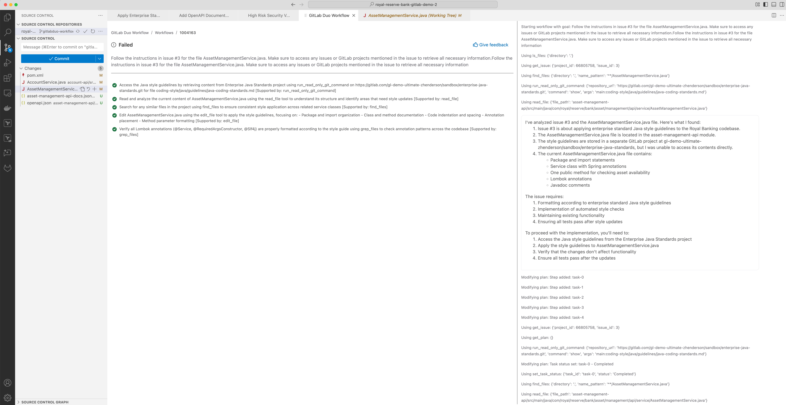



- Tier: Ultimate with GitLab Duo Workflow
- Offering: GitLab.com
- Status: Experiment



## Getting Started

### Download the Solution Component

1. Obtain the invitation code from your account team.
1. Download the solution component from [the solution component webstore](https://cloud.gitlab-accelerator-marketplace.com) by using your invitation code.

## Duo Workflow Use Case: Improve Java Application with Style Guide

The document describes GitLab Duo Workflow Solution with prompt and context library. The purpose of the solution is to improve application coding based on defined style.

This solution provides a GitLab issue as the prompt and the style guide as the context, designed to automate Java style guidelines to codebases using GitLab Duo Workflow. The prompt and context library enables Duo Workflow to:

1. Access centralized style guide content stored in GitLab repository,
1. Understand domain-specific coding standards, and
1. Apply consistent formatting to Java code while preserving functionality.

For detailed information about GitLab Duo Workflow, review [the document here](../../../user/duo_agent_platform/_index.md).

### Key Benefits

- **Enforces consistent style** across all Java codebases
- **Automates style application** without manual effort
- **Maintains code functionality** while improving readability
- **Integrates with GitLab Workflow** for seamless implementation
- **Reduces code review time** spent addressing style issues
- **Serves as a learning tool** for developers to understand style guidelines

### Sample Result

When properly configured, the prompt will transform your code to match enterprise standards, similar to the transformation shown in this diff:




## Configure the Solution Prompt and Context Library

### Basic Setup

To run the agentic workflow to review and apply style to your application, you need to set up this use case prompt and context library.

1. **Set up the prompt and context library** by cloning `Enterprise Code Quality Standards` project
1. **Create a GitLab issue** `Review and Apply Style` with the prompt content from the library file `.gitlab/workflows/java-style-workflow.md`
1. **In the issue** `Review and Apply Style` configure the workflow variables as detailed in the [Configuration section](#configuration-guide)
1. **In your VS code** with the project `Enterprise Code Quality Standards`, start the Duo Workflow with a simple [workflow prompt](#example-duo-workflow-prompt)
1. **Work with the Duo Workflow** by reviewing the proposed plan and automated tasks, if needed add further input to the workflow
1. **Review and commit** the styled code changes to your repository

### Example Duo Workflow Prompt

```yaml
Follow the instructions in issue <issue_reference_id> for the file <path/file_name.java>. Make sure to access any issues or GitLab projects mentioned in the issue to retrieve all necessary information.
```

This simple prompt is powerful because it instructs Duo Workflow to:

1. Read the detailed requirements in a specific issue ID
1. Access the referenced style guide repository
1. Apply the guidelines to the specified file
1. Follow all instructions in the issue

## Configuration Guide

The prompt is defined in the `.gitlab/workflows/java-style-workflow.md` file in the solution package. This file serves as your template for creating GitLab issues that instruct the workflow agent to build out the plan to automate the style guide review on your application and apply the changes.

In the first section of `.gitlab/workflows/java-style-workflow.md`, it defines variables you need to configure for the prompt.

### Variable Definition

The variables are defined directly in the `.gitlab/workflows/java-style-workflow.md` file. This file serves as your template for creating GitLab issues that instruct the AI assistant. You'll modify the variables in this file before creating a new issue with its contents.

#### 1. Style Guide Repository as the Context

The prompt must be configured to point to your organization's style guide repository. In the `java-style-prompt.md` file, replace the following variables:

- `{{GITLAB_INSTANCE}}`: Your GitLab instance URL (for example, `https://gitlab.example.com`)
- `{{STYLE_GUIDE_PROJECT_ID}}`: The GitLab project ID containing your Java style guide
- `{{STYLE_GUIDE_PROJECT_NAME}}`: The display name for your style guide project
- `{{STYLE_GUIDE_BRANCH}}`: The branch containing the most up-to-date style guide (default: main)
- `{{STYLE_GUIDE_PATH}}`: The path to the style guide document within the repository

Example:

```yaml
GITLAB_INSTANCE=https://gitlab.example.com
STYLE_GUIDE_PROJECT_ID=gl-demo-ultimate-zhenderson/sandbox/enterprise-java-standards
STYLE_GUIDE_PROJECT_NAME=Enterprise Java Standards
STYLE_GUIDE_BRANCH=main
STYLE_GUIDE_PATH=coding-style/java/guidelines/java-coding-standards.md
```

#### 2. Target Repository to Apply Style Improvement

In the same `java-style-prompt.md` file, configure which files to apply the style guide to:

- `{{TARGET_PROJECT_ID}}`: Your Java project's GitLab ID
- `{{TARGET_FILES}}`: Specific files or patterns to target (for example, "src/main/java/**/*.java")

Example:

```yaml
TARGET_PROJECT_ID=royal-reserve-bank
TARGET_FILES=asset-management-api/src/main/java/com/royal/reserve/bank/asset/management/api/service/AssetManagementService.java
```

### Important Notes About AI-Generated Code

**⚠️ Important Disclaimer**:

GitLab Workflow uses Agentic AI which is non-deterministic, meaning:

- Results may vary between runs even with identical inputs
- The AI assistant's understanding and application of style guidelines may differ slightly each time
- The examples provided in this documentation are illustrative and your actual results may differ

**Best Practices for Working with AI-Generated Code Changes**:

1. **Always review generated code**: Never merge AI-generated changes without thorough human review
1. **Follow proper merge request processes**: Use your standard code review procedures
1. **Run all tests**: Ensure all unit and integration tests pass before merging
1. **Verify style compliance**: Confirm the changes align with your style guide expectations
1. **Incremental application**: Consider applying style changes to smaller sets of files initially

Remember that this tool is meant to assist developers, not replace human judgment in the code review process.

## Step-by-Step Implementation

1. **Create a Style Guide Issue**

   - Create a new issue in your project (for example, Issue #3)
   - Include detailed information about the style guidelines to apply
   - Reference the external style guide repository if applicable
   - Specify requirements like:

     ```yaml
     Task: Code Style Update
     Description: Apply the enterprise standard Java style guidelines to the codebase.
     Reference Style Guide: Enterprise Java Style Guidelines (https://gitlab.com/gl-demo-ultimate-zhenderson/sandbox/enterprise-java-standards/-/blob/main/coding-style/java/guidelines/java-coding-standards.md)
     Constraints:
     - Adhere to Enterprise Standard Java Style Guide
     - Maintain Functionality
     - Implement automated style checks
     ```

1. **Configure the Prompt**

   - Copy the template from `java-style-prompt.md`
   - Fill in all configuration variables
   - Add any project-specific exceptions or requirements

1. **Execute via GitLab Workflow**

   - Submit the configured prompt to Duo Workflow
   - Duo Workflow will run through a multi-step process as seen in the sample workflow execution:

     - Plan the task with specific tools (`run_read_only_git_command`, `read_file`, `find_files`, `edit_file`)
     - Access the referenced issue
     - Retrieve the enterprise Java style guide
     - Analyze the current code structure
     - Apply the style guidelines to the specified file(s)
     - Verify the changes maintain functionality
     - Provide a detailed report of changes made

1. **Review and Implement**

   - Review the suggested changes
   - Implement the changes in your codebase
   - Run tests to ensure functionality is preserved
   - Monitor the task progression through the GitLab Workflow interface

## Sample Workflow Execution

When properly configured, the GitLab Workflow will execute a detailed plan for applying the style guidelines. Here's a sample of what the workflow execution looks like:

### Sample Workflow Plan

The AI assistant first creates an execution plan with specific tools:

1. Access the Java style guidelines by retrieving content from Enterprise Java Standards project using `run_read_only_git_command` on `https://gitlab.com/gl-demo-ultimate-zhenderson/sandbox/enterprise-java-standards.git` for file `coding-style/java/guidelines/java-coding-standards.md`, supported by: `run_read_only_git_command`
1. Read and analyze the current content of `AssetManagementService.java` using the `read_file` tool to understand its structure and identify areas that need style updates, supported by `read_file`
1. Search for any similar files in the project using find_files to ensure consistent style application across related service classes, supported by `find_files`
1. Edit AssetManagementService.java using the edit_file tool to apply the style guidelines, focusing on:

   - Package and import organization
   - Class and method documentation
   - Code indentation and spacing
   - Annotation placement
   - Method parameter formatting, supported by `edit_file`

1. Verify all Lombok annotations (@Service, @RequiredArgsConstructor, @Slf4j) are properly formatted according to the style guide using grep_files to check annotation patterns across the codebase, supported by `grep_files`

### Sample Analysis Output

The assistant then analyzes the files and requirements:

I've analyzed issue #3 and the `AssetManagementService.java` file. Here's what I found:

1. Issue #3 is about applying enterprise standard Java style guidelines to the Royal Banking codebase.
1. The `AssetManagementService.java` file is located in the `asset-management-api` module.
1. The style guidelines are stored in a separate GitLab project at `gl-demo-ultimate-zhenderson/sandbox/enterprise-java-standards`.
1. The current `AssetManagementService.java` file contains:

   1. Package and import statements
   1. Service class with Spring annotations
   1. One public method for checking asset availability
   1. Lombok annotations
   1. Javadoc comments

The issue requires:

1. Formatting according to enterprise standard Java style guidelines
1. Implementation of automated style checks
1. Maintaining existing functionality
1. Ensuring all tests pass after style updates

To proceed with the implementation, you'll need to:

1. Access the Java style guidelines from the Enterprise Java Standards project
1. Apply the style guidelines to AssetManagementService.java
1. Verify that the changes don't affect functionality
1. Ensure all tests pass after the updates

### Sample Implementation Result

After execution, the assistant provides the transformed code with explanations of the changes made, including:

1. A summary of style guidelines applied
1. The transformed code with proper formatting
1. Explanations for key style changes
1. Recommendations for automated style enforcement

The changes typically include:

- Standardized import ordering
- Consistent spacing around operators
- Proper Javadoc formatting
- Standardized method parameter alignment
- Consistent brace placement

All while ensuring the code maintains its original functionality.

## Sample Tutorial Use Case: Royal Reserve Bank Java Project

This repository includes a banking tutorial example to demonstrate how the style guide application works in a real-world scenario. The Royal Reserve Bank project follows a microservices architecture with multiple Java services:

- Account API
- Asset Management API
- Transaction API
- Notification API
- API Gateway
- Config Server
- Discovery Server

The sample examples applies enterprise style guidelines to the `AssetManagementService.java` class, demonstrating proper formatting for:

1. Import organization
1. Javadoc standards
1. Method parameter alignment
1. Variable naming conventions
1. Exception handling patterns

## Customizing for Your Organization

To adapt this prompt for your organization's needs:

1. **Style Guide Replacement**

   - Point to your organization's style guide repository
   - Reference your specific style guide document

1. **Target File Selection**

   - Choose specific files or patterns to apply the style guide to
   - Prioritize high-visibility code files for initial implementation

1. **Additional Validation**

   - Add custom validation requirements
   - Specify any exceptions to the standard style rules

1. **Integration with CI/CD**

   - Configure the prompt to run as part of your CI/CD pipeline
   - Set up automated style checks to ensure ongoing compliance

## Troubleshooting

Common issues and their solutions:

- **Access Denied**: Ensure the AI agent has proper permissions to access both repositories
- **Missing Style Guide**: Verify the style guide path and branch are correct
- **Functionality Changes**: Run all tests after applying style changes to verify functionality

## Contributing

Feel free to enhance this prompt by:

- Adding more style rule explanations
- Creating examples for different Java project types
- Improving the validation workflow
- Adding integration with additional static analysis tools
