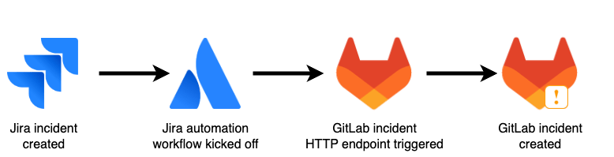
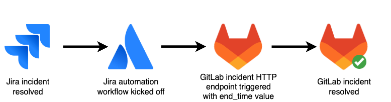



- Tier: Ultimate
- Offering: GitLab.com, GitLab Self-Managed, GitLab Dedicated



With GitLab, you can get visibility into [DORA metrics](../../user/analytics/dora_metrics.md) to help you measure your DevOps performance. The 4 metrics are:

- **Deployment frequency**: average # of deployments per day to production
- **Lead time for changes**: # of seconds to successfully deliver a commit into production (from code committed, to code successfully running in production)
- **Change failure rate**: % of deployments that cause an incident in production in the given time period
- **Time to restore service**: median time an incident was open for on a production environment

While the first two metrics are generated from GitLab CI/CD and Merge Requests, the latter two depend on [GitLab incidents](../../operations/incident_management/manage_incidents.md) being created.

For teams using Jira for incident tracking, this means that incidents need to be replicated from Jira to GitLab in real-time. This project walks through setting up that replication.

**NOTE**: A similar integration exists for issue replication to generate Value Stream Analytics metrics (Lead Time, Issues Created, and Issues Closed). If you're interested in issue replication for VSA metrics, refer to the [Jira to GitLab VSA Integration](jira_vsa.md).

## Architecture

We will need to create 2 automation workflows:

1. Create GitLab incidents when they are created in Jira.
1. Resolve GitLab incidents when they are resolved in Jira.

### Incident Creation

### Incident Resolution

## Setup

### Pre-requisites

This walkthrough assumes that you have:

- a GitLab Ultimate license
- a Jira project to clone incidents from

Jira places [limits](https://www.atlassian.com/software/jira/pricing) on the frequency of Automation runs depending on your Jira license. As of today, the limits are as follows:

| **Tier**   | **Limit**                    |
|------------|------------------------------|
| Free       | 100 runs per month           |
| Standard   | 1700 runs per month          |
| Premium    | 1000 runs per user per month |
| Enterprise | Unlimited runs               |

Each incident creation counts as 1 run, and each incident resolution counts as 1 run.

### GitLab Alert Endpoint

First we'll need to create an HTTP endpoint that can be triggered to create/resolve alerts in GitLab, which in turn create/resolve incidents.

1. Head to your GitLab project where you want Jira incidents to be created. From the sidebar, go to **Settings** > **Monitor**. Expand the **Alerts** section.
1. Under **Alerts**, switch to the **Alert settings** tab. Check the following boxes, and click **Save changes**:
   - _Create an incident. Incidents are created for each alert triggered._
   - _Automatically close associated incident when a recovery alert notification resolves an alert_
1. Under **Alerts**, switch to the **Current integrations** tab. Click **Add new integration**. Set the **Integration type** to `HTTP Endpoint`, give it a name (e.g. `Jira incident sync`), and set **Enable integration** to **Active**. We will come back to customize the alert payload mapping, once we've set up our Jira automation workflows.
1. Click **Save integration**. A message should appear that says "Integration successfully saved". Click **View URL and authorization key**.
1. We'll need the endpoint URL and authorization key when setting up our Jira automation workflow and Lambda function, so save this for later.

### Jira Incident Creation Workflow

To automatically trigger the GitLab alert endpoint when a Jira incident is created, we'll use [Jira automation](https://community.atlassian.com/t5/Jira-articles/Automation-for-Jira-Send-web-request-using-Jira-REST-API/ba-p/1443828).

1. Navigate to your Jira project where your incidents are managed. From the sidebar, head to **Project settings** > **Automation** (you may have to scroll down a bit to find it).
1. From here we can manage our Jira automation workflows. In the upper right, click **Create rule**.
1. For your trigger, search for and select **Issue created**. Click **Save**.
1. Next, select **IF: Add a condition**. Here you can specify what conditions to check for, in order to determine if the issue created relates to an incident. For this guide, we'll select **Issue fields condition**. Under **Field**, we'll select **Summary**, the **Condition** will be set to **contains**, and the value will be `incident`. Click **Save**.
1. With our trigger and condition set, select **THEN: Add an action**. Search for and select **Send web request**.
1. Set the **Web request URL** to your GitLab **Webhook URL** from the previous section.
1. Check the GitLab documentation for
   [endpoint authentication options](../../operations/incident_management/integrations.md#authorization).
   For this guide, we'll use the
   [Bearer authorization header](../../operations/incident_management/integrations.md#bearer-authorization-header)
   method. In your Jira automation configuration, add the following headers:

   | Name | Value |
   | ------ | ------ |
   | Authorization | Bearer \<GitLab endpoint **auth key** from the previous section\> |
   | Content-Type | `application/json` |

   - You may want to set the `Authorization` header to "Hidden".
1. Make sure the **HTTP method** is set to **POST**, and set **Web request body** to **Issue data (Jira format)**.
1. Finally, click **Save**, give your automation a name (e.g. `Jira incident creation`), and click **Turn it on**. In the upper right, click **Return to list**.
1. The last thing you'll need to do is map the Jira payload values to the GitLab alert parameters. If you're planning to also set up incident resolution for the **Time to restore service** metric, skip this step for now. Otherwise, jump to [Map Jira payload values to GitLab alert parameters](#map-jira-payload-values-to-gitlab-alert-parameters) and follow the steps there.

Once you've mapped the payload values, incidents you create in Jira will also be created in GitLab. This will allow you to see the **Change failure rate** DORA metric.

### Jira Incident Resolution Workflow

Create another Jira automation workflow as described above, with the following changes:

1. Set the trigger to **Issue transitioned**. The "From status" field can be left blank. The "To status" field can be set to any statuses representing a resolved incident as per your workflow (e.g. `Closed`, `Done`, `Resolved`, `Completed`).
1. Make sure to name the automation appropriately (e.g. `Jira incident close`).

### Map Jira payload values to GitLab alert parameters

1. Once you've created your Jira automation workflow, click on the workflow you just created, and select **Then: Send web request**.
1. Expand the **Validate your web request configuration** section, and enter a *resolved* issue key to test with (you must have an existing issue key that you can use). Click **Validate**.
1. Expand the **Request POST** section, and expand the **Payload** section. Copy the entire payload.
1. Head back into your GitLab project, and go to **Settings** > **Monitor** > **Alerts** > **Current Integrations**. Click the 'settings' icon next to the integration you created earlier, and switch to the **Configure details** tab.
1. Under **Customize alert payload mapping**, paste the payload you copied from Jira in step 3. Then click **Parse payload fields**.
1. Map the fields as shown below:

    | GitLab alert key | Payload alert key |
    | ------ | ------ |
    | Title | issue.fields.summary |
    | Description | issue.fields.status.description |
    | End time | issue.fields.resolutiondate1 |
    | Monitoring tool | issue.fields.reporter.accountType |
    | Severity | issue.fields.priority.name |
    | Fingerprint | issue.key |
    | Environment | issue.fields.project.name |

1 This is only needed if you set up the incident resolution automation. If this field doesn't appear as an option, make sure you entered a *resolved* issue key to test with in step 2 above.

1. Finally, click **Save integration**.

At this point, incidents you resolve in Jira will also be resolved in GitLab. This will allow you to see the **Time to restore service** DORA metric.

## Resources

- [DORA metrics](../../user/analytics/dora_metrics.md)
  - [Measure DORA metrics with Jira](../../user/analytics/dora_metrics.md#with-jira)
- [GitLab incident management](../../operations/incident_management/manage_incidents.md)
- [GitLab HTTP endpoints](../../operations/incident_management/integrations.md#alerting-endpoints)
  - [GitLab HTTP endpoint authorization](../../operations/incident_management/integrations.md#authorization)
  - [GitLab alert parameters](../../operations/incident_management/integrations.md#customize-the-alert-payload-outside-of-gitlab)
  - [GitLab recovery alerts](../../operations/incident_management/integrations.md#recovery-alerts)
- [Jira automation with web requests](https://community.atlassian.com/t5/Jira-articles/Automation-for-Jira-Send-web-request-using-Jira-REST-API/ba-p/1443828)
