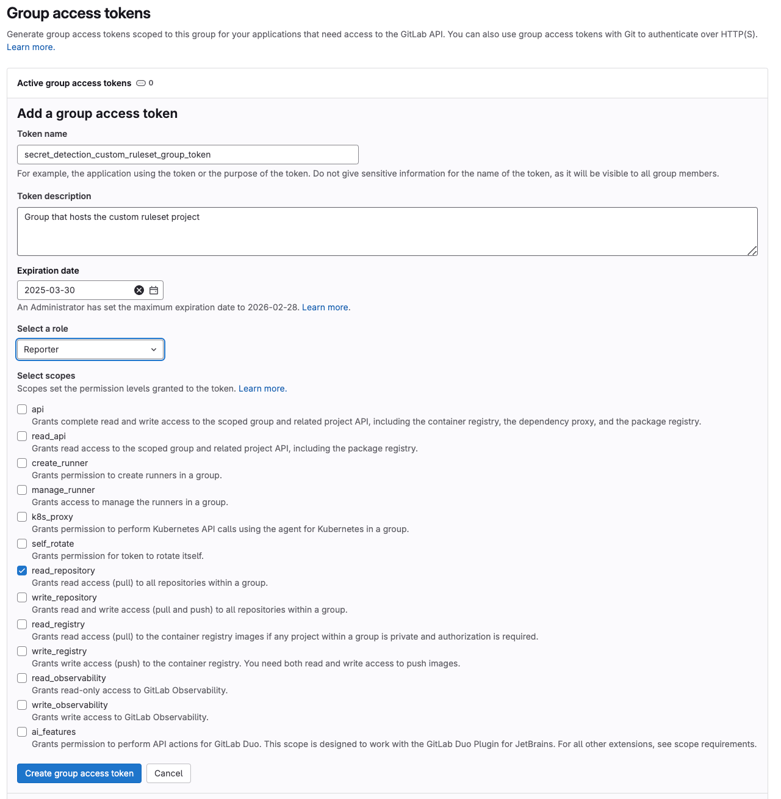
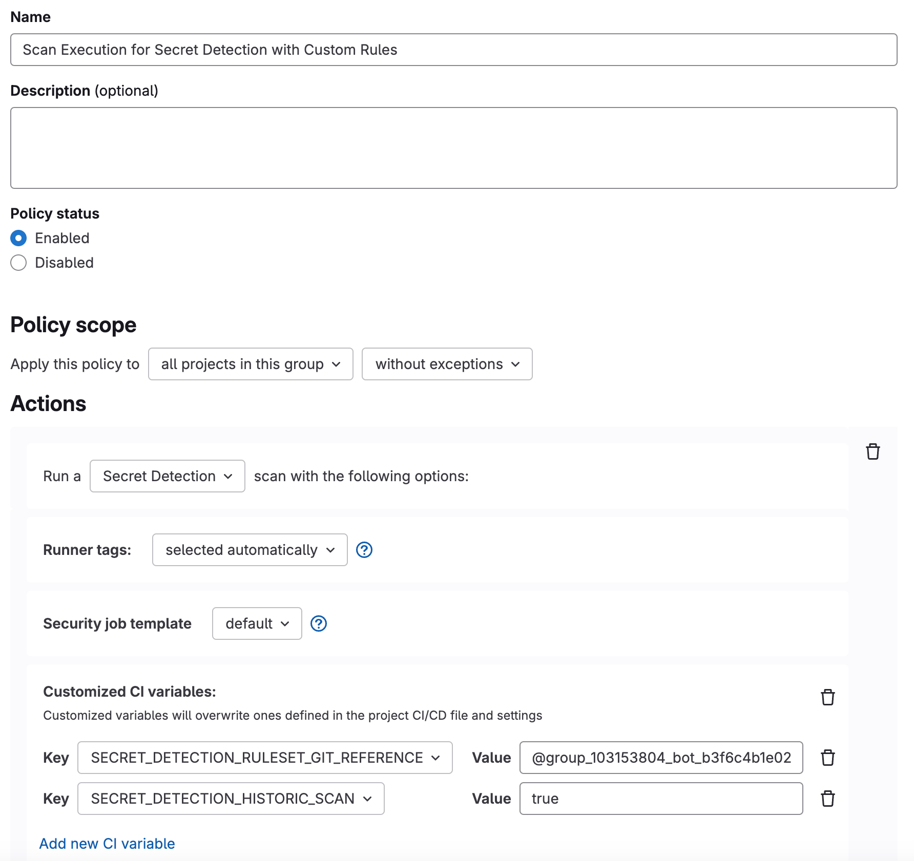
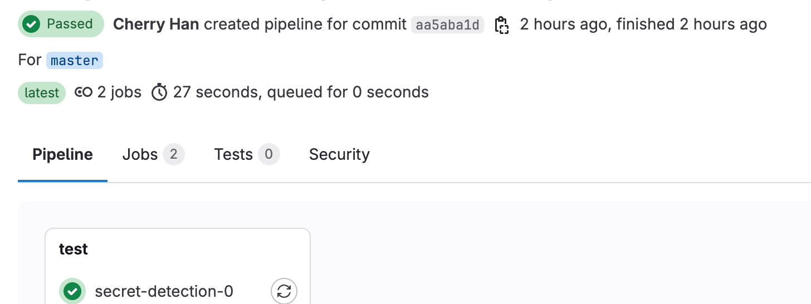
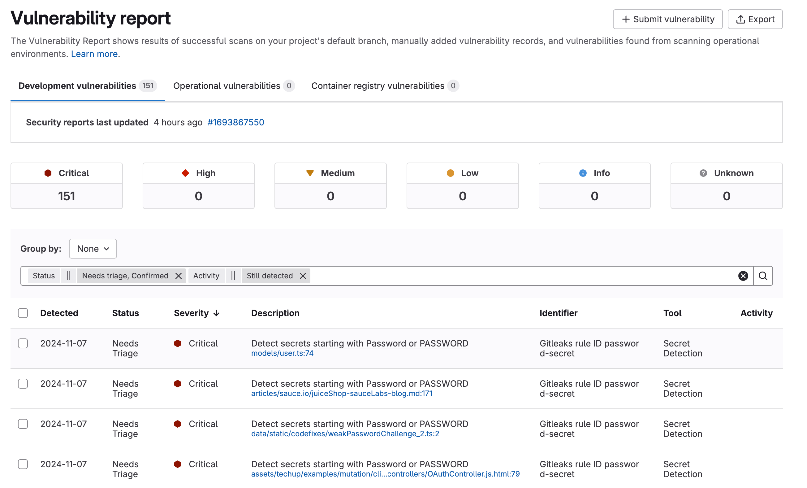
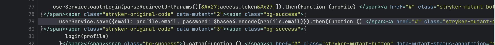



- Tier: Ultimate
- Offering: GitLab.com, GitLab Self-Managed, GitLab Dedicated



## Getting Started

### Download the Solution Component

1. Obtain the invitation code from your account team.
1. Download the solution component from [the solution component webstore](https://cloud.gitlab-accelerator-marketplace.com) by using your invitation code.

### Prerequisites

- GitLab Ultimate tier
- Administrator access to your GitLab instance or group
- [Secret Detection](../../user/application_security/secret_detection/_index.md) enabled for your projects

## Configure Secret Detection Custom Rules

This guide helps you implement Secret Detection Policy at the global level. This solution extends the default secret detection rules to include the detection of PII data elements like Social Security Number and passwords in clear text. The rule extension is considered as the remote ruleset.

### Configure Custom Ruleset

You can set up custom ruleset with the following steps

1. Create a top level group `Secret Detection`
1. From your downloaded component, copy the project `Secret Detection Custom Ruleset` into your newly created `Secret Detection` group.

This custom ruleset extends GitLab pre-build rules. The extension can detect and alert secrets including:

- PII data elements: social security number
- Passwords in plain text.

#### Custom Ruleset File

The custom ruleset is defined in `.gitlab/secret-detection-ruleset.toml`
The rules can be defined using `regex`

#### PII Data Element Detection

The extended rules for PII data element detection

```toml
[[rules]]
id = "ssn"
description = "Social Security Number"
regex = "[0-9]{3}-[0-9]{2}-[0-9]{4}"
tags = ["ssn", "social-security-number"]
keywords = ["ssn"]
```

#### Password in Plain Text

The extended rules for password in plain text

```toml
[[rules]]
id = "password-secret"
description = "Detect secrets starting with Password or PASSWORD"
regex = "(?i)Password[:=]\\s*['\"]?[^'\"]+['\"]?"
tags = ["password", "secret"]
keywords = ["password", "PASSWORD"]
```

### Access Defined Custom Ruleset

In order to access the custom ruleset, you need to create a group access token which generates a bot user. The bot user can be used to authenticate and access the custom ruleset by any projects that run the secret detection with the global policy.

To set the access and authentication, follow these steps:

1. Create a group token: In the group `Secret Detection`, create a group access token `Secret Detection Group Token` under `Settings` menu option, give the token `reporter` role with `read_repository` access



1. Create a group variable: Copy the token value and store safely. Add a group variable under `Settings` menu option called `SECRET_DETECTION_GROUP_TOKEN` as the key with the token value.
1. Obtain the group token bot user: In the same group, navigate to `manage` menu option to select `member` and look up corresponding bot user for the group access token `Secrete Detection Group Token`, copy the value representing the bot user for the group in the format of `@group_[group_id]_bot_[random_number]`


## Implementation Guide

This guide covers the steps to configure the policy to run secret detection for all projects using centralized custom ruleset.

### Configure Secret Detection Policy

To run secret detection automatically in the pipeline as the enforced global policy, set up the policy at the highest level, in this case the top group level. Follow the steps outlined below to create the new secret detection policy.

1. Create the policy: In the same group `Secret Detection`, navigate to that group's **Secure > Policies** page.
1. Click on **New policy**.
1. Select **Scan execution policy**.
1. Configure the policy: Give the policy name `Secret Detection Policy` and enter a description and select `Secret Detection` scan
1. Set the **Policy scope** by selecting either "All projects in this group" (and optionally set exceptions) or "Specific projects" (and select the projects from the dropdown).
1. Under the **Actions** section, "Secret Detection" is shown as default.
1. Under the **Conditions** section, you can optionally change "Triggers:" to "Schedules:" if you want to run the scan on a schedule instead of at every commit.
1. Setup access to the custom ruleset: add CI variables with the value of the bot user, group variable and the URL of the custom ruleset project.

   Since the custom ruleset is hosted in a different project and considered as the remote ruleset, the `SECRET_DETECTION_RULESET_GIT_REFERENCE` must be used.

   ```yaml
   variables:
     SECRET_DETECTION_RULESET_GIT_REFERENCE: "group_[group_id]_bot_[random_number]:$SECRET_DETECTION_GROUP_TOKEN@[custom ruleset project URL]"
     SECRET_DETECTION_HISTORIC_SCAN: "true"
   ```

The UI configuration is shown in this screen: 
For detailed information about this CI variable, see [this document for details](../../user/application_security/secret_detection/pipeline/configure.md#with-a-remote-ruleset).

1. Click **Create policy**.

### Complete Policy Configuration

Upon creating the policy, for reference, here is the complete policy configuration:

```yaml
---
scan_execution_policy:
- name: Scan Execution for Secret Detection with Custom Rules
  description: ''
  enabled: true
  policy_scope:
    projects:
      excluding: []
  rules:
  - type: pipeline
    branches:
    - "*"
  actions:
  - scan: secret_detection
    variables:
      SECRET_DETECTION_RULESET_GIT_REFERENCE: "@group_[group_id]_bot_[random_number]:$SECRET_DETECTION_GROUP_TOKEN@gitlab.com/example_group/secret-detection/secret-detection-custom-ruleset"
      SECRET_DETECTION_HISTORIC_SCAN: 'true'
  skip_ci:
    allowed: true
    allowlist:
      users: []
approval_policy: []
```

## How It Works

Once the policy is running. all the projects associated with the global policy will have the `secret detect` job will run automatically in the pipeline as `secret_detection_0` job.


Secrets will be detected and surfaced. If there is a merge request, the net new secrets will be displayed in the MR widget. If it is the default branch merged, they will be shown in the security vulnerability report as following:


An example password in clear is shown below:


## Troubleshooting

### Policy not applying

Ensure the security policy project you modified is correctly linked to your group. See [Link to a security policy project](../../user/application_security/policies/_index.md#link-to-a-security-policy-project) for more.
