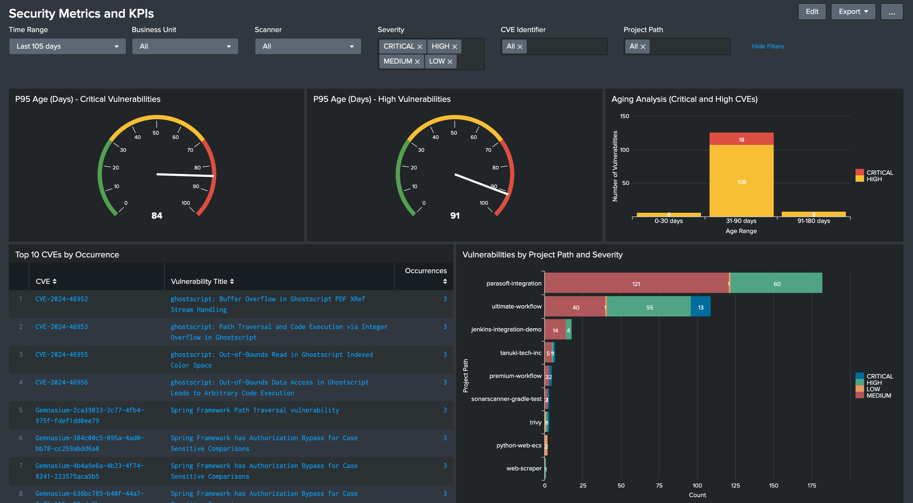

DETAILS:
**Tier:** Ultimate
**Offering:** GitLab.com, GitLab Self-Managed, GitLab Dedicated

The document describes the installation, configuration and user guide of GitLab Security Metrics and KPIs Solution Component. This security solution component provides metrics and KPIs that can be viewed by business units, time range, vulnerability severity and security types. It can provide snapshot of the seucrity posture on the monthly and quarterly basis with pdf documents. The dashboard and visualization of data are displayed as Dashboard in Splunk. 



This solution exports vulnerability data from GitLab projects or groups using the GraphQL API, sends it to Splunk through the HTTP Event Collector (HEC), and includes an out-of-the-box dashboard for security metrics visualization. The export process is designed to run as a GitLab CI/CD pipeline on a scheduled basis.

## Getting Started

### Download the Solution Component

1. Obtain the invitation code from your account team.
1. Download the solution component from [the solution component webstore](https://cloud.gitlab-accelerator-marketplace.com) by using your invitation code.

### Set Up the Solution Component Project

1. Create a new GitLab project to host this exporter.
1. Copy the provided files into your project:
   - `export_vulns.py`
   - `send_to_splunk.py`
   - `requirements.txt`
   - `.gitlab-ci.yml`
1. Configure the required CI/CD variables in your project settings.
1. Set up a pipeline schedule (for example, daily or weekly).

## How It Works

The solution consists of two main components:

1. A vulnerability exporter that fetches data from GitLab Security Dashboard

1. A Splunk ingester that processes the exported data and sends it to Splunk HEC

The pipeline runs in two stages:

1. `extract`: Fetches vulnerabilities and saves to CSV

1. `ingest`: Sends the vulnerability data to Splunk

## Configuration

### Required CI & CD Variables

| Variable | Description | Example Value |
|----------|-------------|---------------|
| `SCOPE` | Target scope for vulnerability scanning | `group:security/appsec` or `security/my-project` |
| `GRAPHQL_API_TOKEN` | GitLab personal access token with API access | `glpat-XXXXXXXXXXXXXXXX` |
| `GRAPHQL_API_URL` | GitLab GraphQL API URL | `https://gitlab.com/api/graphql` |
| `SPLUNK_HEC_TOKEN` | Splunk HTTP Event Collector token | `11111111-2222-3333-4444-555555555555` |
| `SPLUNK_HEC_URL` | Splunk HEC endpoint URL | `https://splunk.company.com:8088/services/collector` |

### Optional CI & CD Variables

| Variable | Description | Example Value | Default |
|----------|-------------|---------------|---------|
| `SEVERITY_FILTER` | Comma-separated list of severity levels | `CRITICAL,HIGH,MEDIUM` | All severities |
| `VULN_TIME_WINDOW` | Time window for vulnerability collection | `24h`, `7d`, or `all` | `24h` |

### Scope Configuration

The `SCOPE` variable determines which projects or groups to scan:

- For a project: `mygroup/myproject`
- For a group: `group:mygroup/subgroup`
- For the entire instance: `instance`

### Severity Filter Examples

Valid severity levels:

- `CRITICAL`
- `HIGH`
- `MEDIUM`
- `LOW`
- `UNKNOWN`

Example combinations:

- `CRITICAL,HIGH`
- `CRITICAL,HIGH,MEDIUM`
- Leave empty to include all severities

### Time Window Configuration

The `VULN_TIME_WINDOW` variable controls how far back to look for vulnerabilities:

- Format: `<number><unit>` where:
  - `number`: Any positive integer
  - `unit`: `h` for hours or `d` for days
- Examples:
  - `24h`: Last 24 hours
  - `7h`: Last 7 hours
  - `15d`: Last 15 days
  - `30d`: Last 30 days
  - `all`: All vulnerabilities (useful for first run)

Default value: `24h`

Example pipeline configurations:

```yaml
# For 12-hour window
variables:
  VULN_TIME_WINDOW: "12h"

# For 3-day window
variables:
  VULN_TIME_WINDOW: "3d"

# For all vulnerabilities
variables:
  VULN_TIME_WINDOW: "all"
```

Schedule your pipeline based on your chosen window. For example:

- For 12h: Schedule twice daily
- For 3d: Schedule every 3 days
- Add some overlap in scheduling to ensure no vulnerabilities are missed

## Pipeline Setup

1. **First Run**:

   - Set `VULN_TIME_WINDOW: "all"` to collect all historical vulnerabilities
   - Run the pipeline once

1. **Ongoing Collection**:

   - Set `VULN_TIME_WINDOW` to your desired window (`24h` or `7d`)
   - Set up a pipeline schedule:
     - For `24h`: Schedule daily
     - For `7d`: Schedule weekly

## Splunk Integration

The script sends vulnerabilities as events to Splunk.

### Index Configuration

1. Create a new index named `gitlab_vulns` in Splunk

1. When creating your HEC token:
   - Set the default **index** to `gitlab_vulns` (this index is referenced in the base search of the provided Splunk dashboard)
   - Ensure the token has permissions to write to this index
   - Ensure that the token has a **sourcetype** that allows event data to be parsed correctly as JSON

Each event includes:

- Detection time
- Vulnerability title and description
- Severity level
- Scanner information
- Project details
- URLs for both project and vulnerability

## Dashboard Setup

The provided dashboard offers comprehensive visibility into your GitLab vulnerability data with the following visualizations:

- P95 Age metrics for Critical and High vulnerabilities (radial gauges)
- Aging Analysis showing the distribution of Critical and High vulnerabilities across age buckets (0-30 days, 31-90 days, 91-180 days, 180+ days)
- Top 10 most frequent CVEs with their occurrence counts
- Vulnerability distribution by project path and severity
- All metrics can be filtered by business unit and time range

To set up the dashboard:

1. **Business Unit Mapping**:
   1. Create a CSV file with two columns:

     ```shell
     project_url,business_unit
     ```

   1. Map each GitLab project URL to its corresponding business unit.
   1. Upload the file to Splunk as a lookup table:
      1. Go to **Settings > Lookups > Lookup table files**.
      1. Select **New Lookup Table File**.
      1. Upload your CSV file.
      1. Set the **Destination filename** to `business_unit_mapping.csv`.
      1. Configure permissions:
         1. Find the row labeled `<splunk_dir>/etc/apps/search/lookups/business_unit_mapping.csv`.
         1. Select **Permissions**.
         1. Set the permissions to either:
            - Set to **Global** for instance-wide access.
            - Share with specific apps or roles as needed.
         1. Select **Save**.

1. **Dashboard Installation**:
   1. Save the provided `vuln_metrics_dashboard.xml` file.
   1. In Splunk:
      1. Go to the Search app.
      1. Click **Dashboards > Create New Dashboard**.
      1. Select **Source** in the edit view.
      1. Replace the default XML with the contents of `vuln_metrics_dashboard.xml`.
      1. Save the dashboard.

## Output Format

The intermediate CSV file contains:

- `detectedAt`: Detection timestamp
- `title`: Vulnerability title
- `severity`: Severity level
- `primaryIdentifier`: Vulnerability identifier
- `exporter`: Scanner name
- `projectPath`: GitLab project path
- `projectUrl`: Project URL
- `description`: Vulnerability description
- `webUrl`: Vulnerability details URL

## Error Handling

The solution includes:

- Rate limiting handling with exponential backoff
- Batch processing for Splunk ingestion
- Proper error reporting
- Timeout handling
- UTF-8 encoding support

## Best Practices

1. **Token Permissions**:

   - GRAPHQL_API_TOKEN needs:
     - Read access to target group/project
     - Security Dashboard access
   - SPLUNK_HEC_TOKEN needs:
     - Event submission permissions to target index

1. **Schedule Frequency**:

   - Match schedule to your `VULN_TIME_WINDOW`
   - Include overlap to prevent missing vulnerabilities
   - Consider your organization's SLAs

1. **Monitoring**:

   - Monitor pipeline success/failure
   - Track number of vulnerabilities exported
   - Monitor Splunk ingestion success

## Troubleshooting

Common issues and solutions:

1. **No vulnerabilities exported**:

   - Verify SCOPE setting
   - Check token permissions
   - Verify Security Dashboard access

1. **Splunk ingestion fails**:

   - Verify HEC URL and token
   - Check network connectivity
   - Verify index permissions
