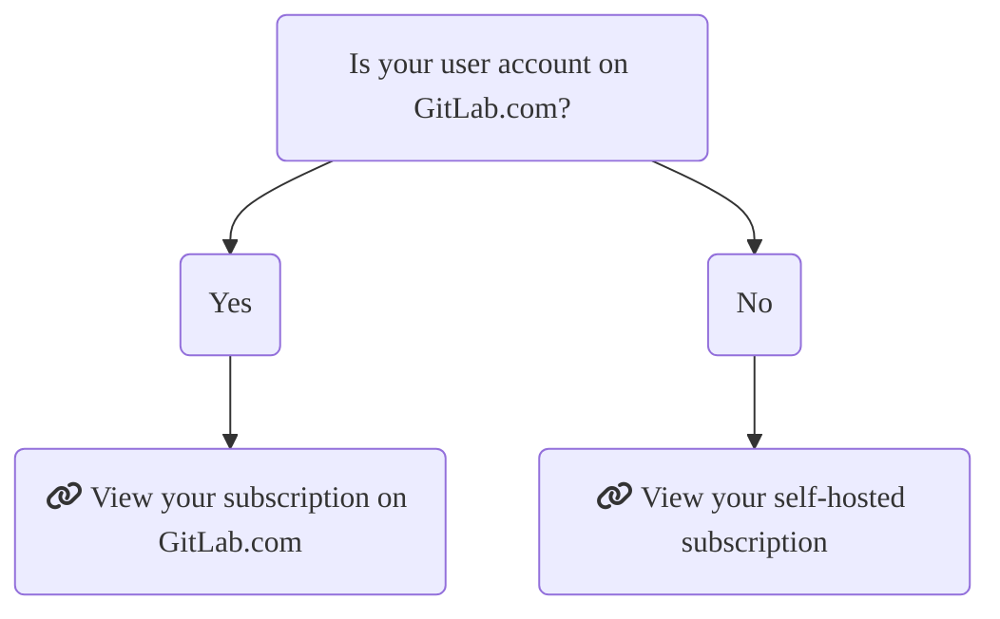

# Choose a GitLab subscription

To choose the right GitLab subscription, select an offering and a tier.

## Choose a subscription

Choose which GitLab subscription suits your needs:

- [GitLab SaaS](gitlab_com/index.md): The GitLab software-as-a-service offering.
  You don't need to install anything to use GitLab SaaS, you only need to
  [sign up](https://gitlab.com/users/sign_up) and start using GitLab straight away.
- [GitLab Dedicated](gitlab_dedicated/index.md): A single-tenant SaaS service for highly regulated and large enterprises.
- [GitLab self-managed](self_managed/index.md): Install, administer, and maintain
  your own GitLab instance.

On a GitLab self-managed instance, a GitLab subscription provides the same set of
features for _all_ users. On GitLab SaaS, you can apply a subscription to a group
namespace. You cannot apply a subscription to a personal namespace.

NOTE:
Subscriptions cannot be transferred between GitLab SaaS and GitLab self-managed.
A new subscription must be purchased and applied as needed.

## Choose a GitLab tier

Pricing is [tier-based](https://about.gitlab.com/pricing/), allowing you to choose
the features that fit your budget.

For more details, see
[a comparison of self-managed features available in each tier](https://about.gitlab.com/pricing/feature-comparison/).

## Find your subscription

The following chart should help you determine your subscription model. Select
the list item to go to the respective help page.

## Contact Support

- See the tiers of [GitLab Support](https://about.gitlab.com/support/).
- [Submit a request](https://support.gitlab.com/hc/en-us/requests/new) through the Support Portal.

We also encourage all users to search our project trackers for known issues and existing feature requests in the [GitLab project](https://gitlab.com/gitlab-org/gitlab/-/issues/).

These issues are the best avenue for getting updates on specific product plans and for communicating directly with the relevant GitLab team members.
