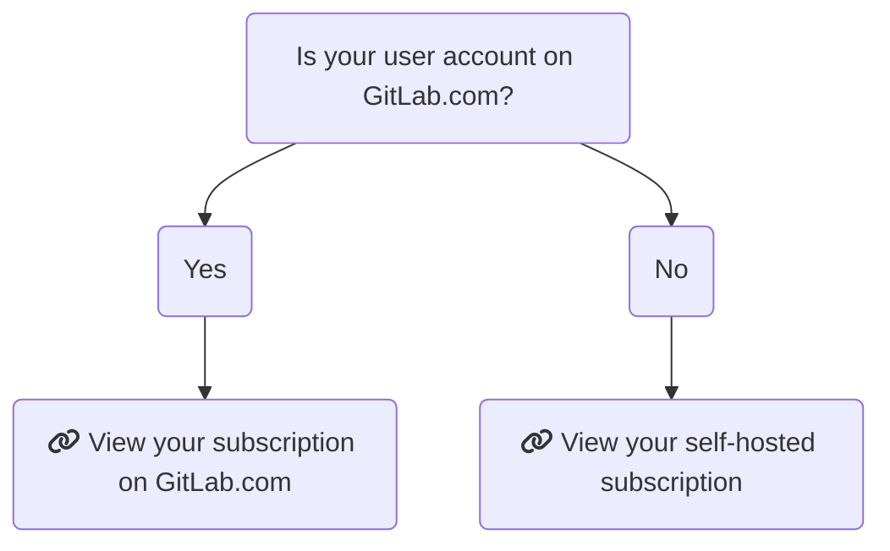
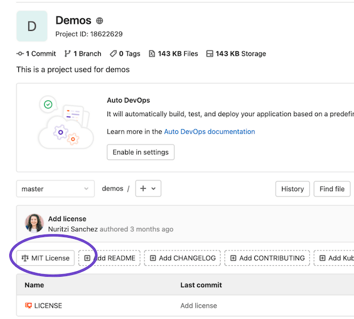
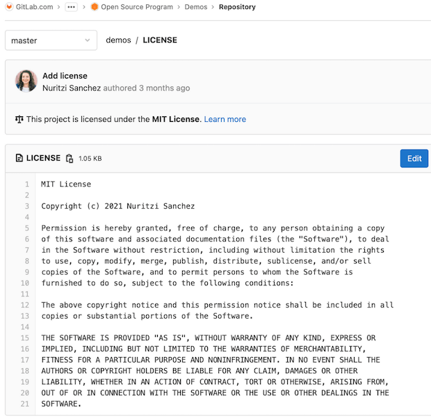
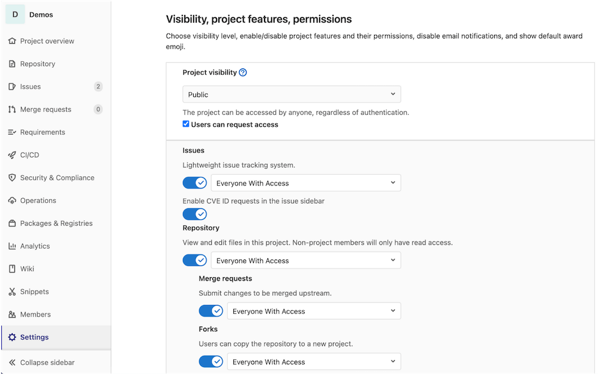
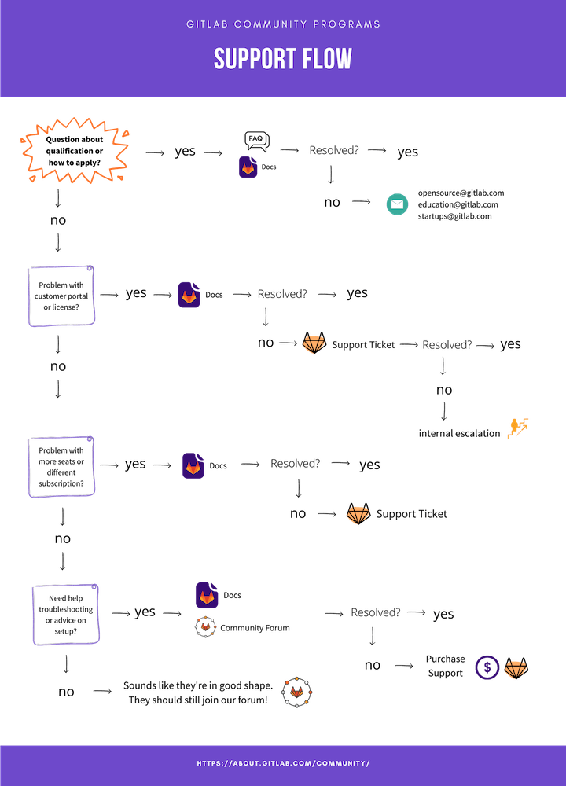

# GitLab subscription **(PREMIUM)**

GitLab offers tiers of features. Your subscription determines which tier you
have access to. Subscriptions are valid for 12 months.

GitLab provides special subscriptions to participants in:

- [Education](#gitlab-for-education)
- [Open Source](#gitlab-for-open-source)

## Choose a GitLab subscription

When choosing a subscription, there are two factors to consider:

- [GitLab SaaS or GitLab self-managed](#choose-between-gitlab-saas-or-gitlab-self-managed)
- [GitLab tier](#choose-a-gitlab-tier)

### Choose between GitLab SaaS or GitLab self-managed

There are some differences in how a subscription applies, depending if you use
GitLab SaaS or GitLab self-managed:

- [GitLab SaaS](gitlab_com/index.md): The GitLab software-as-a-service offering.
  You don't need to install anything to use GitLab SaaS, you only need to
  [sign up](https://gitlab.com/users/sign_up) and start using GitLab straight away.
- [GitLab self-managed](self_managed/index.md): Install, administer, and maintain
  your own GitLab instance.

On a GitLab self-managed instance, a GitLab subscription provides the same set of
features for _all_ users. On GitLab SaaS, you can apply a subscription to either
a group or a personal namespace.

NOTE:
Subscriptions cannot be transferred between GitLab SaaS and GitLab self-managed.
A new subscription must be purchased and applied as needed.

### Choose a GitLab tier

Pricing is [tier-based](https://about.gitlab.com/pricing/), allowing you to choose
the features which fit your budget. For information on what features are available
at each tier for each product, see:

- [GitLab SaaS feature comparison](https://about.gitlab.com/pricing/gitlab-com/feature-comparison/)
- [GitLab self-managed feature comparison](https://about.gitlab.com/pricing/self-managed/feature-comparison/)

## Find your subscription

The following chart should help you determine your subscription model. Click
on the list item to go to the respective help page.

## Customers Portal

With the [Customers Portal](https://customers.gitlab.com/) you can:

- [Change your personal details](#change-your-personal-details)
- [Change your company details](#change-your-company-details)
- [Change your payment method](#change-your-payment-method)
- [Change the linked account](#change-the-linked-account)
- [Change the namespace the subscription is linked to](#change-the-linked-namespace)
- [Change customers portal account password](#change-customers-portal-account-password)

### Change your personal details

Your personal details are used on invoices. Your email address is used for the Customers Portal
login and license-related email.

To change your personal details, including name, billing address, and email address:

1. Log in to the [Customers Portal](https://customers.gitlab.com/customers/sign_in).
1. Select **My account > Account details**.
1. Expand the **Personal details** section.
1. Edit your personal details.
1. Click **Save changes**.

### Change your company details

To change your company details, including company name and VAT number:

1. Log in to the [Customers Portal](https://customers.gitlab.com/customers/sign_in).
1. Select **My account > Account details**.
1. Expand the **Company details** section.
1. Edit the company details.
1. Click **Save changes**.

### Change your payment method

Purchases in the Customers Portal require a credit card on record as a payment method. You can add
multiple credit cards to your account, so that purchases for different products are charged to the
correct card.

If you would like to use an alternative method to pay, please [contact our Sales
team](https://about.gitlab.com/sales/).

To change your payment method:

1. Log in to the [Customers Portal](https://customers.gitlab.com/customers/sign_in).
1. Select **My account > Payment methods**.
1. **Edit** an existing payment method's information or **Add new payment method**.
1. Click **Save Changes**.

#### Set a default payment method

Automatic renewal of a subscription is charged to your default payment method. To mark a payment
method as the default:

1. Log in to the [Customers Portal](https://customers.gitlab.com/customers/sign_in).
1. Select **My account > Payment methods**.
1. **Edit** the selected payment method and check the **Make default payment method** checkbox.
1. Click **Save Changes**.

### Change the linked account

To change the GitLab.com account linked to your Customers Portal account:

1. Log in to the
   [Customers Portal](https://customers.gitlab.com/customers/sign_in).
1. In a separate browser tab, go to [GitLab SaaS](https://gitlab.com) and ensure you
   are not logged in.
1. On the Customers Portal page, click **My account > Account details**.
1. Under **Your GitLab.com account**, click **Change linked account**.
1. Log in to the [GitLab SaaS](https://gitlab.com) account you want to link to the Customers Portal
   account.

### Change the linked namespace

To change the namespace linked to a subscription:

1. Log in to the [Customers Portal](https://customers.gitlab.com/customers/sign_in) with a
   [linked](#change-the-linked-account) GitLab SaaS account.
1. Navigate to the **Manage Purchases** page.
1. Select **Change linked namespace**.
1. Select the desired group from the **This subscription is for** dropdown.
1. Select **Proceed to checkout**.

Subscription charges are calculated based on the total number of users in a group, including its subgroups and nested projects. If the total number of users exceeds the number of seats in your subscription, your account is charged for the additional users.

Only one namespace can be linked to a subscription.

### Change Customers Portal account password

To change the password for this customers portal account:

1. Log in to the [Customers Portal](https://customers.gitlab.com/customers/sign_in).
1. Select the **My account** drop-down and click on **Account details**.
1. Make the required changes to the **Your password** section.
1. Click **Save changes**.

## Community program subscriptions

### GitLab for Education

For qualifying non-profit educational institutions, the [GitLab for Education](https://about.gitlab.com/solutions/education/) program provides
the top GitLab tier, plus 50,000 CI minutes per month.

The GitLab for Education license can only be used for instructional-use or
non-commercial academic research.

Find more information on how to apply and renew at
[GitLab for Education](https://about.gitlab.com/solutions/education/).

### GitLab for Open Source

For qualifying open source projects, the [GitLab for Open Source](https://about.gitlab.com/solutions/open-source/) program provides
the top GitLab tier, plus 50,000 CI minutes per month.

You can find more information about the [program requirements](https://about.gitlab.com/solutions/open-source/join/#requirements),
[renewals](https://about.gitlab.com/solutions/open-source/join/#renewals),
and benefits on the [GitLab for Open Source application page](https://about.gitlab.com/solutions/open-source/join/).

If you have any questions, send an email to `opensource@gitlab.com` for assistance.

#### Verification for Open Source program

As part of the [application verification process](https://about.gitlab.com/solutions/open-source/join/), you must upload <b>three screenshots</b>.
These are the three screenshots that are needed to qualify you for the GitLab for Open Source program.

- [OSI-approved license overview](#screenshot-1-license-overview)
- [OSI-approved license file](#screenshot-2-license-file)
- [Publicly visible settings](#screenshot-3-publicly-visible-settings)

##### OSI-approved license

You must apply an [OSI-approved license](https://opensource.org/licenses/) to each project in your group before you can be verified.

Add the license to the LICENSE file so that it shows up in the overview section of the project. This allows contributors to see it at a glance.

It's best to copy and paste the entire license into the file in its original form. GitLab defaults to **All rights reserved** if no license file is mentioned.
You must ensure that you add the correct license to each project within your group.

After you ensure that you are using OSI-approved licenses for your projects, you can take your screenshots.

##### Screenshot 1: License overview

On the left sidebar, select **Project information > Details**. Take a screenshot that includes a view of the license you've chosen for your project.

##### Screenshot 2: License file

Navigate to one of the license files that you uploaded. You can usually find the license file by selecting **Project information > Details** and scanning the page for the license.
Make sure the screenshot includes the title of the license.

##### Screenshot 3: Publicly visible settings

The goal of the GitLab for Open Source program is to enable collaboration on open source projects.
As a pre-condition to collaboration, people must be able to view the open source project.
As a result, we ask that all projects under this license are publicly visible.

Follow these instructions to take a screenshot of the publicly visible settings:

 1. Go to your project and select **Settings**.
 1. Expand **Visibility, project features, permissions**.
 1. Set **Project Visibility** to **Public**.
 1. Ensure others can request access by selecting the **Users can request access** checkbox.
 1. Take the screenshot. Include as much of the publicly visible settings as possible. Make sure to include your project's name in the
    upper-left of the screenshot.

NOTE:
From time to time, GitLab allows exceptions. One or two projects within a group can be private if there is a legitimate need for it, for example,
if a project holds sensitive data. Email `opensource@gitlab.com` with details of your use case to request written permission for exceptions.

### GitLab for Startups

For qualifying startups, the [GitLab for Startups](https://about.gitlab.com/solutions/startups/) program provides
the top GitLab tier, plus 50,000 CI minutes per month for 12 months.

For more information, including program requirements, see the [Startup program's landing page](https://about.gitlab.com/solutions/startups/).

Send all questions and requests related to the GitLab for Startups program to `startups@gitlab.com`.

### Support for Community Programs

Because these Community Programs are free of cost, regular Priority Support is not included. However, it can be purchased at a 95% discount in some cases.
If interested, email the relevant community program team: `education@gitlab.com`, `opensource@gitlab.com`, or `startups@gitlab.com`.

As a community member, you can follow this diagram to find support:

## Contact Support

Learn more about:

- The tiers of [GitLab Support](https://about.gitlab.com/support/).
- [Submit a request via the Support Portal](https://support.gitlab.com/hc/en-us/requests/new).

We also encourage all users to search our project trackers for known issues and
existing feature requests in the
[GitLab project](https://gitlab.com/gitlab-org/gitlab/-/issues/).

These issues are the best avenue for getting updates on specific product plans
and for communicating directly with the relevant GitLab team members.

<!-- ## Troubleshooting

Include any troubleshooting steps that you can foresee. If you know beforehand what issues
one might have when setting this up, or when something is changed, or on upgrading, it's
important to describe those, too. Think of things that may go wrong and include them here.
This is important to minimize requests for support, and to avoid doc comments with
questions that you know someone might ask.

Each scenario can be a third-level heading, e.g. `### Getting error message X`.
If you have none to add when creating a doc, leave this section in place
but commented out to help encourage others to add to it in the future. -->
