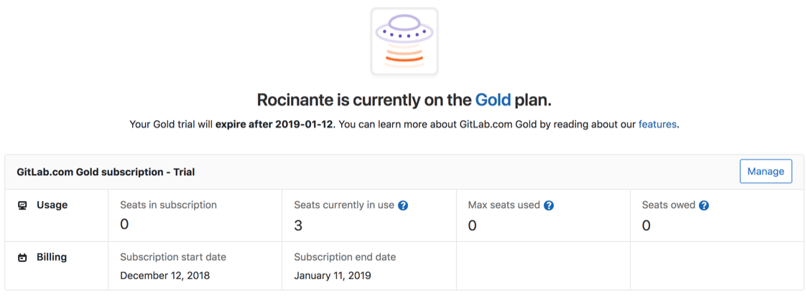

# Subscription setup and management

This page will help get you started with your new subscription or manage an existing one, whether you have subscribed to GitLab.com or self-managed GitLab.

To subscribe, upgrade, or read more about the types of subscriptions, please see [Subscribe to GitLab](../README.md#subscribe-to-gitlab) on the GitLab Documentation landing page.

## Set up GitLab

Learn how GitLab helps you in the stages of the DevOps lifecycle by learning more [about the GitLab product](https://about.gitlab.com/product/), [GitLab features](https://about.gitlab.com/features/), and [GitLab Documentation](../README.md).

### Self-managed: Install GitLab

Take a look at [installing GitLab](https://about.gitlab.com/install/) and our [administrator documentation](../administration/index.md). Then, follow the instructions below under [Your subscription](#your-subscription) to apply your license file. 

### GitLab.com: Create a user and group

Start with creating a user account for yourself using our [sign up page](https://gitlab.com/users/sign_in#register-pane).

[GitLab groups](../user/group/index.md) help assemble related projects together allowing you to grant members access to several projects at once. A group is not required if you plan on having [projects](../user/project/) inside a personal namespace.

## Your subscription

You can view and manage subscriptions through our [Customers portal](https://customers.gitlab.com/). Information on applying your subscription is below.

Please also see our [subscription FAQ](https://about.gitlab.com/pricing/licensing-faq/)

### View subscription and seats

To view and manage the subscriptions you have purchased and the number of seats associated with the subscription, please visit and log into the [Customers’ Portal](https://customers.gitlab.com/subscriptions). For more information, please see our [subscription FAQ](https://about.gitlab.com/pricing/licensing-faq/) and [pricing page](https://about.gitlab.com/pricing/), which includes information on our [true-up pricing policy](https://about.gitlab.com/handbook/product/pricing/#true-up-pricing) when adding more users than at the time of purchase.

Please note that this account may have the same email, but is a _separate_ login from your GitLab.com account. If the two accounts are linked together, then you can use the "sign in with GitLab.com account" link underneath the `Sign In` button.

### Change billing information

In the customers portal, go to the `My Account` page, then revise the `Account Details` information and click on the `Update Account` button.

Future purchases will use the information in this section. The email listed in this section is used for the Customers Portal login and for license related email communication.

### Self-managed: Apply your license file

After purchase, the license file is sent to the email address tied to the Customers portal account, which needs to be [uploaded to the GitLab instance](../user/admin_area/license.md#uploading-your-license).

### Link your GitLab.com account with your Customers Portal account

NOTE: **Note:** This is *required* for GitLab.com subscriptions.

Once signed into the customers portal, if your account is not already linked, you should be prompted to link your account with a "Link my GitLab Account" button.

You can also go to the [My Account](https://customers.gitlab.com/customers/edit) page to add or change the GitLab.com account link.

### Change the linked GitLab.com account for your Customers Portal account

To change which GitLab.com account is associated with a Customers Portal account, please follow these steps:

1. Log into the [Customers Portal](https://customers.gitlab.com/customers/sign_in).
1. In a separate browser tab, visit [GitLab.com](https://gitlab.com) to ensure you are not logged in, or if you are, log out.
1. Back on the Customers Portal page, click [My Account](https://customers.gitlab.com/customers/edit) in the top menu.
1. Under `Your GitLab.com account`, click the `Change linked account` button.
1. Have the user you want associated log in to their [GitLab.com](https://gitlab.com) account.

### GitLab.com: Associate your namespace with your subscription

Once your GitLab.com account is linked, you can go to your [Subscriptions](https://customers.gitlab.com/subscriptions) page to choose or change the namespace your subscription applies to.

Please note that you need to be a group owner to associate a group to your subscription.

### Confirm or upgrade your GitLab.com subscription details within GitLab

To see the status of your GitLab.com subscription, you can click on the Billings
section of the relevant namespace:

* For individuals, this is located at https://gitlab.com/profile/billings under
in your Settings,
* For groups, this is located under the group's Settings dropdown, under Billing.

For groups, you can see details of your subscription - including your current 
plan - in the included table:

| Field | Description |
| ------ | ------ |
| Seats in subscription | If this is a paid plan, this represents the number of seats you've paid to support in your group. |
| Seats currently in use | The number of active seats currently in use. | 
| Max seats used | The highest number of seats you've used. If this exceeds the seats in subscription, you may owe an additional fee for the additional users. | 
| Seats owed | If your max seats used exceeds the seats in your subscription, you'll owe an additional fee for the users you've added. | 
| Subscription start date | The date your subscription started. If this is for a Free plan, this is the date you transitioned off your group's paid plan. | 
| Subscription end date | The date your current subscription will end. This does not apply to Free plans. | 

## Need help?

[GitLab's Documentation](https://docs.gitlab.com/) offers a wide range of topics covering the use and administration of GitLab.

We also encourage all users to search our project trackers for known issues and existing feature requests in:

- [GitLab CE](https://gitlab.com/gitlab-org/gitlab-ce/issues/) for features included in all tiers, and
- [GitLab EE](https://gitlab.com/gitlab-org/gitlab-ee/issues/) for paid-tier features.

These issues are the best avenue for getting updates on specific product plans and for communicating directly with the relevant GitLab team members.

### Contacting Support

Learn more about the tiers of [GitLab Support](https://about.gitlab.com/support/) or [submit a request via the Support Portal](https://support.gitlab.com/hc/en-us/requests/new).
