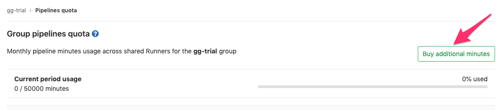
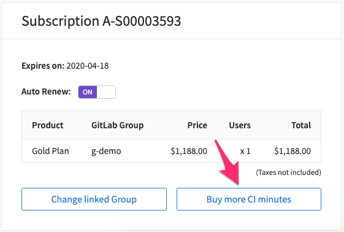

# Customer Docs

This section contains information for:

- New customers about choosing [which GitLab](#which-gitlab) is right for you.
- Existing customers about [managing subscriptions](#managing-subscriptions).

Also see our [subscription FAQ](https://about.gitlab.com/pricing/licensing-faq/).

## Which GitLab?

There are two ways to use GitLab:

- [GitLab.com](#gitlabcom): GitLab's SaaS offering. You don't need to install
  anything to use GitLab.com, you only need to
  [sign up](https://gitlab.com/users/sign_in) and start using GitLab straight away.
- [GitLab self-managed](#gitlab-self-managed): Install, administer, and maintain
  your own GitLab instance.

The following sections outline tiers and features within GitLab.com
and GitLab self-managed.

### GitLab.com

GitLab.com is hosted, managed, and administered by GitLab, Inc., with
[free and paid subscriptions](https://about.gitlab.com/pricing/) for individuals
and teams in the following tiers:

| Tier   | Includes same features available in                 |
|:-------|:----------------------------------------------------|
| Free   | [Core](#gitlab-self-managed) self-managed tier.     |
| Bronze | [Starter](#gitlab-self-managed) self-managed tier.  |
| Silver | [Premium](#gitlab-self-managed) self-managed tier.  |
| Gold   | [Ultimate](#gitlab-self-managed) self-managed tier. |

GitLab.com subscriptions grant access
to the same features available in GitLab self-managed, **except
[administration](../administration/index.md) tools and settings**.

GitLab.com allows you to apply your subscription to a group or your personal user.

When applied to:

- A **group**, the group, all subgroups, and all projects under the selected
  group on GitLab.com will have the features of the associated plan. It is
  recommended to go with a group plan when managing projects and users of an
  organization.
- A **personal userspace** instead, all projects will have features with the
  subscription applied, but as it is not a group, group features will not be available.

TIP: **Tip:**
To support the open source community and encourage the development of open
source projects, GitLab grants access to **Gold** features for all GitLab.com
**public** projects, regardless of the subscription.

The following resources are available for more information on GitLab.com:

- [Feature comparison](https://about.gitlab.com/pricing/gitlab-com/feature-comparison/), for information on what features are available at each tier.
- [GitLab pricing page](https://about.gitlab.com/pricing/), for subscription information and a free trial.
- Our [product marketing page](https://about.gitlab.com/handbook/marketing/product-marketing/), for additional information including:
  - How [different tiers are licensed](https://about.gitlab.com/handbook/marketing/product-marketing/#tiers).
  - The different [GitLab distributions](https://about.gitlab.com/handbook/marketing/product-marketing/#distributions).

#### Subscribing to GitLab.com

To subscribe to GitLab.com:

1. Create a user account for yourself using our
   [sign up page](https://gitlab.com/users/sign_in#register-pane).
1. Create a [group](../user/group/index.md). GitLab groups help assemble related
   projects together allowing you to grant members access to several projects
   at once. A group is not required if you plan on having projects inside a personal
   namespace.
1. Create additional users and
   [add them to the group](../user/group/index.md#add-users-to-a-group).
1. Select the **Bronze**, **Silver**, or **Gold** GitLab.com plan through the
   [GitLab Subscription Manager](https://customers.gitlab.com/).
1. Link your GitLab.com account with your GitLab Subscription Manager account.
   Once signed into the GitLab Subscription Manager, if your account is not
   already linked, you will prompted to link your account with a
   **Link my GitLab Account** button.
1. Associate the group with the subscription.

TIP: **Tip:**
You can also go to the [**My Account**](https://customers.gitlab.com/customers/edit)
page to add or change the GitLab.com account link.

### GitLab self-managed

With GitLab self-managed, you deploy your own GitLab instance on-premises or on a cloud of your choice.
GitLab self-managed is available for [free and with paid subscriptions](https://about.gitlab.com/pricing/#self-managed) in the following tiers:

| Tier     | Includes                                       |
|:---------|:-----------------------------------------------|
| Core     | Core features.                                 |
| Starter  | Core and Starter features.                     |
| Premium  | Core, Starter, and Premium features.           |
| Ultimate | Core, Starter, Premium, and Ultimate features. |

The following resources are available for more information on GitLab self-managed:

- [Feature comparison](https://about.gitlab.com/pricing/self-managed/feature-comparison/), for information on what features are available at each tier.
- [GitLab pricing page](https://about.gitlab.com/pricing/#self-managed), for subscription information and a free trial.
- Our [product marketing page](https://about.gitlab.com/handbook/marketing/product-marketing/), for additional information including:
  - How [different tiers are licensed](https://about.gitlab.com/handbook/marketing/product-marketing/#tiers).
  - The different [GitLab distributions](https://about.gitlab.com/handbook/marketing/product-marketing/#distributions).

#### Subscribing through GitLab self-managed

To subscribe to GitLab through a self-managed installation:

1. [Install](https://about.gitlab.com/install/) GitLab.
1. Complete the installation with
   [administration tasks](../administration/index.md).
1. Select the **Starter**, **Premium**, or **Ultimate** self-managed plan
   through the [GitLab Subscription Manager](https://customers.gitlab.com/).
1. Apply your license file. After purchase, a license file is sent to the email
   address associated to the GitLab Subscription Manager account,
   which needs to be
   [uploaded to your GitLab instance](../user/admin_area/license.md#uploading-your-license).

TIP: **Tip:**
If you are purchasing a subscription for an existing **Core** self-managed
instance, ensure you are purchasing enough seats to
[cover your users](../user/admin_area/index.md#administering-users).

## Managing subscriptions

You can view and manage subscriptions through our
[GitLab Subscription Manager](https://customers.gitlab.com/).

### View subscription and seats

Visit the
[GitLab Subscription Manager](https://customers.gitlab.com/subscriptions) to
view and manage:

- The subscriptions you have purchased.
- The number of seats associated with the subscription.
- Retrieve copies of invoices.
- Change the credit card on file.

For more information, please see our:

- [Subscription FAQ](https://about.gitlab.com/pricing/licensing-faq/).
- [Pricing page](https://about.gitlab.com/pricing/), which includes information
  on our [true-up pricing policy](https://about.gitlab.com/handbook/ceo/pricing/#true-up-pricing)
  when adding more users other than at the time of purchase.

NOTE: **Note:**
The GitLab Subscription Manager account can have the same email address as your
GitLab.com account, but is a _separate_ login. If the two accounts are
linked together, you can use the **Or sign in with GitLab.com**
link underneath the **Sign In** button.

### Change billing information

To change billing information:

1. Log in to [GitLab Subscription Manager](https://customers.gitlab.com/customers/sign_in).
1. Go to the **My Account** page.
1. Make the required changes to the **Account Details** information.
1. Click **Update Account**.

NOTE: **Note:**
Future purchases will use the information in this section.
The email listed in this section is used for the GitLab Subscription Manager
login and for license-related email communication.

### Manage GitLab.com account

This section provided information specific to managing subscriptions with a
GitLab.com account.

#### Change linked account

To change the GitLab.com account associated with a GitLab Subscription Manager
account:

1. Log in to the
   [GitLab Subscription Manager](https://customers.gitlab.com/customers/sign_in).
1. Go to [GitLab.com](https://gitlab.com) in a separate browser tab. Ensure you
   are not logged in.
1. On the GitLab Subscription Manager page, click
   [**My Account**](https://customers.gitlab.com/customers/edit) in the top menu.
1. Under **Your GitLab.com account**, click **Change linked account** button.
1. Log in to [GitLab.com](https://gitlab.com) account to link to.

#### Change associated namespace

With a linked GitLab.com account:

1. Log in to the [GitLab Subscription Manager](https://customers.gitlab.com/customers/sign_in).
1. Navigate to the **Manage Purchases** page.
1. Click **Change linked group**.
1. Select the desired group from the **This subscription is for** dropdown.
1. Click **Proceed to checkout**.

Subscription charges are calculated based on the total number of users in a group, including its subgroups and nested projects. If the total number of users exceeds the number of seats in your subscription, you will be charged for the additional users.

### Confirm or upgrade your subscription

To see the status of your GitLab.com subscription, you can click on the
**Billings** section of the relevant namespace:

- For individuals:
  1. Go to **User Avatar > Settings**.
  1. Click **Billing**.
- For groups, go to the group's **Settings** dropdown, under **Billing**.

The following table describes details of your subscription for groups:

| Field | Description |
| ------ | ------ |
| Seats in subscription | If this is a paid plan, represents the number of seats you've paid to support in your group. |
| Seats currently in use | Number of active seats currently in use. |
| Max seats used | Highest number of seats you've used. If this exceeds the seats in subscription, you may owe an additional fee for the additional users. |
| Seats owed | If your max seats used exceeds the seats in your subscription, you'll owe an additional fee for the users you've added. |
| Subscription start date | Date your subscription started. If this is for a Free plan, is the date you transitioned off your group's paid plan. |
| Subscription end date | Date your current subscription will end. Does not apply to Free plans. |

#### CI pipeline minutes

CI pipeline minutes are the execution time for your [pipelines](../ci/pipelines.md) on our shared runners. Each [GitLab.com tier](https://about.gitlab.com/pricing/) includes a monthly quota of CI pipeline minutes. The quota is applied per group, shared across all members of that group, its subgroups and nested projects. To view the usage, navigate to the group's page, then **Settings > Usage Quotas**.

Only pipeline minutes for our shared runners are restricted. If you have a specific runner setup for your projects, there is no limit to your build time on GitLab.com.

The minutes limit only applies to private projects. The available quota is reset on the first of each calendar month at midnight UTC.

If you reach your limit, you can [purchase additional CI minutes](#extra-shared-runners-pipeline-minutes), or upgrade your account to [Silver or Gold](https://about.gitlab.com/pricing/). Note, your own runners can still be used even if you reach your limits.

##### How pipeline quota usage is calculated

Pipeline quota usage is calculated as the sum of the duration of each individual job. This is slightly different to how pipeline _duration_ is [calculated](https://docs.gitlab.com/ee/ci/pipelines.html#how-pipeline-duration-is-calculated). Pipeline quota usage doesn't consider the intersection of jobs.

A simple example is:

A (1, 3)
B (2, 4)
C (6, 7)

In the example:

A begins at 1 and ends at 3.
B begins at 2 and ends at 4.
C begins at 6 and ends at 7.
Visually, it can be viewed as:

```
0  1  2  3  4  5  6  7
   AAAAAAA
      BBBBBBB
                  CCCC
```

The sum of each individual job is being calculated therefore in this example, `8` runner minutes would be used for this pipeline:

```
A + B + C = 3 + 3 + 2 => 8
```

#### Extra Shared Runners pipeline minutes

If you're using GitLab.com, you can purchase additional CI minutes so your
pipelines will not be blocked after you have used all your CI minutes from your
main quota. Additional minutes:

- Are only used once the shared quota included in your subscription runs out.
- Roll over month to month.

In order to purchase additional minutes, you should follow these steps:

1. Go to **Group > Settings > Pipelines quota**. Once you are on that page, click on **Buy additional minutes**.

   

1. Locate the subscription card that is linked to your group on GitLab.com,
   click on **Buy more CI minutes**, and complete the details about the transaction.

   

1. Once we have processed your payment, the extra CI minutes
   will be synced to your Group and you can visualize it from the
   **Group > Settings > Pipelines quota** page:

   

   The **Additional minutes** displayed now includes the purchased additional CI minutes, plus any
   minutes rolled over from last month.

Be aware that:

1. If you have purchased extra CI minutes before the purchase of a paid plan,
   we will calculate a pro-rated charge for your paid plan. That means you may
   be charged for less than one year since your subscription was previously
   created with the extra CI minutes.
1. Once the extra CI minutes has been assigned to a Group they cannot be transferred
   to a different Group.
1. If you have some minutes used over your default quota, these minutes will
   be deducted from your Additional Minutes quota immediately after your purchase of additional
   minutes.

##### What happens when my CI minutes run out

When the CI minutes run out, an email is sent automatically to notify the owner(s)
of the group/namespace, including a link to [purchase more minutes](https://customers.gitlab.com/plans).

If you are not the owner of the group, you will need to contact them to let them know they need to
[purchase more minutes](https://customers.gitlab.com/plans).

## Subscription changes and your data

When your subscription or trial expires, GitLab does not delete your data.

However, depending on the tier and feature, your data may become inaccessible.

Please note that some features may not behave as expected if a graceful
fallback is not currently implemented. For example,
[environment specific variables not being passed](https://gitlab.com/gitlab-org/gitlab-foss/issues/52825).

If you renew or upgrade, your data will again be accessible.

### Self-managed data

For self-managed customers, there is a two-week grace period when your features
will continue to work as-is, after which the entire instance will become read
only.

However, if you remove the license, you will immediately revert to Core
features.

## Need help?

[GitLab's Documentation](https://docs.gitlab.com/) offers a wide range of
topics covering the use and administration of GitLab.

We also encourage all users to search our project trackers for known issues and
existing feature requests in:

- [GitLab CE](https://gitlab.com/gitlab-org/gitlab-foss/issues/) for features
  included in all tiers.
- [GitLab EE](https://gitlab.com/gitlab-org/gitlab/issues/) for paid-tier
  features.

These issues are the best avenue for getting updates on specific product plans
and for communicating directly with the relevant GitLab team members.

### Contacting Support

Learn more about:

- The tiers of [GitLab Support](https://about.gitlab.com/support/).
- [Submit a request via the Support Portal](https://support.gitlab.com/hc/en-us/requests/new).

<!-- ## Troubleshooting

Include any troubleshooting steps that you can foresee. If you know beforehand what issues
one might have when setting this up, or when something is changed, or on upgrading, it's
important to describe those, too. Think of things that may go wrong and include them here.
This is important to minimize requests for support, and to avoid doc comments with
questions that you know someone might ask.

Each scenario can be a third-level heading, e.g. `### Getting error message X`.
If you have none to add when creating a doc, leave this section in place
but commented out to help encourage others to add to it in the future. -->
