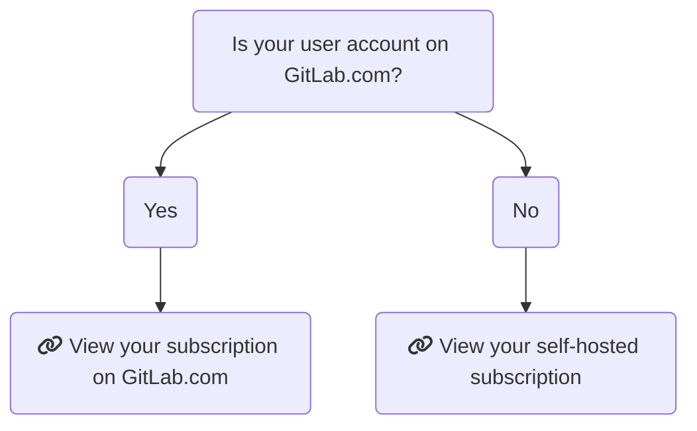
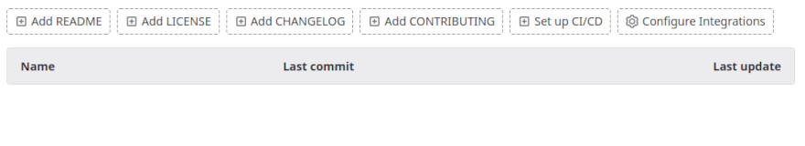

# GitLab subscription **(PREMIUM)**

GitLab offers tiers of features. Your subscription determines which tier you
have access to. Subscriptions are valid for 12 months.

GitLab provides special subscriptions to participants in:

- [Education](#gitlab-for-education)
- [Open Source](#gitlab-for-open-source)

## Choose a GitLab subscription

When choosing a subscription, there are two factors to consider:

- [GitLab SaaS or GitLab self-managed](#choose-between-gitlab-saas-or-gitlab-self-managed)
- [GitLab tier](#choose-a-gitlab-tier)

### Choose between GitLab SaaS or GitLab self-managed

There are some differences in how a subscription applies, depending if you use
GitLab SaaS or GitLab self-managed:

- [GitLab SaaS](gitlab_com/index.md): The GitLab software-as-a-service offering.
  You don't need to install anything to use GitLab SaaS, you only need to
  [sign up](https://gitlab.com/users/sign_up) and start using GitLab straight away.
- [GitLab Dedicated](gitlab_dedicated/index.md): a single-tenant SaaS service for highly regulated and large enterprises.
- [GitLab self-managed](self_managed/index.md): Install, administer, and maintain
  your own GitLab instance.

On a GitLab self-managed instance, a GitLab subscription provides the same set of
features for _all_ users. On GitLab SaaS, you can apply a subscription to a group
namespace. You cannot apply a subscription to a personal namespace.

NOTE:
Subscriptions cannot be transferred between GitLab SaaS and GitLab self-managed.
A new subscription must be purchased and applied as needed.

### Choose a GitLab tier

Pricing is [tier-based](https://about.gitlab.com/pricing/), allowing you to choose
the features which fit your budget. For information on what features are available
at each tier for each product, see: [GitLab self-managed feature comparison](https://about.gitlab.com/pricing/feature-comparison/)

## Find your subscription

The following chart should help you determine your subscription model. Select
the list item to go to the respective help page.

## Customers Portal

With the [Customers Portal](https://customers.gitlab.com/) you can:

- [Change account owner information](#change-account-owner-information)
- [Change your company details](#change-your-company-details)
- [Change your payment method](#change-your-payment-method)
- [Change the linked account](#change-the-linked-account)
- [Change the namespace the subscription is linked to](gitlab_com/index.md#change-the-linked-namespace)
- [Change customers portal account password](#change-customers-portal-account-password)

The Customers Portal is available only to customers who purchased their
subscription from GitLab. If you made your purchase through a partner or
reseller, you must contact them directly for assistance with your subscription.

### Change account owner information

Account owner personal details are used on invoices. The account owner email address is used for the Customers Portal legacy login and license-related email.

If you have registered a Customers Portal account through a GitLab.com account, the GitLab.com account is used for login.

To change account owner information, including name, billing address, and email address:

1. Log in to the [Customers Portal](https://customers.gitlab.com/customers/sign_in).
1. Select **My account > Account details**.
1. Expand the **Personal details** section.
1. Edit the personal details.
1. Select **Save changes**.

If you want to transfer ownership of the Customers Portal account
to another person, after you enter that person's personal details, you must also:

- [Change the Customers Portal account password](#change-customers-portal-account-password).
- [Change the linked GitLab.com account](#change-the-linked-account), if you have one linked.

### Change your company details

To change your company details, including company name and VAT number:

1. Log in to the [Customers Portal](https://customers.gitlab.com/customers/sign_in).
1. Select **My account > Account details**.
1. Expand the **Company details** section.
1. Edit the company details.
1. Select **Save changes**.

### Change your payment method

Purchases in the Customers Portal require a credit card on record as a payment method. You can add
multiple credit cards to your account, so that purchases for different products are charged to the
correct card.

If you would like to use an alternative method to pay, please
[contact our Sales team](https://about.gitlab.com/sales/).

To change your payment method:

1. Log in to the [Customers Portal](https://customers.gitlab.com/customers/sign_in).
1. Select **My account > Payment methods**.
1. **Edit** an existing payment method's information or **Add new payment method**.
1. Select **Save Changes**.

#### Set a default payment method

Automatic renewal of a subscription is charged to your default payment method. To mark a payment
method as the default:

1. Log in to the [Customers Portal](https://customers.gitlab.com/customers/sign_in).
1. Select **My account > Payment methods**.
1. **Edit** the selected payment method and check the **Make default payment method** checkbox.
1. Select **Save Changes**.

### Change the linked account

To change the GitLab.com account linked to your Customers Portal account:

1. Log in to the
   [Customers Portal](https://customers.gitlab.com/customers/sign_in).
1. In a separate browser tab, go to [GitLab.com](https://gitlab.com/users/sign_in) and ensure you
   are not logged in.
1. On the Customers Portal page, select **My account > Account details**.
1. Under **Your GitLab.com account**, select **Change linked account**.
1. Log in to the [GitLab.com](https://gitlab.com/users/sign_in) account you want to link to the Customers Portal
   account.

### Change Customers Portal account password

To change the password for this customers portal account:

1. Log in to the [Customers Portal](https://customers.gitlab.com/customers/sign_in).
1. Select the **My account** dropdown list and select **Account details**.
1. Make the required changes to the **Your password** section.
1. Select **Save changes**.

## Community program subscriptions

### GitLab for Education

For qualifying non-profit educational institutions, the [GitLab for Education Program](https://about.gitlab.com/solutions/education/) provides GitLab Ultimate, plus 50,000 CI/CD minutes per month. The subscription granted under GitLab for Education can only be used for instructional use or non-commercial academic research. For more information—including instructions for applying to the program and renewing program membership—see the [GitLab for Education Program page](https://about.gitlab.com/solutions/education/) and the [GitLab handbook](https://about.gitlab.com/handbook/marketing/community-relations/community-programs/education-program/).

### GitLab for Open Source

For qualifying open source projects, the [GitLab for Open Source Program](https://about.gitlab.com/solutions/open-source/) provides GitLab Ultimate, plus 50,000 CI/CD minutes per month. For more information—including instructions for applying to the program and renewing program membership—see the [GitLab for Open Source Program page](https://about.gitlab.com/solutions/open-source/) and the [GitLab handbook](https://about.gitlab.com/handbook/marketing/community-relations/community-programs/opensource-program/).

#### Meeting GitLab for Open Source Program requirements

To meet GitLab for Open Source Program requirements, first add an OSI-approved open source license to all projects in your namespace.

To add a license to a project:

1. On the top bar, select **Main menu > Projects** and find your project.
1. On the overview page, select **Add LICENSE**. If the license you want is not available as a license template, manually copy the entire, unaltered [text of your chosen license](https://opensource.org/licenses/alphabetical) into the `LICENSE` file. Note that GitLab defaults to **All rights reserved** if users do not perform this action.

Applicants must add the correct license to each project in their respective groups or namespaces. When you're sure you're using OSI-approved licenses for your projects, you can take your screenshots.

NOTE:
GitLab for Open Source Program benefits apply to an entire GitLab namespace. To qualify for the GitLab for Open Source Program, all projects in an applicant's namespace must meet program requirements. Applicants submit materials related to one project in the applying namespace, and the open source program team uses that project to verify eligibility of the entire namespace.

#### Verification for Open Source Program

Next, take screenshots of your project to confirm that project's eligibility. You must upload three screenshots:

- [OSI-approved license overview](#screenshot-1-license-overview)
- [OSI-approved license contents](#screenshot-2-license-contents)
- [Publicly visible settings](#screenshot-3-publicly-visible-settings)

NOTE:
Benefits of the GitLab Open Source Program apply to all projects in a GitLab namespace. All projects in an eligible namespace must meet program requirements.

##### Screenshot 1: License overview

1. On the top bar, select **Main menu > Projects** and find your project.
1. On the left sidebar, select your project avatar. If you haven't specified an avatar for your project, the avatar displays as a single letter.
1. Take a screenshot of the project overview that clearly displays the license you've chosen for your project.

##### Screenshot 2: License contents

1. On the top bar, select **Main menu > Projects** and find your project.
1. On the left sidebar, select **Repository** and locate the project's `LICENSE` file.
1. Take a screenshot of the contents of the file. Make sure the screenshot includes the title of the license.

##### Screenshot 3: Publicly visible settings

To be eligible for the GitLab Open Source Program, projects must be publicly visible. To check your project's public visibility settings:

1. On the top bar, select **Main menu > Projects** and find your project.
1. From the left sidebar, select **Settings > General**.
1. Expand **Visibility, project features, permissions**.
1. From the **Project visibility** dropdown list, select **Public**.
1. Select the **Users can request access** checkbox.
1. Take a screenshot of this view. Include as much of the publicly visible settings as possible. Make sure to include your project's name in the upper-left of the screenshot.

NOTE:
Exceptions to this public visibility requirement apply in select circumstances (for example, in cases where a project in an applicant's namespace may hold sensitive data). Email `opensource@gitlab.com` with details of your use case to request written permission for exceptions.

### GitLab for Startups

For qualifying startups, the [GitLab for Startups](https://about.gitlab.com/solutions/startups/) program provides GitLab Ultimate, plus 50,000 CI/CD minutes per month for 12 months. For more information—including instructions for applying to the program and renewing program membership—see the [GitLab for Startups Program page](https://about.gitlab.com/solutions/startups/) and the [GitLab handbook](https://about.gitlab.com/handbook/marketing/community-relations/community-programs/startups-program/).

## Contact Support

Learn more about:

- The tiers of [GitLab Support](https://about.gitlab.com/support/).
- [Submit a request via the Support Portal](https://support.gitlab.com/hc/en-us/requests/new).

We also encourage all users to search our project trackers for known issues and existing feature requests in the [GitLab project](https://gitlab.com/gitlab-org/gitlab/-/issues/).

These issues are the best avenue for getting updates on specific product plans and for communicating directly with the relevant GitLab team members.

<!-- ## Troubleshooting

Include any troubleshooting steps that you can foresee. If you know beforehand what issues
one might have when setting this up, or when something is changed, or on upgrading, it's
important to describe those, too. Think of things that may go wrong and include them here.
This is important to minimize requests for support, and to avoid doc comments with
questions that you know someone might ask.

Each scenario can be a third-level heading, for example `### Getting error message X`.
If you have none to add when creating a doc, leave this section in place
but commented out to help encourage others to add to it in the future. -->
