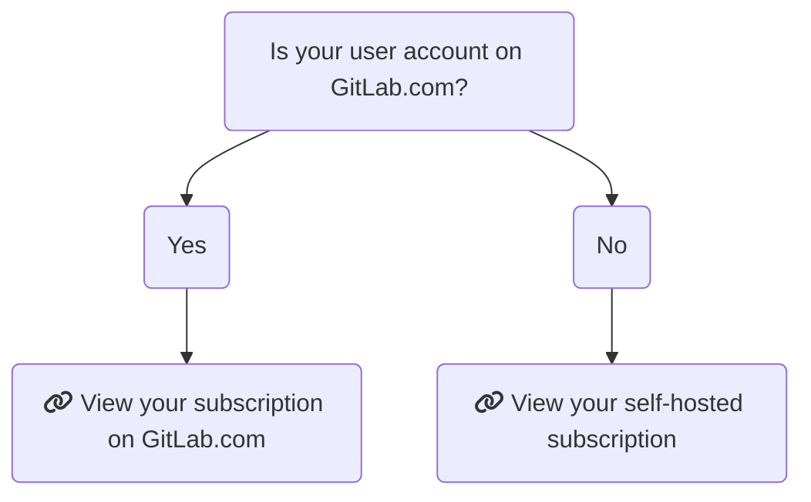

# GitLab subscription **(STARTER)**

GitLab offers tiers of features. Your subscription determines which tier you
have access to. Subscriptions are valid for 12 months.

GitLab provides special subscriptions to participants in:

- [Education](#gitlab-for-education-subscriptions)
- [Open Source](#gitlab-for-open-source-subscriptions)

## Choose a GitLab subscription

When choosing a subscription, there are two factors to consider:

- [GitLab.com or self-managed](#choose-between-gitlabcom-or-self-managed)
- [GitLab tier](#choose-a-gitlab-tier)

### Choose between GitLab.com or self-managed

There are some differences in how a subscription applies, depending if you use
GitLab.com or a self-managed instance:

- [GitLab.com](gitlab_com/index.md): GitLab's software-as-a-service offering.
  You don't need to install anything to use GitLab.com, you only need to
  [sign up](https://gitlab.com/users/sign_up) and start using GitLab straight away.
- [GitLab self-managed](self_managed/index.md): Install, administer, and maintain
  your own GitLab instance.

On a self-managed instance, a GitLab subscription provides the same set of
features for _all_ users. On GitLab.com, you can apply a subscription to either
a group or a personal namespace.

NOTE: **Note:**
Subscriptions cannot be transferred between GitLab.com and GitLab self-managed.
A new subscription must be purchased and applied as needed.

### Choose a GitLab tier

Pricing is [tier-based](https://about.gitlab.com/pricing/), allowing you to choose
the features which fit your budget. For information on what features are available
at each tier for each product, see:

- [GitLab.com feature comparison](https://about.gitlab.com/pricing/gitlab-com/feature-comparison/)
- [Self-managed feature comparison](https://about.gitlab.com/pricing/self-managed/feature-comparison/)

## Find your subscription

The following chart should help you determine your subscription model. Click
on the list item to go to the respective help page.

## Customers portal

With the [Customers Portal](https://customers.gitlab.com/) you can:

- [Change your personal details](#change-your-personal-details)
- [Change your company details](#change-your-company-details)
- [Change your payment method](#change-your-payment-method)
- [Change the linked account](#change-the-linked-account)
- [Change the associated namespace](#change-the-associated-namespace)
- [Change customers portal account password](#change-customers-portal-account-password)

### Change your personal details

Your personal details are used on invoices. Your email address is used for the Customers Portal
login and license-related email.

To change your personal details, including name, billing address, and email address:

1. Log in to the [Customers Portal](https://customers.gitlab.com/customers/sign_in).
1. Select **My account > Account details**.
1. Expand the **Personal details** section.
1. Edit your personal details.
1. Click **Save changes**.

### Change your company details

To change your company details, including company name and VAT number:

1. Log in to the [Customers Portal](https://customers.gitlab.com/customers/sign_in).
1. Select **My account > Account details**.
1. Expand the **Company details** section.
1. Edit the company details.
1. Click **Save changes**.

### Change your payment method

Purchases in the Customers Portal require a credit card on record as a payment method. You can add
multiple credit cards to your account, so that purchases for different products are charged to the
correct card.

If you would like to use an alternative method to pay, please [contact our Sales
team](https://about.gitlab.com/sales/).

To change your payment method:

1. Log in to the [Customers Portal](https://customers.gitlab.com/customers/sign_in).
1. Select **My account > Payment methods**.
1. **Edit** an existing payment method's information or **Add new payment method**.
1. Click **Save Changes**.

#### Set a default payment method

Automatic renewal of a subscription is charged to your default payment method. To mark a payment
method as the default:

1. Log in to the [Customers Portal](https://customers.gitlab.com/customers/sign_in).
1. Select **My account > Payment methods**.
1. **Edit** the selected payment method and check the **Make default payment method** checkbox.
1. Click **Save Changes**.

### Change the linked account

To change the GitLab.com account associated with your Customers Portal
account:

1. Log in to the
   [Customers Portal](https://customers.gitlab.com/customers/sign_in).
1. In a separate browser tab, go to [GitLab.com](https://gitlab.com) and ensure you
   are not logged in.
1. On the Customers Portal page, click **My account > Account details**.
1. Under **Your GitLab.com account**, click **Change linked account**.
1. Log in to the [GitLab.com](https://gitlab.com) account you want to link to the Customers Portal
   account.

### Change the associated namespace

With a linked GitLab.com account:

1. Log in to the [Customers Portal](https://customers.gitlab.com/customers/sign_in).
1. Navigate to the **Manage Purchases** page.
1. Click **Change linked namespace**.
1. Select the desired group from the **This subscription is for** dropdown.
1. Click **Proceed to checkout**.

Subscription charges are calculated based on the total number of users in a group, including its subgroups and nested projects. If the total number of users exceeds the number of seats in your subscription, your account is charged for the additional users.

### Change Customers Portal account password

To change the password for this customers portal account:

1. Log in to the [Customers Portal](https://customers.gitlab.com/customers/sign_in).
1. Select the **My account** drop-down and click on **Account details**.
1. Make the required changes to the **Your password** section.
1. Click **Save changes**.

## GitLab for Education subscriptions

The GitLab Education license can only be used for instructional-use or
non-commercial academic research.

Find more information how to apply and renew at
[GitLab for Education](https://about.gitlab.com/solutions/education/).

## GitLab for Open Source subscriptions

All [GitLab for Open Source](https://about.gitlab.com/solutions/open-source/program/)
requests, including subscription renewals, must be made by using the application process.
If you have any questions, send an email to `opensource@gitlab.com` for assistance.

## Contact Support

Learn more about:

- The tiers of [GitLab Support](https://about.gitlab.com/support/).
- [Submit a request via the Support Portal](https://support.gitlab.com/hc/en-us/requests/new).

We also encourage all users to search our project trackers for known issues and
existing feature requests in the
[GitLab project](https://gitlab.com/gitlab-org/gitlab/-/issues/).

These issues are the best avenue for getting updates on specific product plans
and for communicating directly with the relevant GitLab team members.

<!-- ## Troubleshooting

Include any troubleshooting steps that you can foresee. If you know beforehand what issues
one might have when setting this up, or when something is changed, or on upgrading, it's
important to describe those, too. Think of things that may go wrong and include them here.
This is important to minimize requests for support, and to avoid doc comments with
questions that you know someone might ask.

Each scenario can be a third-level heading, e.g. `### Getting error message X`.
If you have none to add when creating a doc, leave this section in place
but commented out to help encourage others to add to it in the future. -->
