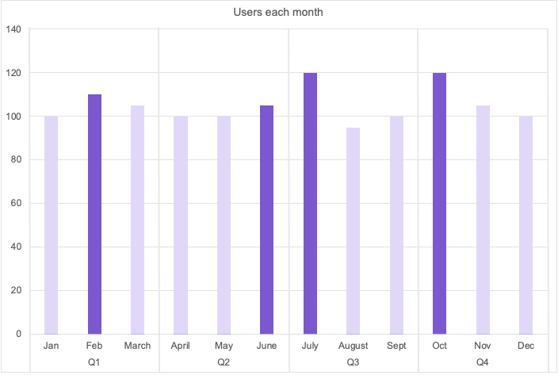

# Quarterly reconciliation and annual true-ups

DETAILS:
**Tier:** Premium, Ultimate
**Offering:** GitLab.com, Self-managed, GitLab Dedicated

In accordance with [the GitLab Subscription Agreement](https://about.gitlab.com/terms/), GitLab reviews your seat usage and sends you an invoice for any overages.
This review can occur:

- **Annually**. This process is also known as **the annual true-up process**. This process requires you to pay the full annual subscription fee for users added anytime during the year.
- **Quarterly**. With this process, you pay on a prorated basis for the remaining portion of the subscription term.

## Quarterly reconciliation vs. annual true-ups

Quarterly reconciliation can result in substantial savings.

Let's say in January you purchased an annual license for 100 users. This chart shows your usage during the year.
The number of users went up and down, with 120 as the maximum. The dark purple indicates the most users you had each quarter.

If you are being billed annually:

- During the year, you went over the license by 20 users.
- If we pretend each extra seat is $100, then you pay $100 x 20 users.

Annual total: **$2000**

If you are being billed quarterly, you pay for the maximum number of seats you used during the quarter,
and for only the remaining quarters. Your invoice is prorated for the remaining portion of the subscription term.

Using the same example, if a seat is $100 per year, then it is $25 per quarter.

- In Q1, you had a maximum of 110 users. 10 users over subscription x $25 per user x 3 quarters = **$750**
  The license is now paid for 110 users.

- In Q2, 105 users was the maximum. You did not go over 110 users, so no charge.

- In Q3, you had 120 users. 10 users over subscription x $25 per user x 1 remaining quarter = **$250**
  The license is now paid for 120 users.

- In Q4, you had 120 users. You did not exceed the number of users. However, if you had, you would not be charged, because in Q4, there are no charges for exceeding the number.

Annual total: **$1000**

With quarterly reconciliation, you pay less annually.

If it's not possible for you to participate in quarterly reconciliations, you can opt out of the
process by using a contract amendment. In that case, you default to the annual review.

## Timeline for quarterly invoicing and payment

At the end of each subscription quarter, GitLab notifies you about overages.
The date you're notified about the overage is not the same as the date
you are billed.

### GitLab SaaS

Group owners receive an email **on the reconciliation date**.
The email communicates the [overage seat quantity](gitlab_com/index.md#seats-owed)
and expected invoice amount.

**Seven days later**, the subscription is updated to include the additional
seats, and an invoice is generated for a prorated amount. If a credit card
is on file, a payment is automatically applied. Otherwise, an invoice is
sent and subject to your terms.

### Self-managed instances

Administrators receive an email **six days after the reconciliation date**.
This email communicates the [overage seat quantity](self_managed/index.md#users-over-subscription)
and expected invoice amount.

**Seven days later**, the subscription is updated to include the additional
seats, and an invoice is generated for a prorated amount. If a credit card
is on file, a payment is automatically applied. Otherwise, an invoice is
sent and subject to your payment terms.

### Troubleshooting failed payment

If your credit card is declined during the reconciliation process, an email will be sent with the subject `Your GitLab subscription failed to reconcile`. Follow these instructions to update your payment information, and the reconciliation will be automatically retried:

1. Sign in to your account at `https://customers.gitlab.com`.
1. On the left sidebar, select **Billing account settings**.
1. Under **Payment methods**, select **Add new payment method**.
1. After the new payment method has been added, select **Edit**, then select **Default** to mark it as the default payment method.

Reconciliation is retried automatically as soon as the payment method is updated.

## Quarterly reconciliation eligibility

### You are automatically enrolled in quarterly reconciliation if

- The credit card you used to purchase your subscription is still linked to your GitLab account.
- You purchased your subscription through an invoice.

### You are excluded from quarterly reconciliation if

- You purchased your subscription from a reseller or another channel partner.
- You purchased a multi-year subscription.
- You purchased your subscription with a purchasing order.
- You are a public sector customer.
- You have an offline environment and used a license file to activate your subscription.
- You are enrolled in a program that provides a free tier such as the GitLab for Education, GitLab for Open Source Program, or GitLab for Startups.

If you are excluded from quarterly reconciliation and not on a free tier, your true-ups are reconciled annually.
