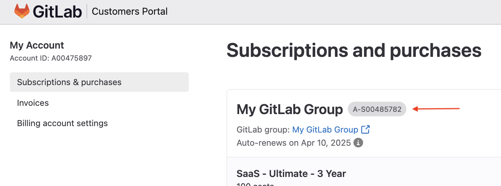

# Subscription add-ons

DETAILS:
**Tier:** Premium, Ultimate
**Offering:** GitLab.com, Self-managed, GitLab Dedicated

You can purchase subscription add-ons to give users in your organization access to more GitLab features.
Subscription add-ons are purchased as additional seats in your subscription.
Access to features provided by subscription add-ons is managed through seat assignment. Subscription
add-ons can be assigned to billable users only.

## Purchase GitLab Duo seats

You can purchase additional GitLab Duo Pro or GitLab Duo Enterprise seats for your group namespace or self-managed instance. After you complete the purchase, you must assign the seats to billable users so that they can use GitLab Duo.

To purchase GitLab Duo Pro seats, you can use the Customers Portal, or you can contact the [GitLab Sales team](https://about.gitlab.com/solutions/gitlab-duo-pro/sales/). To purchase GitLab Duo Enterprise, contact the [GitLab Sales team](https://about.gitlab.com/solutions/gitlab-duo-pro/sales/).

1. Sign in to the [GitLab Customers Portal](https://customers.gitlab.com/).
1. On the subscription card, select the vertical ellipsis (**{ellipsis_v}**).
1. Select **Buy GitLab Duo Pro**.
1. Enter the number of seats for GitLab Duo.
1. Review the **Purchase summary** section.
1. From the **Payment method** dropdown list, select your payment method.
1. Select **Purchase seats**.

## Assign GitLab Duo seats

Prerequisites:

- You must purchase a GitLab Duo add-on, or have an active GitLab Duo trial.
- For self-managed and GitLab Dedicated:
  - The GitLab Duo Pro add-on is available in GitLab 16.8 and later.
  - The GitLab Duo Enterprise add-on is only available in GitLab 17.3 and later.

After you purchase GitLab Duo, you can assign seats to billable users to grant access to the add-on.

### For GitLab.com

To use GitLab Duo features in any project or group, you must assign the user to a seat in at least one top-level group.

1. On the left sidebar, select **Search or go to** and find your group.
1. Select **Settings > GitLab Duo**.
1. To the right of the user, turn on the toggle to assign a GitLab Duo seat.

### For self-managed

Prerequisites:

- You must be an administrator.

1. On the left sidebar, at the bottom, select **Admin**.
1. Select **GitLab Duo**.
   - If the **GitLab Duo** menu item is not available, synchronize your subscription
     after purchase:
     1. On the left sidebar, select **Subscription**.
     1. In **Subscription details**, to the right of **Last sync**, select
        synchronize subscription (**{retry}**).
1. To the right of the user, turn on the toggle to assign a GitLab Duo seat.

#### Configure network and proxy settings

For self-managed instances, to enable GitLab Duo features,
you must [enable network connectivity](../user/ai_features_enable.md).

## Assign and remove GitLab Duo seats in bulk

You can assign or remove seats in bulk for multiple users.

### For GitLab.com

1. On the left sidebar, select **Search or go to** and find your group.
1. Select **Settings > Usage Quotas**.
1. Select the **GitLab Duo** tab.
1. Select the users to assign or remove seats for:
   - To select multiple users, to the left of each user, select the checkbox.
   - To select all, select the checkbox at the top of the table.
1. Assign or remove seats:
   - To assign seats, select **Assign seat**, then **Assign seats** to confirm.
   - To remove users from seats, select **Remove seat**, then **Remove seats** to confirm.

### For self-managed

Administrators of self-managed instances can use a [Rake task](../raketasks/user_management.md#bulk-assign-users-to-gitlab-duo-pro) to assign or remove seats in bulk.

## Purchase additional GitLab Duo seats

You can purchase additional GitLab Duo Pro or GitLab Duo Enterprise seats for your group namespace or self-managed instance. After you complete the purchase, the seats are added to the total number of GitLab Duo seats in your subscription.

Prerequisites:

- You must purchase the GitLab Duo Pro or GitLab Duo Enterprise add-on.

### For GitLab.com

1. On the left sidebar, select **Search or go to** and find your group.
1. Select **Settings > Usage Quotas**.
1. Select the **GitLab Duo** tab.
1. Select **Add seats**.
1. In the Customers Portal, in the **Add additional seats** field, enter the number of seats. The amount
   cannot be higher than the number of seats in the subscription associated with your group namespace.
1. In the **Billing information** section, select the payment method from the dropdown list.
1. Select the **Privacy Policy** and **Terms of Service** checkbox.
1. Select **Purchase seats**.
1. Select the **GitLab SaaS** tab and refresh the page.

### For self-managed and GitLab Dedicated

Prerequisites:

- You must be an administrator.

1. Sign in to the [GitLab Customers Portal](https://customers.gitlab.com/).
1. On the **GitLab Duo Pro** section of your subscription card select **Add seats**.
1. Enter the number of seats. The amount cannot be higher than the number of seats in the subscription.
1. Review the **Purchase summary** section.
1. From the **Payment method** dropdown list, select your payment method.
1. Select **Purchase seats**.

## Start GitLab Duo Pro trial

DETAILS:
**Tier:** Premium, Ultimate
**Offering:** GitLab.com, Self-managed, GitLab Dedicated

### On GitLab.com

Prerequisites:

- You must be an owner of a top-level group that has an active paid subscription or Ultimate trial.

1. On the left sidebar, select **Search or go to** and find your group.
1. Select **Settings > Billing**.
1. Select **Start a free GitLab Duo Pro trial**.
1. Complete the fields.
1. Select **Continue**.
1. If prompted, select the group that the trial should be applied to.
1. Select **Activate my trial**.
1. [Assign seats](#assign-gitlab-duo-seats) to the users who need access.

### On Self-managed and GitLab Dedicated

Prerequisites:

- You must have an active paid Premium or Ultimate subscription. GitLab Duo Pro trials are not available to free users of self-managed at this time.
- You must have GitLab 16.8 or later and your instance must be able to [synchronize your subscription data](self_managed/index.md#subscription-data-synchronization) with GitLab.
- GitLab Duo requires GitLab 17.2 and later for the best user experience and results. Earlier versions may continue to work, however the experience may be degraded.

1. Go to the [GitLab Duo Pro trial page](https://about.gitlab.com/solutions/gitlab-duo-pro/self-managed-and-gitlab-dedicated-trial/).
1. Complete the fields.

   - To find your subscription name:
     1. In the Customers Portal, on the **Subscriptions & purchases** page, find the subscription you want to apply the trial to.
     1. At the top of the page, the subscription name appears in a badge.

        
   - Ensure the email you submit for trial registration matches the email of the [subscription contact](customers_portal.md#change-your-subscription-contact).
1. Select **Submit**.

The trial automatically syncs to your instance within 24 hours. After the trial has synced, [assign seats](#assign-gitlab-duo-seats) to users that you want to access GitLab Duo.

## Automatic seat removal 

GitLab Duo add-on seats are removed automatically to ensure only eligible users have access. This
happens when there are:

- Seat overages
- Blocked, banned, and deactivated users

### For seat overages

If your quantity of purchased GitLab Duo add-on seats is reduced, seat assignments are automatically removed to match the seat quantity available in the subscription.

For example:

- You have a 50 seat GitLab Duo Pro subscription with all seats assigned.
- You renew the subscription for 30 seats. The 20 users over subscription are automatically removed from GitLab Duo Pro seat assignment.
- If only 20 users were assigned a GitLab Duo Pro seat before renewal, then no removal of seats would occur.

Seats are selected for removal based on the following criteria, in this order:

1. Users who have not yet used Code Suggestions, ordered by most recently assigned.
1. Users who have used Code Suggestions, ordered by least recent usage of Code Suggestions.

### For blocked, banned and deactivated users

Once or twice each day, a CronJob reviews GitLab Duo seat assignments. If a user who is assigned a GitLab Duo seat becomes
blocked, banned, or deactivated, their access to GitLab Duo features is automatically removed.

After the seat has been removed, it becomes available and can be re-assigned to a new user.
