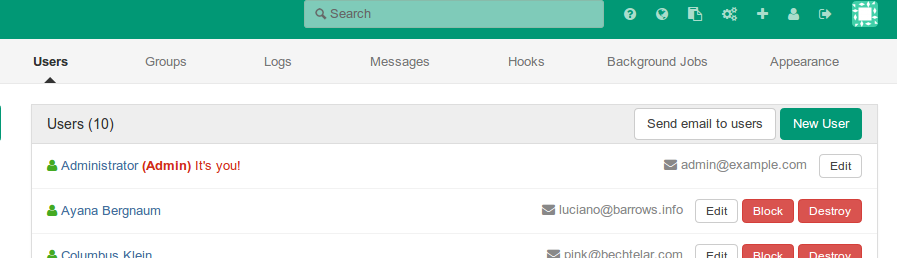
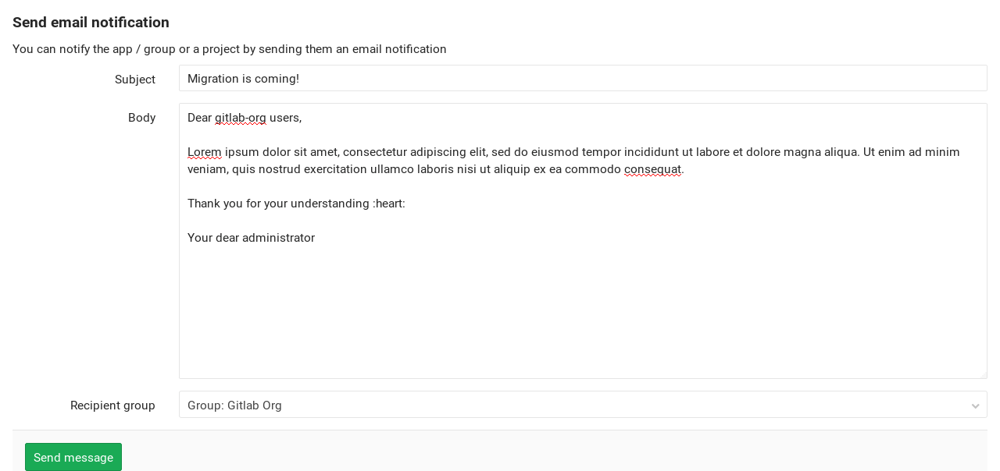

# Email from GitLab **[STARTER ONLY]**

As a GitLab administrator you can email GitLab users from within GitLab.

## Overview

GitLab provides a simple tool to email all users or users of a chosen group or
project right from the admin area. Users will receive the email to their primary
email address.

## Use-cases

- Notify your users about a new project, a new feature, or a new product launch.
- Notify your users about a new deployment, or that will be downtime expected
  for a particular reason.

## Sending emails to users from within GitLab

1. Go to the admin area using the wrench icon in the top right corner and
   navigate to **Overview > Users > Send email to users**.

    

1. Compose an email and choose where it will be sent (all users or users of a
   chosen group or project):

    

## Unsubscribing from emails

User can choose to unsubscribe from receiving emails from GitLab by following
the unsubscribe link from the email. Unsubscribing is unauthenticated in order
to keep the simplicity of this feature.

On unsubscribe, user will receive an email notifying that unsubscribe happened.
The endpoint that provides the unsubscribe option is rate-limited.

[ee]: https://about.gitlab.com/products/
