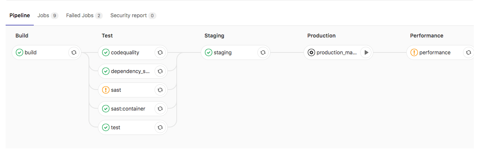

Use CI/CD variables to set up the Auto DevOps domain, provide a custom
Helm chart, or scale your application.

## Build and deployment variables

Use these variables to customize and deploy your build.

<!-- markdownlint-disable MD056 -->

| **CI/CD variable**                      | **Description** |
|-----------------------------------------|-----------------|
| `ADDITIONAL_HOSTS`                      | Fully qualified domain names specified as a comma-separated list that are added to the Ingress hosts. |
| `<ENVIRONMENT>_ADDITIONAL_HOSTS`        | For a specific environment, the fully qualified domain names specified as a comma-separated list that are added to the Ingress hosts. This takes precedence over `ADDITIONAL_HOSTS`. |
| `AUTO_BUILD_IMAGE_VERSION`              | Customize the image version used for the `build` job. See [list of versions](https://gitlab.com/gitlab-org/cluster-integration/auto-build-image/-/releases). |
| `AUTO_DEPLOY_IMAGE_VERSION`             | Customize the image version used for Kubernetes deployment jobs. See [list of versions](https://gitlab.com/gitlab-org/cluster-integration/auto-deploy-image/-/releases). |
| `AUTO_DEVOPS_ATOMIC_RELEASE`            | Auto DevOps uses [`--atomic`](https://v2.helm.sh/docs/helm/#options-43) for Helm deployments by default. Set this variable to `false` to disable the use of `--atomic` |
| `AUTO_DEVOPS_BUILD_IMAGE_CNB_BUILDER`   | The builder used when building with Cloud Native Buildpacks. The default builder is `heroku/buildpacks:22`. [More details](stages.md#auto-build-using-cloud-native-buildpacks). |
| `AUTO_DEVOPS_BUILD_IMAGE_EXTRA_ARGS`    | Extra arguments to be passed to the `docker build` command. Using quotes doesn't prevent word splitting. [More details](customize.md#pass-arguments-to-docker-build). |
| `AUTO_DEVOPS_BUILD_IMAGE_FORWARDED_CI_VARIABLES` | A [comma-separated list of CI/CD variable names](customize.md#forward-cicd-variables-to-the-build-environment) to be forwarded to the build environment (the buildpack builder or `docker build`). |
| `AUTO_DEVOPS_BUILD_IMAGE_CNB_PORT`      | In GitLab 15.0 and later, port exposed by the generated Docker image. Set to `false` to prevent exposing any ports. Defaults to `5000`. |
| `AUTO_DEVOPS_BUILD_IMAGE_CONTEXT`       | Used to set the build context directory for Dockerfile and Cloud Native Buildpacks. Defaults to the root directory. |
| `AUTO_DEVOPS_CHART`                     | Helm Chart used to deploy your apps. Defaults to the one [provided by GitLab](https://gitlab.com/gitlab-org/cluster-integration/auto-deploy-image/-/tree/master/assets/auto-deploy-app). |
| `AUTO_DEVOPS_CHART_REPOSITORY`          | Helm Chart repository used to search for charts. Defaults to `https://charts.gitlab.io`. |
| `AUTO_DEVOPS_CHART_REPOSITORY_NAME`     | Used to set the name of the Helm repository. Defaults to `gitlab`. |
| `AUTO_DEVOPS_CHART_REPOSITORY_USERNAME` | Used to set a username to connect to the Helm repository. Defaults to no credentials. Also set `AUTO_DEVOPS_CHART_REPOSITORY_PASSWORD`. |
| `AUTO_DEVOPS_CHART_REPOSITORY_PASSWORD` | Used to set a password to connect to the Helm repository. Defaults to no credentials. Also set `AUTO_DEVOPS_CHART_REPOSITORY_USERNAME`. |
| `AUTO_DEVOPS_CHART_REPOSITORY_PASS_CREDENTIALS` | Set to a non-empty value to enable forwarding of the Helm repository credentials to the chart server when the chart artifacts are on a different host than repository. |
| `AUTO_DEVOPS_CHART_REPOSITORY_INSECURE` | Set to a non-empty value to add a `--insecure-skip-tls-verify` argument to the Helm commands. By default, Helm uses TLS verification. |
| `AUTO_DEVOPS_CHART_CUSTOM_ONLY`         | Set to a non-empty value to use only a custom chart. By default, the latest chart is downloaded from GitLab. |
| `AUTO_DEVOPS_CHART_VERSION`             | Set the version of the deployment chart. Defaults to the latest available version. |
| `AUTO_DEVOPS_COMMON_NAME`               | From GitLab 15.5, set to a valid domain name to customize the common name used for the TLS certificate. Defaults to `le-$CI_PROJECT_ID.$KUBE_INGRESS_BASE_DOMAIN`. Set to `false` to not set this alternative host on the Ingress. |
| `AUTO_DEVOPS_DEPLOY_DEBUG`              | If this variable is present, Helm outputs debug logs. |
| `AUTO_DEVOPS_ALLOW_TO_FORCE_DEPLOY_V<N>` | From [auto-deploy-image](https://gitlab.com/gitlab-org/cluster-integration/auto-deploy-image) v1.0.0, if this variable is present, a new major version of chart is forcibly deployed. For more information, see [Ignore warnings and continue deploying](upgrading_auto_deploy_dependencies.md#ignore-warnings-and-continue-deploying). |
| `BUILDPACK_URL`                         | A full Buildpack URL. [Must point to a URL supported by Pack](customize.md#custom-buildpacks). |
| `CANARY_ENABLED`                        | Used to define a [deploy policy for canary environments](#deploy-policy-for-canary-environments). |
| `BUILDPACK_VOLUMES`                     | Specify one or more [Buildpack volumes to mount](stages.md#mount-volumes-into-the-build-container). Use a pipe `|` as list separator. |
| `CANARY_PRODUCTION_REPLICAS`            | Number of canary replicas to deploy for [Canary Deployments](../../user/project/canary_deployments.md) in the production environment. Takes precedence over `CANARY_REPLICAS`. Defaults to 1. |
| `CANARY_REPLICAS`                       | Number of canary replicas to deploy for [Canary Deployments](../../user/project/canary_deployments.md). Defaults to 1. |
| `CI_APPLICATION_REPOSITORY`             | The repository of container image being built or deployed, `$CI_APPLICATION_REPOSITORY:$CI_APPLICATION_TAG`. For more details, read [Custom container image](customize.md#custom-container-image). |
| `CI_APPLICATION_TAG`                    | The tag of the container image being built or deployed, `$CI_APPLICATION_REPOSITORY:$CI_APPLICATION_TAG`. For more details, read [Custom container image](customize.md#custom-container-image). |
| `DAST_AUTO_DEPLOY_IMAGE_VERSION`        | Customize the image version used for DAST deployments on the default branch. Should usually be the same as `AUTO_DEPLOY_IMAGE_VERSION`. See [list of versions](https://gitlab.com/gitlab-org/cluster-integration/auto-deploy-image/-/releases). |
| `DOCKERFILE_PATH`                       | Allows overriding the [default Dockerfile path for the build stage](customize.md#custom-dockerfiles) |
| `HELM_RELEASE_NAME`                     | Allows the `helm` release name to be overridden. Can be used to assign unique release names when deploying multiple projects to a single namespace. |
| `HELM_UPGRADE_VALUES_FILE`              | Allows the `helm upgrade` values file to be overridden. Defaults to `.gitlab/auto-deploy-values.yaml`. |
| `HELM_UPGRADE_EXTRA_ARGS`               | Allows extra options in `helm upgrade` commands when deploying the application. Using quotes doesn't prevent word splitting. |
| `INCREMENTAL_ROLLOUT_MODE`              | If present, can be used to enable an [incremental rollout](#incremental-rollout-to-production) of your application for the production environment. Set to `manual` for manual deployment jobs or `timed` for automatic rollout deployments with a 5 minute delay each one. |
| `K8S_SECRET_*`                          | Any variable prefixed with [`K8S_SECRET_`](#configure-application-secret-variables) is made available by Auto DevOps as environment variables to the deployed application. |
| `KUBE_CONTEXT`                          | Can be used to select a context to use from `KUBECONFIG`. When `KUBE_CONTEXT` is blank, the default context in `KUBECONFIG` (if any) is used. A context must be selected when used [with the agent for Kubernetes](../../user/clusters/agent/ci_cd_workflow.md). |
| `KUBE_INGRESS_BASE_DOMAIN`              | Can be used to set a domain per cluster. See [cluster domains](../../user/project/clusters/gitlab_managed_clusters.md#base-domain) for more information. |
| `KUBE_NAMESPACE`                        | The namespace used for deployments. When using certificate-based clusters, [this value should not be overwritten directly](../../user/project/clusters/deploy_to_cluster.md#custom-namespace). |
| `KUBECONFIG`                            | The kubeconfig to use for deployments. User-provided values take priority over GitLab-provided values. |
| `PRODUCTION_REPLICAS`                   | Number of replicas to deploy in the production environment. Takes precedence over `REPLICAS` and defaults to 1. For zero-downtime upgrades, set to 2 or greater. |
| `REPLICAS`                              | Number of replicas to deploy. Defaults to 1. Change this variable instead of [modifying](customize.md#customize-helm-chart-values) `replicaCount`. |
| `ROLLOUT_RESOURCE_TYPE`                 | Allows specification of the resource type being deployed when using a custom Helm chart. Default value is `deployment`. |
| `ROLLOUT_STATUS_DISABLED`               | Used to disable rollout status check because it does not support all resource types, for example, `cronjob`. |
| `STAGING_ENABLED`                       | Used to define a [deploy policy for staging and production environments](#deploy-policy-for-staging-and-production-environments). |
| `TRACE`                                 | Set to any value to make Helm commands produce verbose output. You can use this setting to help diagnose Auto DevOps deployment problems. |

<!-- markdownlint-enable MD056 -->

## Database variables

WARNING:
From [GitLab 16.0](https://gitlab.com/gitlab-org/gitlab/-/issues/343988), `POSTGRES_ENABLED` is no longer set by default.

Use these variables to integrate CI/CD with PostgreSQL databases.

| **CI/CD variable**                            | **Description**                    |
|-----------------------------------------|------------------------------------|
| `DB_INITIALIZE`                         | Used to specify the command to run to initialize the application's PostgreSQL database. Runs inside the application pod. |
| `DB_MIGRATE`                            | Used to specify the command to run to migrate the application's PostgreSQL database. Runs inside the application pod. |
| `POSTGRES_ENABLED`                      | Whether PostgreSQL is enabled. Set to `true` to enable the automatic deployment of PostgreSQL. |
| `POSTGRES_USER`                         | The PostgreSQL user. Defaults to `user`. Set it to use a custom username. |
| `POSTGRES_PASSWORD`                     | The PostgreSQL password. Defaults to `testing-password`. Set it to use a custom password. |
| `POSTGRES_DB`                           | The PostgreSQL database name. Defaults to the value of [`$CI_ENVIRONMENT_SLUG`](../../ci/variables/_index.md#predefined-cicd-variables). Set it to use a custom database name. |
| `POSTGRES_VERSION`                      | Tag for the [`postgres` Docker image](https://hub.docker.com/_/postgres) to use. Defaults to `9.6.16` for tests and deployments. If `AUTO_DEVOPS_POSTGRES_CHANNEL` is set to `1`, deployments uses the default version `9.6.2`. |
| `POSTGRES_HELM_UPGRADE_VALUES_FILE`     | When using [auto-deploy-image v2](upgrading_auto_deploy_dependencies.md), this variable allows the `helm upgrade` values file for PostgreSQL to be overridden. Defaults to `.gitlab/auto-deploy-postgres-values.yaml`. |
| `POSTGRES_HELM_UPGRADE_EXTRA_ARGS`      | When using [auto-deploy-image v2](upgrading_auto_deploy_dependencies.md), this variable allows extra PostgreSQL options in `helm upgrade` commands when deploying the application. Using quotes doesn't prevent word splitting. |
| `POSTGRES_CHART_REPOSITORY`             | Helm Chart repository used to search for PostgreSQL chart. Defaults to `https://raw.githubusercontent.com/bitnami/charts/eb5f9a9513d987b519f0ecd732e7031241c50328/bitnami`. |
| `POSTGRES_CHART_VERSION`                | Helm Chart version used for PostgreSQL chart. Defaults to `8.2.1`. |

## Job-skipping variables

 Use these variables to skip specific types of CI/CD jobs. When skipped, the CI/CD jobs don't get created or run.

| **Job name**                           | **CI/CD variable**              | **GitLab version**    | **Description** |
|----------------------------------------|---------------------------------|-----------------------|-----------------|
| `.fuzz_base`                           | `COVFUZZ_DISABLED`              |                       | [Read more](../../user/application_security/coverage_fuzzing/_index.md) about how `.fuzz_base` provide capability for your own jobs. The job isn't created if the value is `"true"`. |
| `apifuzzer_fuzz`                       | `API_FUZZING_DISABLED`          |                       | The job isn't created if the value is `"true"`. |
| `build`                                | `BUILD_DISABLED`                |                       | If the variable is present, the job isn't created. |
| `build_artifact`                       | `BUILD_DISABLED`                |                       | If the variable is present, the job isn't created. |
| `brakeman-sast`                        | `SAST_DISABLED`                 |                       | The job isn't created if the value is `"true"`. |
| `canary`                               | `CANARY_ENABLED`                |                       | This manual job is created if the variable is present. |
| `code_intelligence`                    | `CODE_INTELLIGENCE_DISABLED`    |                       | If the variable is present, the job isn't created. |
| `code_quality`                         | `CODE_QUALITY_DISABLED`         |                       | The job isn't created if the value is `"true"`. |
| `container_scanning`                   | `CONTAINER_SCANNING_DISABLED`   |                       | The job isn't created if the value is `"true"`. |
| `dast`                                 | `DAST_DISABLED`                 |                       | The job isn't created if the value is `"true"`. |
| `dast_environment_deploy`              | `DAST_DISABLED_FOR_DEFAULT_BRANCH` or `DAST_DISABLED`  |                        | The job isn't created if the value is `"true"`. |
| `dependency_scanning`                  | `DEPENDENCY_SCANNING_DISABLED`  |                       | The job isn't created if the value is `"true"`. |
| `flawfinder-sast`                      | `SAST_DISABLED`                 |                       | The job isn't created if the value is `"true"`. |
| `gemnasium-dependency_scanning`        | `DEPENDENCY_SCANNING_DISABLED`  |                       | The job isn't created if the value is `"true"`. |
| `gemnasium-maven-dependency_scanning`  | `DEPENDENCY_SCANNING_DISABLED`  |                       | The job isn't created if the value is `"true"`. |
| `gemnasium-python-dependency_scanning` | `DEPENDENCY_SCANNING_DISABLED`  |                       | The job isn't created if the value is `"true"`. |
| `kubesec-sast`                         | `SAST_DISABLED`                 |                       | The job isn't created if the value is `"true"`. |
| `license_management`                   | `LICENSE_MANAGEMENT_DISABLED`   | GitLab 12.7 and earlier | If the variable is present, the job isn't created. Job deprecated [from GitLab 12.8](https://gitlab.com/gitlab-org/gitlab/-/merge_requests/22773) |
| `license_scanning`                     | `LICENSE_MANAGEMENT_DISABLED`   |                       | The job isn't created if the value is `"true"`. Job deprecated [from GitLab 15.9](https://gitlab.com/gitlab-org/gitlab/-/merge_requests/111071) |
| `load_performance`                     | `LOAD_PERFORMANCE_DISABLED`     |                       | If the variable is present, the job isn't created. |
| `nodejs-scan-sast`                     | `SAST_DISABLED`                 |                       | The job isn't created if the value is `"true"`. |
| `performance`                          | `PERFORMANCE_DISABLED`          | GitLab 13.12 and earlier | Browser performance. If the variable is present, the job isn't created. Replaced by `browser_performance`. |
| `browser_performance`                  | `BROWSER_PERFORMANCE_DISABLED`  |                       | Browser performance. If the variable is present, the job isn't created. Replaces `performance`. |
| `phpcs-security-audit-sast`            | `SAST_DISABLED`                 |                       | The job isn't created if the value is `"true"`. |
| `pmd-apex-sast`                        | `SAST_DISABLED`                 |                       | The job isn't created if the value is `"true"`. |
| `review`                               | `REVIEW_DISABLED`               |                       | If the variable is present, the job isn't created. |
| `review:stop`                          | `REVIEW_DISABLED`               |                       | Manual job. If the variable is present, the job isn't created. |
| `secret_detection`                     | `SECRET_DETECTION_DISABLED`     |                       | The job isn't created if the value is `"true"`. |
| `secret_detection_default_branch`      | `SECRET_DETECTION_DISABLED`     |                       | The job isn't created if the value is `"true"`. |
| `semgrep-sast`                         | `SAST_DISABLED`                 |                       | The job isn't created if the value is `"true"`. |
| `sobelow-sast`                         | `SAST_DISABLED`                 |                       | The job isn't created if the value is `"true"`. |
| `stop_dast_environment`                | `DAST_DISABLED_FOR_DEFAULT_BRANCH` or `DAST_DISABLED` |                       | The job isn't created if the value is `"true"`. |
| `spotbugs-sast`                        | `SAST_DISABLED`                 |                       | The job isn't created if the value is `"true"`. |
| `test`                                 | `TEST_DISABLED`                 |                       | If the variable is present, the job isn't created. |
| `staging`                              | `STAGING_ENABLED`               |                       | The job is created if the variable is present. |
| `stop_review`                          | `REVIEW_DISABLED`               |                       | If the variable is present, the job isn't created. |

## Configure application secret variables

Some deployed applications require access to secret variables.
Auto DevOps detects CI/CD variables starting with `K8S_SECRET_`,
and makes them available to the deployed application as
environment variables.

Prerequisites:

- The variable value must be a single line.

To configure secret variables:

1. On the left sidebar, select **Search or go to** and find your project.
1. Select **Settings > CI/CD**.
1. Expand **Variables**.
1. Create a CI/CD variable with the prefix `K8S_SECRET_`. For example, you
   can create a variable called `K8S_SECRET_RAILS_MASTER_KEY`.
1. Run an Auto DevOps pipeline, either by manually creating a new
   pipeline or by pushing a code change to GitLab.

### Kubernetes secrets

Auto DevOps pipelines use your application secret variables to
populate a Kubernetes secret. This secret is unique per environment.
When deploying your application, the secret is loaded as environment
variables in the container running the application. For example, if
you create a secret called `K8S_SECRET_RAILS_MASTER_KEY`, your
Kubernetes secret might look like:

```shell
$ kubectl get secret production-secret -n minimal-ruby-app-54 -o yaml

apiVersion: v1
data:
  RAILS_MASTER_KEY: MTIzNC10ZXN0
kind: Secret
metadata:
  creationTimestamp: 2018-12-20T01:48:26Z
  name: production-secret
  namespace: minimal-ruby-app-54
  resourceVersion: "429422"
  selfLink: /api/v1/namespaces/minimal-ruby-app-54/secrets/production-secret
  uid: 57ac2bfd-03f9-11e9-b812-42010a9400e4
type: Opaque
```

## Update application secrets

Environment variables are generally immutable in a Kubernetes pod.
If you update an application secret and then manually
create a new pipeline, running applications do not receive the
updated secret.

To update application secrets, either:

- Push a code update to GitLab to force the Kubernetes deployment to recreate pods.
- Manually delete running pods to cause Kubernetes to create new pods with updated
  secrets.

Variables with multi-line values are not supported due to
limitations with the Auto DevOps scripting environment.

## Configure replica variables

Add replica variables when you want to scale your deployments:

1. Add a replica variable as a [project CI/CD variable](../../ci/variables/_index.md#for-a-project).
1. To scale your application, redeploy it.

   WARNING:
   Do not scale your application using Kubernetes directly. Helm might not detect the change,
   and subsequent deployments with Auto DevOps can undo your changes.

### Custom replica variables

You can create custom replica variables with the format `<TRACK>_<ENV>_REPLICAS`:

- `<TRACK>` is the all-caps value of the `track`
  [Kubernetes label](https://kubernetes.io/docs/concepts/overview/working-with-objects/labels/)
  set in the Helm Chart app definition. If `track` is not set, omit `<TRACK>` from the custom variable.
- `<ENV>` is the all-caps environment name of the deploy job set in
  `.gitlab-ci.yml`.

For example, if the environment is `qa` and the track is
`foo`, create an environment variable called `FOO_QA_REPLICAS`:

```yaml
QA testing:
  stage: deploy
  environment:
    name: qa
  script:
    - deploy foo
```

The track `foo` must be defined in the application's Helm chart.
For example:

```yaml
replicaCount: 1
image:
  repository: gitlab.example.com/group/project
  tag: stable
  pullPolicy: Always
  secrets:
    - name: gitlab-registry
application:
  track: foo
  tier: web
service:
  enabled: true
  name: web
  type: ClusterIP
  url: http://my.host.com/
  externalPort: 5000
  internalPort: 5000
```

## Deploy policy for staging and production environments

Auto DevOps typically uses continuous deployment, and pushes
automatically to the `production` environment whenever a new pipeline
runs on the default branch. To deploy to production manually, you can
use the `STAGING_ENABLED` CI/CD variable.

If you set `STAGING_ENABLED`, GitLab automatically deploys the
application to a `staging` environment. When you're ready to deploy to
production, GitLab creates a `production_manual` job.

You can also enable manual deployment in your [project settings](requirements.md#auto-devops-deployment-strategy).

## Deploy policy for canary environments

DETAILS:
**Tier:** Premium, Ultimate
**Offering:** GitLab.com, GitLab Self-Managed, GitLab Dedicated

You can use a [canary environment](../../user/project/canary_deployments.md) before
deploying any changes to production.

If you set `CANARY_ENABLED`, GitLab creates two [manual jobs](../../ci/pipelines/_index.md#add-manual-interaction-to-your-pipeline):

- `canary` - Deploys the application to the canary environment.
- `production_manual` - Deploys the application to production.

## Incremental rollout to production

DETAILS:
**Tier:** Premium, Ultimate
**Offering:** GitLab.com, GitLab Self-Managed, GitLab Dedicated

Use an incremental rollout to continuously deploy your application,
starting with only a few pods. You can increase the number of pods
manually.

You can enable manual deployment in your [project settings](requirements.md#auto-devops-deployment-strategy),
or by setting `INCREMENTAL_ROLLOUT_MODE` to `manual`.

If you set `INCREMENTAL_ROLLOUT_MODE` to `manual`, GitLab creates four
manual jobs:

1. `rollout 10%`
1. `rollout 25%`
1. `rollout 50%`
1. `rollout 100%`

The percentage is based on the `REPLICAS` CI/CD variable, and defines the number of
pods used for deployment. For example, if the value is `10` and you run the
`10%` rollout job, your application is deployed to only one pod.

You can run the rollout jobs in any order. To scale down, rerun a
lower percentage job.

After you run the `rollout 100%` job, you cannot scale down, and must
[roll back your deployment](../../ci/environments/deployments.md#retry-or-roll-back-a-deployment).

### Example incremental rollout configurations

Without `INCREMENTAL_ROLLOUT_MODE` and without `STAGING_ENABLED`:


Without `INCREMENTAL_ROLLOUT_MODE` and with `STAGING_ENABLED`:



With `INCREMENTAL_ROLLOUT_MODE` set to `manual` and without `STAGING_ENABLED`:


With `INCREMENTAL_ROLLOUT_MODE` set to `manual` and with `STAGING_ENABLED`:


## Timed incremental rollout to production

DETAILS:
**Tier:** Premium, Ultimate
**Offering:** GitLab.com, GitLab Self-Managed, GitLab Dedicated

Use a timed incremental rollout to continuously deploy your application, starting with
only a few pods.

You can enable timed incremental deployment in your [project settings](requirements.md#auto-devops-deployment-strategy),
or by setting the `INCREMENTAL_ROLLOUT_MODE` CI/CD variable to `timed`.

If you set `INCREMENTAL_ROLLOUT_MODE` to `timed`, GitLab creates four jobs:

1. `timed rollout 10%`
1. `timed rollout 25%`
1. `timed rollout 50%`
1. `timed rollout 100%`

There is a five-minute delay between jobs.
