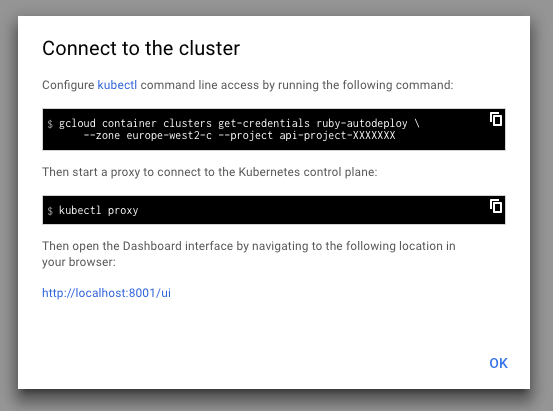

# Auto DevOps: quick start guide

DANGER: Auto DevOps is currently in **Beta** and _not recommended for production use_.

> [Introduced][ce-37115] in GitLab 10.0.

This is a step-by-step guide to deploying a project hosted on GitLab.com to
Google Cloud, using Auto DevOps.

We made a minimal [Ruby
application](https://gitlab.com/auto-devops-examples/minimal-ruby-app) to use
as an example for this guide. It contains two main files:

* `server.rb` - our application. It will start an HTTP server on port 5000 and
  render "Hello, world!"
* `Dockerfile` - to build our app into a container image. It will use a ruby
  base image and run `server.rb`

## Fork sample project on GitLab.com

Let’s start by forking our sample application. Go to [the project
page](https://gitlab.com/auto-devops-examples/minimal-ruby-app) and press the
**Fork** button. Soon you should have a project under your namespace with the
necessary files.

## Setup your own cluster on Google Kubernetes Engine

If you do not already have a Google Cloud account, create one at
https://console.cloud.google.com.

Visit the [**Kubernetes Engine**](https://console.cloud.google.com/kubernetes/list)
tab and create a new cluster. You can change the name and leave the rest of the
default settings. Once you have your cluster running, you need to connect to the
cluster by following the Google interface.

## Connect to Kubernetes cluster

You need to have the Google Cloud SDK installed. e.g.
On macOS, install [homebrew](https://brew.sh):

1. Install Brew Caskroom: `brew install caskroom/cask/brew-cask`
2. Install Google Cloud SDK: `brew cask install google-cloud-sdk`
3. Add `kubectl` with: `gcloud components install kubectl`
4. Log in: `gcloud auth login`

Now go back to the Google interface, find your cluster, follow the instructions
under "Connect to the cluster" and open the Kubernetes Dashboard. It will look
something like:

```sh
gcloud container clusters get-credentials ruby-autodeploy \ --zone europe-west2-c --project api-project-XXXXXXX
```

Finally, run `kubectl proxy`.



## Copy credentials to GitLab.com project

Once you have the Kubernetes Dashboard interface running, you should visit
**Secrets** under the  "Config" section. There, you should find the settings we
need for GitLab integration: `ca.crt` and token.


You need to copy-paste the `ca.crt` and token into your project on GitLab.com in
the Kubernetes integration page under project
**Settings > Integrations > Project services > Kubernetes**. Don't actually copy
the namespace though. Each project should have a unique namespace, and by leaving
it blank, GitLab will create one for you.


For the API URL, you should use the "Endpoint" IP from your cluster page on
Google Cloud Platform.

## Expose application to the world

In order to be able to visit your application, you need to install an NGINX
ingress controller and point your domain name to its external IP address. Let's
see how that's done.

### Set up Ingress controller

You’ll need to make sure you have an ingress controller. If you don’t have one, do:

```sh
brew install kubernetes-helm
helm init
helm install --name ruby-app stable/nginx-ingress
```

This should create several services including `ruby-app-nginx-ingress-controller`.
You can list your services by running `kubectl get svc` to confirm that.

### Point DNS at Cluster IP

Find out the external IP address of the `ruby-app-nginx-ingress-controller` by
running:

```sh
kubectl get svc ruby-app-nginx-ingress-controller -o jsonpath='{.status.loadBalancer.ingress[0].ip}'
```

NOTE: **Note:**
If your ingress controller has been installed in a different way, you can find
how to get the external IP address in the
[Cluster documentation](../../user/project/clusters/index.md#getting-the-external-ip-address).

Use this IP address to configure your DNS. This part heavily depends on your
preferences and domain provider. But in case you are not sure, just create an
A record with a wildcard host like `*.<your-domain>`.

Use `nslookup minimal-ruby-app-staging.<yourdomain>` to confirm that domain is
assigned to the cluster IP.

## Set up Auto DevOps

In your GitLab.com project, go to **Settings > CI/CD** and find the Auto DevOps
section. Select "Enable Auto DevOps", add in your base domain, and save.

Next, a pipeline needs to be triggered. Since the test project doesn't have a
`.gitlab-ci.yml`, you need to either push a change to the repository or
manually visit `https://gitlab.com/<username>/minimal-ruby-app/pipelines/new`,
where `<username>` is your username.

This will create a new pipeline with several jobs: `build`, `test`, `codequality`,
and `production`. The `build` job will create a Docker image with your new
change and push it to the Container Registry. The `test` job will test your
changes, whereas the `codequality` job will run static analysis on your changes.
Finally, the `production` job will deploy your changes to a production application.

Once the deploy job succeeds you should be able to see your application by
visiting the Kubernetes dashboard. Select the namespace of your project, which
will look like `minimal-ruby-app-23`, but with a unique ID for your project,
and your app will be listed as "production" under the Deployment tab.

Once its ready, just visit `http://minimal-ruby-app.example.com` to see the
famous "Hello, world!"!

[ce-37115]: https://gitlab.com/gitlab-org/gitlab-ce/issues/37115
