# Getting started with Auto DevOps

This is a step-by-step guide that will help you use [Auto DevOps](index.md) to
deploy a project hosted on GitLab.com to Google Kubernetes Engine.

We will use GitLab's native Kubernetes integration, so you will not need
to create a Kubernetes cluster manually using the Google Cloud Platform console.
We will create and deploy a simple application that we create from a GitLab template.

These instructions will also work for a self-hosted GitLab instance; you'll just
need to ensure your own [Runners are configured](../../ci/runners/README.md) and
[Google OAuth is enabled](../../integration/google.md).

## Configuring your Google account

Before creating and connecting your Kubernetes cluster to your GitLab project,
you need a Google Cloud Platform account. If you don't already have one,
sign up at <https://console.cloud.google.com>. You'll need to either sign in with an existing
Google account (for example, one that you use to access Gmail, Drive, etc.) or create a new one.

1. Follow the steps as outlined in the ["Before you begin" section of the Kubernetes Engine docs](https://cloud.google.com/kubernetes-engine/docs/quickstart#before-you-begin)
   in order for the required APIs and related services to be enabled.
1. Make sure you have created a [billing account](https://cloud.google.com/billing/docs/how-to/manage-billing-account).

TIP: **Tip:**
Every new Google Cloud Platform (GCP) account receives [$300 in credit](https://console.cloud.google.com/freetrial),
and in partnership with Google, GitLab is able to offer an additional $200 for new GCP accounts to get started with GitLab's
Google Kubernetes Engine Integration. All you have to do is [follow this link](https://cloud.google.com/partners/partnercredit/?pcn_code=0014M00001h35gDQAQ#contact-form) and apply for credit.

## Creating a new project from a template

We will use one of GitLab's project templates to get started. As the name suggests,
those projects provide a barebones application built on some well-known frameworks.

1. In GitLab, click the plus icon (**+**) at the top of the navigation bar and select
   **New project**.
1. Go to the **Create from template** tab where you can choose among a Ruby on
   Rails, Spring, or NodeJS Express project.
   We'll use the Ruby on Rails template.

   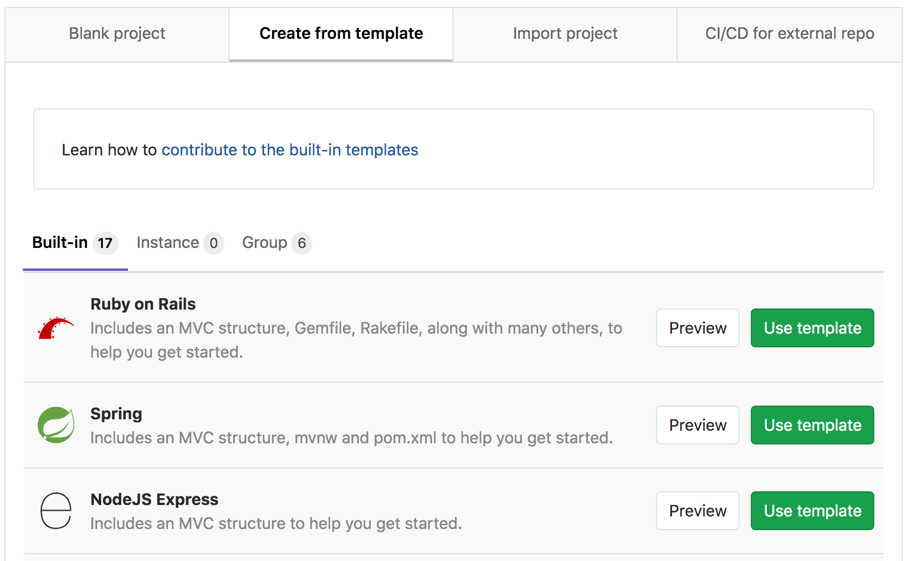

1. Give your project a name, optionally a description, and make it public so that
   you can take advantage of the features available in the
   [GitLab Gold plan](https://about.gitlab.com/pricing/#gitlab-com).

   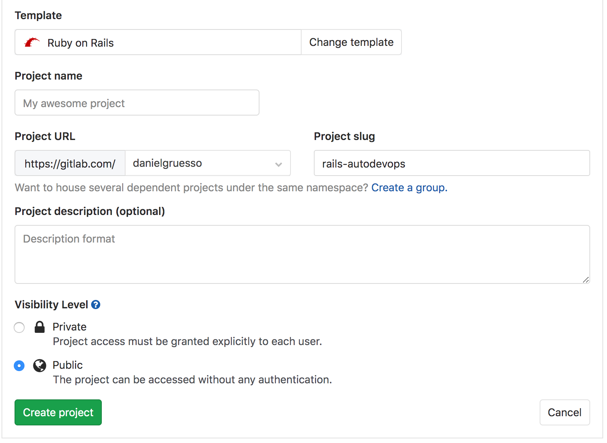

1. Click **Create project**.

Now that the project is created, the next step is to create the Kubernetes cluster
under which this application will be deployed.

## Creating a Kubernetes cluster from within GitLab

1. On the project's landing page, click the button labeled **Add Kubernetes cluster**
   (note that this option is also available when you navigate to **Operations > Kubernetes**).

   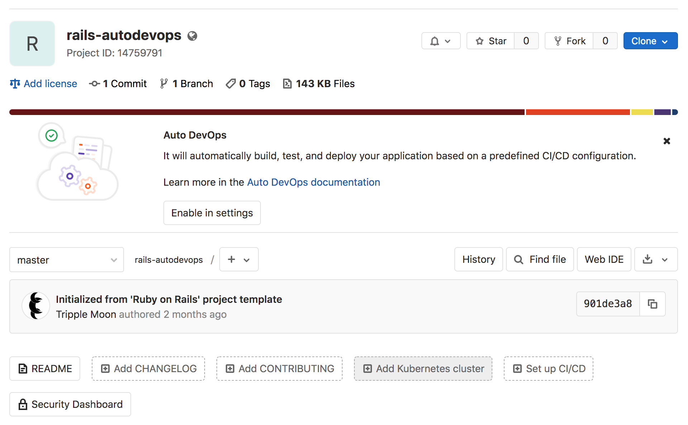

1. One the **Create new cluster on GKE** tab, click "Sign in with Google".

   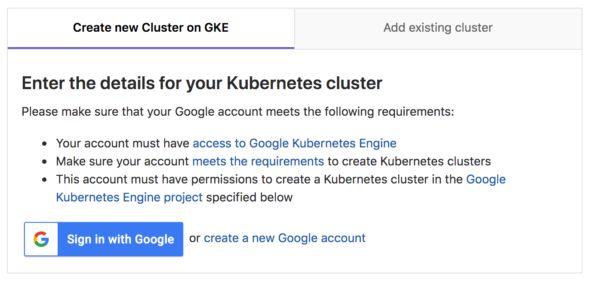

1. Connect with your Google account and press **Allow** when asked (this will
   be shown only the first time you connect GitLab with your Google account).

   

1. The last step is to provide the cluster details. Give it a name, leave the
   environment scope as is, and choose the GCP project under which the cluster
   will be created. (Per the instructions when you
   [configured your Google account](#configuring-your-google-account), a project
   should have already been created for you.) Next, choose the
   [region/zone](https://cloud.google.com/compute/docs/regions-zones/) under which the
   cluster will be created, enter the number of nodes you want it to have, and
   finally choose the [machine type](https://cloud.google.com/compute/docs/machine-types).

   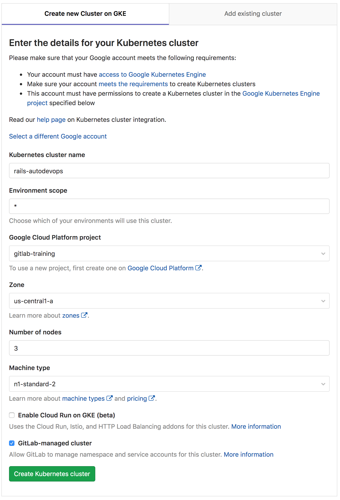

1. Once ready, click **Create Kubernetes cluster**.

After a couple of minutes, the cluster will be created. You can also see its
status on your [GCP dashboard](https://console.cloud.google.com/kubernetes).

The next step is to install some applications on your cluster that are needed
to take full advantage of Auto DevOps.

## Installing Helm, Ingress, and Prometheus

GitLab's Kubernetes integration comes with some
[pre-defined applications](../../user/project/clusters/index.md#installing-applications)
for you to install.

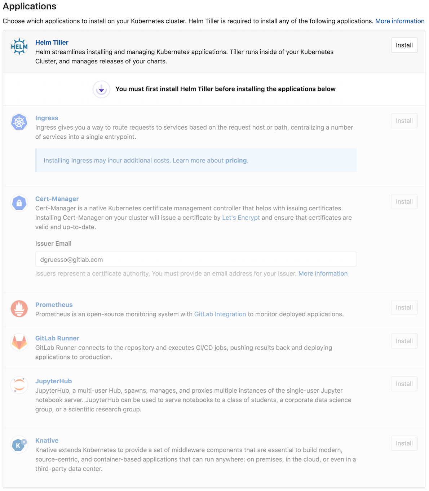

The first one to install is Helm Tiller, a package manager for Kubernetes, which
is needed in order to install the rest of the applications. Go ahead and click
its **Install** button.

Once it's installed, the other applications that rely on it will each have their **Install**
button enabled. For this guide, we need Ingress and Prometheus. Ingress provides
load balancing, SSL termination, and name-based virtual hosting, using NGINX behind
the scenes. Prometheus is an open-source monitoring and alerting system that we'll
use to supervise the deployed application. We will not install GitLab Runner as
we'll use the shared Runners that GitLab.com provides.

After the Ingress is installed, wait a few seconds and copy the IP address that
is displayed in order to add in your base **Domain** at the top of the page. For
the purpose of this guide, we will use the one suggested by GitLab. Once you have
filled in the domain, click **Save changes**.

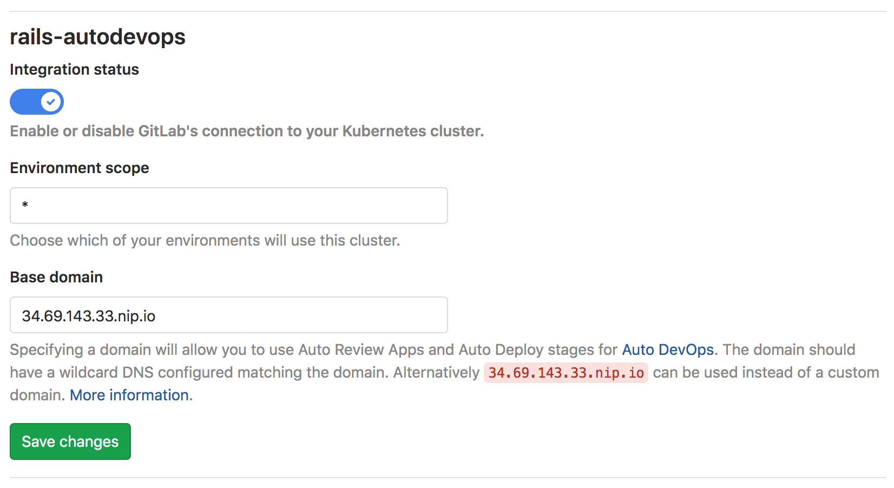

## Enabling Auto DevOps (optional)

Starting with GitLab 11.3, Auto DevOps is enabled by default. However, it is possible to disable
Auto DevOps at both the instance-level (for self-managed instances) and also at the group-level.
Follow these steps if Auto DevOps has been manually disabled.

1. First, navigate to **Settings > CI/CD > Auto DevOps**.
1. Select **Default to Auto DevOps pipeline**.
1. Lastly, let's select the [continuous deployment strategy](index.md#deployment-strategy)
   which will automatically deploy the application to production once the pipeline
   successfully runs on the `master` branch.
1. Click **Save changes**.

   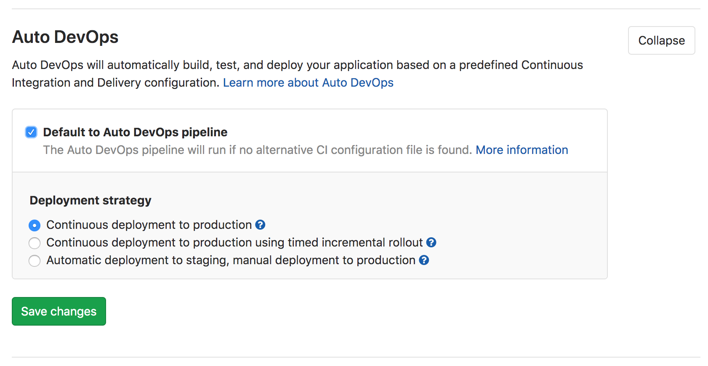

Once you complete all the above and save your changes, a new pipeline is
automatically created. To view the pipeline, go to **CI/CD > Pipelines**.

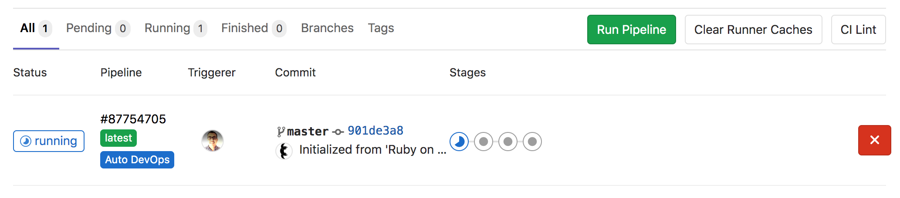

In the next section we'll break down the pipeline and explain what each job does.

## Deploying the application

By now you should see the pipeline running, but what is it running exactly?

To navigate inside the pipeline, click its status badge. (Its status should be "running").
The pipeline is split into 4 stages, each running a couple of jobs.

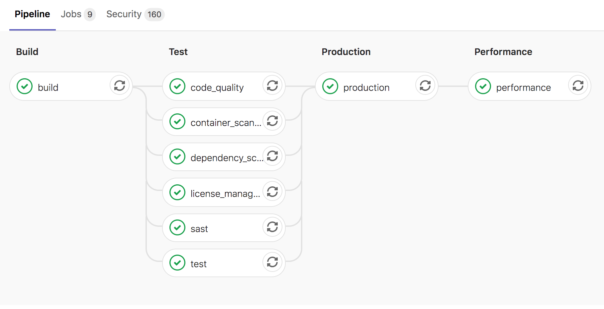

In the **build** stage, the application is built into a Docker image and then
uploaded to your project's [Container Registry](../../user/packages/container_registry/index.md) ([Auto Build](index.md#auto-build)).

In the **test** stage, GitLab runs various checks on the application:

- The `test` job runs unit and integration tests by detecting the language and
  framework ([Auto Test](index.md#auto-test))
- The `code_quality` job checks the code quality and is allowed to fail
  ([Auto Code Quality](index.md#auto-code-quality-starter)) **(STARTER)**
- The `container_scanning` job checks the Docker container if it has any
  vulnerabilities and is allowed to fail ([Auto Container Scanning](index.md#auto-container-scanning-ultimate))
- The `dependency_scanning` job checks if the application has any dependencies
  susceptible to vulnerabilities and is allowed to fail ([Auto Dependency Scanning](index.md#auto-dependency-scanning-ultimate)) **(ULTIMATE)**
- The `sast` job runs static analysis on the current code to check for potential
  security issues and is allowed to fail([Auto SAST](index.md#auto-sast-ultimate)) **(ULTIMATE)**
- The `license_management` job searches the application's dependencies to determine each of their
  licenses and is allowed to fail ([Auto License Compliance](index.md#auto-license-compliance-ultimate)) **(ULTIMATE)**

NOTE: **Note:**
As you might have noticed, all jobs except `test` are allowed to fail in the
test stage.

The **production** stage is run after the tests and checks finish, and it automatically
deploys the application in Kubernetes ([Auto Deploy](index.md#auto-deploy)).

Lastly, in the **performance** stage, some performance tests will run
on the deployed application
([Auto Browser Performance Testing](index.md#auto-browser-performance-testing-premium)). **(PREMIUM)**

---

The URL for the deployed application can be found under the **Environments**
page where you can also monitor your application. Let's explore that.

### Monitoring

Now that the application is successfully deployed, let's navigate to its
website. First, go to **Operations > Environments**.

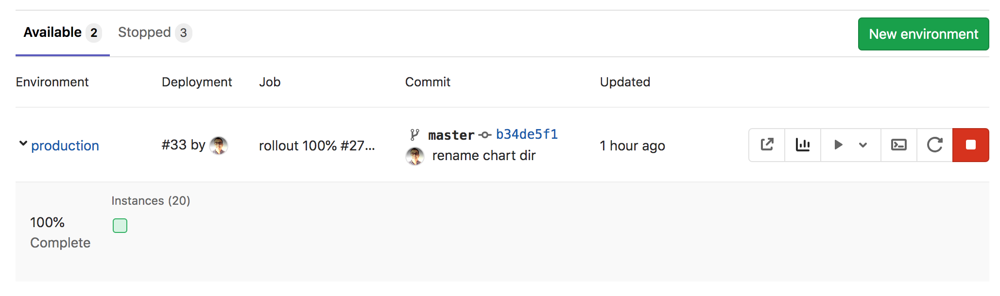

In **Environments** you can see some details about the deployed
applications. In the rightmost column for the production environment, you can make use of the three icons:

- The first icon will open the URL of the application that is deployed in
  production. It's a very simple page, but the important part is that it works!
- The next icon, with the small graph, will take you to the metrics page where
  Prometheus collects data about the Kubernetes cluster and how the application
  affects it (in terms of memory/CPU usage, latency, etc.).

  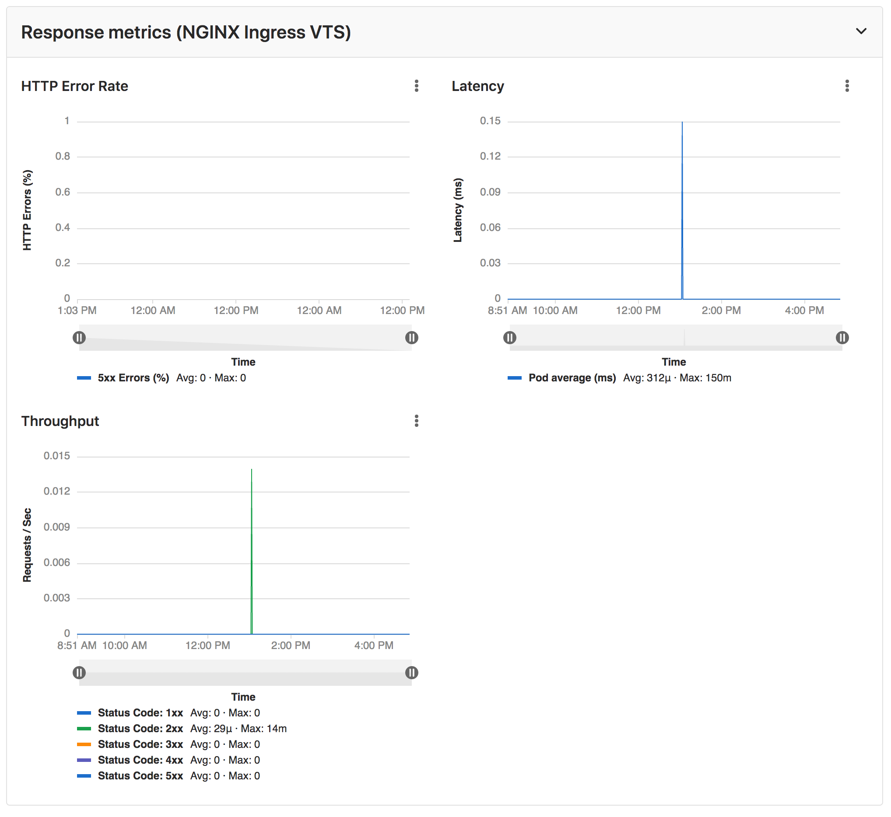

- The third icon is the [web terminal](../../ci/environments.md#web-terminals)
  and it will open a terminal session right inside the container where the
  application is running.

Right below, there is the
[Deploy Board](../../user/project/deploy_boards.md).
The squares represent pods in your Kubernetes cluster that are associated with
the given environment. Hovering above each square you can see the state of a
deployment and clicking a square will take you to the pod's logs page.

TIP: **Tip:**
There is only one pod hosting the application at the moment, but you can add
more pods by defining the [`REPLICAS` variable](index.md#environment-variables)
under **Settings > CI/CD > Environment variables**.

### Working with branches

Following the [GitLab flow](../gitlab_flow.md#working-with-feature-branches),
let's create a feature branch that will add some content to the application.

Under your repository, navigate to the following file: `app/views/welcome/index.html.erb`.
By now, it should only contain a paragraph: `<p>You're on Rails!</p>`, so let's
start adding content. Let's use GitLab's [Web IDE](../../user/project/web_ide/index.md) to make the change. Once
you're on the Web IDE, make the following change:

```html
<p>You're on Rails! Powered by GitLab Auto DevOps.</p>
```

Stage the file, add a commit message, and create a new branch and a merge request
by clicking **Commit**.

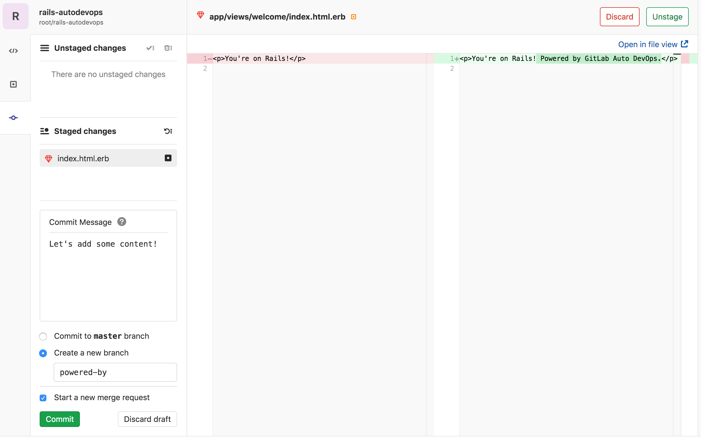

Once you submit the merge request, you'll see the pipeline running. This will
run all the jobs as [described previously](#deploying-the-application), as well as
a few more that run only on branches other than `master`.

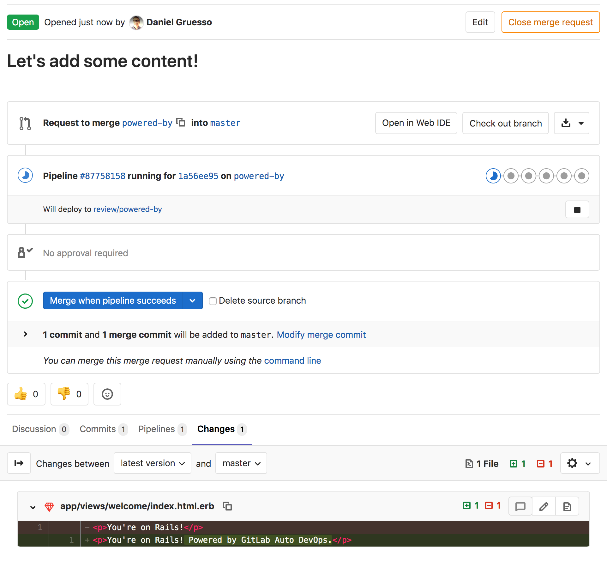

After a few minutes you'll notice that there was a failure in a test.
This means there's a test that was 'broken' by our change.
Navigating into the `test` job that failed, you can see what the broken test is:

```
Failure:
WelcomeControllerTest#test_should_get_index [/app/test/controllers/welcome_controller_test.rb:7]:
<You're on Rails!> expected but was
<You're on Rails! Powered by GitLab Auto DevOps.>..
Expected 0 to be >= 1.

bin/rails test test/controllers/welcome_controller_test.rb:4
```

Let's fix that:

1. Back to the merge request, click the **Open in Web IDE** button.
1. Find the `test/controllers/welcome_controller_test.rb` file and open it.
1. Change line 7 to say `You're on Rails! Powered by GitLab Auto DevOps.`
1. Click **Commit**.
1. On your left, under "Unstaged changes", click the little checkmark icon
   to stage the changes.
1. Write a commit message and click **Commit**.

Now, if you go back to the merge request you should not only see the test passing, but
also the application deployed as a [review app](index.md#auto-review-apps). You
can visit it by following clicking the **View app** button. You will see
the changes that we previously made.

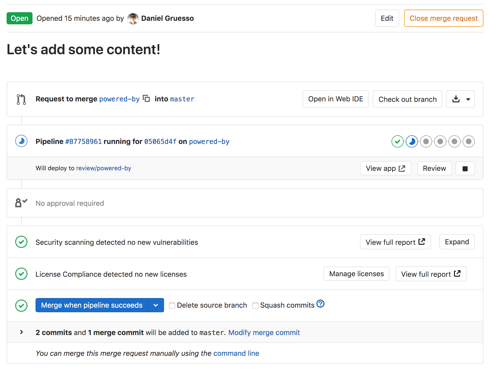

Once you merge the merge request, the pipeline will run on the `master` branch,
and the application will be eventually deployed straight to production.

## Conclusion

After implementing this project, you should now have a solid understanding of the basics of Auto DevOps.
We started from building and testing to deploying and monitoring an application
all within GitLab. Despite its automatic nature, Auto DevOps can also be configured
and customized to fit your workflow. Here are some helpful resources for further reading:

1. [Auto DevOps](index.md)
1. [Multiple Kubernetes clusters](index.md#using-multiple-kubernetes-clusters-premium) **(PREMIUM)**
1. [Incremental rollout to production](index.md#incremental-rollout-to-production-premium) **(PREMIUM)**
1. [Disable jobs you don't need with environment variables](index.md#environment-variables)
1. [Use a static IP for your cluster](../../user/clusters/applications.md#using-a-static-ip)
1. [Use your own buildpacks to build your application](index.md#custom-buildpacks)
1. [Prometheus monitoring](../../user/project/integrations/prometheus.md)
