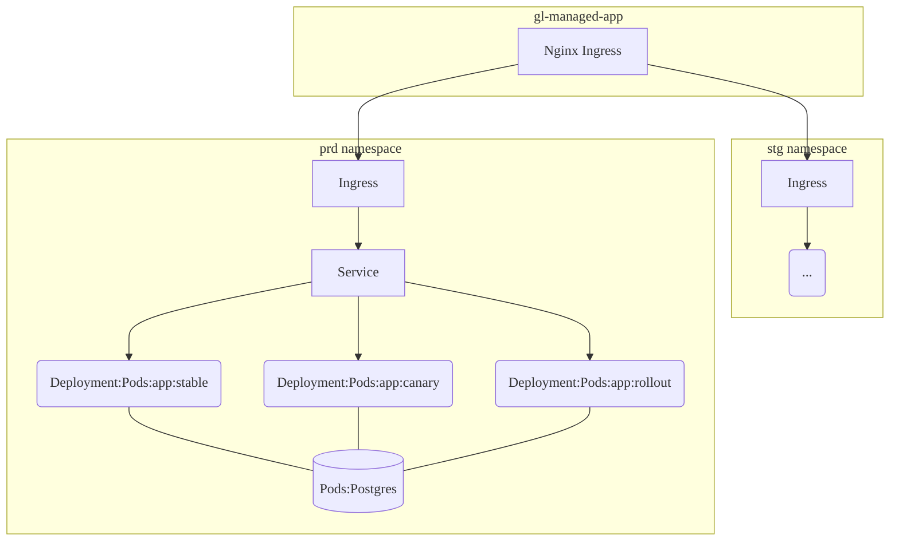
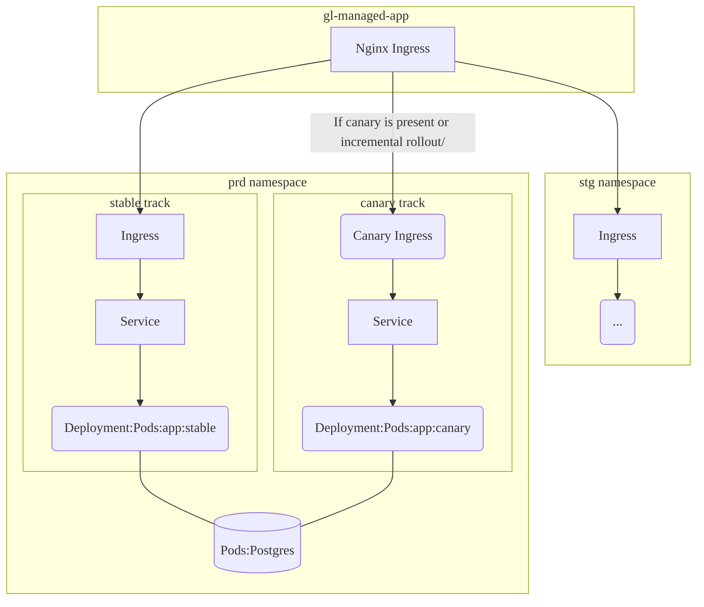

DETAILS:
**Tier:** Free, Premium, Ultimate
**Offering:** GitLab.com, GitLab Self-Managed, GitLab Dedicated

[Auto Deploy](stages.md#auto-deploy) is a feature that deploys your application to a Kubernetes cluster.
It consists of several dependencies:

- [Auto Deploy template](https://gitlab.com/gitlab-org/gitlab/-/blob/master/lib/gitlab/ci/templates/Jobs/Deploy.gitlab-ci.yml) is a set of pipeline jobs and scripts that makes use of `auto-deploy-image`.
- [`auto-deploy-image`](https://gitlab.com/gitlab-org/cluster-integration/auto-deploy-image) is the executable image that communicates with the Kubernetes cluster.
- [`auto-deploy-app chart`](https://gitlab.com/gitlab-org/cluster-integration/auto-deploy-image/-/tree/master/assets/auto-deploy-app) is the Helm chart for deploying your application.

The `auto-deploy-image` and `auto-deploy-app` charts use [Semantic Versioning](https://semver.org/).
By default, your Auto DevOps project keeps using the stable and non-breaking version.
However, these dependencies could be upgraded in a major version release of GitLab
with breaking changes requiring you to upgrade your deployments.

This guide explains how to upgrade your deployments with newer or different major versions of Auto Deploy dependencies.

## Verify dependency versions

The process to check the current versions differs depending on which template you
are using. First verify which template is in use:

- For self-managed instances, the [stable Auto Deploy template bundled with the GitLab package](https://gitlab.com/gitlab-org/gitlab/-/blob/master/lib/gitlab/ci/templates/Jobs/Deploy.gitlab-ci.yml)
  is being used.
- [The GitLab.com stable Auto Deploy template](https://gitlab.com/gitlab-org/gitlab/-/blob/master/lib/gitlab/ci/templates/Jobs/Deploy.gitlab-ci.yml)
  is being used if **one** of the following is true:
  - Your Auto DevOps project doesn't have a `.gitlab-ci.yml` file.
  - Your Auto DevOps project has a `.gitlab-ci.yml` and [includes](../../ci/yaml/_index.md#includetemplate)
    the `Auto-DevOps.gitlab-ci.yml` template.
- [The latest Auto Deploy template](https://gitlab.com/gitlab-org/gitlab/-/blob/master/lib/gitlab/ci/templates/Jobs/Deploy.latest.gitlab-ci.yml)
  is being used if **both** of the following is true:
  - Your Auto DevOps project has a `.gitlab-ci.yml` file and [includes](../../ci/yaml/_index.md#includetemplate)
    the `Auto-DevOps.gitlab-ci.yml` template.
  - It also includes [the latest Auto Deploy template](#early-adopters)

If you know what template is being used:

- The `auto-deploy-image` version is in the template (for example `auto-deploy-image:v1.0.3`).
- The `auto-deploy-app` chart version is [in the auto-deploy-image repository](https://gitlab.com/gitlab-org/cluster-integration/auto-deploy-image/-/blob/v1.0.3/assets/auto-deploy-app/Chart.yaml)
  (for example `version: 1.0.3`).

## Compatibility

The following table explains the version compatibility between GitLab and Auto Deploy dependencies:

| GitLab version   | `auto-deploy-image` version | Notes |
|------------------|-----------------------------|-------|
| v10.0 to v14.0   | v0.1.0 to v2.0.0            | v0 and v1 auto-deploy-image are backwards compatible. |
| v13.4 and later  | v2.0.0 and later            | v2 auto-deploy-image contains breaking changes, as explained in the [upgrade guide](#upgrade-deployments-to-the-v2-auto-deploy-image). |

You can find the current stable version of auto-deploy-image in the [Auto Deploy stable template](https://gitlab.com/gitlab-org/gitlab/-/blob/master/lib/gitlab/ci/templates/Jobs/Deploy.gitlab-ci.yml).

## Upgrade Guide

Projects using Auto DevOps must use the unmodified chart managed by GitLab.
[Customized charts](customize.md#custom-helm-chart) are unsupported.

### Upgrade deployments to the v1 `auto-deploy-image`

The v1 chart is backward compatible with the v0 chart, so no configuration changes are needed.

### Upgrade deployments to the v2 `auto-deploy-image`

The v2 auto-deploy-image contains multiple dependency and architectural changes.
If your Auto DevOps project has an active environment deployed with the v1 `auto-deploy-image`, proceed with the following upgrade guide. Otherwise, you can skip this process.

#### Kubernetes 1.16+

The v2 auto-deploy-image drops support for Kubernetes 1.15 and earlier. If you need to upgrade your
Kubernetes cluster, follow your cloud provider's instructions. Here's
[an example on GKE](https://cloud.google.com/kubernetes-engine/docs/how-to/upgrading-a-cluster).

#### Helm v3

The `auto-deploy-image` uses the Helm binary to manipulate the releases.
Previously, `auto-deploy-image` used Helm v2, which used Tiller in a cluster.
In the v2 `auto-deploy-image`, it uses Helm v3 that doesn't require Tiller anymore.

If your Auto DevOps project has an active environment that was deployed with the v1
`auto-deploy-image`, use the following steps to upgrade to v2, which uses Helm v3:

1. Include the [Helm 2to3 migration CI/CD template](https://gitlab.com/gitlab-org/gitlab/-/raw/master/lib/gitlab/ci/templates/Jobs/Helm-2to3.gitlab-ci.yml):

   - If you are on GitLab.com, or GitLab 14.0.1 or later, this template is already included in Auto DevOps.
   - On other versions of GitLab, you can modify your `.gitlab-ci.yml` to include the templates:

     ```yaml
     include:
       - template: Auto-DevOps.gitlab-ci.yml
       - remote: https://gitlab.com/gitlab-org/gitlab/-/raw/master/lib/gitlab/ci/templates/Jobs/Helm-2to3.gitlab-ci.yml
     ```

1. Set the following CI/CD variables:

   - `MIGRATE_HELM_2TO3` to `true`. If this variable is not present, migration jobs do not run.
   - `AUTO_DEVOPS_FORCE_DEPLOY_V2` to `1`.
   - **Optional:** `BACKUP_HELM2_RELEASES` to `1`. If you set this variable, the migration
     job saves a backup for 1 week in a job artifact called `helm-2-release-backups`.
     If you accidentally delete the Helm v2 releases before you are ready, you can restore
     this backup from a Kubernetes manifest file by using `kubectl apply -f $backup`.

     **WARNING:**
     *Do not use this if you have public pipelines*.
     This artifact can contain secrets and is visible to any
     user who can see your job.

1. Run a pipeline and trigger the `<environment-name>:helm-2to3:migrate` job.
1. Deploy your environment as usual. This deployment uses Helm v3.
1. If the deployment succeeds, you can safely run `<environment-name>:helm-2to3:cleanup`.
   This deletes all Helm v2 release data from the namespace.
1. Remove the `MIGRATE_HELM_2TO3` CI/CD variable or set it to `false`. You can do this one environment at a time using [environment scopes](../../ci/environments/_index.md#limit-the-environment-scope-of-a-cicd-variable).

#### In-Cluster PostgreSQL Channel 2

The v2 auto-deploy-image drops support for [legacy in-cluster PostgreSQL](upgrading_postgresql.md).
If your Kubernetes cluster still depends on it, [upgrade and migrate your data](upgrading_postgresql.md)
with the [v1 auto-deploy-image](#use-a-specific-version-of-auto-deploy-dependencies).

#### Traffic routing change for canary deployments and incremental rollouts

Auto Deploy supports advanced deployment strategies such as [canary deployments](cicd_variables.md#deploy-policy-for-canary-environments)
and [incremental rollouts](../../ci/environments/incremental_rollouts.md).

Previously, `auto-deploy-image` created one service to balance the traffic between
unstable and stable tracks by changing the replica ratio. In the v2 `auto-deploy-image`,
it controls the traffic with [Canary Ingress](https://kubernetes.github.io/ingress-nginx/user-guide/nginx-configuration/annotations/#canary).

For more details, see the [v2 `auto-deploy-app` chart resource architecture](#v2-chart-resource-architecture).

If your Auto DevOps project has active `canary` or `rollout` track releases in the
`production` environment deployed with the v1 `auto-deploy-image`, use the following
steps to upgrade to v2:

1. Verify your project is [using the v1 `auto-deploy-image`](#verify-dependency-versions).
   If not, [specify the version](#use-a-specific-version-of-auto-deploy-dependencies).
1. If you're in the process of deploying `canary` or `rollout` deployments, promote
   them to `production` first to delete the unstable tracks.
1. Verify your project is [using the v2 `auto-deploy-image`](#verify-dependency-versions).
   If not, [specify the version](#use-a-specific-version-of-auto-deploy-dependencies).
1. Add an `AUTO_DEVOPS_FORCE_DEPLOY_V2` CI/CD variable with a value of `true`
   in the GitLab CI/CD settings.
1. Create a new pipeline and run the `production` job to renew the resource architecture
   with the v2 `auto-deploy-app chart`.
1. Remove the `AUTO_DEVOPS_FORCE_DEPLOY_V2` variable.

### Use a specific version of Auto Deploy dependencies

To use a specific version of Auto Deploy dependencies, specify the previous Auto Deploy
stable template that contains the [desired version of `auto-deploy-image` and `auto-deploy-app`](#verify-dependency-versions).

For example, if the template is bundled in GitLab 16.10, change your `.gitlab-ci.yml` to:

```yaml
include:
  - template: Auto-DevOps.gitlab-ci.yml
  - remote: https://gitlab.com/gitlab-org/gitlab/-/raw/v16.10.0-ee/lib/gitlab/ci/templates/Jobs/Deploy.gitlab-ci.yml
```

### Ignore warnings and continue deploying

If you are certain that the new chart version is safe to be deployed, you can add
the `AUTO_DEVOPS_FORCE_DEPLOY_V<major-version-number>` [CI/CD variable](cicd_variables.md#build-and-deployment-variables)
to force the deployment to continue.

For example, if you want to deploy the `v2.0.0` chart on a deployment that previously
used the `v0.17.0` chart, add `AUTO_DEVOPS_FORCE_DEPLOY_V2`.

## Early adopters

If you want to use the latest [beta](../../policy/development_stages_support.md#beta) or unstable version of `auto-deploy-image`, include
the latest Auto Deploy template into your `.gitlab-ci.yml`:

```yaml
include:
  - template: Auto-DevOps.gitlab-ci.yml
  - template: Jobs/Deploy.latest.gitlab-ci.yml
```

WARNING:
Using a [beta](../../policy/development_stages_support.md#beta) or unstable `auto-deploy-image` could cause unrecoverable damage to
your environments. Do not test it with important projects or environments.

## Resource Architectures of the `auto-deploy-app` chart

### v0 and v1 chart resource architecture



### v2 chart resource architecture



## Troubleshooting

### Major version mismatch warning

If deploying a chart that has a major version that is different from the previous one,
the new chart might not be correctly deployed. This could be due to an architectural
change. If that happens, the deployment job fails with a message similar to:

```plaintext
*************************************************************************************
                                   [WARNING]
Detected a major version difference between the chart that is currently deploying (auto-deploy-app-v0.7.0), and the previously deployed chart (auto-deploy-app-v1.0.0).
A new major version might not be backward compatible with the current release (production). The deployment could fail or be stuck in an unrecoverable status.
...
```

To clear this error message and resume deployments, you must do one of the following:

- Manually [upgrade the chart version](#upgrade-guide).
- [Use a specific chart version](#use-a-specific-version-of-auto-deploy-dependencies).

### Error: `missing key "app.kubernetes.io/managed-by": must be set to "Helm"`

If your cluster has a deployment that was deployed with the v1 `auto-deploy-image`,
you might encounter the following error:

- `Error: rendered manifests contain a resource that already exists. Unable to continue with install: Secret "production-postgresql" in namespace "<project-name>-production" exists and cannot be imported into the current release: invalid ownership metadata; label validation error: missing key "app.kubernetes.io/managed-by": must be set to "Helm"; annotation validation error: missing key "meta.helm.sh/release-name": must be set to "production-postgresql"; annotation validation error: missing key "meta.helm.sh/release-namespace": must be set to "<project-name>-production"`

This is because the previous deployment was deployed with Helm2, which is not compatible with Helm3.
To resolve the problem, follow the [upgrade guide](#upgrade-deployments-to-the-v2-auto-deploy-image).
