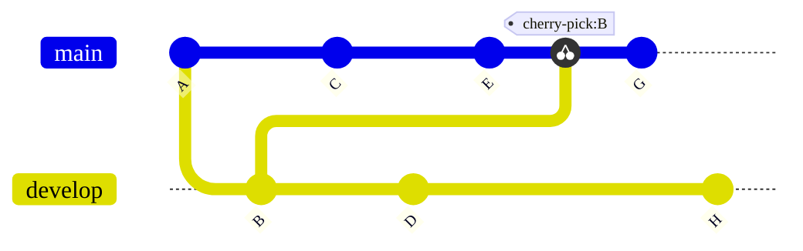



- Tier: Free, Premium, Ultimate
- Offering: GitLab.com, GitLab Self-Managed, GitLab Dedicated



When you use `git cherry-pick` from the command line, you copy specific changes from an existing
branch into your current branch. Cherry-picks help when you want to:

- Backport a bug fix to older release branches without bringing in new features.
- Reuse work from branches that can never merge.
- Backport small features to a previous release, without including experimental changes.
- Apply an emergency production fix (hotfix) to a development branch.
- Copy changes from a fork to the upstream repository.

To learn about cherry-picking from the GitLab UI, see
[Cherry-pick changes](../../user/project/merge_requests/cherry_pick_changes.md).

When you cherry-pick a commit, Git:

- Creates a new commit with the same changes on your current branch.
- Preserves the original commit message and author information.
- Generates a new commit SHA. (The original commit remains unchanged.)

<!-- Diagram reused in doc/user/projects/merge_requests/cherry_pick_changes.md -->



Use `git cherry-pick` carefully because it can create duplicate commits with identical changes but
different Secure Hash Algorithms (SHAs). This can potentially complicate your project history. Consider these alternatives first:

- If you need most of the changes in a branch, and the branch history is clean, merge the entire
  branch into your current branch.
- If the original commit includes complex dependencies you don't need in your new branch,
  create a new commit instead of cherry-picking the old commit.

## Apply one commit to another branch

To cherry-pick a single commit into your current working branch:

1. Identify the SHA of the commit you want to cherry-pick.
   To find this, check the commit history or use the `git log` command. For example:

   ```shell
   $ git log

   commit abc123f
   Merge: 88888999999 aaaaabbbbbb
   Author: user@example.com
   Date:   Tue Aug 31 21:19:41 2021 +0000

       Fixes a regression we found yesterday
    ```

1. Check out the branch you want to cherry-pick into:

   ```shell
   git checkout release
   ```

1. Use the `git cherry-pick` command to copy commit `abc123f` from the
   feature branch into the `release` branch. Replace `abc123f` with the SHA of
   the commit you identified:

   ```shell
   git cherry-pick abc123f
   ```

Git copies the changes from commit `abc123f` to the `release` branch, and shows a notification
if conflicts occur. Resolve the conflicts, and continue the cherry-pick process. Repeat for each
branch that needs the contents of commit `abc123f`.

## Apply multiple commits to another branch

If the code you need was added over the course of multiple commits, cherry-pick each of those commits
into your desired target branch:

1. Identify the SHAs of the commits you want to cherry-pick. To find this, check the commit history
   or use the `git log` command. For example, if the code change is in one commit and improved test
   coverage is in the next commit:

   ```shell
   $ git log

   commit abc123f
   Merge: 88888999999 aaaaabbbbbb
   Author: user@example.com
   Date:   Tue Aug 31 21:19:41 2021 +0000

       Fixes a regression we found yesterday

   commit ghi456j
   Merge: 44444666666 cccccdddddd
   Author: user@example.com
   Date:   Tue Aug 31 21:19:41 2021 +0000

       Adds tests to ensure the problem does not happen again
    ```

1. Check out the branch (`release`) you want to cherry-pick into:

   ```shell
   git checkout release
   ```

1. Copy the commits to your `release` branch.

   - To copy each commit into the `release` branch individually, use the `git cherry-pick` command for
     each commit. Replace `abc123f` and `ghi456j` with the SHA of your desired commits:

     ```shell
     git cherry-pick abc123f
     git cherry-pick ghi456j
     ...
     ```

   - To cherry-pick a range of commits into your `release` branch, using the SHAs to mark the
     beginning and end, use the `..` notation. This command applies all the commits between `abc123f`
     and `ghi456j`:

     ```shell
     git cherry-pick abc123f..ghi456j
     ```

## Copy the contents of an entire branch

When you cherry-pick the merge commit for a branch, your cherry-pick copies all changes from the branch
to your current working branch. Cherry-picking a merge commit requires the `-m` flag. This flag tells Git
which parent commit to use. Merge commits can have multiple parent commits depending on how they were created.

In simple cases, `-m 1` uses the first parent, which is merge commit for the branch. To specify the
second parent, which is often the last commit before the feature branch merged, use `-m 2`. These flags
determine which changes Git applies to your current branch.

To cherry-pick the merge commit from branch `feature-1` into your current working branch:

1. Identify the SHA of the commit you want to cherry-pick.
   To find this, check the commit history or use the `git log` command. For example:

   ```shell
   $ git log

   commit 987pqr6
   Merge: 88888999999 aaaaabbbbbb
   Author: user@example.com
   Date:   Tue Aug 31 21:19:41 2021 +0000

       Merges feature-1 into main
    ```

1. Check out the branch you want to cherry-pick into:

   ```shell
   git checkout feature-2
   ```

1. Use the `git cherry-pick` command with the `-m` option and the index of the parent commit
   you want to use as the mainline. Replace `<merge-commit-hash>` with the SHA of the merge commit
   and `<parent_index>` with the index of the parent commit. The index starts from `1`. For example:

   ```shell
   # git cherry-pick -m <parent_index> <merge-commit-hash>
   git cherry-pick -m 1 987pqr6
   ```

When you run this command, Git copies the contents of the `987pqr6` merge commit into your `feature-2`
branch. If, instead of the merge commit `987pqr6`, you want to use the last commit from the `feature-1`
branch, use `-m 2` instead.

## Related topics

- [Cherry-pick changes with the GitLab UI](../../user/project/merge_requests/cherry_pick_changes.md).
- [Commits API](../../api/commits.md#cherry-pick-a-commit)

## Troubleshooting

If you encounter conflicts during cherry-picking:

1. Resolve the conflicts manually in the affected files.
1. Stage the resolved files:

   ```shell
   git add <resolved_file>
   ```

1. Continue the cherry-pick process:

   ```shell
   git cherry-pick --continue
   ```

To abort the cherry-pick process and return to the previous state,
use the following command:

```shell
git cherry-pick --abort
```

This undoes any changes made during the cherry-pick process.
