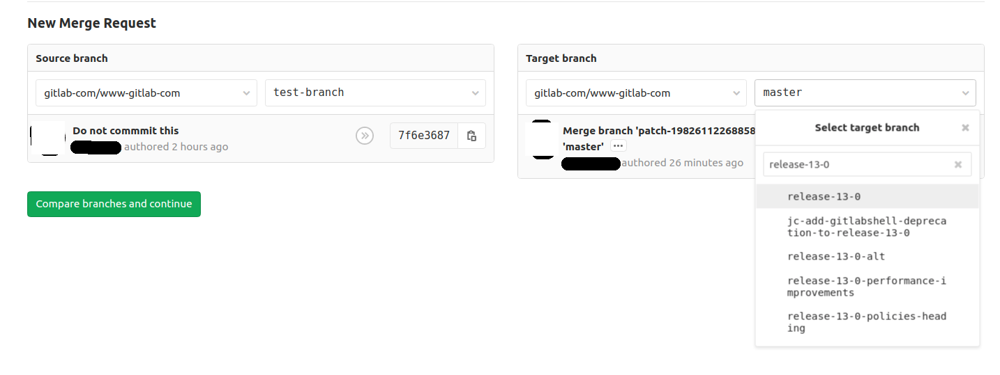

# Develop on a feature branch **(FREE)**

GitLab values encourage the use of [Minimal Viable Change (MVC)](https://about.gitlab.com/handbook/values/#minimal-viable-change-mvc).
However, viable changes are not always small. In such cases, it can help to set up a dedicated feature branch.
People can contribute MRs to that feature branch, without affecting the functionality of the [default branch](../../user/project/repository/branches/default.md).

Once work on the development branch is complete, then the feature branch can be finally merged into the default branch.

GitLab frequently implements this process whenever there is an MVC that requires multiple MRs.

## Use case: GitLab release posts

This section describes the use case with GitLab [release posts](https://about.gitlab.com/handbook/marketing/blog/release-posts/).
Dozens of GitLab team members contribute to each monthly release post.
In such cases, it may be more efficient to submit an MR on the release post feature branch instead of the [default branch](../../user/project/repository/branches/default.md).

In this case, the feature branch would be `release-X-Y`. Assuming the `release-X-Y` branch already exists, you can set up an MR against that branch, with the following steps:

1. Navigate to the [default branch](../../user/project/repository/branches/default.md) (here, `main`):

   ```shell
   git checkout main
   ```

1. Make sure you have the latest version of your repository:

   ```shell
   git fetch
   git pull
   ```

1. Check out the feature branch:

   ```shell
   git checkout release-x-y
   ```

1. Create a new branch (`test-branch`) against the feature branch (`release-x-y`):

   ```shell
   git checkout -b test-branch release-x-y
   ```

   You should now be on a branch named `test-branch`.

1. Make desired changes on the `test-branch`.
1. Add your changes, commit, and push to the `test-branch`:

   ```shell
   git add .
   ```

1. Commit your changes:

   ```shell
   git commit -m "Some good reason"
   ```

1. Push your changes to the repository:

   ```shell
   git push --set-upstream origin test-branch
   ```

1. Navigate to the URL for your repository. In this case, the repository is `www-gitlab-com`, available at `https://gitlab.com/gitlab-com/www-gitlab-com`.

   If needed, sign in to GitLab. You should then see an option to **Create merge request**:

   

1. After you click **Create merge request**, an option to **Change branches** displays. Select that option.

1. In the **New Merge Request** screen, you can now select the **Source** and **Target** branches.
In the screenshot shown,
we have selected `test-branch` as the source, and `release-13-0` as the target.

   

1. Once you've selected the Source and Target branches, click **Compare branches and continue**.
   You should see an entry similar to:

   ```plaintext
   New Merge Request

   From test-branch into release-13-0
   ```

   An entry like this confirms your merge request's destination.

1. Make any additional changes in the **New Merge Request** screen, and click **Submit merge request**.
1. In the new merge request, look for **Request to merge**. An entry similar to this displays:

   ```plaintext
   Request to merge test-branch into release-13-0
   ```

   That confirms you've set up the MR to merge into the specified branch, not the [default branch](../../user/project/repository/branches/default.md).

1. Proceed with the change as you would with any other MR.
1. When your MR is approved, and an appropriate user merges that MR, you can rest assured that your work is incorporated directly into the feature branch.
When the feature branch is ready, it can then be merged into the [default branch](../../user/project/repository/branches/default.md).
