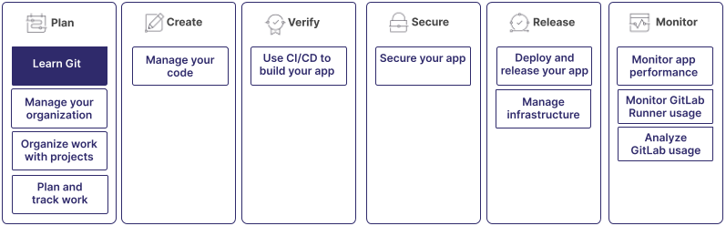

Git is a version control system you use to track changes to your code and collaborate with others.
GitLab is a web-based Git repository manager that provides CI/CD and other features to help you
manage your software development lifecycle.

You can use GitLab without knowing Git.
However, it is advantageous to understand Git when you use GitLab for source control.

Learning Git is part of a larger workflow:

## Repositories

A Git repository is a directory that contains all the files, folders, and version
history of your project.
It serves as a central hub where Git manages and tracks changes to your code.

When you initialize a Git repository or clone an existing one, Git creates a hidden directory,
`.git`, inside the project directory.
The directory contains all the essential metadata and objects Git uses to manage your repository,
including the complete history of all changes made to the files.
Git tracks changes at the file level, so you can view the modifications made to individual
files over time.

For more information, see [Repositories](../../user/project/repository/_index.md).

## Working directories

Your working directory is where you make changes to your code.
When you clone a Git repository, you create a local copy of the repository in your working directory.
You can edit files, add new ones, and test your code.
To collaborate, you can:

- **Commit**: After you make changes in your working directory, commit those changes to your local repository.
- **Push**: Push your changes to a remote Git repository hosted on GitLab. This makes your changes available to other team members.
- **Pull**: Pull changes made by others from the remote repository, and ensure that your local repository is updated with the latest changes.

For more information, see [Common Git commands](commands.md).

## Branches

In Git, you can use branches to work on different features, bug fixes, or experiments
simultaneously without interfering with each other's work.
Branching enables you to create an isolated environment where you can make and test
changes without affecting the default branch.
In GitLab, the default branch is usually called `main`.

### Merge a branch

After a feature is complete or a bug is fixed, you can merge your branch into the default branch.
You can do this in a [Merge request](../../user/project/merge_requests/_index.md).
Merging is a safe way to bring changes from one branch into another while preserving the
history of the changes.

If there are conflicts between the branches, for example, if you modify the same lines of code
in both branches, GitLab flags these as [merge conflicts](../../user/project/merge_requests/conflicts.md).
These must be resolved manually by reviewing and editing the code.

### Delete a branch

After a successful merge, you can delete the branch if it is no longer needed.
Deleting unnecessary branches helps keep your repository organized and manageable.

NOTE:
To ensure no work is lost, verify all changes are incorporated into the default branch
before you delete the branch after the final merge.

For more information, see [Branches](../../user/project/repository/branches/_index.md).

## Understand the Git workflow

You can manage your code, collaborate with others, and keep your project organized
with a Git workflow.
A standard Git workflow includes the following steps:

1. **Clone a repository**: Create a local copy of the repository by cloning it to your machine.
   You can work on the project without affecting the original repository.
1. **Create a new branch**: Before you make any changes, it's recommended to create a new branch.
   This ensures that your changes are isolated and don't interfere with the work of others on the
   default branch.
1. **Make changes**: Make changes to files in your working directory.
   You can add new features, fix bugs, or make other modifications.
1. **Stage changes**: After you make changes to your files, stage the changes you want to commit.
   Staging tells Git which changes should be included in the next commit.
1. **Commit changes**: Commit your staged changes to your local repository.
   A commit saves a snapshot of your work and creates a history of the changes to your files.
1. **Push changes**: To share your changes with others, push them to the remote repository.
   This makes your changes available to other collaborators.
1. **Merge your branch**: After your changes are reviewed and approved, merge your branch into the
   default branch. For example, `main`. This step incorporates your changes into the project.

## Forks

Some organizations, particularly those working with open-source projects, may use
different workflows. For example, [Forks](../../user/project/repository/forking_workflow.md).

A fork is a personal copy of the repository that exists in your own namespace.
Use this workflow when contributing to open-source projects or when your team uses a
centralized repository.

## Install Git

To use Git commands and contribute to GitLab projects, you should download and install
the Git client on your computer.

The installation process varies depending on your operating system.
For example, Windows, MacOS, or Linux.
For information on how to install Git, see [Install Git](how_to_install_git/_index.md).

## Git commands

To interact with Git from the command line, you can use Git commands:

- `git clone`: Clone a repository to your local machine.
- `git branch`: List, create, or delete branches in your local repository.
- `git checkout`: Switch between different branches in your local repository.
- `git add`: Stage changes for commit.
- `git commit`: Commit staged changes to your local repository.
- `git push`: Push local commits to the remote repository.
- `git pull`: Fetch changes from the remote repository and merge them into your local branch.

For more comprehensive information and detailed explanations,
see [Command Git commands](commands.md) guide.

<!--- Use this section when the [Generate an SSH key pair](../user/ssh.md) page is added to the navigation

### Use SSH with Git

When you work with remote repositories, you should use SSH for secure communication.

GitLab uses the SSH protocol to securely communicate with Git.
When you use SSH keys to authenticate to the GitLab remote server,
you don't need to supply your username and password each time.

To learn how to generate and add SSH keys to your GitLab account,
see [Generate an SSH key pair](../user/ssh.md).
-->

## Practice with Git

The best way to learn Git is to practice.
You can create a test project, experiment with different Git commands,
and explore different workflows.

GitLab provides a web-based interface for many Git operations, but you can also use
Git from the command line to interact with GitLab. This provides you with additional
flexibility and control.

For a hands-on approach to learning Git commands, see [Tutorial: Make your first Git commit](../../tutorials/make_first_git_commit/_index.md). For other helpful resources, see [Tutorials: Learn Git](../../tutorials/learn_git.md).
