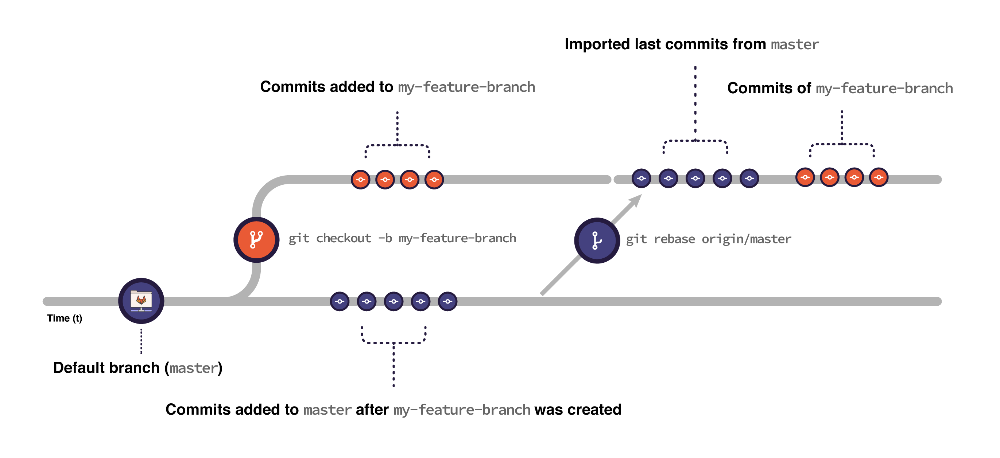

# Introduction to Git rebase, force-push, and merge conflicts **(FREE)**

This guide helps you to get started with rebasing, force-pushing, and fixing
merge conflicts locally.

Before diving into this document, make sure you are familiar with using
[Git through the command line](../../gitlab-basics/start-using-git.md).

## Git rebase

[Rebasing](https://git-scm.com/docs/git-rebase) is a very common operation in
Git. There are the following rebase options:

- [Regular rebase](#regular-rebase).
- [Interactive rebase](#interactive-rebase).

### Before rebasing

WARNING:
`git rebase` rewrites the commit history. It **can be harmful** to do it in
shared branches. It can cause complex and hard to resolve merge conflicts. In
these cases, instead of rebasing your branch against the default branch,
consider pulling it instead (`git pull origin master`). It has a similar
effect without compromising the work of your contributors.

It's safer to back up your branch before rebasing to make sure you don't lose
any changes. For example, consider a [feature branch](../../gitlab-basics/start-using-git.md#branches)
called `my-feature-branch`:

1. Open your feature branch in the terminal:

   ```shell
   git checkout my-feature-branch
   ```

1. Checkout a new branch from it:

   ```shell
   git checkout -b my-feature-branch-backup
   ```

1. Go back to your original branch:

   ```shell
   git checkout my-feature-branch
   ```

Now you can safely rebase it. If anything goes wrong, you can recover your
changes by resetting `my-feature-branch` against `my-feature-branch-backup`:

1. Make sure you're in the correct branch (`my-feature-branch`):

   ```shell
   git checkout my-feature-branch
   ```

1. Reset it against `my-feature-branch-backup`:

   ```shell
   git reset --hard my-feature-branch-backup
   ```

Note that if you added changes to `my-feature-branch` after creating the backup branch,
you lose them when resetting.

### Regular rebase

With a regular rebase you can update your feature branch with the default
branch (or any other branch).
This is an important step for Git-based development strategies. You can
ensure that the changes you're adding to the codebase do not break any
existing changes added to the target branch _after_ you created your feature
branch.

For example, to update your branch `my-feature-branch` with your
[default branch](../../user/project/repository/branches/default.md) (here, using `main`):

1. Fetch the latest changes from `main`:

   ```shell
   git fetch origin main
   ```

1. Checkout your feature branch:

   ```shell
   git checkout my-feature-branch
   ```

1. Rebase it against `main`:

   ```shell
   git rebase origin/main
   ```

1. [Force-push](#force-push) to your branch.

When you rebase:

1. Git imports all the commits submitted to `main` _after_ the
   moment you created your feature branch until the present moment.
1. Git puts the commits you have in your feature branch on top of all
   the commits imported from `main`:



You can replace `main` with any other branch you want to rebase against, for
example, `release-10-3`. You can also replace `origin` with other remote
repositories, for example, `upstream`. To check what remotes you have linked to your local
repository, you can run `git remote -v`.

If there are [merge conflicts](#merge-conflicts), Git prompts you to fix
them before continuing the rebase.

To learn more, check Git's documentation on [rebasing](https://git-scm.com/book/en/v2/Git-Branching-Rebasing)
and [rebasing strategies](https://git-scm.com/book/en/v2/Git-Branching-Rebasing).

### Interactive rebase

You can use interactive rebase to modify commits. For example, amend a commit
message, squash (join multiple commits into one), edit, or delete
commits. Use a rebase for changing past commit messages,
and organizing the commit history of your branch to keep it clean.

NOTE:
If you want to keep the default branch commit history clean, you don't need to
manually squash all your commits before merging every merge request.
With [Squash and Merge](../../user/project/merge_requests/squash_and_merge.md),
GitLab does it automatically.

When you want to change anything in recent commits, use interactive
rebase by passing the flag `--interactive` (or `-i`) to the rebase command.

For example, if you want to edit the last three commits in your branch
(`HEAD~3`), run:

```shell
git rebase -i HEAD~3
```

Git opens the last three commits in your terminal text editor and describes
all the interactive rebase options you can use. The default option is `pick`,
which maintains the commit unchanged. Replace the keyword `pick` according to
the operation you want to perform in each commit. To do so, you need to edit
the commits in your terminal's text editor.

For example, if you're using [Vim](https://www.vim.org/) as the text editor in
a macOS's `ZSH` shell, and you want to **squash** all the three commits
(join them into one):

1. Press <!-- vale gitlab.FirstPerson = NO --> <kbd>i</kbd> <!-- vale gitlab.FirstPerson = YES -->
   on your keyboard to switch to Vim's editing mode.
1. Navigate with your keyboard arrows to edit the **second** commit keyword
   from `pick` to `squash` (or `s`). Do the same to the **third** commit.
   The first commit should be left **unchanged** (`pick`) as we want to squash
   the second and third into the first.
1. Press <kbd>Escape</kbd> to leave the editing mode.
1. Type `:wq` to "write" (save) and "quit".
1. Git outputs the commit message so you have a chance to edit it:
   - All lines starting with `#` are ignored and not included in the commit
   message. Everything else is included.
   - To leave it as it is, type `:wq`. To edit the commit message: switch to the
   editing mode, edit the commit message, and save it as you just did.
1. If you haven't pushed your commits to the remote branch before rebasing,
   push your changes normally. If you had pushed these commits already,
   [force-push](#force-push) instead.

Note that the steps for editing through the command line can be slightly
different depending on your operating system and the shell you're using.

See [Numerous undo possibilities in Git](numerous_undo_possibilities_in_git/index.md#undo-staged-local-changes-without-modifying-history)
for a deeper look into interactive rebase.

## Force-push

When you perform more complex operations, for example, squash commits, reset or
rebase your branch, you must _force_ an update to the remote branch.
These operations imply rewriting the commit history of the branch.
To force an update, pass the flag `--force` or `-f` to the `push` command. For
example:

```shell
git push --force origin my-feature-branch
```

Forcing an update is **not** recommended when you're working on shared
branches.

Alternatively, you can pass the flag [`--force-with-lease`](https://git-scm.com/docs/git-push#Documentation/git-push.txt---force-with-leaseltrefnamegt)
instead. It is safer, as it does not overwrite any work on the remote
branch if more commits were added to the remote branch by someone else:

```shell
git push --force-with-lease origin my-feature-branch
```

If the branch you want to force-push is [protected](../../user/project/protected_branches.md),
you can't force-push to it unless you unprotect it first. Then you can
force-push and re-protect it.

## Merge conflicts

As Git is based on comparing versions of a file
line-by-line, whenever a line changed in your branch coincides with the same
line changed in the target branch (after the moment you created your feature branch from it), Git
identifies these changes as a merge conflict. To fix it, you need to choose
which version of that line you want to keep.

Most conflicts can be [resolved through the GitLab UI](../../user/project/merge_requests/resolve_conflicts.md).

For more complex cases, there are various methods for resolving them. There are
also [Git GUI apps](https://git-scm.com/downloads/guis) that can help by
visualizing the differences.

To fix conflicts locally, you can use the following method:

1. Open the terminal and checkout your feature branch, for example, `my-feature-branch`:

   ```shell
   git checkout my-feature-branch
   ```

1. [Rebase](#regular-rebase) your branch against the target branch so Git
   prompts you with the conflicts:

   ```shell
   git rebase origin/master
   ```

1. Open the conflicting file in a code editor of your preference.
1. Look for the conflict block:
   - It begins with the marker: `<<<<<<< HEAD`.
   - Below, there is the content with your changes.
   - The marker: `=======` indicates the end of your changes.
   - Below, there's the content of the latest changes in the target branch.
   - The marker `>>>>>>>` indicates the end of the conflict.
1. Edit the file: choose which version (before or after `=======`) you want to
   keep, and then delete the portion of the content you don't want in the file.
1. Delete the markers.
1. Save the file.
1. Repeat the process if there are other conflicting files.
1. Stage your changes:

   ```shell
   git add .
   ```

1. Commit your changes:

   ```shell
   git commit -m "Fix merge conflicts"
   ```

1. Continue rebasing:

   ```shell
   git rebase --continue
   ```

   WARNING:
   Up to this point, you can run `git rebase --abort` to stop the process.
   Git aborts the rebase and rolls back the branch to the state you had before
   running `git rebase`.
   After you run `git rebase --continue` the rebase **cannot** be aborted.

1. [Force-push](#force-push) to your remote branch.
