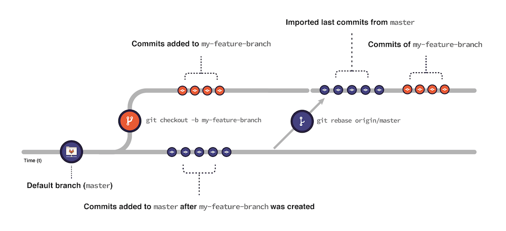

In Git, a rebase updates your branch with the contents of another branch.
A rebase confirms that changes in your branch don't conflict with
changes in the target branch.

If you have a [merge conflict](../../user/project/merge_requests/conflicts.md),
you can rebase to fix it.

When you rebase:

1. Git imports all the commits submitted to your target branch after you initially created
   your branch from it.
1. Git applies the commits from your branch on top of the imported commits:

   

While most rebases are performed against `main`, you can rebase against any other
branch. You can also specify a different remote repository.
For example, `upstream` instead of `origin`.

WARNING:
`git rebase` rewrites the commit history. It can cause conflicts in
shared branches and complex merge conflicts.
Instead of rebasing your branch against the default branch,
consider using `git pull origin master`. Pulling has similar
effects with less risk of compromising others' work.

## Rebase

When you use Git to rebase, each commit is applied to your branch.
When merge conflicts occur, you are prompted to address them.

For more advanced options for your commits, use [an interactive rebase](#interactive-rebase).

Prerequisites:

- You must have [permissions](../../user/permissions.md) to force push to branches.

To use Git to rebase your branch against the target branch:

1. Open a terminal and change to your project directory.
1. Ensure you have the latest contents of the target branch.
   In this example, the target branch is `main`:

   ```shell
   git fetch origin main
   ```

1. Check out your branch:

   ```shell
   git checkout my-branch
   ```

1. Optional. Create a backup of your branch:

   ```shell
   git branch my-branch-backup
   ```

   Changes added to `my-branch` after this point are lost
   if you restore from the backup branch.

1. Rebase against the `main` branch:

   ```shell
   git rebase origin/main
   ```

1. If merge conflicts exist:
   1. Resolve the conflicts in your editor.

   1. Stage the changes:

      ```shell
      git add .
      ```

   1. Continue the rebase:

      ```shell
      git rebase --continue
      ```

1. Force push your changes to the target branch, while protecting others' commits:

   ```shell
   git push origin my-branch --force-with-lease
   ```

## Interactive rebase

Use an interactive rebase to specify how to handle each commit.
The following instructions use the [Vim](https://www.vim.org/) text editor to edit commits.

To rebase interactively:

1. Open a terminal and change to your project directory.
1. Ensure you have the latest contents of the target branch. In this example, the target branch is `main`:

   ```shell
   git fetch origin main
   ```

1. Check out your branch:

   ```shell
   git checkout my-branch
   ```

1. Optional. Create a backup of your branch:

   ```shell
   git branch my-branch-backup
   ```

   Changes added to `my-branch` after this point are lost
   if you restore from the backup branch.

1. In the GitLab UI, in your merge request, confirm the number of commits
   to rebase in the **Commits** tab.
1. Open these commits. For example, to edit the last five commits:

   ```shell
   git rebase -i HEAD~5
   ```

   Git opens the commits in your terminal text editor, oldest first.
   Each commit shows the action to take, the SHA, and the commit title. For example:

   ```shell
   pick 111111111111 Second round of structural revisions
   pick 222222222222 Update inbound link to this changed page
   pick 333333333333 Shifts from H4 to H3
   pick 444444444444 Adds revisions from editorial
   pick 555555555555 Revisions continue to build the concept part out

   # Rebase 111111111111..222222222222 onto zzzzzzzzzzzz (5 commands)
   #
   # Commands:
   # p, pick <commit> = use commit
   # r, reword <commit> = use commit, but edit the commit message
   # e, edit <commit> = use commit, but stop for amending
   # s, squash <commit> = use commit, but meld into previous commit
   # f, fixup [-C | -c] <commit> = like "squash" but keep only the previous
   ```

1. Switch to Vim's edit mode by pressing <kbd>i</kbd>.
1. Use the arrow keys to move the cursor to the commit you want to edit.
1. For each commit, except the first one, change `pick` to `squash` or `fixup` (or `s` or `f`).
1. Repeat for the remaining commits.
1. End edit mode, save, and quit:

   - Press <kbd>ESC</kbd>.
   - Type `:wq`.

1. When squashing, Git prompts you to edit the commit message:

   - Lines starting with `#` are ignored and not included in the commit
     message.
   - To keep the current message, type `:wq`.
   - To edit the commit message, switch to
     edit mode, make changes, and save.

1. Push your changes to the target branch.

   - If you didn't push your commits to the target branch before rebasing:

     ```shell
     git push origin my-branch
     ```

   - If you already pushed the commits:

     ```shell
     git push origin my-branch --force-with-lease
     ```

     Some actions require a force push to make changes to the branch. For more information, see [Force push to a remote branch](#force-push-to-a-remote-branch).

## Resolve conflicts from the command line

To give you the most control over each change, you should fix complex conflicts locally from the command line, instead of in GitLab.

Prerequisites:

- You must have [permissions](../../user/permissions.md) to force push to branches.

1. Open the terminal and check out your feature branch:

   ```shell
   git switch my-feature-branch
   ```

1. Rebase your branch against the target branch. In this example, the target branch is `main`:

   ```shell
   git fetch
   git rebase origin/main
   ```

1. Open the conflicting file in your preferred code editor.
1. Locate and resolve the conflict block:
   1. Choose which version (before or after `=======`) you want to keep.
   1. Delete the version you don't want to keep.
   1. Delete the conflict markers.
1. Save the file.
1. Repeat the process for each file with conflicts.
1. Stage your changes:

   ```shell
   git add .
   ```

1. Commit your changes:

   ```shell
   git commit -m "Resolve merge conflicts"
   ```

   WARNING:
   You can run `git rebase --abort` to stop the process before this point.
   Git aborts the rebase and rolls back the branch to the state
   before running `git rebase`. After you run `git rebase --continue`, you cannot abort the rebase.

1. Continue the rebase:

   ```shell
   git rebase --continue
   ```

1. Force push the changes to your
   remote branch:

   ```shell
    git push origin my-feature-branch --force-with-lease
   ```

## Force push to a remote branch

Complex Git operations like squashing commits, resetting a branch, or rebasing rewrite branch history.
Git requires a forced update for these changes.

Force pushing is not recommended on shared branches, because you risk destroying
others' changes.

If the branch is [protected](../../user/project/repository/branches/protected.md),
you can't force push unless you:

- Unprotect it.
- Allow force pushes.

For more information, see [Allow force push on a protected branch](../../user/project/repository/branches/protected.md#allow-force-push-on-a-protected-branch).

## Restore your backed up branch

If a rebase or force push fails, restore your branch from its backup:

1. Ensure you're on the correct branch:

   ```shell
   git checkout my-branch
   ```

1. Reset your branch to the backup:

   ```shell
   git reset --hard my-branch-backup
   ```

## Approving after rebase

If you rebase a branch, you've added commits. If your project is configured to
[prevent approvals by users who add commits](../../user/project/merge_requests/approvals/settings.md#prevent-approvals-by-users-who-add-commits), you can't approve a merge request you've rebased.

## Related topics

- [Revert and undo changes](undo.md)
- [Git documentation for branches and rebases](https://git-scm.com/book/en/v2/Git-Branching-Rebasing)
- [Project squash and merge settings](../../user/project/merge_requests/squash_and_merge.md#configure-squash-options-for-a-project)
- [Merge conflicts](../../user/project/merge_requests/conflicts.md)

## Troubleshooting

For CI/CD pipeline troubleshooting information, see [Debugging CI/CD pipelines](../../ci/debugging.md).

### `Unmergeable state` after `/rebase` quick action

The `/rebase` command schedules a background task. The task attempts to rebase
the changes in the source branch on the latest commit of the target branch.
If, after using the `/rebase`
[quick action](../../user/project/quick_actions.md#issues-merge-requests-and-epics),
you see this error, a rebase cannot be scheduled:

```plaintext
This merge request is currently in an unmergeable state, and cannot be rebased.
```

This error occurs if any of these conditions are true:

- Conflicts exist between the source and target branches.
- The source branch contains no commits.
- Either the source or target branch does not exist.
- An error has occurred, resulting in no diff being generated.

To resolve the `unmergeable state` error:

1. Resolve any merge conflicts.
1. Confirm the source branch exists, and has commits.
1. Confirm the target branch exists.
1. Confirm the diff has been generated.

### `/merge` quick action ignored after `/rebase`

If `/rebase` is used, `/merge` is ignored to avoid a race condition where the source branch is merged or deleted before it is rebased.
