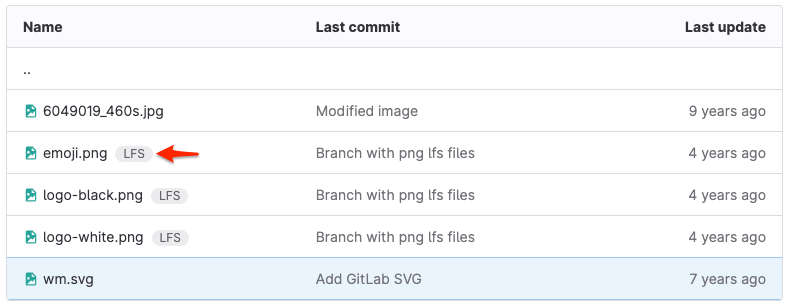

Git Large File Storage (LFS) is an open source Git extension that helps Git repositories
manage large binary files efficiently. Git can't track changes to binary files
(like audio, video, or image files) the same way it tracks changes to text files.
While text-based files can generate plaintext diffs, any change to a binary file requires
Git to completely replace the file in the repository. Repeated changes to large files
increase your repository's size. Over time, this increase in size can slow down regular Git
operations like `clone`, `fetch`, or `pull`.

Use Git LFS to store large binary files outside of your Git repository, leaving only
a small, text-based pointer for Git to manage. When you add a file to your repository
using Git LFS, GitLab:

1. Adds the file to your project's configured object storage, instead of the Git repository.
1. Adds a pointer to your Git repository, instead of the large file. The pointer
   contains information about your file, like this:

   ```plaintext
   version https://git-lfs.github.com/spec/v1
   oid sha256:lpca0iva5kpz9wva5rgsqsicxrxrkbjr0bh4sy6rz08g2c4tyc441rto5j5bctit
   size 804
   ```

   - **Version** - the version of the Git LFS specification in use
   - **OID** - The hashing method used, and a unique object ID, in the form `{hash-method}:{hash}`.
   - **Size** - The file size, in bytes.

1. Queues a job to recalculate your project's statistics, including storage size and
   LFS object storage. Your LFS object storage is the sum of the size of all LFS
   objects associated with your repository.

Files managed with Git LFS show a **LFS** badge next to the filename:



Git LFS clients use HTTP Basic authentication, and communicate with your server
over HTTPS. After you authenticate the request, the Git LFS client receives instructions
on where to fetch (or push) the large file.

Your Git repository remains smaller, which helps you adhere to repository size limits.
For more information, see repository size limits
[for GitLab Self-Managed](../../../administration/settings/account_and_limit_settings.md#repository-size-limit) and
[for GitLab SaaS](../../../user/gitlab_com/_index.md#account-and-limit-settings).

## Understand how Git LFS works with forks

When you fork a repository, your fork includes the upstream repository's existing LFS objects
that existed at the time of your fork. If you add new LFS objects to your fork,
they belong to only your fork, and not the upstream repository. The total object storage
increases only for your fork.

When you create a merge request from your fork back to the upstream project, and
your merge request contains a new Git LFS object, GitLab associates the new LFS object
with the _upstream_ project after merge.

## Configure Git LFS for a project

DETAILS:
**Tier:** Free, Premium, Ultimate
**Offering:** GitLab Self-Managed, GitLab Dedicated

GitLab enables Git LFS by default for both GitLab Self-Managed and GitLab SaaS.
It offers both server settings and project-specific settings.

- To configure Git LFS on your instance, such as setting up remote object storage, see
  [GitLab Git Large File Storage (LFS) Administration](../../../administration/lfs/_index.md).
- To configure Git LFS for a specific project:

  1. In the root directory of your local copy of the repository, run `git lfs install`. This command
     adds:
     - A pre-push Git hook to your repository.
     - A [`.gitattributes` file](../../../user/project/repository/files/git_attributes.md) to track
       handling for individual files and file types.
  1. Add the files and file types you want to track with Git LFS.

## Enable or disable Git LFS for a project

Git LFS is enabled by default for both GitLab Self-Managed and GitLab SaaS.

Prerequisites:

- You must have at least the Developer role for the project.

To enable or disable Git LFS for your project:

1. On the left sidebar, select **Search or go to** and find your project.
1. Select **Settings > General**.
1. Expand the **Visibility, project features, permissions** section.
1. Select the **Git Large File Storage (LFS)** toggle.
1. Select **Save changes**.

## Add and track files

You can add large files to Git LFS. This helps you manage files in Git repositories.
When you track files with Git LFS, they are replaced with text pointers in Git,
and stored on a remote server. For more information, see [Git LFS](../../git/file_management.md#git-lfs).

## Clone a repository that uses Git LFS

When you clone a repository that uses Git LFS, Git detects the LFS-tracked files
and clones them over HTTPS. If you run `git clone` with a SSH URL, like
`user@hostname.com:group/project.git`, you must enter your GitLab credentials again for HTTPS
authentication.

By default, Git LFS operations occur over HTTPS, even when Git communicates with your repository over SSH.
In GitLab 17.2, [pure SSH support for LFS](https://gitlab.com/groups/gitlab-org/-/epics/11872) was introduced.
For information on how to enable this feature, see [Pure SSH transfer protocol](../../../administration/lfs/_index.md#pure-ssh-transfer-protocol).

To fetch new LFS objects for a repository you have already cloned, run this command:

```shell
git lfs fetch origin main
```

## Migrate an existing repository to Git LFS

Read the [`git-lfs-migrate` documentation](https://github.com/git-lfs/git-lfs/blob/main/docs/man/git-lfs-migrate.adoc)
on how to migrate an existing Git repository with Git LFS.

## Delete a Git LFS file from repository history

It's important to understand the differences between untracking a file in Git LFS and deleting a file:

- **Untrack**: The file remains on disk and in your repository history.
If users check out historical branches or tags, they still need the LFS version of the file.
- **Delete**: The file is removed but remains in your repository history.

To delete a tracked file with Git LFS, see [Remove a file](../undo.md#remove-a-file-from-a-repository).

To completely expunge all history of a file, past and present,
see [Handle sensitive information](../undo.md#handle-sensitive-information).

WARNING:
Expunging file history requires rewriting Git history. This action is destructive and irreversible.

## Reduce repository size after removing large files

If you need to remove large files from your repository's history, to reduce
the total size of your repository, see
[Reduce repository size](../../../user/project/repository/repository_size.md#methods-to-reduce-repository-size).

## Related topics

- Use Git LFS to set up [exclusive file locks](../file_management.md#configure-file-locks).
- Blog post: [Getting started with Git LFS](https://about.gitlab.com/blog/2017/01/30/getting-started-with-git-lfs-tutorial/)
- [Git LFS with Git](../../git/file_management.md#git-lfs)
- [Git LFS developer information](../../../development/lfs.md)
- [GitLab Git Large File Storage (LFS) Administration](../../../administration/lfs/_index.md) for GitLab Self-Managed
- [Troubleshooting Git LFS](troubleshooting.md)
- [The `.gitattributes` file](../../../user/project/repository/files/git_attributes.md)
