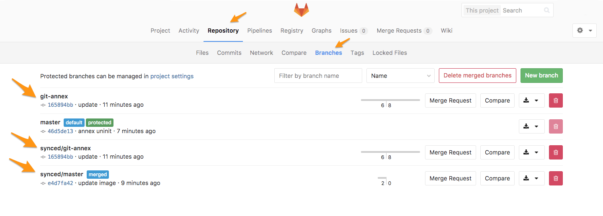

# Migration guide from Git Annex to Git LFS

>**Note:**
Git Annex support [has been removed](https://gitlab.com/gitlab-org/gitlab/issues/1648) in GitLab Enterprise
Edition 9.0 (2017/03/22).

Both [Git Annex](http://git-annex.branchable.com/) and [Git LFS](https://git-lfs.github.com/) are tools to manage large files in Git.

## History

Git Annex [was introduced in GitLab Enterprise Edition 7.8](https://about.gitlab.com/blog/2015/02/17/gitlab-annex-solves-the-problem-of-versioning-large-binaries-with-git/), at a time
where Git LFS didn't yet exist. A few months later, GitLab brought support for
Git LFS in [GitLab 8.2](https://about.gitlab.com/blog/2015/11/23/announcing-git-lfs-support-in-gitlab/) and is available for both Community and
Enterprise editions.

## Differences between Git Annex and Git LFS

Some items below are general differences between the two protocols and some are
ones that GitLab developed.

- Git Annex works only through SSH, whereas Git LFS works both with SSH and HTTPS
  (SSH support was added in GitLab 8.12).
- Annex files are stored in a sub-directory of the normal repositories, whereas
  LFS files are stored outside of the repositories in a place you can define.
- Git Annex requires a more complex setup, but has much more options than Git
  LFS. You can compare the commands each one offers by running `man git-annex`
  and `man git-lfs`.
- Annex files cannot be browsed directly in GitLab's interface, whereas LFS
  files can.

## Migration steps

>**Note:**
Since Git Annex files are stored in a sub-directory of the normal repositories
(`.git/annex/objects`) and LFS files are stored outside of the repositories,
they are not compatible as they are using a different scheme. Therefore, the
migration has to be done manually per repository.

There are basically two steps you need to take in order to migrate from Git
Annex to Git LFS.

### TL; DR

If you know what you are doing and want to skip the reading, this is what you
need to do (we assume you have [git-annex enabled](../../../administration/git_annex.md#using-gitlab-git-annex) in your
repository and that you have made backups in case something goes wrong).
Fire up a terminal, navigate to your Git repository and:

1. Disable `git-annex`:

   ```shell
   git annex sync --content
   git annex direct
   git annex uninit
   git annex indirect
   ```

1. Enable `git-lfs`:

   ```shell
   git lfs install
   git lfs track <files>
   git add .
   git commit -m "commit message"
   git push
   ```

### Disabling Git Annex in your repo

Before changing anything, make sure you have a backup of your repository first.
There are a couple of ways to do that, but you can simply clone it to another
local path and maybe push it to GitLab if you want a remote backup as well.
Here you'll find a guide on
[how to back up a **git-annex** repository to an external hard drive](https://www.thomas-krenn.com/en/wiki/Git-annex_Repository_on_an_External_Hard_Drive).

Since Annex files are stored as objects with symlinks and cannot be directly
modified, we need to first remove those symlinks.

NOTE: **Note:**
Make sure the you read about the [`direct` mode](https://git-annex.branchable.com/direct_mode/) as it contains
useful information that may fit in your use case. Note that `annex direct` is
deprecated in Git Annex version 6, so you may need to upgrade your repository
if the server also has Git Annex 6 installed. Read more in the
[Git Annex troubleshooting tips](../../../administration/git_annex.md#troubleshooting-tips) section.

1. Backup your repository

   ```shell
   cd repository
   git annex sync --content
   cd ..
   git clone repository repository-backup
   cd repository-backup
   git annex get
   cd ..
   ```

1. Use `annex direct`:

   ```shell
   cd repository
   git annex direct
   ```

   The output should be similar to this:

   ```shell
   commit
   On branch master
   Your branch is up-to-date with 'origin/master'.
   nothing to commit, working tree clean
   ok
   direct debian.iso ok
   direct  ok
   ```

1. Disable Git Annex with [`annex uninit`](https://git-annex.branchable.com/git-annex-uninit/):

   ```shell
   git annex uninit
   ```

   The output should be similar to this:

   ```shell
   unannex debian.iso ok
   Deleted branch git-annex (was 2534d2c).
   ```

   This will `unannex` every file in the repository, leaving the original files.

1. Switch back to `indirect` mode:

   ```shell
   git annex indirect
   ```

   The output should be similar to this:

   ```shell
   (merging origin/git-annex into git-annex...)
   (recording state in git...)
   commit  (recording state in git...)

   ok
   (recording state in git...)
   [master fac3194] commit before switching to indirect mode
    1 file changed, 1 deletion(-)
    delete mode 120000 alpine-virt-3.4.4-x86_64.iso
   ok
   indirect  ok
   ok
   ```

---

At this point, you have two options. Either add, commit and push the files
directly back to GitLab or switch to Git LFS. We will tackle the LFS switch in
the next section.

### Enabling Git LFS in your repo

Git LFS is enabled by default on all GitLab products (GitLab CE, GitLab EE,
GitLab.com), therefore, you don't need to do anything server-side.

1. First, make sure you have `git-lfs` installed locally:

   ```shell
   git lfs help
   ```

   If the terminal doesn't prompt you with a full response on `git-lfs` commands,
   [install the Git LFS client](https://git-lfs.github.com/) first.

1. Inside the repo, run the following command to initiate LFS:

   ```shell
   git lfs install
   ```

1. Enable `git-lfs` for the group of files you want to track. You
   can track specific files, all files containing the same extension, or an
   entire directory:

   ```shell
   git lfs track images/01.png   # per file
   git lfs track **/*.png        # per extension
   git lfs track images/         # per directory
   ```

   Once you do that, run `git status` and you'll see `.gitattributes` added
   to your repo. It collects all file patterns that you chose to track via
   `git-lfs`.

1. Add the files, commit and push them to GitLab:

   ```shell
   git add .
   git commit -m "commit message"
   git push
   ```

   If your remote is set up with HTTP, you will be asked to enter your login
   credentials. If you have [2FA enabled](../../../user/profile/account/two_factor_authentication.md), make sure to use a
   [personal access token](../../../user/profile/account/two_factor_authentication.md#personal-access-tokens)
   instead of your password.

## Removing the Git Annex branches

After the migration finishes successfully, you can remove all `git-annex`
related branches from your repository.

On GitLab, navigate to your project's **Repository ➔ Branches** and delete all
branches created by Git Annex: `git-annex`, and all under `synced/`.



You can also do this on the command line with:

```shell
git branch -d synced/master
git branch -d synced/git-annex
git push origin :synced/master
git push origin :synced/git-annex
git push origin :git-annex
git remote prune origin
```

If there are still some Annex objects inside your repository (`.git/annex/`)
or references inside `.git/config`, run `annex uninit` again:

```shell
git annex uninit
```

## Further Reading

- (Blog Post) [Getting Started with Git FLS](https://about.gitlab.com/blog/2017/01/30/getting-started-with-git-lfs-tutorial/)
- (Blog Post) [Announcing LFS Support in GitLab](https://about.gitlab.com/blog/2015/11/23/announcing-git-lfs-support-in-gitlab/)
- (Blog Post) [GitLab Annex Solves the Problem of Versioning Large Binaries with Git](https://about.gitlab.com/blog/2015/02/17/gitlab-annex-solves-the-problem-of-versioning-large-binaries-with-git/)
- (GitLab Docs) [Git Annex](../../../administration/git_annex.md)
- (GitLab Docs) [Git LFS](index.md)
