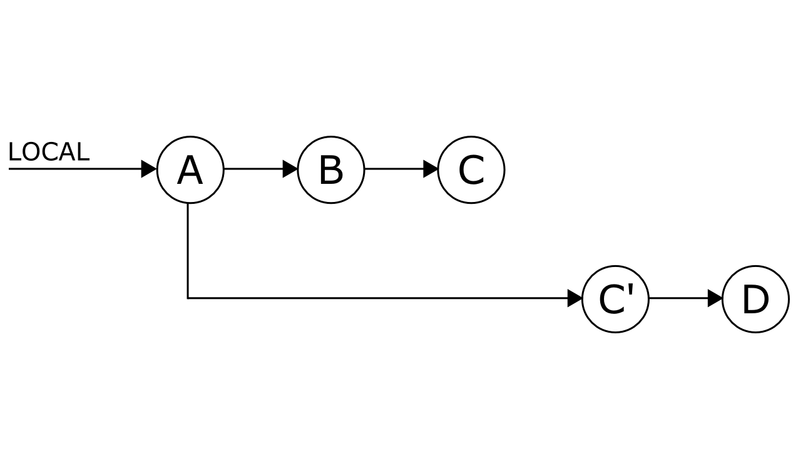

# Numerous undo possibilities in Git

## Introduction

In this tutorial, we will show you different ways of undoing your work in Git, for which
we will assume you have a basic working knowledge of. Check GitLab's
[Git documentation](../index.md#git-documentation) for reference.
Also, we will only provide some general info of the commands, which is enough
to get you started for the easy cases/examples, but for anything more advanced please refer to the [Git book](https://git-scm.com/book/en/v2).

We will explain a few different techniques to undo your changes based on the stage
of the change in your current development. Also, keep in mind that [nothing in
Git is really deleted.][git-autoclean-ref]
This means that until Git automatically cleans detached commits (which cannot be
accessed by branch or tag) it will be possible to view them with `git reflog` command
and access them with direct commit-id. Read more about _[redoing the undo](#redoing-the-undo)_ on the section below.

This guide is organized depending on the [stage of development][git-basics]
where you want to undo your changes from and if they were shared with other developers
or not. Because Git is tracking changes a created or edited file is in the unstaged state
(if created it is untracked by Git). After you add it to a repository (`git add`) you put
a file into the **staged** state, which is then committed (`git commit`) to your
local repository. After that, file can be shared with other developers (`git push`).
Here's what we'll cover in this tutorial:

 - [Undo local changes](#undo-local-changes) which were not pushed to remote repository

    - Before you commit, in both unstaged and staged state
    - After you committed

 - Undo changes after they are pushed to remote repository

    - [Without history modification](#undo-remote-changes-without-changing-history) (preferred way)
    - [With history modification](#undo-remote-changes-with-modifying-history) (requires
      coordination with team and force pushes).

      - [Usecases when modifying history is generally acceptable](#where-modifying-history-is-generally-acceptable)
      - [How to modify history](#how-modifying-history-is-done)
      - [How to remove sensitive information from repository](#deleting-sensitive-information-from-commits)


### Branching strategy

[Git][git-official] is a de-centralized version control system, which means that beside regular
versioning of the whole repository, it has possibilities to exchange changes
with other repositories. To avoid chaos with
[multiple sources of truth][git-distributed], various
development workflows have to be followed, and it depends on your internal
workflow how certain changes or commits can be undone or changed.
[GitLab Flow][gitlab-flow] provides a good
balance between developers clashing with each other while
developing the same feature and cooperating seamlessly, but it does not enable
joined development of the same feature by multiple developers by default.
When multiple developers develop the same feature on the same branch, clashing
with every synchronization is unavoidable, but a proper or chosen Git Workflow will
prevent that anything is lost or out of sync when feature is complete. You can also
read through this blog post on [Git Tips & Tricks][gitlab-git-tips-n-tricks]
to learn how to easily **do** things in Git.


## Undo local changes

Until you push your changes to any remote repository, they will only affect you.
That broadens your options on how to handle undoing them. Still, local changes
can be on various stages and each stage has a different approach on how to tackle them.


### Unstaged local changes (before you commit)

When a change is made, but it is not added to the staged tree, Git itself
proposes a solution to discard changes to certain file.

Suppose you edited a file to change the content using your favorite editor:

```shell
vim <file>
```

Since you did not `git add <file>` to staging, it should be under unstaged files (or
untracked if file was created). You can confirm that with:

```shell
$ git status
On branch master
Your branch is up-to-date with 'origin/master'.
Changes not staged for commit:
  (use "git add <file>..." to update what will be committed)
  (use "git checkout -- <file>..." to discard changes in working directory)

    modified:   <file>
no changes added to commit (use "git add" and/or "git commit -a")
```

At this point there are 3 options to undo the local changes you have:

 - Discard all local changes, but save them for possible re-use [later](#quickly-save-local-changes)

     ```shell
     git stash
     ```

 - Discarding local changes (permanently) to a file

     ```shell
     git checkout -- <file>
     ```

 - Discard all local changes to all files permanently

     ```shell
     git reset --hard
     ```


Before executing `git reset --hard`, keep in mind that there is also a way to
just temporary store the changes without committing them using `git stash`.
This command resets the changes to all files, but it also saves them in case
you would like to apply them at some later time. You can read more about it in
[section below](#quickly-save-local-changes).

### Quickly save local changes

You are working on a feature when a boss drops by with an urgent task. Since your
feature is not complete, but you need to swap to another branch, you can use
`git stash` to save what you had done, swap to another branch, commit, push,
test, then get back to previous feature branch, do `git stash pop` and continue
where you left.

The example above shows that discarding all changes is not always a preferred option,
but Git provides a way to save them for later, while resetting the repository to state without
them. This is achieved by Git stashing command `git stash`, which in fact saves your
current work and runs `git reset --hard`, but it also has various
additional options like:

 - `git stash save`, which enables including temporary commit message, which will help you identify changes, among with other options
 - `git stash list`, which lists all previously stashed commits (yes, there can be more) that were not `pop`ed
 - `git stash pop`, which redoes previously stashed changes and removes them from stashed list
 - `git stash apply`, which redoes previously stashed changes, but keeps them on stashed list

### Staged local changes (before you commit)

Let's say you have added some files to staging, but you want to remove them from the
current commit, yet you want to retain those changes - just move them outside
of the staging tree. You also have an option to discard all changes with
`git reset --hard` or think about `git stash` [as described earlier.](#quickly-save-local-changes)

Lets start the example by editing a file, with your favorite editor, to change the
content and add it to staging

```
vim <file>
git add <file>
```

The file is now added to staging as confirmed by `git status` command:

```shell
$ git status
On branch master
Your branch is up-to-date with 'origin/master'.
Changes to be committed:
  (use "git reset HEAD <file>..." to unstage)

	new file:   <file>
```

Now you have 4 options to undo your changes:

 - Unstage the file to current commit (HEAD)

     ```shell
     git reset HEAD <file>
     ```

 - Unstage everything - retain changes

     ```shell
     git reset
     ```

 - Discard all local changes, but save them for [later](#quickly-save-local-changes)

     ```shell
     git stash
     ```

 - Discard everything permanently

     ```shell
     git reset --hard
     ```

## Committed local changes

Once you commit, your changes are recorded by the version control system.
Because you haven't pushed to your remote repository yet, your changes are
still not public (or shared with other developers). At this point, undoing
things is a lot easier, we have quite some workaround options. Once you push
your code, you'll have less options to troubleshoot your work.

### Without modifying history

Through the development process some of the previously committed changes do not
fit anymore in the end solution, or are source of the bugs. Once you find the
commit which triggered bug, or once you have a faulty commit, you can simply
revert it with `git revert commit-id`. This command inverts (swaps) the additions and
deletions in that commit, so that it does not modify history. Retaining history
can be helpful in future to notice that some changes have been tried
unsuccessfully in the past.

In our example we will assume there are commits `A`,`B`,`C`,`D`,`E` committed in this order: `A-B-C-D-E`,
and `B` is the commit you want to undo. There are many different ways to identify commit
`B` as bad, one of them is to pass a range to `git bisect` command. The provided range includes
last known good commit (we assume `A`) and first known bad commit (where bug was detected - we will assume `E`).

```shell
git bisect A..E
```

Bisect will provide us with commit-id of the middle commit to test, and then guide us
through simple bisection process. You can read more about it [in official Git Tools][git-debug]
In our example we will end up with commit `B`, that introduced bug/error. We have
4 options on how to remove it (or part of it) from our repository.

- Undo (swap additions and deletions) changes introduced by commit `B`.

   ```shell
   git revert commit-B-id
   ```

- Undo changes on a single file or directory from commit `B`, but retain them in the staged state

   ```shell
   git checkout commit-B-id <file>
   ```

- Undo changes on a single file or directory from commit `B`, but retain them in the unstaged state

   ```shell
   git reset  commit-B-id <file>
   ```

 - There is one command we also must not forget: **creating a new branch**
   from the point where changes are not applicable or where the development has hit a
   dead end. For example you have done commits `A-B-C-D` on your feature-branch
   and then you figure `C` and `D` are wrong. At this point you either reset to `B`
   and do commit `F` (which will cause problems with pushing and if forced pushed also with other developers)
   since branch now looks `A-B-F`, which clashes with what other developers have locally (you will
   [change history](#with-history-modification)), or you simply checkout commit `B` create
   a new branch and do commit `F`. In the last case, everyone else can still do their work while you
   have your new way to get it right and merge it back in later. Alternatively, with GitLab,
   you can [cherry-pick](../../../user/project/merge_requests/cherry_pick_changes.md#cherry-picking-a-commit)
   that commit into a new merge request.

      

      ```shell
      git checkout commit-B-id
      git checkout -b new-path-of-feature
      # Create <commit F>
      git commit -a
      ```

### With history modification

There is one command for history modification and that is `git rebase`. Command
provides interactive mode (`-i` flag) which enables you to:

 - **reword** commit messages (there is also `git commit --amend` for editing
   last commit message)
 - **edit** the commit content (changes introduced by commit) and message
 - **squash** multiple commits into a single one, and have a custom or aggregated
   commit message
 - **drop** commits - simply delete them
 - and few more options

Let us check few examples. Again there are commits `A-B-C-D` where you want to
delete commit `B`.

- Rebase the range from current commit D to A:

   ```shell
   git rebase -i A
   ```

- Command opens your favorite editor where you write `drop` in front of commit
 `B`, but you leave default `pick` with all other commits. Save and exit the
 editor to perform a rebase. Remember: if you want to cancel delete whole
 file content before saving and exiting the editor

In case you want to modify something introduced in commit `B`.

- Rebase the range from current commit D to A:

    ```shell
    git rebase -i A
    ```

- Command opens your favorite text editor where you write `edit` in front of commit
 `B`, but leave default `pick` with all other commits. Save and exit the editor to
 perform a rebase

- Now do your edits and commit changes:

    ```shell
    git commit -a
    ```

You can find some more examples in [below section where we explain how to modify
history](#how-modifying-history-is-done)


### Redoing the Undo

Sometimes you realize that the changes you undid were useful and you want them
back. Well because of first paragraph you are in luck. Command `git reflog`
enables you to *recall* detached local commits by referencing or applying them
via commit-id. Although, do not expect to see really old commits in reflog, because
Git regularly [cleans the commits which are *unreachable* by branches or tags][git-autoclean-ref].

To view repository history and to track older commits you can use below command:

```shell
$ git reflog show

# Example output:
b673187 HEAD@{4}: merge 6e43d5987921bde189640cc1e37661f7f75c9c0b: Merge made by the 'recursive' strategy.
eb37e74 HEAD@{5}: rebase -i (finish): returning to refs/heads/master
eb37e74 HEAD@{6}: rebase -i (pick): Commit C
97436c6 HEAD@{7}: rebase -i (start): checkout 97436c6eec6396c63856c19b6a96372705b08b1b
...
88f1867 HEAD@{12}: commit: Commit D
97436c6 HEAD@{13}: checkout: moving from 97436c6eec6396c63856c19b6a96372705b08b1b to test
97436c6 HEAD@{14}: checkout: moving from master to 97436c6
05cc326 HEAD@{15}: commit: Commit C
6e43d59 HEAD@{16}: commit: Commit B
```

Output of command shows repository history. In first column there is commit-id,
in following column, number next to `HEAD` indicates how many commits ago something
was made, after that indicator of action that was made (commit, rebase, merge, ...)
and then on end description of that action.

## Undo remote changes without changing history

This topic is roughly same as modifying committed local changes without modifying
history. **It should be the preferred way of undoing changes on any remote repository
or public branch.** Keep in mind that branching is the best solution when you want
to retain the history of faulty development, yet start anew from certain point. Branching
enables you to include the existing changes in new development (by merging) and
it also provides a clear timeline and development structure.


If you want to revert changes introduced in certain `commit-id` you can simply
revert that `commit-id` (swap additions and deletions) in newly created commit:
You can do this with

```shell
git revert commit-id
```

or creating a new branch:

```shell
git checkout commit-id
git checkout -b new-path-of-feature
```

## Undo remote changes with modifying history

This is useful when you want to *hide* certain things - like secret keys,
passwords, SSH keys, etc. It is and should not be used to hide mistakes, as
it will make it harder to debug in case there are some other bugs. The main
reason for this is that you loose the real development progress. **Also keep in
mind that, even with modified history, commits are just detached and can still be
accessed through commit-id** - at least until all repositories perform
the cleanup of detached commits (happens automatically).


### Where modifying history is generally acceptable

Modified history breaks the development chain of other developers, as changed
history does not have matching commits'ids. For that reason it should not
be used on any public branch or on branch that *might* be used by other
developers. When contributing to big open source repositories (e.g. [GitLab CE][gitlab-ce]),
it is acceptable to *squash* commits into a single one, to present
a nicer history of your contribution.
Keep in mind that this also removes the comments attached to certain commits
in merge requests, so if you need to retain traceability in GitLab, then
modifying history is not acceptable.
A feature-branch of a merge request is a public branch and might be used by 
other developers, but project process and rules might allow or require 
you to use `git rebase` (command that changes history) to reduce number of
displayed commits on target branch after reviews are done (for example
GitLab). There is a `git merge --squash` command which does exactly that
(squashes commits on feature-branch to a single commit on target branch
at merge).

>**Note:**
Never modify the commit history of `master` or shared branch

### How modifying history is done

After you know what you want to modify (how far in history or how which range of
old commits), use `git rebase -i commit-id`. This command will then display all the commits from
current version to chosen commit-id and allow modification, squashing, deletion
of that commits.

```shell
$ git rebase -i commit1-id..commit3-id
pick <commit1-id> <commit1-commit-message>
pick <commit2-id> <commit2-commit-message>
pick <commit3-id> <commit3-commit-message>

# Rebase commit1-id..commit3-id onto <commit4-id> (3 command(s))
#
# Commands:
# p, pick = use commit
# r, reword = use commit, but edit the commit message
# e, edit = use commit, but stop for amending
# s, squash = use commit, but meld into previous commit
# f, fixup = like "squash", but discard this commit's log message
# x, exec = run command (the rest of the line) using shell
# d, drop = remove commit
#
# These lines can be re-ordered; they are executed from top to bottom.
#
# If you remove a line here THAT COMMIT WILL BE LOST.
#
# However, if you remove everything, the rebase will be aborted.
#
# Note that empty commits are commented out
```

>**Note:**
It is important to notice that comment from the output clearly states that, if
you decide to abort, then do not just close your editor (as that will in-fact
modify history), but remove all uncommented lines and save.

That is one of the reasons why `git rebase` should be used carefully on
shared and remote branches. But don't worry, there will be nothing broken until
you push back to the remote repository (so you can freely explore the
different outcomes locally).

```shell
# Modify history from commit-id to HEAD (current commit)
git rebase -i commit-id
```

### Deleting sensitive information from commits

Git also enables you to delete sensitive information from your past commits and
it does modify history in the progress. That is why we have included it in this
section and not as a standalone topic. To do so, you should run the
`git filter-branch`, which enables you to rewrite history with
[certain filters][git-filters-manual].
This command uses rebase to modify history and if you want to remove certain
file from history altogether use:

```shell
git filter-branch --tree-filter 'rm filename' HEAD
```

Since `git filter-branch` command might be slow on big repositories, there are
tools that can use some of Git specifics to enable faster execution of common
tasks (which is exactly what removing sensitive information file is about).
An alternative is [BFG Repo-cleaner][bfg-repo-cleaner]. Keep in mind that these
tools are faster because they do not provide a same fully feature set as `git filter-branch`
does, but focus on specific usecases.

## Conclusion

There are various options of undoing your work with any version control system, but
because of de-centralized nature of Git, these options are multiplied (or limited)
depending on the stage of your process. Git also enables rewriting history, but that
should be avoided as it might cause problems when multiple developers are
contributing to the same codebase.

<!-- Identifiers, in alphabetical order -->

[bfg-repo-cleaner]: https://rtyley.github.io/bfg-repo-cleaner/
[git-autoclean-ref]: https://git-scm.com/book/en/v2/Git-Internals-Maintenance-and-Data-Recovery
[git-basics]: https://git-scm.com/book/en/v2/Git-Basics-Recording-Changes-to-the-Repository
[git-debug]: https://git-scm.com/book/en/v2/Git-Tools-Debugging-with-Git
[git-distributed]: https://git-scm.com/about/distributed
[git-filters-manual]: https://git-scm.com/docs/git-filter-branch#_options
[git-official]: https://git-scm.com/
[gitlab-ce]: https://gitlab.com/gitlab-org/gitlab-ce/blob/master/CONTRIBUTING.md#contribution-acceptance-criteria
[gitlab-flow]: https://about.gitlab.com/2014/09/29/gitlab-flow/
[gitlab-git-tips-n-tricks]: https://about.gitlab.com/2016/12/08/git-tips-and-tricks/
