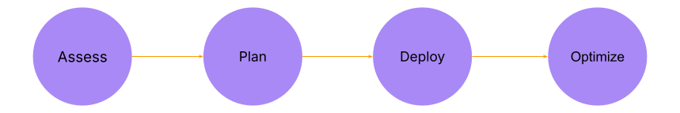

DETAILS:
**Tier:** Free, Premium, Ultimate
**Offering:** GitLab.com, GitLab Self-Managed

This page describes how to analyze your CI/CD build requirements to design, configure,
and validate a GitLab Runner fleet hosted on Google Kubernetes Engine (GKE).

The following diagram illustrates the path of your runner fleet implementation journey.
The guide follows these steps:



You can use this framework to plan a runner deployment for a single group or a GitLab instance that serves your entire organization.

This framework includes the following steps:

1. [Assess the expected CI/CD workloads](#assess-the-expected-cicd-workloads)
1. [Plan the Runner fleet configuration](#plan-the-runner-fleet-configuration)
1. [Deploy the runner on GKE](#deploy-the-runner-on-gke)
1. [Optimize](#optimize)

## Assess the expected CI/CD workloads

In this phase, you gather the CI/CD build requirements of the development teams that you support. If applicable, create an inventory of the programming, scripting, and markup languages that are in use.

You might be supporting multiple development teams, various programming languages,
and build requirements. Start with one team, one project, and one set of CI/CD build
requirements for the first set of in-depth analysis.

To assess expected CI/CD workloads:

- Estimate the CI/CD job demand that you expect to support (hourly, daily, weekly).
- Estimate the CPU and RAM resource requirements for a representative sample CI/CD job for a specific project. These estimates help identify the different profiles you might support. The characteristics of those profiles are important to identify the right GKE Cluster needed to support your requirements. Refer to this example on how to determine the CPU and RAM requirements.
- Determine if you have any security or policy requirements that require you to segment access to certain runners by groups or projects.

### Estimate the CPU and RAM requirements for a CI/CD job

The CPU and RAM resource requirements vary depending on factors like the type of programming language or the type of CI/CD job (build, integration tests, unit tests, security scans). The following section describes a method to gather CI/CD job CPU and resource requirements. You can adopt and build on this approach for your own needs.

For example, to run a CI/CD job similar to the one defined in the FastAPI project fork: [ra-group / fastapi · GitLab](https://gitlab.com/ra-group2/fastapi).
The job in this example uses a Python image, downloads the project's requirements, and runs the existing unit tests.
The `.gitlab-ci.yml` for the job is as follows:

```yaml
tests:
  image: python:3.11.10-bookworm
  parallel: 25
  script:
  - pip install -r requirements.txt
  - pytest
```

To identify the compute and RAM resources needed, use Docker to:

- Create a specific image that uses the FastAPI fork and the CI/CD job script as entrypoint.
- Run a container with the built image and monitor resource usage.

Complete the following steps to identify the compute and RAM resources needed:

1. Create a script file in your project that contains all the CI commands. The script file is named `entrypoint.sh`.

   ```shell
   #!/bin/bash
   cd /fastapi || exit
   pip install -r requirements.txt
   pytest

1. Create a Dockerfile to create an image where the `entrypoint.sh` file runs the CI script.

   ```dockerfile
   FROM python:3.11.10-bookworm
   RUN mkdir /fastapi
   COPY . /fastapi
   RUN chmod +x /fastapi/entrypoint.sh
   CMD [ "bash", "/fastapi/entrypoint.sh" ]
   ```

1. Build the image. To simplify the process, perform all operations such as build, store,
   and run the image locally. This approach eliminates the need of an online registry to pull and push the image.

   ```shell
   ❯ docker build . -t my-project_dir/fastapi:testing
   ...
   Successfully tagged my-project_dir/fastapi:testing
   ```

1. Run a container with the built image and simultaneously monitor the resources usage during the container execution. Create a script named `metrics.sh` with the following command:

   ```shell
   #! /bin/bash

   container_id=$(docker run -d --rm my-project_dir/fastapi:testing)

   while true; do
       echo "Collecting metrics..."
       metrics=$(docker stats --no-trunc --no-stream --format "table {{.ID}}\t{{.CPUPerc}}\t{{.MemUsage}}" | grep "$container_id")
       if [ -z "$metrics" ]; then
           exit 0
       fi
       echo "Saving metrics..."
       echo "$metrics" >> metrics.log
       sleep 1
   done
   ```

   This script runs a detached container with the image built. The container ID is then used to collect its `CPU` and `Memory` usage until the container exits upon successful completion. The metrics collected are saved in a file called `metrics.log`.

   NOTE:
   In the example, the CI/CD job is short-lived, so the sleep between each container poll is set to one second. Adjust this value to better suit your needs.

1. Analyze the `metrics.log` file to identify the peak usage of the test container.

   In the example, the maximum CPU usage is `107.50%` and the maximum memory usage is `303.1Mi`.

   ```log
   223e93dd05c6   94.98%    83.79MiB / 15.58GiB
   223e93dd05c6   28.27%    85.4MiB / 15.58GiB
   223e93dd05c6   53.92%    121.8MiB / 15.58GiB
   223e93dd05c6   70.73%    171.9MiB / 15.58GiB
   223e93dd05c6   20.78%    177.2MiB / 15.58GiB
   223e93dd05c6   26.19%    180.3MiB / 15.58GiB
   223e93dd05c6   77.04%    224.1MiB / 15.58GiB
   223e93dd05c6   97.16%    226.5MiB / 15.58GiB
   223e93dd05c6   98.52%    259MiB / 15.58GiB
   223e93dd05c6   98.78%    303.1MiB / 15.58GiB
   223e93dd05c6   100.03%   159.8MiB / 15.58GiB
   223e93dd05c6   103.97%   204MiB / 15.58GiB
   223e93dd05c6   107.50%   207.8MiB / 15.58GiB
   223e93dd05c6   105.96%   215.7MiB / 15.58GiB
   223e93dd05c6   101.88%   226.2MiB / 15.58GiB
   223e93dd05c6   100.44%   226.7MiB / 15.58GiB
   223e93dd05c6   100.20%   226.9MiB / 15.58GiB
   223e93dd05c6   100.60%   227.6MiB / 15.58GiB
   223e93dd05c6   100.46%   228MiB / 15.58GiB
   ```

### Analyzing the metrics collected

Based on the metrics collected, for this job profile, you can limit the Kubernetes executor job to
`1 CPU` and `~304 Mi of Memory`. Even if this conclusion is accurate, it might not be practical for all use cases.

If you use a cluster with a node pool of three `e2-standard-4` nodes to run jobs, the `1 CPU` limit allows only **12 jobs** to run simultaneously (an `e2-standard-4`  node has **4 vCPU** and **16 GB** of memory). Additional jobs wait for the running jobs to complete and free up the resources before starting.

The memory requested is critical because Kubernetes terminates any pod that uses more memory than the limit set or available on the cluster. However, the CPU limit is more flexible but impacts the job duration. A lower CPU limit set increases the time it takes for a job to complete. In the above example, setting the CPU limit to `250m` (or `0.25`) instead `1` increased the job duration by four times (from about two minutes to eight to ten minutes).

As the metrics collection method uses a polling mechanism, you should round up the maximum usage identified. For example, instead of `303 Mi` for the memory usage, round it to `400 Mi`.

Important considerations for the above example:

- The metrics above were collected on the local machine, which doesn't have the same CPU configuration than a Google Kubernetes Engine Cluster. However, these metrics were validated by monitoring them on a Kubernetes cluster with an `e2-standard-4` node.
- To get an accurate representation of those metrics, run the tests described in the [Assess phase](#assess-the-expected-cicd-workloads) on a Google Compute Engine VM.

## Plan the runner fleet configuration

In the planning phase, map out the right runner fleet configuration for your organization. Consider the runner scope (instance, group, project) and the Kubernetes cluster configuration based on:

- Your assessment of the CI/CD job resource demand
- Your inventory of CI/CD job types

### Runner scope

To plan runner scope, consider the following questions:

- Do you want project owners and group owners to create and manage their own runners?

  - By default, project and group owners can create runner configuration and register runners to a project or group in GitLab.
  - This design makes it easy for developers to create a build environment. This approach reduces developer friction when getting started with GitLab CI. However, in large organizations, this approach may lead to many underutilized or unused runners across the environment.

- Does your organization have security or other policies that require segmenting access to certain types of runners to specific groups or projects?

The most straightforward way to deploy a runner in a GitLab Self-Managed environments is to create it for an instance. Runners scoped for an instance are available to all groups and projects by default.

If you are able to meet all your organization's needs with instance runners, then this deployment pattern is the most efficient pattern. It ensures that you can operate a CI/CD build fleet at scale efficiently and cost effectively.

If there are requirements to segment access to specific runners to certain groups or projects, incorporate those into your planning process.

#### Example runner fleet configuration - Instance runners

The configuration in the table demonstrates the flexibility available when configuring a runner fleet for your organization. This example uses multiple runners with different instance sizes and different job tags. These runners enables you to support different types of CI/CD jobs, each with specific CPU and RAM resource requirements. However, it may not be the most efficient pattern when using Kubernetes.

| Runner Type | Runner Tag | Scope | Count of Runner type to offer | Runner Worker Specification | Runner Host Environment | Environment Configuration |
| :---- | :---- | :---- | :---- | :---- | :---- | :---- |
| Instance | ci-runner-small | Available to run CI/CD jobs for all groups and projects by default. | 5 | 2 vCPU, 8GB RAM | Kubernetes | → 3 nodes <br> → Runner worker compute node \= **e2-standard-2**  |
| Instance | ci-runner-medium | Available to run CI/CD jobs for all groups and projects by default. | 2 | 4 vCPU, 16GB RAM | Kubernetes | → 3 nodes <br> → Runner worker compute node \= **e2-standard-4**   |
| Instance | ci-runner-large | Available to run CI/CD jobs for all groups and projects by default. | 1 | 8 vCPU, 32GB RAM | Kubernetes | → 3 nodes <br> → Runner worker compute node \= **e2-standard-8**   |

In the runner fleet configuration example, there are a total of three runner configurations and eight runners actively running CI/CD jobs.

With the Kubernetes executor, you can use the Kubernetes scheduler and overwrite container resources.
In theory, you can deploy a single GitLab Runner on a Kubernetes cluster with adequate resources. You
can then overwrite container resources to select the appropriate compute type for each CI/CD job.
Implementing this pattern reduces the number of separate runner configurations you need to deploy and operate.

### Best practices

- Always dedicate a node pool to the runner managers.
  - Log processing and cache or artifacts management can be CPU intensive.
- Always set a default limit (CPU/Memory for Build/Helper/Service containers) in the `config.toml` file.
- Always allow maximum overwrite for the resources in the `config.toml` file.
- In the job definition (`.gitlab-ci.yml`), specify the right limit needed by the jobs.
  - If not specified, the default values set in the `config.toml` file is used.
  - If a container exceeds its memory limit, the system automatically terminates it using the Out of Memory (OOM) kill process.
- Use the feature flags `FF_RETRIEVE_POD_WARNING_EVENTS` and `FF_PRINT_POD_EVENTS`. For more details, see the [feature flags documentation](https://docs.gitlab.com/runner/configuration/feature-flags.html).

## Deploy the runner on GKE

When you are ready to install GitLab Runner on a Google Kubernetes cluster, you have many options. If you have created your cluster on GKE, you can use either the GitLab Runner Helm Chart or Operator to install the runner on the cluster.

If you are yet to set up the cluster on GKE, GitLab provides the GitLab Runner Infrastructure Toolkit (GRIT) which simultaneously:

- Create a multi node pool GKE cluster: **Standard Edition** and **Standard Mode**.
- Install GitLab Runner on the cluster using the GitLab Runner Kubernetes operator

The following example uses GRIT to deploy the Google Kubernetes cluster and GitLab Runner Manager.

To have the cluster and GitLab Runner well configured, consider the following information:

- **How many job types do I need to cover?** This information comes from the assess phase. The assess phase aggregates metrics and identifies the number of resulting groups, considering organizational constraints. A **job type** is a collection of categorized jobs identified during the access phase. This categorization is based on the maximum resources needed by the job.
- **How many GitLab Runner Managers do I need to run?** This information comes from the plan phase. If the organization manages projects separately, apply this framework to each project individually. This approach is relevant only when multiple job profiles are identified (for the entire organization or for a specific project), and they are all handled by an individual or a fleet of GitLab Runners. A basic configuration typically uses one GitLab Runner Manager per GKE cluster.
- **What is the estimated max concurrent CI/CD jobs?** This information represents an estimate of the maximum number of concurrent CI/CD jobs that are run at any point in time. This information is needed when configuring the GitLab Runner Manager by providing how long it waits during the `Prepare` stage: job pod scheduling on a node with limited available resources.

### Real life applications for the FastAPI fork

For the FastAPI, consider the following information:

- **How many job profiles do I need to cover?** We only have one job profile with the following characteristics: `1 CPU` and `303 Mi` of memory. As explained in [Analyzing the metrics collected](#analyzing-the-metrics-collected) sections, we change those raw values to the following:
  - `400 Mi` for the memory limit instead of `303 Mi` to avoid any job failure due to the memory limits.
  - `0.20` for the CPU instead of `1 CPU`. We don’t mind our job taking more time to complete. We prioritize accuracy and quality over speed when completing tasks.
- **How many GitLab Runner Managers do I need to run?** Only one GitLab Runner Manager is enough for our tests.
- **What is the expected Workload?** We want to be able to run up to 20 jobs simultaneously at any time.

Based on these inputs, any GKE Cluster with the following minimum characteristics should be enough:

- Minimum CPU: **(0.20 + helper_cpu_usage) * number_of_jobs_simultaneously**. In our example, we get **7 vCPU** with the limit for the helper container set to **0.15 CPU**.
- Minimum Memory: **(400Mi + helper_memory_usage) * number_of_jobs_simultaneously**. In our example, we get at least **10 Gi** with the limit for the helper set to **100 Mi**.

Other characteristics such as the minimum storage required should also be considered. However, we don't into consideration in the example.

Possible configurations for our GKE cluster can be (both configuration allows to run more than **20 jobs** simultaneously):

- GKE Cluster with a node pool of `3 e2-standard-4` nodes for a total of `12 vCPU` and `48 GiB` of memory
- GKE Cluster with a node pool of only on `e2-standard-8` nodes for a total of `8 vCPU` and `32 GiB` of memory

For the sake of our example, we use the first configuration. To prevent the GitLab Runner Manager log processing from impacting the overall log processing, use a dedicated node pool where GitLab Runner is installed.

#### GKE GRIT configuration

The resulting GKE configuration for GRIT looks similar to this:

```terraform
google_project     = "GCLOUD_PROJECT"
google_region      = "GCLOUD_REGION"
google_zone        = "GCLOUD_ZONE"
name               = "my-grit-gke-cluster"
node_pools = {
  "runner-manager" = {
    node_count = 1,
    node_config = {
      machine_type = "e2-standard-2",
      image_type   = "cos_containerd",   #Linux OS container only. Change to windows_ltsc_containerd for Windows OS container
      disk_size_gb = 50,
      disk_type    = "pd-balanced",
      labels = {
        "app" = "gitlab-runner",
      }
    },
  },
  "worker-pool" = {
    node_count = 3,
    node_config = {
      machine_type = "e2-standard-4",    #4vCPU, 16GB each
      image_type   = "cos_containerd",   #Linux OS container only. Change to windows_ltsc_containerd for Windows OS container
      disk_size_gb = 150,
      disk_type    = "pd-balanced",
      labels = {
        "app" = "gitlab-runner-job"
      }
    },
  },
}
```

In the configuration above:

- The `runner-manager` block refers to the node pool where GitLab Runner is installed. In our example, a `e2-standard-2` is more than enough.
- The labels sections in the `runner-manager` block is useful when installing GitLab Runner on GitLab. A node selector is configured through the operator configuration to make sure that GitLab Runner is installed on a node of this node pool.
- The `worker-pool` block refers to the node pool where the CI/CD job pod is created. The configuration provided creates a node pool of `3 e2-standard-4` nodes labeled `"app" = "gitlab-runner-job"` to host the job pod.
- The `image_type` parameter can be used to set the image used by the nodes. It can be set to `windows_ltsc_containerd` if your workload relies mostly on Windows image.

Here is an illustration of this configuration:


#### GitLab Runner GRIT configuration

The resulting GitLab Runner configuration for GRIT looks similar to this:

```terraform
gitlab_pat         = "glpat-REDACTED"
gitlab_project_id  = GITLAB_PROJECT_ID
runner_description = "my-grit-gitlab-runner"
runner_image       = "registry.gitlab.com/gitlab-org/ci-cd/gitlab-runner-ubi-images/gitlab-runner-ocp:amd64-v17.3.1"
helper_image       = "registry.gitlab.com/gitlab-org/ci-cd/gitlab-runner-ubi-images/gitlab-runner-helper-ocp:x86_64-v17.3.1"
concurrent     = 20
check_interval = 1
runner_tags    = ["my-custom-tag"]
config_template    = <<EOT
[[runners]]
  name = "my-grit-gitlab-runner"
  shell = "bash"
  environment = [
    "FF_RETRIEVE_POD_WARNING_EVENTS=true",
    "FF_PRINT_POD_EVENTS=true",
  ]
  [runners.kubernetes]
    image = "alpine"
    cpu_limit = "0.25"
    memory_limit = "400Mi"
    helper_cpu = "150m"
    helper_memory = "150Mi"
    cpu_limit_overwrite_max_allowed = "0.25"
    memory_limit_overwrite_max_allowed = "400Mi"
    helper_cpu_limit_overwrite_max_allowed = "150m"
    helper_memory_limit_overwrite_max_allowed = "150Mi"
  [runners.kubernetes.node_selector]
    "app" = "gitlab-runner-job"
EOT
pod_spec = [
  {
    name      = "selector",
    patchType = "merge",
    patch     = <<EOT
nodeSelector:
  app: "gitlab-runner"
EOT
  }
]
```

In the configuration above:

- The `pod_spec` parameter allows us to set a node selector for the pod running GitLab Runner. In the configuration, the node selector is set to `"app" = "gitlab-runner"` to ensure that GitLab Runner is installed on the runner-manager node pool.
- The `config_template` parameters provides a default limit for all jobs run by the GitLab Runner Manager. It also allows an overwrite of those limits as long as the value set is not greater than the default values.
- The feature flags `FF_RETRIEVE_POD_WARNING_EVENTS` and `FF_PRINT_POD_EVENTS`are also set to ease debugging in the event of a job failure. See the [feature flag documentation](https://docs.gitlab.com/runner/configuration/feature-flags.html) for more details.

### Real life applications for a hypothetical use case

Take the following information in to consideration:

- **How many job profiles do I need to cover?** Two profiles (specifications provided takes the helper limits in account):
  - Medium jobs: `300m CPU` and `200 MiB`
  - CPU-intensive jobs: `1 CPU` and `1 GiB`
- **How many GitLab Runner Managers do I need to run?** One.
- **What is the expected Workload?**
  - Up to **50 medium** jobs simultaneously
  - Up to **25 CPU-intensive** jobs simultaneously

#### GKE configuration

- Needs for medium jobs:
  - CPU: 300m * 50 = 5 CPU (approximate)
  - Memory: 200 MiB * 50 = 10 GiB
- Needs for CPU-intensive jobs:
  - CPU: 1 * 25 = 25
  - Memory: 1 GiB * 25 = 25 GiB

The GKE cluster should have:

- A node pool for GitLab Runner Manager (let's consider that the log processing is not demanding): **1 e2-standard-2** node
- A node pool for medium jobs: **3 e2-standard-4** nodes
- A node pool for CPU-intensive jobs: **1 e2-highcpu-32** node (`32 vCPU` and `32 GiB` Memory)

```terraform
google_project     = "GCLOUD_PROJECT"
google_region      = "GCLOUD_REGION"
google_zone        = "GCLOUD_ZONE"
name               = "my-grit-gke-cluster"
node_pools = {
  "runner-manager" = {
    node_count = 1,
    node_config = {
      machine_type = "e2-standard-2",
      image_type   = "cos_containerd",   #Linux OS container only. Change to windows_ltsc_containerd for Windows OS container
      disk_size_gb = 50,
      disk_type    = "pd-balanced",
      labels = {
        "app" = "gitlab-runner",
      }
    },
  },
  "medium-pool" = {
    node_count = 3,
    node_config = {
      machine_type = "e2-standard-4",    #4vCPU, 16GB each
      image_type   = "cos_containerd",   #Linux OS container only. Change to windows_ltsc_containerd for Windows OS container
      disk_size_gb = 150,
      disk_type    = "pd-balanced",
      labels = {
        "app" = "gitlab-runner-job"
      }
    },
  },
  "cpu-intensive-pool" = {
    node_count = 1,
    node_config = {
      machine_type = "e2-highcpu-32", #32vCPU, 32GB each
      image_type   = "cos_containerd",
      disk_size_gb = 150,
      disk_type    = "pd-balanced",
      labels = {
        "app" = "gitlab-runner-job"
      }
    },
  },
}
```

#### GitLab Runner configuration

The current implementation of GRIT doesn’t allow the installation of more than one runner at the time. The `config_template` provided doesn't set configurations like `node_selection` and other limits, as done in the previous example. A simple configuration allows the maximum allowed overwrite value for CPU-intensive jobs and sets the correct values in the `.gitlab-ci.yml` file. The resulting GitLab Runner configuration looks similar to this:

```terraform
gitlab_pat         = "glpat-REDACTED"
gitlab_project_id  = GITLAB_PROJECT_ID
runner_description = "my-grit-gitlab-runner"
runner_image       = "registry.gitlab.com/gitlab-org/ci-cd/gitlab-runner-ubi-images/gitlab-runner-ocp:amd64-v17.3.1"
helper_image       = "registry.gitlab.com/gitlab-org/ci-cd/gitlab-runner-ubi-images/gitlab-runner-helper-ocp:x86_64-v17.3.1"
concurrent     = 100
check_interval = 1
runner_tags    = ["my-custom-tag"]
config_template    = <<EOT
[[runners]]
  name = "my-grit-gitlab-runner"
  shell = "bash"
  environment = [
    "FF_RETRIEVE_POD_WARNING_EVENTS=true",
    "FF_PRINT_POD_EVENTS=true",
  ]
  [runners.kubernetes]
    image = "alpine"
    cpu_limit_overwrite_max_allowed = "0.75"
    memory_limit_overwrite_max_allowed = "900Mi"
    helper_cpu_limit_overwrite_max_allowed = "250m"
    helper_memory_limit_overwrite_max_allowed = "100Mi"
EOT
pod_spec = [
  {
    name      = "selector",
    patchType = "merge",
    patch     = <<EOT
nodeSelector:
  app: "gitlab-runner"
EOT
  }
]
```

The `.gitlab-ci.yml` file looks similar to this:

- For medium jobs:

```yaml
variables:
  KUBERNETES_CPU_LIMIT: "200m"
  KUBERNETES_MEMORY_LIMIT: "100Mi"
  KUBERNETES_HELPER_CPU_LIMIT: "100m"
  KUBERNETES_HELPER_MEMORY_LIMIT: "100Mi"

tests:
  image: some-image:latest
  script:
  - command_1
  - command_2
...
  - command_n
  tags:
    - my-custom-tag
```

- For CPU-intensive jobs:

```yaml
variables:
  KUBERNETES_CPU_LIMIT: "0.75"
  KUBERNETES_MEMORY_LIMIT: "900Mi"
  KUBERNETES_HELPER_CPU_LIMIT: "150m"
  KUBERNETES_HELPER_MEMORY_LIMIT: "100Mi"

tests:
  image: custom-cpu-intensive-image:latest
  script:
  - cpu_intensive_command_1
  - cpu_intensive_command_2
...
  - cpu_intensive_command_n
  tags:
    - my-custom-tag
```

NOTE:
For an easier configuration, use one GitLab Runner per cluster for job profile. This approach is recommended until GitLab supports either multiple GitLab Runner installations on the same cluster or multiple `[[runners]]` section in the `config.toml` template.

### Set up monitoring and observability

As a final step in the deployment phase, you must establish a solution to monitor the runner host environment and GitLab Runner. The infrastructure level, runner, and CI/CD job metrics provide insights into the efficiency and reliability of your CI/CD build infrastructure. They also provides the insight needed to tune and optimize the Kubernetes cluster, GitLab Runner, and CI/CD job configuration.

#### Monitoring best practices

- Monitor job level metrics: job duration, job success and failure rates.
  - To analyze the job-level metrics, understand which CI/CD jobs are run most frequently and consume the most compute and RAM resources in aggregate. This job profile is a good starting point for evaluating optimization opportunities.
- Monitor the Kubernetes cluster resource utilization:
  - CPU utilization
  - Memory utilization
  - Network utilization
  - Disk utilization

See the [Dedicated GitLab Runner monitoring page](https://docs.gitlab.com/runner/monitoring/index.html) for more details on how to proceed.

## Optimize

Optimizing a CI/CD build environment is an ongoing process. The type and volume of CI/CD jobs are constantly evolving, requiring your active engagement.

You likely have specific organizational goals for CI/CD and CI/CD build infrastructure. Therefore, the first step is to define your optimization requirements and quantifiable objectives.

The following is an example set of optimization requirements from across our customer base:

- CI/CD job startup times
- CI/CD job duration
- CI/CD job reliability
- CI/CD compute cost optimization

The next step is to start analyzing the CI/CD metrics in conjunction with the infrastructure metrics for the Kubernetes cluster. A critical correlation to analyze is as follows:

- CPU utilization by Kubernetes namespace
- Memory utilization by Kubernetes namespace
- CPU utilization by node
- Memory utilization by node
- CI/CD job failure rates

Typically on Kubernetes, high CI/CD job failure rates (independent of failures due to flaky tests) are attributed to resource constraints on the Kubernetes cluster. Analyze these metrics to achieve the optimal balance of CI/CD job start times, job duration, job reliability, and infrastructure resource utilization in your Kubernetes cluster configuration.

### Best practices

- Establish a process to categorize CI/CD jobs across your organization by job type.
- Establish a job type categorization framework to simplify both monitoring configuration and approach to optimization of the GitLab CI/CD build infrastructure on Kubernetes and the CI/CD job type.
- Assigning each job type its own node on the cluster might result in the best balance of CI/CD job performance, job reliability and infrastructure utilization.

Using Kubernetes as the infrastructure stack for the CI/CD build environment offers significant benefits. However, it require continuous monitoring and optimization of the Kubernetes infrastructure. After you establish an observability and optimization framework, you can support millions of CI/CD jobs per month. You can eliminate resource contention, achieve deterministic CI/CD job runs, and optimal resource usage. These improvements result in operational efficiency and cost optimization.

## Next steps

Take the next steps to provide a better user experience:

- Support for multiple GitLab Runner installations on the same cluster. This enables a better management of scenarios where multiple job profiles should be handled (the GitLab Runner can be adequately configured to prevent any misused of the resources).
- Support for GKE node autoscaling. This allows GKE to scale up and down according to the workload, thus saving money.
- Enable jobs metrics monitoring. This enables admins to better optimize their cluster and GitLab Runner based on actual usage.
