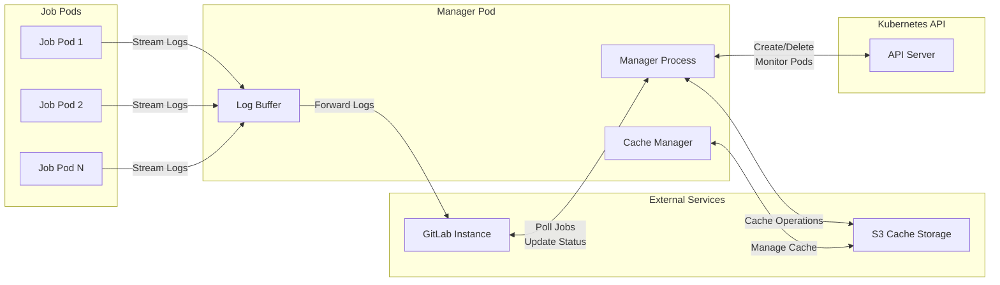
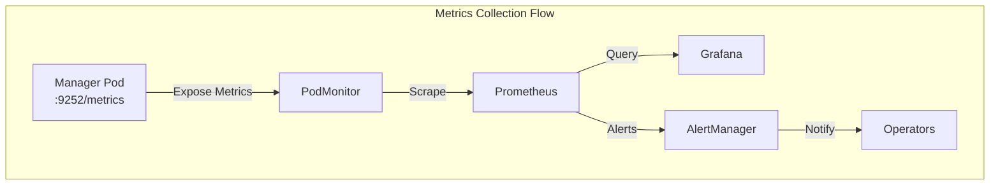
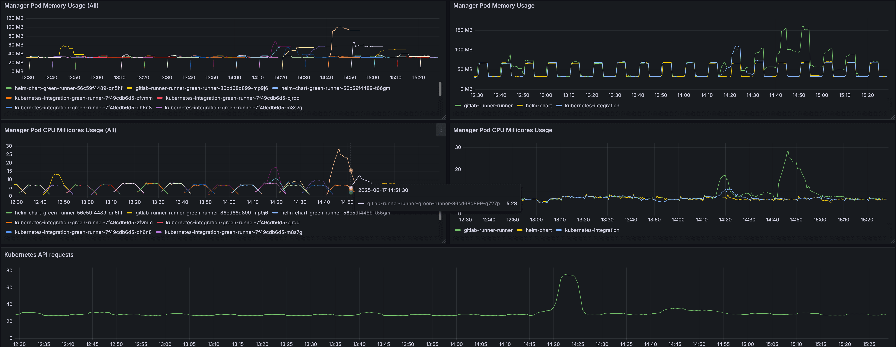
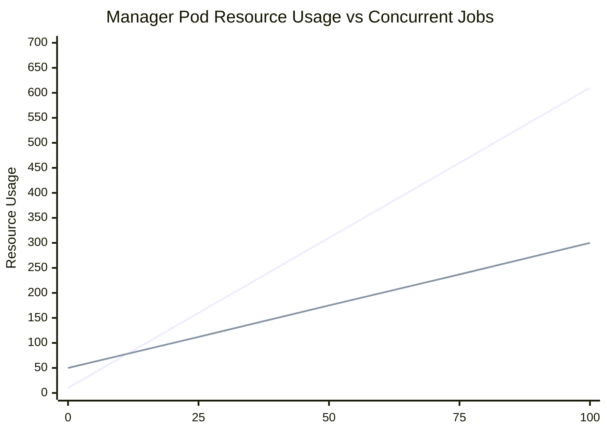
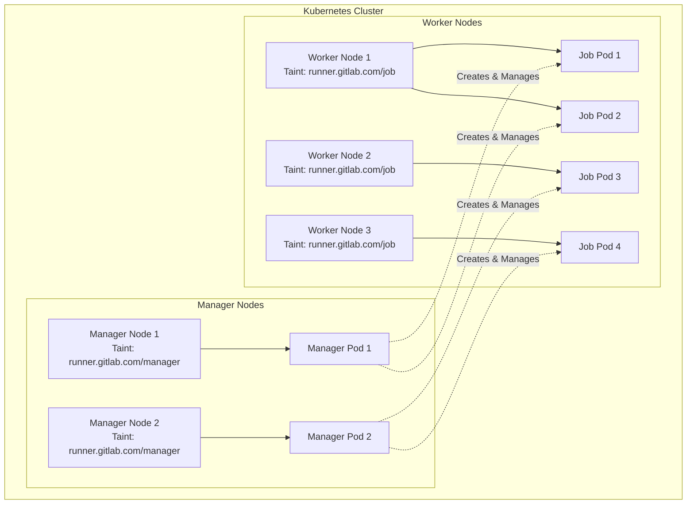



- Tier: Free, Premium, Ultimate
- Offering: GitLab.com, GitLab Self-Managed, GitLab Dedicated



To monitor and optimize GitLab Runner manager pod performance in Kubernetes environments, GitLab recommends
the following best practices. Apply them to identify performance bottlenecks and implement solutions for
optimal CI/CD pipeline execution.

## Prerequisites

Before you implement these recommendations:

- Deploy GitLab Runner in Kubernetes using the [Kubernetes executor](https://docs.gitlab.com/runner/executors/kubernetes/)
- Have administrator access to your Kubernetes cluster
- Configure [Prometheus monitoring](../../administration/monitoring/_index.md) for GitLab Runner
- Have basic understanding of Kubernetes resource management

## GitLab Runner manager pod responsibilities

The GitLab Runner manager pod coordinates all CI/CD job execution in Kubernetes.
Its performance directly impacts your pipeline efficiency.

It handles:

- **Log processing**: Collects and forwards job logs from worker pods to GitLab
- **Cache management**: Coordinates local and cloud-based caching operations
- **Kubernetes API requests**: Creates, monitors, and deletes worker pods
- **GitLab API communication**: Polls for jobs and reports status updates
- **Pod lifecycle management**: Manages worker pod provisioning and cleanup



Each responsibility affects performance differently:

- **CPU intensive**: Kubernetes API operations, log processing
- **Memory intensive**: Log buffering, job queue management
- **Network intensive**: GitLab API communication, log streaming

## Deploy GitLab Runner in Kubernetes

Install GitLab Runner through the [GitLab Runner Operator](https://gitlab.com/gitlab-org/gl-openshift/gitlab-runner-operator).
The Operator actively receives new features and improvements.
The GitLab Runner team installs the Operator through the
[Experimental GRIT framework](https://gitlab.com/gitlab-org/ci-cd/runner-tools/grit/-/tree/main/scenarios/google/gke/operator?ref_type=heads).

The easiest way to install GitLab Runner in Kubernetes is to apply the
[`operator.k8s.yaml` manifest from the latest release](https://gitlab.com/gitlab-org/gl-openshift/gitlab-runner-operator/-/releases)
and then follow the instructions in the [Operator install documentation](https://docs.gitlab.com/runner/install/operator/#install-on-kubernetes).

## Configure monitoring

Observability is critical for GitLab Runner administration in Kubernetes because
pods are ephemeral and metrics provide the primary operational visibility.

For monitoring, install [`kube-prometheus-stack`](https://github.com/prometheus-community/helm-charts/blob/main/charts/kube-prometheus-stack/README.md).

To configure monitoring for the Operator, see [Monitor GitLab Runner Operator](https://docs.gitlab.com/runner/monitoring#monitor-gitlab-runner-operator).

## Performance monitoring

Effective monitoring is crucial for maintaining optimal manager pod performance.



### Key performance metrics

Monitor these essential metrics:

| Metric                                             | Description                      | Performance Indicator |
| -------------------------------------------------- | -------------------------------- | --------------------- |
| `gitlab_runner_jobs`                               | Current running jobs             | Job queue saturation  |
| `gitlab_runner_limit`                              | Configured job concurrency limit | Capacity utilization  |
| `gitlab_runner_request_concurrency_exceeded_total` | Requests above concurrency limit | API throttling        |
| `gitlab_runner_errors_total`                       | Total caught errors              | System stability      |
| `container_cpu_usage_seconds_total`                | Container CPU usage              | Resource consumption  |
| `container_memory_working_set_bytes`               | Container memory usage           | Memory pressure       |

### Prometheus queries

Track manager pod performance with these queries:

```prometheus
# Manager pod memory usage in MB
container_memory_working_set_bytes{pod=~"gitlab-runner.*"} / 1024 / 1024

# Manager pod CPU utilization in Millicores
rate(container_cpu_usage_seconds_total{pod=~"gitlab-runner.*"}[5m]) * 1000

# Job queue saturation
gitlab_runner_jobs / gitlab_runner_limit

# Jobs per runner
gitlab_runner_jobs

# API request rate
sum(rate(apiserver_request_total[5m]))
```

### Example dashboard

The following dashboard shows Manager Pod utilization across all pods using the Prometheus queries described previously:



This dashboard can help you visualize:

- Memory usage trends across manager pods
- CPU utilization patterns during job execution
- Job queue saturation levels
- Individual pod resource consumption

## Identify overloaded manager pods

Recognize performance degradation before it impacts your pipelines.

### Resource utilization indicators

By default, GitLab Runner Operator does not apply CPU or memory limits to manager pods.

To set resource limits:

```shell
kubectl patch deployment gitlab-runner -p '{"spec":{"template":{"spec":{"containers":[{"name":"gitlab-runner","resources":{"requests":{"cpu":"500m","memory":"256Mi"},"limits":{"cpu":"1000m","memory":"512Mi"}}}]}}}}'
```



The feature to allow deployment patching from the Operator configuration is under development.
For more information, see [merge request 197](https://gitlab.com/gitlab-org/gl-openshift/gitlab-runner-operator/-/merge_requests/197).



**High CPU usage patterns:**

- CPU consistently above 70% during standard operations
- CPU spikes exceeding 90% during job creation
- Sustained high CPU without corresponding job activity

**Memory consumption trends:**

- Memory usage above 80% of allocated limits
- Continuous memory growth without workload increase
- Out-of-memory (OOM) events in manager pod logs

### Performance degradation signs

Watch for these operational symptoms:

- Jobs remaining pending longer than usual
- Pod creation times exceeding 30 seconds
- Delayed log output in GitLab job interfaces
- `etcdserver: request timed out` errors in logs

### Diagnostic commands

```shell
# Current resource usage
kubectl top pods --containers

> POD                                                 NAME              CPU(cores)   MEMORY(bytes)
> gitlab-runner-runner-86cd68d899-m6qqm               runner            7m           32Mi

# Check for performance errors
kubectl logs gitlab-runner-runner-86cd68d899-m6qqm --since=2h | grep -E "(error|timeout|failed)"
```

## Resource configuration

Proper resource configuration is essential for optimal performance.

### Performance testing methodology

GitLab Runner Manager Pod performance is tested using a job that maximizes log output:

<details>
<summary>Performance test job definition</summary>

```yaml
performance_test:
  stage: build
  timeout: 30m
  tags:
    - kubernetes_runner
  image: alpine:latest
  parallel: 100
  variables:
    FILE_SIZE_MB: 4
    CHUNK_SIZE_BYTES: 1024
    FILE_NAME: "test_file_${CI_JOB_ID}_${FILE_SIZE_MB}MB.dat"
    KUBERNETES_CPU_REQUEST: "200m"
    KUBERNETES_CPU_LIMIT: "200m"
    KUBERNETES_MEMORY_REQUEST: "200Mi"
    KUBERNETES_MEMORY_LIMIT: "200Mi"
  script:
    - echo "Starting performance test job ${CI_PARALLEL_ID}/${CI_PARALLEL_TOTAL} with ${FILE_SIZE_MB}MB file size, ${CHUNK_SIZE_BYTES} bytes chunk size"
    - dd if=/dev/urandom of="${FILE_NAME}" bs=1M count=${FILE_SIZE_MB}
    - echo "File generated successfully. Size:"
    - ls -lh "${FILE_NAME}"
    - echo "Reading file in ${CHUNK_SIZE_BYTES} byte chunks"
    - |
      TOTAL_SIZE=$(stat -c%s "${FILE_NAME}")
      BLOCKS=$((TOTAL_SIZE / CHUNK_SIZE_BYTES))
      echo "Processing $BLOCKS blocks of $CHUNK_SIZE_BYTES bytes each"
      for i in $(seq 0 99 $BLOCKS); do
        echo "Processing blocks $i to $((i+99))"
        dd if="${FILE_NAME}" bs=${CHUNK_SIZE_BYTES} skip=$i count=100 2>/dev/null | xxd -l $((CHUNK_SIZE_BYTES * 100)) -c 16
        sleep 0.5
      done
```

</details>

This test generates 4 MB of log output per job, which reaches the default
[`output_limit`](https://docs.gitlab.com/runner/configuration/advanced-configuration/#the-runners-section)
to stress test the manager pod's log processing capabilities.

**Test results:**

| Parallel Jobs | Peak CPU Usage | Peak Memory Usage |
| ------------- | -------------- | ----------------- |
| 50            | 308m           | 261 MB            |
| 100           | 657m           | 369 MB            |



**Key findings:**

- CPU usage scales approximately linearly with concurrent jobs
- Memory usage increases with job count but not linearly
- All jobs run concurrently without queuing

### CPU requirements

Based on GitLab performance testing, calculate manager pod CPU requirements:

Manager pod CPU = Base CPU + (Concurrent jobs × CPU per job factor)

Where:

- Base CPU: 10m (baseline overhead)
- CPU per job factor: ~6m per concurrent job (based on testing)

**Examples based on test results:**

For 50 concurrent jobs:

```yaml
resources:
  requests:
    cpu: "310m" # 10m + (50 × 6m) = 310m
  limits:
    cpu: "465m" # 50% headroom for burst traffic
```

For 100 concurrent jobs:

```yaml
resources:
  requests:
    cpu: "610m" # 10m + (100 × 6m) = 610m
  limits:
    cpu: "915m" # 50% headroom
```

### Memory requirements

Based on GitLab testing, calculate memory requirements:

Manager pod memory = Base memory + (Concurrent jobs × Memory per job)

Where:

- Base memory: 50 MB (baseline overhead)
- Memory per job: ~2.5 MB per concurrent job (with 4MB log output)

**Examples based on test results:**

For 50 concurrent jobs:

```yaml
resources:
  requests:
    memory: "175Mi" # 50 + (50 × 2.5) = 175 MB
  limits:
    memory: "350Mi" # 100% headroom
```

For 100 concurrent jobs:

```yaml
resources:
  requests:
    memory: "300Mi" # 50 + (100 × 2.5) = 300 MB
  limits:
    memory: "600Mi" # 100% headroom
```



Memory usage varies significantly based on log volume. Jobs producing more than
4 MB of logs require proportionally more memory.



### Configuration examples

**Small-scale (1-20 concurrent jobs):**

```yaml
resources:
  limits:
    cpu: 300m
    memory: 256Mi
  requests:
    cpu: 150m
    memory: 128Mi

runners:
  config: |
    concurrent = 20

    [[runners]]
      limit = 20
      request_concurrency = 5
```

**Large-scale (75+ concurrent jobs):**

```yaml
resources:
  limits:
    cpu: 1000m
    memory: 1Gi
  requests:
    cpu: 600m
    memory: 600Mi

runners:
  config: |
    concurrent = 150

    [[runners]]
      limit = 150
      request_concurrency = 20
```

### Horizontal pod autoscaler

Configure automatic scaling:

```yaml
apiVersion: autoscaling/v2
kind: HorizontalPodAutoscaler
metadata:
  name: gitlab-runner-hpa
spec:
  scaleTargetRef:
    apiVersion: apps/v1
    kind: Deployment
    name: gitlab-runner
  minReplicas: 2
  maxReplicas: 5
  metrics:
    - type: Resource
      resource:
        name: cpu
        target:
          type: Utilization
          averageUtilization: 70
    - type: Resource
      resource:
        name: memory
        target:
          type: Utilization
          averageUtilization: 80
```

## Troubleshoot performance issues

Address common manager pod performance problems with these solutions.

### API rate limiting

**Problem:** Manager pod exceeds Kubernetes API rate limits.

**Solution:** Optimize API polling:

```toml
[[runners]]
  [runners.kubernetes]
    poll_interval = "5s"  # Increase from default 3s
    poll_timeout = "180s"
    use_informer = true  # GitLab Runner 17.9+
```

## Performance optimization

Apply these performance optimization strategies for challenging scenarios.

### Cache optimization

Configure distributed caching to reduce manager pod load. This action reduces computation
required for job pods by sharing cached files:

```toml
[runners.cache]
  Type = "s3"
  Shared = true

  [runners.cache.s3]
    ServerAddress = "cache.example.com"
    BucketName = "gitlab-runner-cache"
    PreSignedURLDisabled = false
```

## Node segregation

Segregate manager pods from job pods by using dedicated nodes to ensure stable
performance and prevent resource contention. This isolation prevents job pods
from disrupting critical manager pod operations.



### Configure node taints

**For manager nodes:**

```shell
# Taint nodes dedicated to Manager Pods
kubectl taint nodes <manager-node-name> runner.gitlab.com/manager=:NoExecute

# Label nodes for easier selection
kubectl label nodes <manager-node-name> runner.gitlab.com/workload-type=manager
```

**For worker nodes:**

```shell
# Taint nodes dedicated to job pods
kubectl taint nodes <worker-node-name> runner.gitlab.com/job=:NoExecute

# Label nodes for job scheduling
kubectl label nodes <worker-node-name> runner.gitlab.com/workload-type=job
```

### Configure manager pod scheduling

Update the GitLab Runner Operator configuration to schedule manager pods only on dedicated nodes:

```yaml
apiVersion: apps.gitlab.com/v1beta2
kind: Runner
metadata:
  name: gitlab-runner
spec:
  gitlabUrl: https://gitlab.example.com
  token: gitlab-runner-secret
  buildImage: alpine
  podSpec:
    name: "manager-node-affinity"
    patch: |
      {
        "spec": {
          "nodeSelector": {
            "runner.gitlab.com/workload-type": "manager"
          },
          "tolerations": [
            {
              "key": "runner.gitlab.com/manager",
              "operator": "Exists",
              "effect": "NoExecute"
            }
          ]
        }
      }
    patchType: "strategic"
```

### Configure job pod scheduling

Ensure job pods run only on worker nodes by updating `config.toml`.

```toml
[runners.kubernetes.node_selector]
"runner.gitlab.com/workload-type" = "job"

[runners.kubernetes.node_tolerations]
"runner.gitlab.com/job=" = "NoExecute"
```

**Benefits of node segregation:**

- Dedicated resources for manager pods without job interference
- Predictable performance without resource contention
- Option to run without resource limits when using dedicated nodes
- Simplified capacity planning with node-based scaling

### Emergency procedures

**Graceful restart:**

```shell
# Scale down to stop accepting new jobs
kubectl scale deployment gitlab-runner --replicas=0

# Wait for active jobs to complete (max 10 minutes)
timeout 600 bash -c 'while kubectl get pods -l job-type=user-job | grep Running; do sleep 10; done'

# Scale back up
kubectl scale deployment gitlab-runner --replicas=1
```

## Capacity planning

These calculations are based on tests with 4 MB log output per job.
Your resource requirements might vary based on:

- Log volume per job
- Job execution patterns
- Cache usage
- Network latency to GitLab

Calculate optimal resources using this Python function:

```python
def calculate_manager_resources(concurrent_jobs, avg_log_mb_per_job=4):
    """Calculate Manager Pod resources based on performance testing."""
    # CPU: ~6m per concurrent job + 10m base
    base_cpu = 0.01  # 10m
    cpu_per_job = 0.006  # 6m per job
    total_cpu = base_cpu + (concurrent_jobs * cpu_per_job)

    # Memory: ~2.5MB per job + 50MB base (for 4MB log output)
    base_memory = 50
    memory_per_job = 2.5 * (avg_log_mb_per_job / 4)  # Scale with log size
    total_memory = base_memory + (concurrent_jobs * memory_per_job)

    return {
        'cpu_request': f"{int(total_cpu * 1000)}m",
        'cpu_limit': f"{int(total_cpu * 1.5 * 1000)}m",  # 50% headroom
        'memory_request': f"{int(total_memory)}Mi",
        'memory_limit': f"{int(total_memory * 2.0)}Mi"  # 100% headroom
    }
```

## Performance thresholds

Establish thresholds for proactive intervention:

| Metric         | Warning        | Critical       | Action Required         |
| -------------- | -------------- | -------------- | ----------------------- |
| CPU Usage      | 70% sustained  | 85% sustained  | Scale or optimize       |
| Memory Usage   | 80% of limit   | 90% of limit   | Increase limits         |
| API Error Rate | 2% of requests | 5% of requests | Investigate bottlenecks |
| Job Queue Time | 30 seconds     | 2 minutes      | Review capacity         |

## Related topics

- [GitLab Runner fleet configuration and best practices](gitlab_runner_fleet_config_and_best_practices.md) - Job pod performance optimization
- [GitLab Runner executors](https://docs.gitlab.com/runner/executors/) - Execution environment performance characteristics
- [GitLab Runner monitoring](../../administration/monitoring/_index.md) - General monitoring setup
- [Plan and operate a fleet of runners](https://docs.gitlab.com/runner/fleet_scaling/) - Strategic fleet deployment

## Summary

Optimizing GitLab Runner manager pod performance requires systematic monitoring,
proper resource allocation, and proactive troubleshooting.

Key strategies include:

- **Proactive monitoring** by using Prometheus metrics and Grafana dashboards
- **Resource planning** based on concurrent job capacity and log volume
- **Multi-manager architecture** for fault tolerance and load distribution
- **Emergency procedures** for quick issue resolution

Implement these strategies to ensure reliable CI/CD pipeline execution while maintaining optimal resource utilization.
