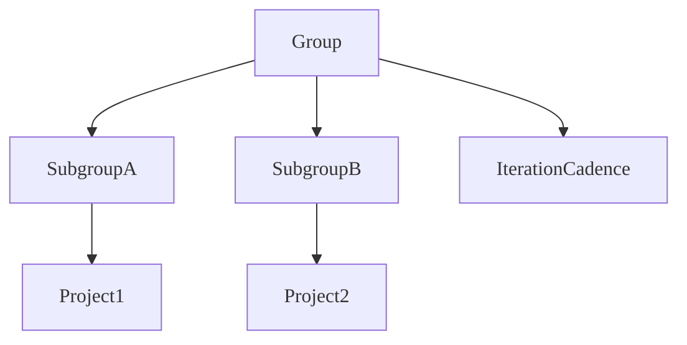

To run an Agile development iteration in GitLab, you use multiple GitLab features
that work together.

To run an Agile iteration from GitLab:

1. Create a group.
1. Create a project.
1. Set up an iteration cadence.
1. Create scoped labels.
1. Create your epics and issues.
1. Create an issue board.

After you've created these core components, you can begin running your iterations.

## Create a group

Iteration cadences are created at the group level, so start by
[creating one](../../user/group/_index.md#create-a-group) if you don't have one already.

You use groups to manage one or more related projects at the same time.
You add your users as members in the group, and assign them a role. Roles determine
the [level of permissions](../../user/permissions.md) each user has on the projects in the group.
Membership automatically cascades down to all subgroups and projects.

## Create a project

Now [create one or more projects](../../user/project/_index.md) in your group.
There are several different ways to create a project. A project contains
your code and pipelines, but also the issues that are used for planning your upcoming code changes.

## Set up an iteration cadence

Before you start creating epics or issues, create an
[iteration cadence](../../user/group/iterations/_index.md#iteration-cadences).
Iteration cadences contain the individual, sequential iteration timeboxes for planning and reporting
on your issues.

When creating an iteration cadence, you can decide whether to automatically manage the iterations or
disable the automated scheduling to
[manually manage the iterations](../../user/group/iterations/_index.md#create-an-iteration-manually).

Similar to membership, iterations cascade down your group, subgroup, and project hierarchy. If your team has multiple groups and projects, create the iteration cadence in the top-most shared group:

## Create scoped labels

You should also [create scoped labels](../../user/project/labels.md) in the same group where you created
your iteration cadence. Labels help you
organize your epics, issues, and merge requests, as well as help you
to visualize the flow of issues in boards. For example, you can use scoped labels like
`workflow::planning`, `workflow::ready for development`, `workflow::in development`, and `workflow::complete`
to indicate the status of an issue. You can also leverage scoped labels to denote the type of issue
or epic such as `type::feature`, `type::defect`, and `type::maintenance`.

## Create your epics and issues

Now you can get started planning your iterations. Start by creating [epics](../../user/group/epics/_index.md)
in the group where you created your iteration cadence,
then create child [issues](../../user/project/issues/_index.md) in one or more of your projects.
Add labels to each as needed.

## Create an issue board

[Issue boards](../../user/project/issue_board.md) help you plan your upcoming iterations or visualize
the workflow of the iteration currently in progress. List columns can be created based on label,
assignee, iteration, or milestone. You can also filter the board by multiple attributes and group
issues by their epic.

In the group where you created your iteration cadence and labels,
[create an issue board](../../user/project/issue_board.md#create-an-issue-board) and name it
"Iteration Planning." Then, create lists for each of your iterations. You can then drag issues from
the "Open" list into iteration lists to schedule them for upcoming iterations.

To visualize the workflow for issues in the current iteration, create another issue board called
"Current Iteration." When you're creating the board:

1. Select **Configure board** (**{settings}**).
1. Next to **Iteration**, select **Edit**.
1. From the dropdown list, select **Current iteration**.
1. Select **Save changes**.

Your board will now only ever show issues that are in the current iteration.
You can start adding lists for each of the `workflow::...` labels you created previously.

Now you're ready to start development.
