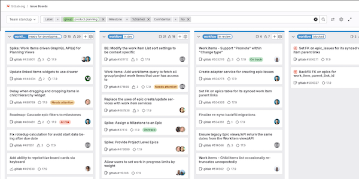

DETAILS:
**Tier:** Premium, Ultimate
**Offering:** GitLab.com, GitLab Self-Managed, GitLab Dedicated

<!-- vale gitlab_base.FutureTense = NO -->

This tutorial shows you how to create and configure an issue board that helps teams run effective stand-ups.
When you're done, you'll have a board that supports this workflow:

1. Before each stand-up:

   - Team members update the status of their assigned tasks.
   - Tasks flow through lists that show their current state: planning, in development, blocked, or complete.

1. During the stand-up:

   - Team members discuss in-progress work and share completion timelines.
   - Blocked tasks are identified and plans made to resolve them.
   - New tasks are added to the ready list.
   - Completed tasks are celebrated and moved to done.

The result: Your team leaves each stand-up aligned on sprint progress, with risks identified and plans to address them.

To set up an issue board for team stand-ups:

1. [Create a group](#create-a-group)
1. [Create a project](#create-a-project)
1. [Create labels](#create-labels)
1. [Create the team stand-up board](#create-the-team-stand-up-board)
1. [Configure your board lists](#configure-your-board-lists)
1. [Create issues for team tasks](#create-issues-for-team-tasks)

## Before you begin

- If you're using an existing group for this tutorial, make sure you have at least the Planner role for the group.
- If you're using an existing project for this tutorial, make sure you have at least the Planner role for the project.

## Create a group

Start by creating a group to manage one or more related projects.
Groups let you manage member access and share settings across projects.

To create a group:

1. On the left sidebar, at the top, select **Create new** (**{plus}**) and **New group**.
1. Select **Create group**.
1. Complete the fields:
   - In **Group name**, enter `Paperclip Software Factory`.
1. Select **Create group**.

You've created an empty group.
Next, create a project to store your issues and code.

## Create a project

Projects store your code repositories and issues you'll use for planning.
All development work happens in projects.

To create a blank project:

1. In your group, in the upper-right corner, select **New project**.
1. Select **Create blank project**.
1. Complete the fields:
   - In **Project name**, enter `Paperclip Assistant`.
1. Select **Create project**.

## Create labels

To track issue status during stand-ups, you need workflow labels.

Create these labels in your `Paperclip Software Factory` group rather than the project.
Group-level labels are available to all projects in the group, which helps establish consistent
workflows across teams.

To create a workflow label:

1. On the left sidebar, select **Search or go to** and find your **Paperclip Software Factory** group.
1. Select **Manage > Labels**.
1. Select **New label**.
1. In the **Title** field, enter the label name.
1. Optional. Select a background color or enter a hex color value.
1. Select **Create label**.

Repeat these steps to create all the workflow labels:

- `workflow::planning breakdown`
- `workflow::ready for development`
- `workflow::in development`
- `workflow::ready for review`
- `workflow::in review`
- `workflow::blocked`
- `workflow::verification`
- `workflow::complete`

## Create the team stand-up board

Create your board in the group so you can manage issues from any project in the group.

To create a group issue board:

1. On the left sidebar, select **Search or go to** and find your **Paperclip Software Factory** group.
1. Select **Plan > Issue boards**.
1. In the upper-left corner, select the dropdown list with the current board name.
1. Select **Create new board**.
1. Complete the fields:
   - In **Title**, enter `Team stand-up`.
   - Select both **Show the Open list** and **Show the Closed list**.
1. Select **Create board**.

### Add workflow lists to your board

1. In the upper-right corner, select **Add list** (**{plus}**).
1. From **New list**, select **Label**.
1. From the **Value** dropdown list, select a workflow label.
1. Select **Add to board**.
1. Repeat steps 1-4 for each workflow label.

Your board now has lists for each workflow state, though they'll be empty until you add issues in later steps.

## Configure your board lists

You can customize your board by setting filters that apply to all lists.
For example, you can show issues only from the current iteration or with specific labels.

To configure your board:

1. On your team stand-up board, select **Configure board** (**{settings}**).
1. Complete any of these fields to filter issues:
   - **Milestone**: to show issues from a specific milestone.
   - **Assignee**: to show issues assigned to specific team members.
   - **Labels**: to show issues with specific labels.
   - **Weight**: to show issues with specific weight values.
   - **Iteration**: to show issues from the current iteration.
1. Select **Create board**.

Your board now shows only issues that match your filters.
For example, if you select a milestone, only issues assigned to that milestone appear in the board lists.

## Create issues for team tasks

You can create issues directly from your board during the team stand-up.

To create an issue:

1. On your team stand-up board, in the `workflow::ready for development` list, select **Create new issue** (**{plus}**).
1. Complete the fields:
   - In **Title**, enter `Redesign user profile page`
   - From the **Projects** dropdown list, select **Paperclip Software Factory / Paperclip Assistant**
1. Select **Create issue**.

The issue is created with the `workflow::ready for development` label because you created it in that list.

### Add metadata to the issue

1. On the issue card, select anywhere except the title.
1. On the right sidebar, in the field you want to update, select **Edit**.
1. Select your changes.
1. Select any area outside the field to save.

Congratulations!
You've set up a team stand-up board that helps track work and facilitate discussions.
Your team can now use this board to run effective stand-ups.

## Related topics

- [Plan and track work tutorials](../plan_and_track.md).
- [Stand-ups, retrospectives, and velocity](../scrum_events/standups_retrospectives_velocity.md)
- [Product Development Flow](https://handbook.gitlab.com/handbook/product-development-flow/): how we use workflow labels at GitLab.
