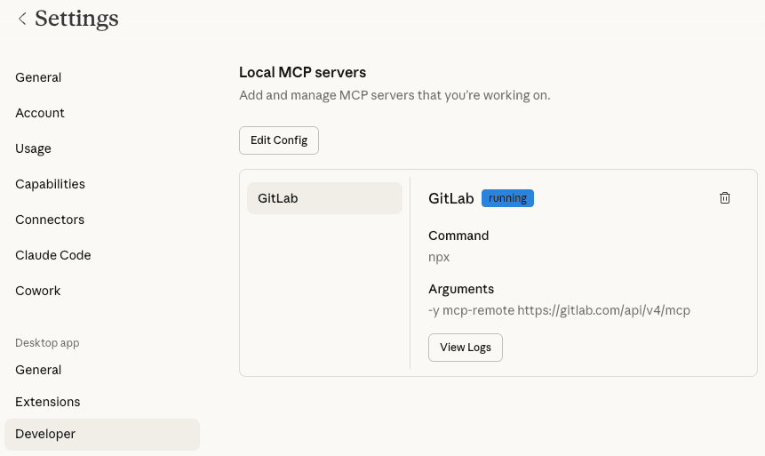
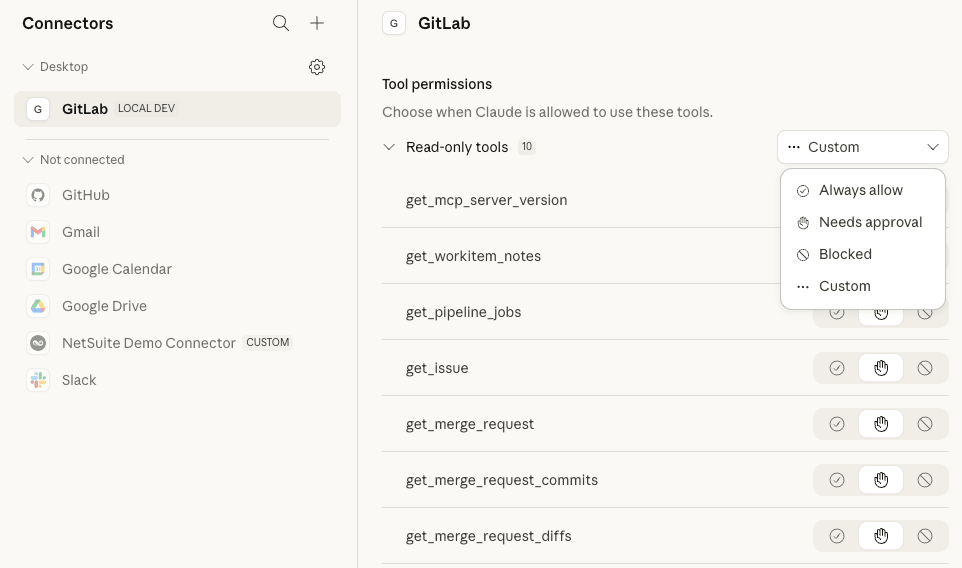
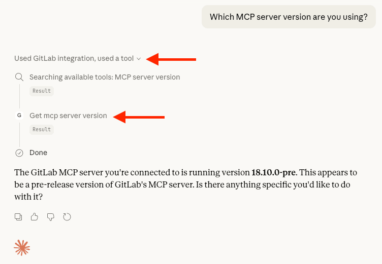
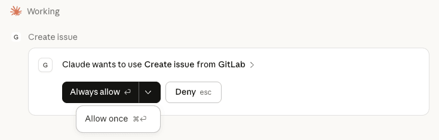

With the [GitLab Model Context Protocol (MCP) server](../../user/gitlab_duo/model_context_protocol/mcp_server.md),
you can connect external AI tools and applications to your GitLab instance. In this tutorial,
you will configure the GitLab MCP server to connect to Claude Desktop. After you have
successfully integrated Claude Desktop with the MCP server, you will
instruct Claude to create an issue in your GitLab instance.

## Before you begin

- Turn on [GitLab Duo](../../user/duo_agent_platform/turn_on_off.md#turn-gitlab-duo-on-or-off) and [beta and experimental features](../../user/duo_agent_platform/turn_on_off.md#turn-on-beta-and-experimental-features).
- Install [Claude Desktop](https://support.claude.com/en/articles/10065433-installing-claude-desktop) for your operating system.
- Install Node.js version 20 or later.
  Have Node.js available globally in the `PATH` environment variable (`which -a node`).
- Have at least one active project where you can create an issue.

## Connect Claude Desktop to the GitLab MCP server

1. Open Claude Desktop.
1. Edit the configuration file. You can do either of the following:
   - In Claude Desktop, select **Settings** > **Developer** > **Edit Config**.
   - In your file system, go to `claude_desktop_config.json` and open the file. For example:
     - On macOS: `~/Library/Application Support/Claude/claude_desktop_config.json`.
     - On Windows: `%APPDATA%\Claude\claude_desktop_config.json`.
1. Add the following entry for the GitLab MCP server, editing as needed:
   - For the `"command":` parameter, if `npx` is installed locally instead of globally, provide the full path to `npx`.
   - Replace `<gitlab.example.com>` with:
     - On GitLab Self-Managed, your GitLab instance URL.
     - On GitLab.com, `GitLab.com`.

   ```json
   {
     "mcpServers": {
       "GitLab": {
         "command": "npx",
         "args": [
           "-y",
           "mcp-remote",
           "https://<gitlab.example.com>/api/v4/mcp"
         ]
       }
     }
   }
   ```

1. Save the configuration and restart Claude Desktop.
1. On first connect, Claude Desktop opens a browser window for OAuth authentication. Review and approve the request.
1. Go to **Settings** > **Developer** and verify the new GitLab MCP configuration.



## Customize tool permissions

After you've successfully connected the MCP server, you can customize what tools
Claude can use when interacting with your GitLab instance. For example,
you can configure Claude to request approval before executing certain actions,
like creating an issue or managing a CI/CD pipeline.

To view tool permissions in Claude:

1. In the left sidebar, select **Customize** > **Connectors**.
1. Under **Desktop**, select **GitLab**.
1. Set `create_issue` to either **Needs approval** or **Always allow**.



## Test the connection

Now that you've successfully connected Claude Desktop to the MCP server,
test the connection with a prompt:

1. In the chat text box, type:

   ```plaintext
   Which MCP server version are you using?
   ```

1. Press <kbd>Enter</kbd> or select **Send**.

Claude should respond with the server version along with
details about the integration and tools it used to answer
the prompt.



## Create an issue in a project

Now, ask Claude to find a specific project where
you can create a test issue.

1. In the chat text box, type:

   ```plaintext
   Can you find my project <project_name>?
   ```

   Replace `<project_name>` with your project.

1. Press <kbd>Enter</kbd> or select **Send**.
1. After Claude finds your project, ask
   Claude to create an issue in the project.
   In the chat text box, type:

   ```plaintext
   Can you create an issue in the project called "Test issue from MCP server", and give it the following description: "This is a test issue created by Claude Desktop and the GitLab MCP server."
   ```

1. Press <kbd>Enter</kbd> or select **Send**.
1. If you set `create_issue` to **Needs approval**, Claude will ask for permission to create an issue.
   Select **Always allow** or, from the dropdown list, select **Allow once**.

   

After Claude creates the issue, it will provide issue details, including a URL to access the issue in your browser.
