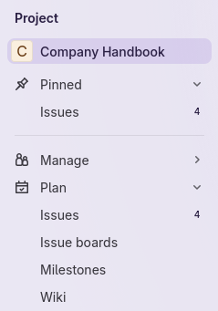
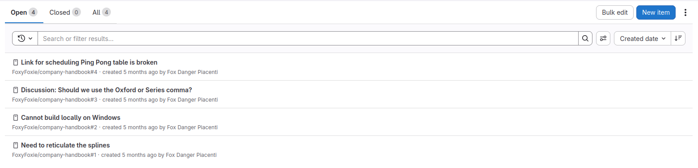
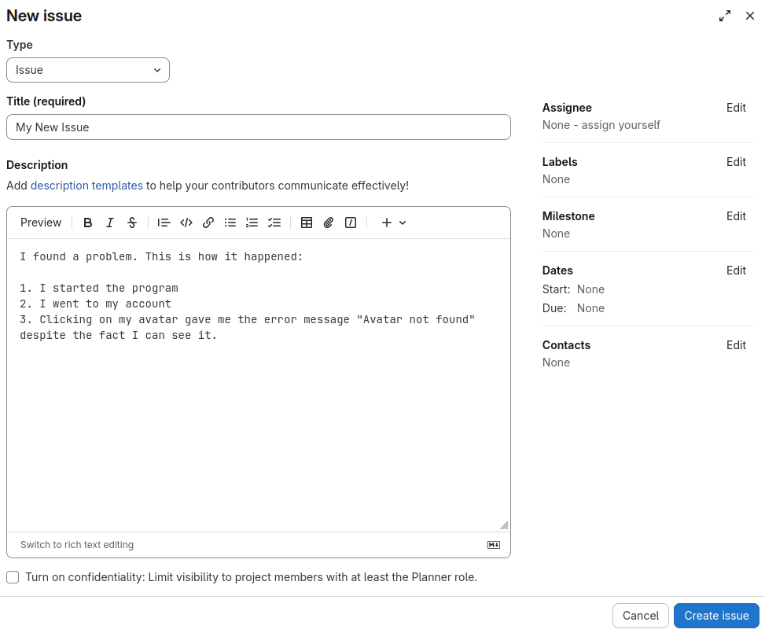
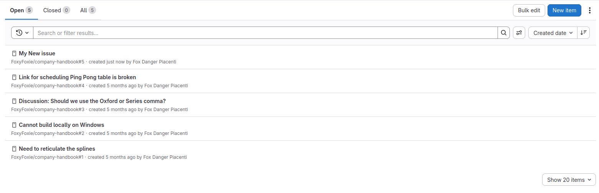



- Tier: Free, Premium, Ultimate
- Offering: GitLab.com, GitLab Self-Managed, GitLab Dedicated



An [issue](../../user/project/issues/_index.md) tracks a task, problem, or planned feature in your [project](../../user/project/organize_work_with_projects.md). Issues are used to plan work and ask for help. Issues can track any task, not just bugs or problems.

Learn how to view all the open issues in your project, and create a new one to report a problem you noticed.

## Open the issues list

First, browse through the open issues the project.
This way, you can see if there is an existing issue for the problem you noticed.

In your project, in the left sidebar, select **Plan** > **Issues**.

A list of all open issues appears:

## Create a new issue

You don't find any existing issues that describe the bug you noticed, so in this step, you'll create a new one.

In the upper-right, select **New item**.

1. Select the **Type** of the issue, or use the default, **Issue**.
1. Give your new issue a title to summarize it.
1. Add a description of the work to be performed, the idea to be transcribed, or the bug you found.
1. If you know who in the project should be assigned this task, set the **Assignee** field. Select **assign yourself** if you intend to work on this issue.
1. You may additionally select [labels](../../user/project/labels.md) to better categorize your issue.
1. Select a [milestone](../../user/project/milestones/_index.md) if applicable.
1. Optional. Fill in the **Dates** fields to specify when this task is intended to begin and end.
1. Optional. Set the **Contacts** to tag additional team members or stakeholders who should be consulted on this task.
1. Select **Create issue** to finish creating the new issue. The revised issue list appears with the new issue included.

## Next steps

Next you can:

- Visit, update, and comment on your issue.
- Work with issues as a [Kanban Board](../kanban/_index.md).
- Learn how to perform [issue triage](../issue_triage/_index.md).
