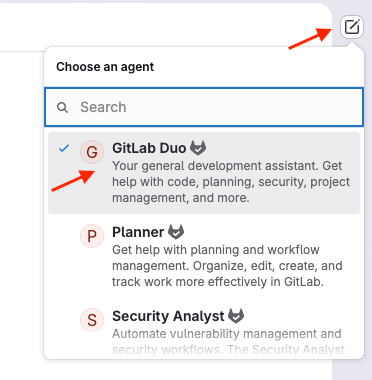
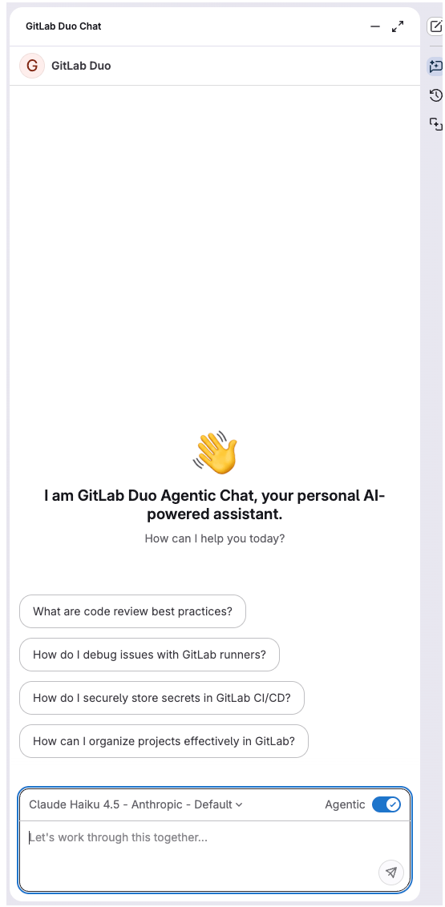
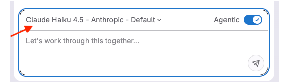
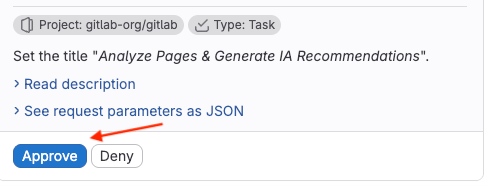
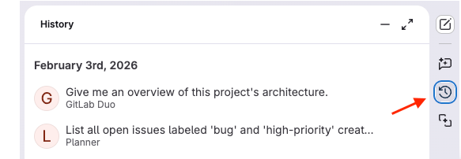

GitLab Duo Chat (Agentic) uses AI assistants called agents to help you accomplish specific tasks and answer complex questions.
In this tutorial, you'll complete the following tasks to help you get to know the GitLab Duo Chat interface:

- Ask the default GitLab Duo agent to answer a general question.
- Use the Planner Agent to complete more complex issue management tasks, specifically:
  - Find and filter high-priority bugs in an issue.
  - Find issues assigned to you, and break down the work required into subtasks.

## Before you begin

- Meet the [GitLab Duo Agent Platform prerequisites](../../user/duo_agent_platform/_index.md#prerequisites).
- Set a [default GitLab Duo namespace](../../user/profile/preferences.md#set-a-default-gitlab-duo-namespace).
- Choose a project you're familiar with. Have at least one open issue assigned to you.

## Open GitLab Duo Chat

First, get familiar with the chat interface and start your first chat.

1. In the top bar, select **Search or go to** and find your project.
1. In the GitLab Duo sidebar on the right, select **Add new chat**.
1. Now choose which agent to use. To ask a general question, select **GitLab Duo**.

   

The GitLab Duo panel slides out from the right side of the screen.
The panel stays open as you navigate through GitLab, so you can reference code, issues, or merge requests while chatting.



On the bottom of the panel, near the chat text box, you can choose the large language model to use.
For this tutorial, you can keep the default selection.



Now try it out!

1. In the chat text box, type:

   ```plaintext
   Give me an overview of this project's architecture.
   ```

1. Press <kbd>Enter</kbd> or select **Send**.

GitLab Duo summarizes its findings in the panel.

## Find and filter issues

Now try searching for specific issues in your project.
You want to identify all high-priority bugs in the project.

For this task, switch to the Planner Agent.

1. In the GitLab Duo sidebar, select **Add new chat** > **Planner**.
1. In the chat text box, type:

   ```plaintext
   List all open issues labeled 'bug' and 'high-priority' created in the last 30 days.
   ```

1. Press <kbd>Enter</kbd> or select **Send**.

The Planner Agent searches your project and filters issues based on your criteria.
You receive a list of matching issues with their titles, issue numbers, and links.

Next, try some follow-up prompts to filter by different labels, date ranges, or other criteria. For example:

```plaintext
Order this list by date created, and then alphabetically by name.
```

## Analyze an issue and create subtasks

You're going to use Chat to see a list of issues assigned to you, and analyze one in more detail.

1. In the Planner Agent conversation, in the chat text box, type:

   ```plaintext
   Show me all the open issues assigned to me.
   ```

1. Press <kbd>Enter</kbd> or select **Send**.

1. Choose one of the issues. Now you will use the Planner Agent to create child items
   to break the work down into more manageable steps.

   Don't worry if you don't need the child items, you can always close them later.

1. In the chat text box, type:

   ```plaintext
   Analyze issue #<selected_issue_number> and suggest how to break up the work into two or three subtasks.
   ```

1. Press <kbd>Enter</kbd> or select **Send**.

1. Review the suggested child items, and if you agree with them, type:

   ```plaintext
   Create these subtasks as child items under issue #<selected_issue_number>.
   ```

   Alternatively, use follow-up prompts to request more refinements until you're satisfied.

1. Press <kbd>Enter</kbd> or select **Send**.

1. GitLab Duo prepares the work items for final review. Read the descriptions and view the JSON request parameters,
   then select **Approve**.

   

The issues are added as child items to your issue and the chat panel displays their links. You can then add labels, assign the issues, or set a milestone.

## Next steps

Congratulations! You've learned how to use GitLab Duo Chat and the Planner Agent for simple issue management.

You can continue to iterate on the details of the subtasks, for example:

- `Can you provide more detail on task 3?`
- `Split task 2 into separate tasks`
- `Add technical implementation notes to these tasks`

Or, if you were trying this out as an experiment, you can close the subtasks:

```plaintext
Close these subtasks and add a comment in each that says: "This subtask was created as part of a tutorial exercise."
```

To review the work you've done, you can go back to your previous chats.
On the GitLab Duo sidebar, select **GitLab Duo Chat history** ().


