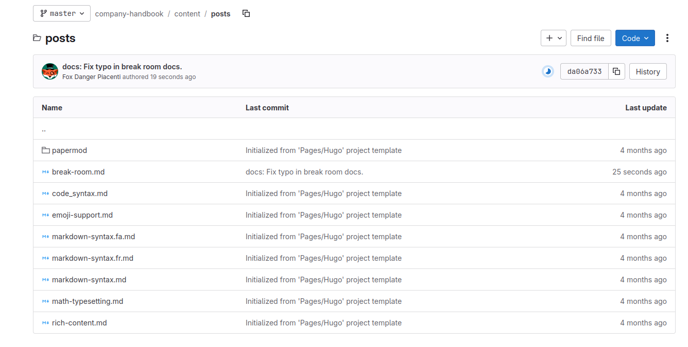
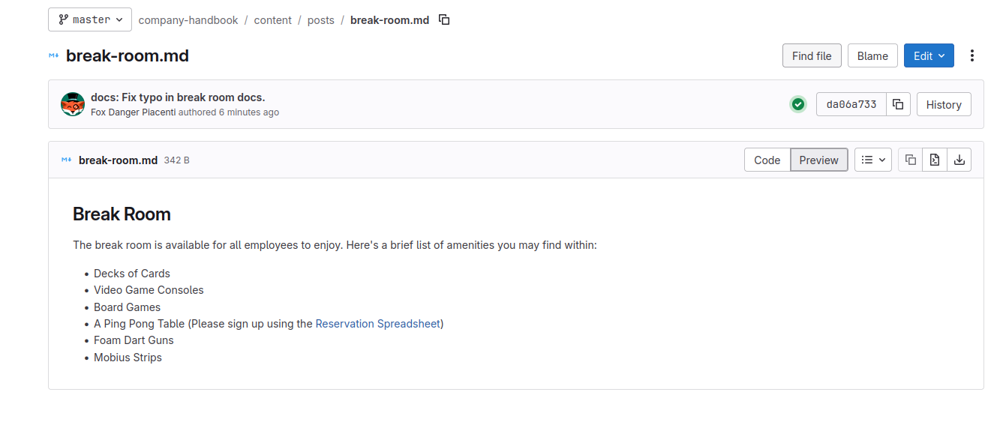
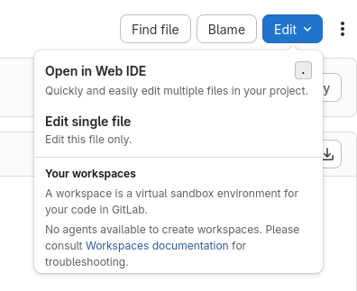
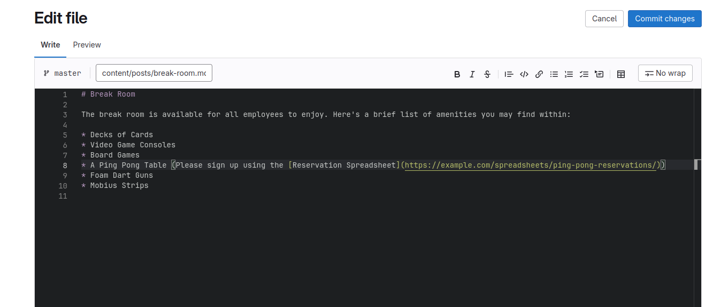
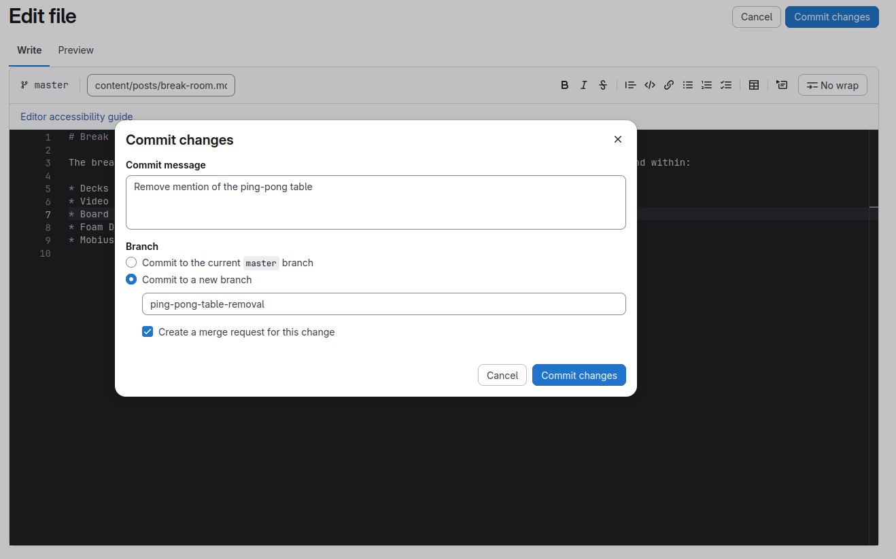
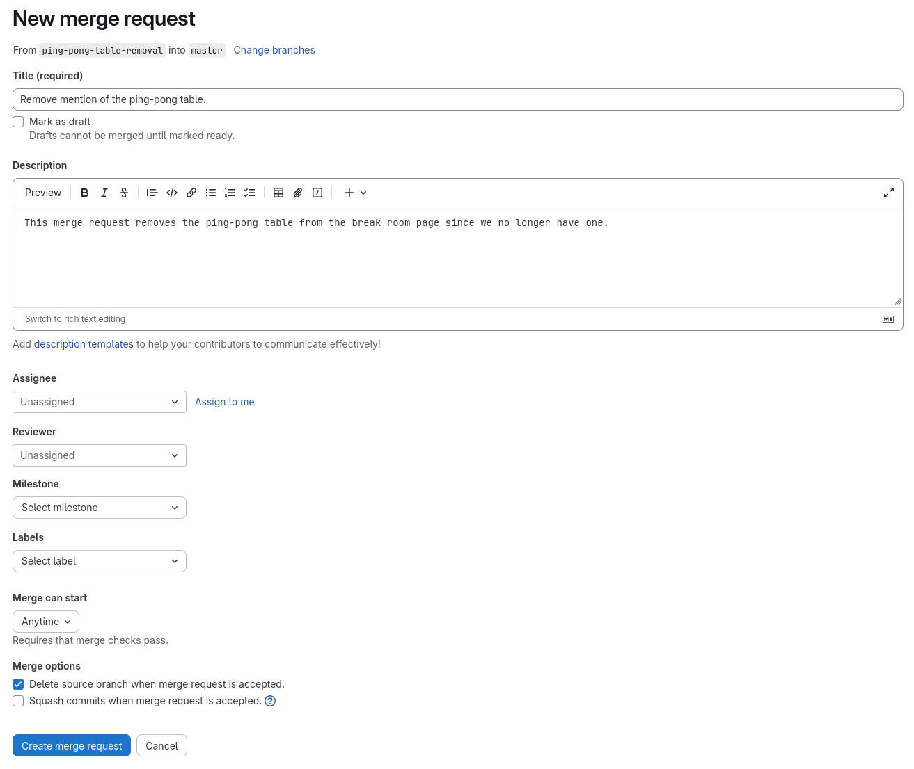



- Tier: Free, Premium, Ultimate
- Offering: GitLab.com, GitLab Self-Managed, GitLab Dedicated



[Project](../../user/project/organize_work_with_projects.md) files may be edited by team members who have [appropriate access](../../user/project/members/_index.md).

Learn how to edit an individual file directly in the GitLab UI using the simple Web Editor.

## Select the file you wish to edit

First, go to the project home page to get a list of files in the project.

Select any file to view its details.

## Edit the file

Select the **Edit** dropdown list, and then select **Edit single file**.

In the editor, make your edits to the file as needed.

## Commit your changes and create a merge request

It is possible to commit (save) your changes directly to the file. However, this is not recommended for most teams, as it is good practice to first have your changes reviewed by a team member. In this step, you'll create a branch and merge request with the new changes.

After you have finished editing:

1. Select **Commit changes**.
1. Fill in the **commit message** text box with a description of your changes.
1. Under **Branch**, select **Commit to a new branch**.
1. Under **Commit to a new branch**, enter a name for your new branch or leave the automatically generated one provided for you.
1. Make sure **Create a merge request for this change** is selected.

Finally, select **Commit changes** to commit your changes to the new branch. The new merge request form appears. To create the request, do the following:

1. Set the **Title** to an appropriate summary of the changes.
1. Put more details about your changes in the **Description** field.
1. Set the **Assignee** to yourself.
1. If you know who should review your changes, set the **Reviewer**.
1. Optional. Set the [milestone](../../user/project/milestones/_index.md) of your merge request.
1. Optional. Set labels for your merge request to better categorize it.
1. Select **Create merge request** to create your merge request.

Your edits are now in a merge request, and ready to be reviewed by another contributor.

## Next steps

Next you can:

- Review someone else's merge request
- [Create an issue on your existing project](../create_issue_in_existing_project/_index.md)
