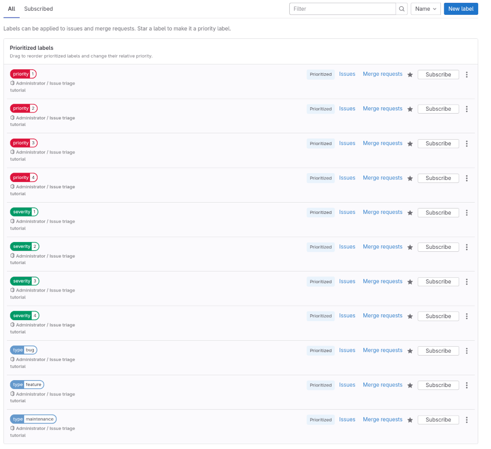
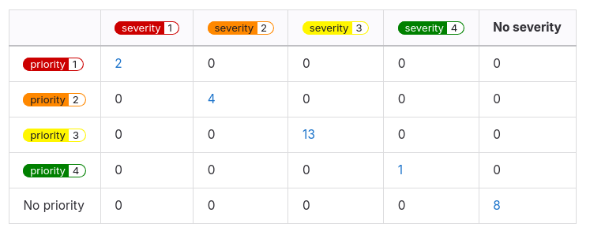

DETAILS:
**Tier:** Free, Premium, Ultimate
**Offering:** GitLab.com, GitLab Self-Managed, GitLab Dedicated

<!-- vale gitlab_base.FutureTense = NO -->

Issue triage is the process of categorization according to type and severity.
As your project grows and people create more issues, it's worth creating a workflow for how you'll
triage incoming issues.

In this tutorial, you'll learn how to set up a GitLab project for this.

To set up GitLab for issue triage in a project:

1. [Create a project](#create-a-project)
1. [Decide on the criteria for types, severity, and priority](#decide-on-the-criteria-for-types-severity-and-priority)
1. [Document your criteria](#document-your-criteria)
1. [Create scoped labels](#create-scoped-labels)
1. [Prioritize the new labels](#prioritize-the-new-labels)
1. [Create an issue triage board](#create-an-issue-triage-board)
1. [Create issues for features](#create-issues-for-features)

## Before you begin

- If you're using an existing project for this tutorial, make sure you have at least the Reporter role
  for the project.
- If you follow the steps below and later decide to create a parent group for your project, to make
  best use of labels, you'll have to promote the project labels to group labels.
  Consider creating a group first.

## Create a project

A project contains the issues that are used for planning your upcoming code changes.

If you already have a project you're working in, proceed to
[Decide on the criteria for types, severity, and priority](#decide-on-the-criteria-for-types-severity-and-priority).

To create a blank project:

1. On the left sidebar, at the top, select **Create new** (**{plus}**) and **New project/repository**.
1. Select **Create blank project**.
1. Enter the project details.
   - For **Project name**, enter `Issue triage tutorial`.
1. Select **Create project**.

## Decide on the criteria for types, severity, and priority

Next, you'll need to determine:

- **Types** of issues you want to recognize. If you need a more granular approach, you
  can also create subtypes for each type. Types help categorize work to get an understanding of the
  kind of work that is requested of your team.
- Levels of **priorities** and **severities** to define the impact that incoming work has on end
  users and to assist in prioritization.

For this tutorial, suppose you've decided on the following:

- Type: `Bug`, `Feature`, and `Maintenance`
- Priority: `1`, `2`, `3`, and `4`
- Severity: `1`, `2`, `3`, and `4`

For inspiration, see how we define these at GitLab:

- [Types and subtypes](https://handbook.gitlab.com/handbook/engineering/metrics/#work-type-classification)
- [Priority](https://handbook.gitlab.com/handbook/engineering/infrastructure/engineering-productivity/issue-triage/#priority)
- [Severity](https://handbook.gitlab.com/handbook/engineering/infrastructure/engineering-productivity/issue-triage/#severity)

## Document your criteria

After you agree on all the criteria, write it all down somewhere your team mates can always access.

For example, add it to a [wiki](../../user/project/wiki/_index.md) in your project, or your company
handbook published with [GitLab Pages](../../user/project/pages/_index.md).

<!-- Idea for expanding this tutorial:
     Add steps for [creating a wiki page](../../user/project/wiki/_index.md#create-a-new-wiki-page). -->

## Create scoped labels

DETAILS:
**Tier:** Premium, Ultimate
**Offering:** GitLab.com, GitLab Self-Managed, GitLab Dedicated

Next, you'll create labels to add to issues to categorize them.

The best tool for this is [scoped labels](../../user/project/labels.md#scoped-labels), which you
can use to set mutually exclusive attributes.

Checking with the list of types, severities, and priorities you've assembled
[previously](#decide-on-the-criteria-for-types-severity-and-priority), you'll want to create matching
scoped labels.

The double colon (`::`) in the name of a scoped label prevents two labels of the same scope being
used together.
For example, if you add the `type::feature` label to an issue that already has `type::bug`, the
previous one is removed.

NOTE:
Scoped labels are available in the Premium and Ultimate tier.
If you're on the Free tier, you can use regular labels instead.
However, they aren't mutually exclusive.

To create each label:

1. On the left sidebar, select **Search or go to** and find your project.
1. Select **Manage > Labels**.
1. Select **New label**.
1. In the **Title** field, enter the name of the label. Start with `type::bug`.
1. Optional. Select a color by selecting from the available colors, or enter a hex color value for
   a specific color in the **Background color** field.
1. Select **Create label**.

Repeat these steps to create all the labels you'll need:

- `type::bug`
- `type::feature`
- `type::maintenance`
- `priority::1`
- `priority::2`
- `priority::3`
- `priority::4`
- `severity::1`
- `severity::2`
- `severity::3`
- `severity::4`

## Prioritize the new labels

Now, set the new labels as priority labels, which ensures that the most important issues show on top
of the issue list if you sort by priority or label priority.

To learn what happens when you sort by priority or label priority, see
[Sorting and ordering issue lists](../../user/project/issues/sorting_issue_lists.md).

To prioritize a label:

1. On the Labels page, next to a label you want to prioritize, select the star (**{star-o}**).
   This label now appears at the top of the label list, under **Prioritized labels**.
1. To change the relative priority of these labels, drag them up and down the list.
   The labels higher in the list get higher priority.
1. Prioritize all the labels you created previously.
   Make sure that labels of higher priority and severity are higher on the list than the lower values.

## Create an issue triage board

To prepare for the incoming issue backlog, create an [issue board](../../user/project/issue_board.md) that organizes issues by label.
You'll use it to quickly create issues and add labels to them by dragging cards to various lists.

To set up your issue board:

1. Decide on the scope of the board. For example, create one that you'll use to assign
   severity to issues.
1. On the left sidebar, select **Search or go to** and find your
   **Issue triage tutorial** project.
1. Select **Plan > Issue boards**.
1. In the upper-left corner of the issue board page, select the dropdown list with the current board name.
1. Select **Create new board**.
1. In the **Title** field, enter `Issue triage (by severity)`.
1. Keep the **Show the Open list** checkbox selected and clear the **Show the Closed list** one.
1. Select **Create board**. You should see an empty board.
1. Create a list for the `severity::1` label:
   1. In the upper-right corner of the issue board page, select **Create list**.
   1. In the column that appears, from the **Value** dropdown list, select the `severity::1` label.
   1. Select **Add to board**.
1. Repeat the previous step for labels `severity::2`, `severity::3`, and `severity::4`.

For now, the lists in your board should be empty. Next, you'll populate them with some issues.

## Create issues for features

To track upcoming features and bugs, you must create some issues.
Issues belong in projects, but you can also create them directly from your issue board.

Start by creating some issues for planned features.
You can create issues for bugs as you find them (hopefully not too many!).

To create an issue from your **Issue triage (by severity)** board:

1. On the **Open** list, select **Create new issue** (**{plus}**).
   The **Open** list shows issues that don't fit any other board list.

   If you already know which severity label your issue should have, you can create it directly from that label list.
   Each issue created from a label list will be given that label.
1. Complete the fields:
   - Under **Title**, enter `User registration`.
1. Select **Create issue**.
1. Repeat these steps to create a few more issues.

   For example, if you're building an app, create the following issues:

   - `User registration`
   - `Profile creation`
   - `Search functionality`
   - `Add to favorites`
   - `Push notifications`
   - `Social sharing`
   - `In-app messaging`
   - `Track progress`
   - `Feedback and ratings`
   - `Settings and preferences`

Your first triage issue board is ready!
Try it out by dragging some issues from the **Open** list to one of the label lists to add one of
the severity labels.

## Next steps

Next, you can:

- Tweak how you use issue boards. Some options include:
  - Edit your current issue board to also have lists for priority and type labels.
    This way, you'll make the board wider and might require some horizontal scrolling.
  - Create separate issue boards named `Issue triage (by priority)` and `Issue triage (by type)`.
    This way, you'll keep various types of triage work separate, but will require switching between
    boards.
  - [Set up issue boards for team hand-off](../boards_for_teams/_index.md).
- Browse issues by priority or severity in issue lists,
  [filtered by each label](../../user/project/issues/managing_issues.md#filter-the-list-of-issues).
  If it's available to you, make use of
  [the "is one of" filter operator](../../user/project/issues/managing_issues.md#filter-with-the-or-operator).
- Break the issues down into [tasks](../../user/tasks.md).
- Create policies that help automate issue triage in a project with the [`gitlab-triage` gem](https://gitlab.com/gitlab-org/ruby/gems/gitlab-triage).
  Generate summary reports with heatmaps like the following:

  

To learn more about issue triage at GitLab, see [Issue Triage](https://handbook.gitlab.com/handbook/engineering/infrastructure/engineering-productivity/issue-triage/)
and [Triage Operations](https://handbook.gitlab.com/handbook/engineering/infrastructure/engineering-productivity/triage-operations/).
