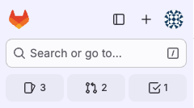
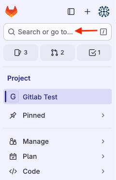
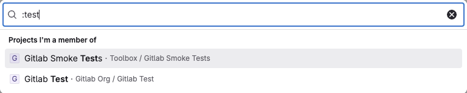
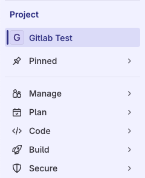
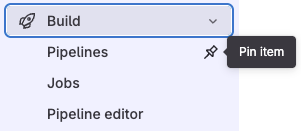
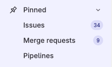
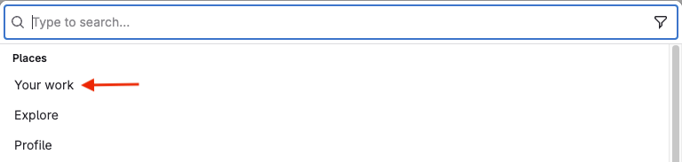
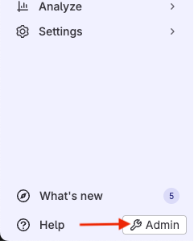



- Tier: Free, Premium, Ultimate
- Offering: GitLab.com, GitLab Self-Managed, GitLab Dedicated





- [Introduced](https://gitlab.com/groups/gitlab-org/-/epics/9044) in GitLab 16.0.
- In 16.0 through 16.5, you can turn the sidebar off by selecting your avatar and turning off the **New navigation** toggle.



<!-- vale gitlab_base.FutureTense = NO -->

Follow this tutorial to learn how to use the new left sidebar to navigate the UI.

## Layout of the left sidebar

At the top of the left sidebar are several shortcuts. Use these shortcuts to
show and hide the left sidebar, create new items, search, and view your profile. You can also view your list of issues,
merge requests, and to-do items.



If you have hidden the left sidebar, you can display it temporarily by hovering your cursor over the left edge of the GitLab window.



The next area of the left sidebar changes based on the information you're viewing. For example,
you might be viewing a project, exploring projects or groups, or viewing your profile.
To switch to other areas of the left sidebar, use **Search or go to**. If you've [turned on the new navigation](../../user/interface_redesign.md#turn-new-navigation-on-or-off), this field is on the top bar.

The rest of the left sidebar is populated based on the option you choose. For example,
if you're in a project, the sidebar is project-specific.

## Find your project

Now let's go over a few common tasks you'll use the left sidebar for.

To start, we will find the project we want to work on.

1. To explore all available projects, on the left sidebar, select **Search or go to**. If you've [turned on the new navigation](../../user/interface_redesign.md#turn-new-navigation-on-or-off), this field is on the top bar.
1. Choose from the list of frequently visited projects, or
   type a colon `:` followed by the project name:

   

The left sidebar now shows project-specific options.

## Pin frequently used items

You can pin menu items if you tend to use them frequently.

1. Expand the sections until you are viewing the item you want to pin.
1. Hover over and select the pin ().

   

The item is displayed in the **Pinned** section:



The items you pin while you're viewing a project are different than the items you pin while viewing a group.



## Use a more focused view

On the left sidebar, you can also choose a more focused view into the areas you have access to.
Select **Search or go to** and then select **Your work**. If you've [turned on the new navigation](../../user/interface_redesign.md#turn-new-navigation-on-or-off), this field is on the top bar.

Then, on the left sidebar, **Your work** is displayed.

## Go to the Admin area

The **Admin** area is also available on the left sidebar at the bottom:

## Access What's new

The **What's new** feature shows users some of the highlights of new features from the last 10 GitLab versions.

To access the unread **What's new** items, on the left sidebar, at the bottom, select **What's new**.

To access previously read **What's new** items:

1. On the left sidebar, at the bottom, select **Help** ().
1. Select **What's new** from the menu.
