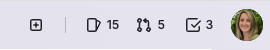
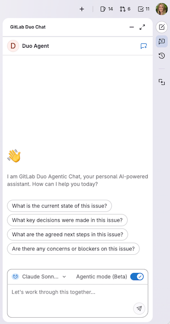
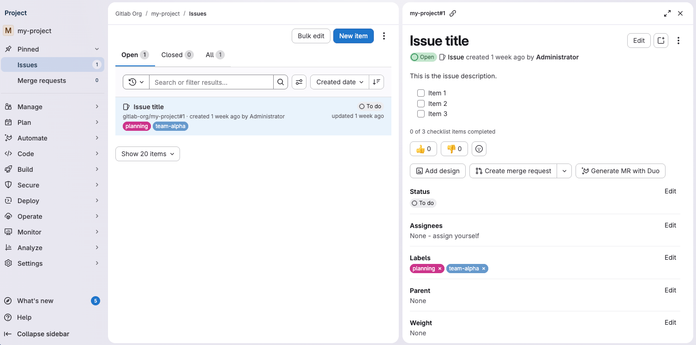
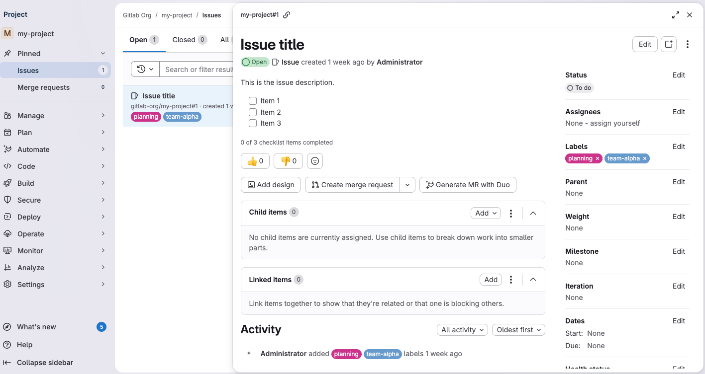
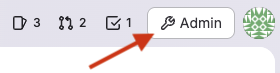



- Tier: Free, Premium, Ultimate
- Offering: GitLab.com, GitLab Self-Managed, GitLab Dedicated





- [Introduced](https://gitlab.com/groups/gitlab-org/-/epics/9044) in GitLab 16.0.
- In 16.0 through 16.5, you can turn the sidebar off by selecting your avatar and turning off the **New navigation** toggle.
- Interface [updated](https://gitlab.com/gitlab-org/gitlab/-/merge_requests/208474) to a panel-based layout in GitLab 18.6.



<!-- vale gitlab_base.FutureTense = NO -->

Follow this tutorial to learn how to use the different interface elements to navigate GitLab.

## Layout of the interface

In the upper-right corner, there are several shortcuts. Use these shortcuts to create new items, and to view your
profile, your list of issues, merge requests, and to-do items.

The left sidebar changes based on the information you're viewing. For example,
you might be viewing a project, exploring projects or groups, or viewing your profile.
To switch to other areas of the left sidebar, use **Search or go to** in the top bar.

The rest of the left sidebar is populated based on the option you choose. For example,
if you're in a project, the sidebar is project-specific.

On the right, the GitLab Duo sidebar has buttons to access GitLab Duo Chat, sessions, and suggestions.

## Find your project

Now let's go over a few common tasks you'll use the left sidebar for.

To start, we will find the project we want to work on.

1. To explore all available projects, on the top bar, select **Search or go to**.
1. Choose from the list of frequently visited projects, or
   type a colon `:` followed by the project name:

   

The left sidebar now shows project-specific options.

## Pin frequently used items

You can pin menu items if you tend to use them frequently.

1. Expand the sections until you are viewing the item you want to pin.
1. Hover over and select the pin ().

   

The item is displayed in the **Pinned** section:



The items you pin while you're viewing a project are different than the items you pin while viewing a group.



## Use a more focused view

On the left sidebar, you can also choose a more focused view into the areas you have access to.
Select **Search or go to** and then select **Your work**.

Then, on the left sidebar, **Your work** is displayed.

## Open work items in the details panel

When you select a work item, like an issue, it opens in a details panel.

To open the item in the full page view, either:

- On the Issues or Epics page, right-click the item and open it in a new tab.
- Select the item, and from the details panel select its ID (for example, `myproject#123456`).

If there's enough screen space, the details panel opens next to the list or board you open it from.
On smaller screens, the detail panel covers the list or board panel.

### Set preference for opening work items in a panel

By default, work items like issues or epics open in the details panel.
If you prefer to turn it off:

1. On the top bar, select **Search or go to** and find your project or group.
1. Select **Plan** > **Issues** or **Epics**.
1. At the top of the Issues or Epics page, select **Display options** ()
   and turn off the **Open items in side panel** toggle.

Your preference is saved and applies across GitLab.

## Go to the Admin area

The **Admin** area is available in the upper-right corner:

## Access What's new

The **What's new** feature shows users some of the highlights of new features from the last 10 GitLab versions.

To access the unread **What's new** items, on the left sidebar, at the bottom, select **What's new**.

To access previously read **What's new** items:

1. On the left sidebar, at the bottom, select **Help** ().
1. Select **What's new** from the menu.
