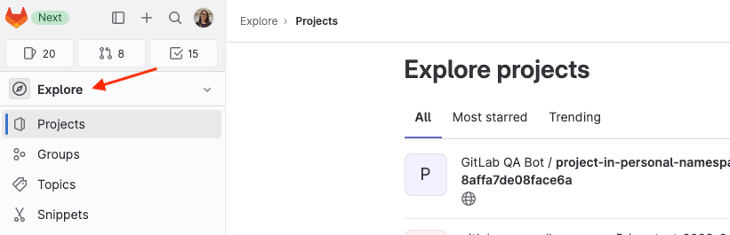
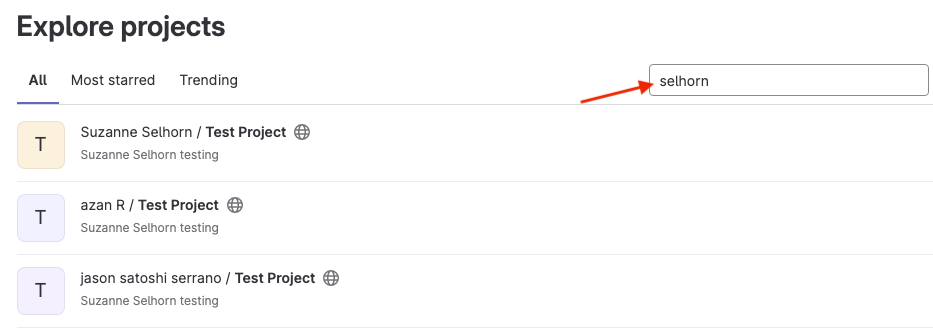
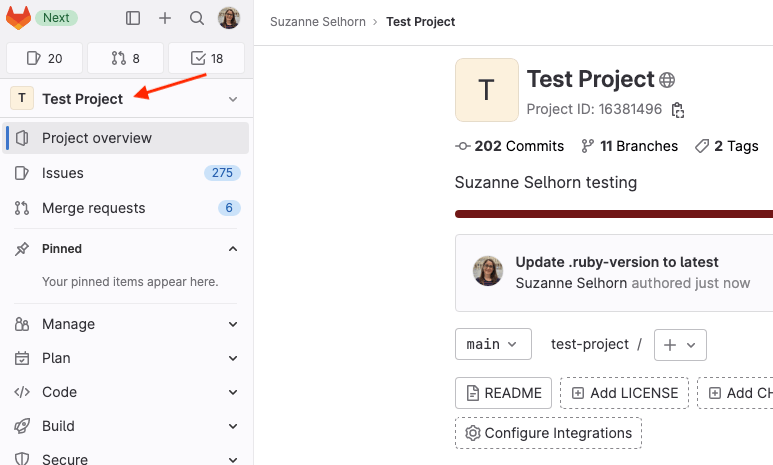
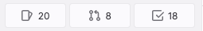
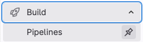
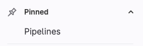
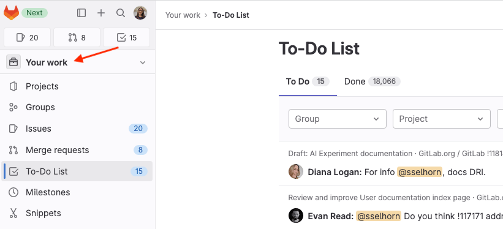

# Tutorial: Use the left sidebar to navigate GitLab

> [Introduced](https://gitlab.com/groups/gitlab-org/-/epics/9044) in GitLab 16.0.

Follow this tutorial to learn how to use the new left sidebar to navigate the UI.

Provide feedback in
[issue 409005](https://gitlab.com/gitlab-org/gitlab/-/issues/409005).

## Enable the new left sidebar

To view the new sidebar:

1. On the top bar, in the upper-right corner, select your avatar.
1. Turn on the **New navigation** toggle.

To turn off this sidebar, return to your avatar and turn off the toggle.

## Find your project and customize the sidebar

Let's get started exploring the GitLab UI and left sidebar.

1. Start by finding the project you want to work on.
   To explore all available projects, on the left sidebar, select **Explore**:

   

1. On the right, above the list of projects, type search criteria.

   

1. When you find the project you want, select the project name.
   The left sidebar now shows project-specific options.

   

Now, on the left sidebar:

- Your issues, merge requests, and to-do items are listed in the shortcuts
  at the top:

  

- You can pin other items if you tend to use them frequently.
  To do so:

  1. Expand the sections until you are viewing the item you want to pin.
  1. Hover over and select the pin (**{thumbtack}**).

     

  The item is displayed in the **Pinned** section:

  

- If you need to find a merge request you created,
  an issue you opened, or anything else, next to your avatar,
  select the magnifying glass (**{search}**).

## View everything assigned to you

On the left sidebar, you can also choose a more focused view into the areas you have access to.

- Change the view to **Your work**.

  
