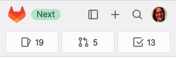
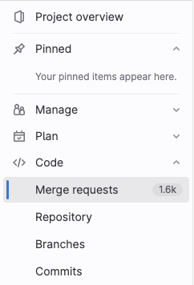
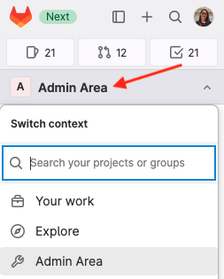

# Tutorial: Use the left sidebar to navigate GitLab **(FREE ALL)**

> [Introduced](https://gitlab.com/groups/gitlab-org/-/epics/9044) in GitLab 16.0.

Follow this tutorial to learn how to use the new left sidebar to navigate the UI.

Provide feedback in
[issue 409005](https://gitlab.com/gitlab-org/gitlab/-/issues/409005).

## Enable the new left sidebar

To view the new sidebar:

1. On the left sidebar, select your avatar.
1. Turn on the **New navigation** toggle.

To turn off this sidebar, return to your avatar and turn off the toggle.

## Layout of the left sidebar

At the top of the left sidebar are several shortcuts. Use these shortcuts to
show and hide the left sidebar, create new items, search, and view your profile. You can also view your list of issues,
merge requests, and to-do items.

If you have hidden the left sidebar, you can display it temporarily by hovering your cursor over the left edge of the GitLab window.

The next area of the left sidebar changes based on the information you're viewing. For example,
you might be viewing a project, exploring projects or groups, or viewing your profile.
Use this area to switch to other areas of the left sidebar.

The rest of the left sidebar is populated based on the option you choose. For example,
if you're in a project, the sidebar is project-specific:

## Find your project

Now let's go over a few common tasks you'll use the left sidebar for.

To start, we will find the project we want to work on.

1. To explore all available projects, on the left sidebar, select **Explore**:

   

1. On the right, above the list of projects, type search criteria.
   The search finds projects with a matching description.

   

1. When you find the project you want, select the project name.
   The left sidebar now shows project-specific options.

   

## Pin frequently used items

You can pin menu items if you tend to use them frequently.

1. Expand the sections until you are viewing the item you want to pin.
1. Hover over and select the pin (**{thumbtack}**).

   

The item is displayed in the **Pinned** section:

NOTE:
The items you pin while you're viewing a project are different than the items you pin while viewing a group.

## Use a more focused view

On the left sidebar, you can also choose a more focused view into the areas you have access to.
Change the view to **Your work**:

## Go to the Admin Area

The Admin Area is also available on the left sidebar:

