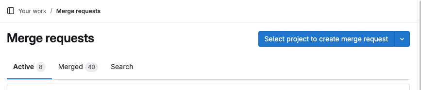
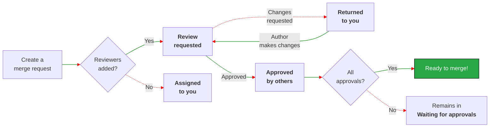
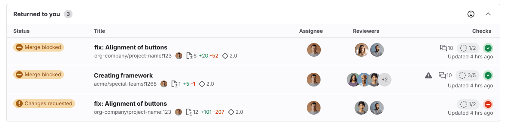

DETAILS:
**Tier:** Free, Premium, Ultimate
**Offering:** GitLab.com, GitLab Self-Managed, GitLab Dedicated

> - [Introduced](https://gitlab.com/groups/gitlab-org/-/epics/13448) in GitLab 17.9 [with a flag](../../administration/feature_flags.md) named `merge_request_dashboard`. Disabled by default.
> - [Enabled](https://gitlab.com/gitlab-org/gitlab/-/issues/480854) on GitLab.com in GitLab 17.9.

FLAG:
The availability of this feature is controlled by a feature flag.
For more information, see the history.

This tutorial introduces you to the new user interface for managing merge requests.

Whether you're an author awaiting review, or a reviewer providing feedback, this page
helps you track your work. It sorts your work into clear categories to help you:

- Spend less time tracking merge requests that need your attention.
- Focus on the most urgent work first.
- See the status of your contributions.
- Prevent in-progress work from being forgotten.
- Improve your code review velocity.

## See it in action

To see your merge request homepage on GitLab.com, either:

- Use the <kbd>Shift</kbd> + <kbd>m</kbd> [keyboard shortcut](../../user/shortcuts.md).
- On the left sidebar, select **Merge requests**.

It's organized into three tabs, to help you focus on what needs your attention right now, while
still giving you access to other recent work:

- **Active**: These merge requests need attention from you, or a member of your team.
- **Merged**: These merge requests merged in the last 14 days, and you were an assignee or a reviewer.
- **Search**: Search all merge requests, and filter them as needed.

GitLab shows the total number of **Active** merge requests on the left sidebar on all pages. For example, this user has:

- 31 open issues (**{issue-type-issue}**)
- 8 active merge requests (**{merge-request-open}**)
- 29 to-do items (**{todo-done}**)

## The review process for merge requests

During the life of a merge request, it is created, reviewed, modified, approved, and eventually merged.
On the merge request homepage, merge requests are sorted by steps in the [review process](../../user/project/merge_requests/reviews/_index.md),
to help you understand quickly what actions you should take:

This review flow makes some assumptions:

1. The **Assignee** is the author of the merge request.
1. **Reviewers** are the users who review the work in the merge request.
1. Reviewers use the [**Start a review**](../../user/project/merge_requests/reviews/_index.md#start-a-review) and
   [**Submit a review**](../../user/project/merge_requests/reviews/_index.md#submit-a-review) features.

## How to read the display

Merge requests are grouped by current step in the review process. Each table row shows the most critical
information about a merge request:

The table groups related information about a merge request together into columns:

- **Status** - The current status of the merge request.
- **Title** - Important metadata about the issue, including:
  - The merge request title.
  - The assignee's avatar.
  - The number of files and lines added and removed (`+` / `-`).
  - Milestone
- **Author** - The author's avatar.
- **Reviewers** - The reviewers' avatars. Reviewers with a green check mark have approved the merge request.
- **Checks** - A compact assessment of mergeability.
  - Number of unresolved threads, like `0 of 3`.
  - Current required [approval status](../../user/project/merge_requests/approvals/_index.md#in-the-list-of-merge-requests).
  - Most recent pipeline's status.
  - Date of last update.

## Merge requests in the Active tab

Merge requests in the **Active** tab are grouped by status. Merge requests with these statuses count
toward the total shown on the left sidebar:

### Assigned to you

You're the merge request author. You've not added reviewers yet.

- Next step: Add reviewers to start the review process.
- Statuses:
  - **Draft**: The merge request is marked as draft.
  - **Reviewers needed**: The merge request is not a draft, but has no reviewers.

### Returned to you

Reviewers have provided feedback, or requested changes.

- Next step: Address reviewer comments, and implement suggested changes.
- Statuses:
  - **Changes requested**: A reviewer has requested changes.
  - **Reviewer commented**: A reviewer has left comments but not requested changes.

### Review requested

You're a reviewer for this merge request.

- Next step: Review the merge request. Provide approval and feedback. Request changes when needed.
- Statuses:
  - **Requested**: You've not yet started a review.
  - **Review started**: You've started a review, but not completed it yet.

## Merge requests excluded from the active count

The **Active** tab shows all your in-progress merge requests, sorted by status.
These merge requests are excluded from the active count, because no action is required from you right now:

### Waiting for assignee

Your assigned merge requests that are waiting for approvals, and reviews you have requested changes for.

- Next step: Wait for reviews and approvals.
- Statuses:
  - **You requested changes**: You've completed your review and requested changes.
  - **You commented**: You've commented, but have not completed your review.

### Waiting for approvals

Your assigned merge requests that are waiting for approvals, and reviews you have requested changes for.

- Next step: Wait until all approval requirements are met.
- Statuses:
  - **Approvals required** - Number of required approvals remaining.
  - **Approved** - Either you have approved, or all required approvals are satisfied.
  - **Waiting for approvals**.

### Approved by you

Merge requests you've reviewed and approved.

- Next step: Wait for other approvals and other merge requirements to be met.
- Statuses:
  - **Approved** - You've approved, and required approvals are satisfied.
  - **Approval required** - You've approved, but not all required approvals are satisfied.

### Approved by others

Merge requests that have received approvals from other team members.

- Next step: Potentially ready to merge, if all requirements are met.
- Statuses:
  - **Approved** - Your merge request has received the necessary approvals.
