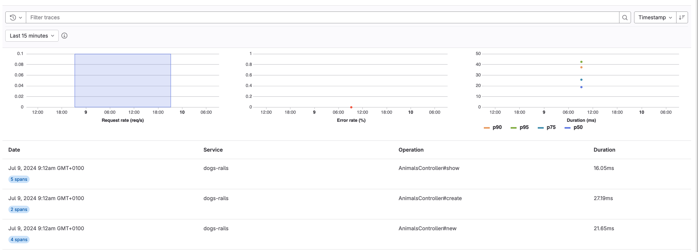

FLAG:
The availability of this feature is controlled by a feature flag.
For more information, see the history of the [**Distributed tracing** feature](../../development/tracing.md).
<!-- Update this note when observability_features flag is removed -->

In this tutorial, you'll learn how to create, configure, instrument, and monitor a Ruby on Rails application using GitLab Observability features.

## Before you begin

Take a moment and make sure you have the following:

- A GitLab Ultimate subscription for GitLab.com or GitLab Self-Managed
- A local installation of Ruby on Rails
- Basic knowledge of Git, Ruby on Rails, and the core concepts of [OpenTelemetry](https://opentelemetry.io/)

## Create a new GitLab project

First, create a new GitLab project and a corresponding access token.
This tutorial uses the project name `animals`.

1. On the left sidebar, at the top, select **Create new** (**{plus}**) and **New project/repository**.
1. Select **Create blank project**.
1. Enter the project details.
   - In the **Project name** field, enter `animals`.
1. Select **Create project**.
1. In the `animals` project, on the left sidebar, select **Settings > Access tokens**.
1. Create an access token with the `api` scope and Developer role. Store the token value somewhere safe—you'll need it later.

## Create a Rails application

Next, we need a new Ruby on Rails application that we can instrument. For this tutorial, let's create a toy application to store a list of animals.

To create an application:

1. From the command line, run the following:

   ```shell
   rails new animals
   ```

1. Go to the `animals` directory and run the application:

   ```shell
   cd animals
   rails server -p 8080
   ```

1. In a web browser, visit `http://localhost:8080` and make sure the application is running correctly.
1. Create a model scaffold for an Animal class and run the generated database migrations:

   ```shell
   rails generate scaffold Animal species:string number_of_legs:integer dangerous:boolean
   rails db:migrate
   ```

1. Run the application again and visit the list of animals at `http://localhost:8080/animals`. Try creating, editing, and deleting an animal to make sure everything works as expected.
1. Add the OpenTelemetry and dotenv gems to the Gemfile:

   ```shell
   bundle add opentelemetry-sdk opentelemetry-instrumentation-all opentelemetry-exporter-otlp dotenv
   ```

1. Create an initializer to handle the configuration, and add an `.env` file to store environment variables:

   ```shell
   touch config/initializers/opentelemetry.rb
   touch .env
   ```

1. Edit `config/initializers/opentelemetry.rb` and add the following code:

   ```ruby
   require 'opentelemetry/sdk'
   require 'opentelemetry/instrumentation/all'
   require 'opentelemetry-exporter-otlp'

   OpenTelemetry::SDK.configure do |c|
     c.service_name = 'animals-rails'
     c.use_all()
   end
   ```

1. Find your project ID:
   1. On the `animal` project overview page, in the upper-right corner, select **Actions** (**{ellipsis_v}**).
   1. Select **Copy project ID**. Save the copied ID for later.

1. Edit `.env` and add the following code:

   ```shell
   OTEL_EXPORTER = "otlphttp"
   OTEL_EXPORTER_OTLP_ENDPOINT = "https://gitlab.com/api/v4/projects/{{PROJECT_ID}}/observability"
   OTEL_EXPORTER_OTLP_HEADERS = "PRIVATE-TOKEN={{ACCESS_TOKEN}}"
   OTEL_LOG_LEVEL = "debug"
   ```

   Be sure to replace the `PROJECT_ID`, and `ACCESS_TOKEN` with the values you obtained earlier.
   If using GitLab Self-Managed, replace `gitlab.com` with your GitLab Self-Managed instance hostname.

## View traces

Now that you have an application configured to use Observability tracing,
you can view exported traces on GitLab.com.

To view exported traces:

1. Start the `animals` application again.
1. Visit `http://localhost:8080/animals` and perform some actions in the application.
1. In the `animals` project, on the left sidebar, select **Monitor > Traces**.
   If everything is working correctly, you should see a trace for each controller action.

   

1. Optional. Select a trace to view its span.

   

Congratulations! You successfully created an application, configured it to use GitLab Observability features, and examined the traces the application created. You can continue to experiment with this toy application, or try configuring a more complex application to export traces.

Remember that Observability Tracing is not yet ready for production use. There is no official support for logs or metrics using the OpenTelemetry collector with a Ruby on Rails application.
