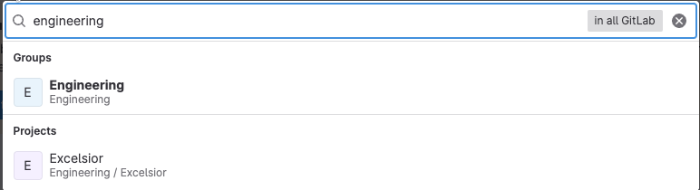
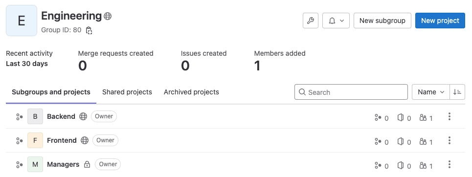
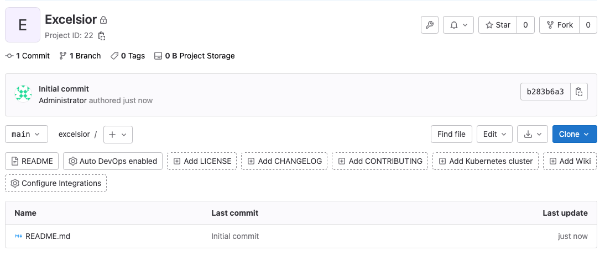
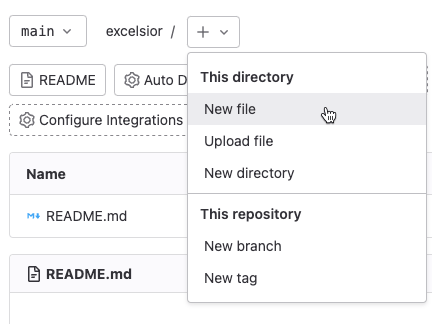
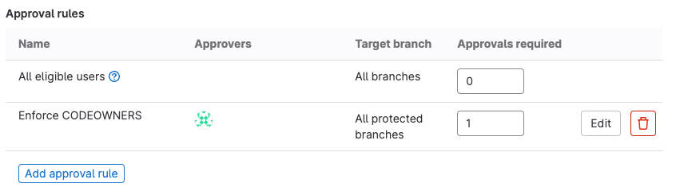
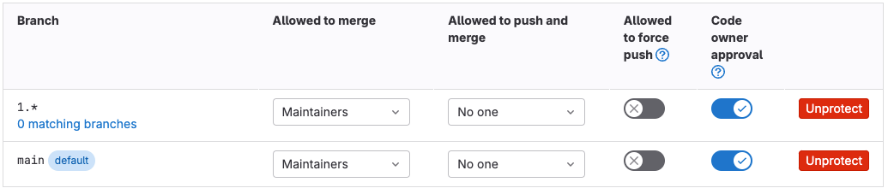
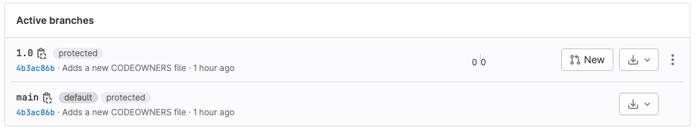
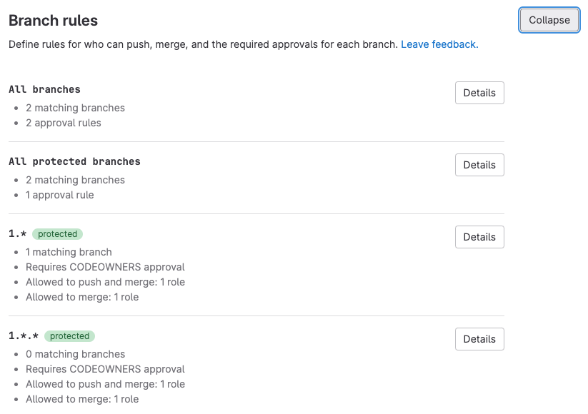

<!-- vale gitlab_base.FutureTense = NO -->

DETAILS:
**Tier:** Free, Premium, Ultimate
**Offering:** GitLab.com, GitLab Self-Managed, GitLab Dedicated

When your team starts a new project, they need a workflow that balances efficiency
with appropriate reviews. In GitLab, you can create user groups, combine those
groups with branch protections, and then enforce those protections with approval rules.

This tutorial sets up protections for the `1.x` and `1.x.x` release branches of an
example project named "Excelsior", and creates a minimal approval workflow for the project:

1. [Create the `engineering` group](#create-the-engineering-group)
1. [Create subgroups in `engineering`](#create-subgroups-in-engineering)
1. [Add users to the subgroups](#add-users-to-the-subgroups)
1. [Create the Excelsior project](#create-the-excelsior-project)
1. [Add a basic CODEOWNERS file](#add-a-basic-codeowners-file)
1. [Configure approval rules](#configure-approval-rules)
1. [Enforce CODEOWNER approval on branches](#enforce-codeowner-approval-on-branches)
1. [Create the release branches](#create-the-release-branches)

## Before you begin

- You must have the Maintainer or Owner role.
- You need a list of managers and their email addresses.
- You need a list of your backend and frontend engineers, and their email addresses.
- You understand [semantic versioning](https://semver.org/) for branch names.

## Create the `engineering` group

Before setting up Excelsior Project, you should create a group to own
the project. Here, you'll set up the Engineering group:

1. On the left sidebar, at the top, select **Create new** (**{plus}**) and **New group**.
1. Select **Create group**.
1. For **Group name**, enter `Engineering`.
1. For the **Group URL**, enter `engineering`.
1. Set the **Visibility level** to **Private**.
1. Personalize your experience so GitLab shows the most helpful information to you:
   - For **Role**, select **System administrator**.
   - For **Who will be using this group?** select **My company or team**.
   - For **What will you use this group for?** select **I want to store my code**.
1. Skip inviting members to the group. You'll add users in a later section of this tutorial.
1. Select **Create group**.

Next, you'll add subgroups to this `engineering` group for more granular control.

## Create subgroups in `engineering`

The `engineering` group is a good start, but Excelsior Project's
backend engineers, frontend engineers, and managers
have different tasks, and different areas of specialty.

Here, you'll create three more granular subgroups in the Engineering group to
segment users by the type of work they do: `managers`, `frontend`, and `backend`.
Then you'll add these new groups as members of the `engineering` group.

First, create the new subgroup:

1. On the left sidebar, select **Search or go to**
   and search for `engineering`. Select the group named `Engineering`:

   

1. On the overview page for the `engineering` group, in the upper-right corner,
   select **New subgroup**.
1. For the **Subgroup name**, enter `Managers`.
1. Set the **Visibility level** to **Private**.
1. Select **Create subgroup**.

Next, add the subgroup as a member of the `engineering` group:

1. On the left sidebar, select **Search or go to**
   and search for `engineering`. Select the group named `Engineering`.
1. Select **Manage > Members**.
1. In the upper right, select **Invite a group**.
1. For **Select a group to invite**, select `Engineering / Managers`.
1. When adding the subgroups select the role **Maintainer**.
   This configures the highest role a member of the subgroup can inherit when accessing the `engineering` group and its projects.
1. Optional. Select an expiration date.
1. Select **Invite**.

Repeat this process to create subgroups for `backend` and `frontend`. When you're done,
search for the `engineering` group one more time. Its overview page should show
three subgroups, like this:



## Add users to the subgroups

In the previous step, when you added your subgroups to the parent group (`engineering`), you limited
members of the subgroups to the Maintainer role. This role is the highest role they can inherit
for projects owned by `engineering`. As a result:

- User 1 is added to the `manager` subgroup with the Guest role, and receives
  the Guest role on `engineering` projects.
- User 2 is added to the `manager` group with the Owner role. This role is higher
  than the maximum role (Maintainer) you set, so User 2 receives the Maintainer
  role instead of Owner.

To add a user to the `frontend` subgroup:

1. On the left sidebar, select **Search or go to**
   and search for `frontend`. Select the `Frontend` group.
1. Select **Manage > Members**.
1. Select **Invite members**.
1. Fill in the fields. Select the **Developer** role by default, increasing it
   to **Maintainer** if this user reviews the work of others.
1. Select **Invite**.
1. Repeat these steps until you've added all of the frontend engineers into the
   `frontend` subgroup.

Now do the same with the `backend` and `managers` groups. The same user can be a
member of multiple subgroups.

## Create the Excelsior project

Now that your group structure is in place, create the `excelsior` project
for the teams to work in. Because both frontend and backend engineers
are involved, `excelsior` should belong to `engineering` instead of any of the
smaller subgroups you just created.

To create the new `excelsior` project:

1. On the left sidebar, select **Search or go to** and
   search for `engineering`. Select the group named `Engineering`.
1. On the overview page for the `engineering` group, on the left sidebar, at the top,
   select **Create new** (**{plus}**) and **In this group > New project/repository**.
1. Select **Create blank project**.
1. Enter the project details:
   - In the **Project name** field, enter `Excelsior`. The **Project slug** should
     auto-populate with `excelsior`.
   - For **Visibility Level**, select **Public**.
   - Select **Initialize repository with a README** to add an initial file to the repository.
1. Select **Create project**.

GitLab creates the `excelsior` project for you, and redirects you to its homepage.
It should look like this:



You'll use a feature on this page in the next step.

## Add a basic CODEOWNERS file

Add a CODEOWNERS file to the root directory of your project to route reviews to
the right subgroup. This example sets up four rules:

- All changes should be reviewed by someone in the `engineering` group.
- A manager should review any change to the CODEOWNERS file itself.
- Frontend engineers should review changes to frontend files.
- Backend engineers should review changes to backend files.

NOTE:
GitLab Free supports only optional reviews. To make reviews required, you need
GitLab Premium or Ultimate.

To add a CODEOWNERS file to your `excelsior` project:

1. On the left sidebar, select **Search or go to** and
   search for `Excelsior`. Select the project named `Excelsior`.
1. Next to the branch name, select the plus icon (**{plus}**), then **New file**:
   
1. For **Filename**, enter `CODEOWNERS`. This will create a file named `CODEOWNERS`
   in the root directory of your project.
1. Paste this example into the editing area, changing `@engineering/` if it
   does not match your group structure:

   ```plaintext
   # All changes should be reviewed by someone in the engineering group
   * @engineering

   # A manager should review any changes to this file
   CODEOWNERS @engineering/managers

   # Frontend files should be reviewed by FE engineers
   [Frontend] @engineering/frontend
   *.scss
   *.js

   # Backend files should be reviewed by BE engineers
   [Backend] @engineering/backend
   *.rb
   ```

1. For a **Commit message**, paste in:

   ```plaintext
   Adds a new CODEOWNERS file

   Creates a small CODEOWNERS file to:
   - Route backend and frontend changes to the right teams
   - Route CODEOWNERS file changes to managers
   - Request all changes be reviewed
   ```

1. Select **Commit changes**.

The CODEOWNERS file is now in place in the `main` branch of your project, and
available for all future branches created in this project.

## Configure approval rules

The CODEOWNERS file describes the appropriate reviewers for directories and
file types. Approval rules direct merge requests to those reviewers.
Here, you will set up an approval rule that uses the information in your new CODEOWNERS
file and adds protection for release branches:

1. On the left sidebar, select **Search or go to** and
   search for `Excelsior`. Select the project named `Excelsior`.
1. Select **Settings > Merge requests**.
1. In the **Merge request approvals** section, scroll to **Approval rules**.
1. Select **Add approval rule**.
1. Create a rule named `Enforce CODEOWNERS`.
1. Select **All protected branches**.
1. To make the rule required in GitLab Premium and GitLab Ultimate,
   set the **Approvals required** to `1`.
1. Add the `managers` group as approvers.
1. Select **Add approval rule**.
1. Scroll to **Approval settings** and make sure
   **Prevent editing approval rules in merge requests** is selected.
1. Select **Save changes**.

When added, the `Enforce CODEOWNERS` rule looks like this:



## Enforce CODEOWNER approval on branches

You've configured several protections for your project, and you're now ready to
combine those protections together to safeguard your project's important branches:

- Your users are sorted into logical groups and subgroups.
- Your CODEOWNERS file describes the subject matter experts for file types and directories.
- Your approval rule encourages (in GitLab Free) or requires (in GitLab Premium and GitLab Ultimate)
  the subject matter experts to review changes.

Your `excelsior` project uses [semantic versioning](https://semver.org/) for
release branch names, so you know the release branches follow the pattern `1.x`
and `1.x.x`. You want all code added to these branches to be reviewed by subject
matter experts, and for managers to make the final decision on what work is merged
into the release branch.

Rather than create protections for a branch at a time, configure wildcard branch rules
to protect multiple branches:

1. On the left sidebar, select **Search or go to** and
   search for `Excelsior`. Select the project named `Excelsior`.
1. Select **Settings > Repository**.
1. Expand **Protected branches**.
1. From the **Branch** dropdown list, type `1.*`, and then select **Create wildcard `1.*`**.
1. To require everyone to submit merge requests, rather than pushing commits directly:
   1. Set **Allowed to merge** to **Maintainers**.
   1. Set **Allowed to push and merge** to **No one**.
   1. Leave **Allowed to force push** disabled.
1. In GitLab Premium and GitLab Ultimate, to require Code Owners to review changes
   to files they work on, toggle **Require approval from code owners**.
1. Select **Protect**.
1. In the table of branches, find the rule marked as `Default`. (Depending on
   your version of GitLab, this branch might be named `main` or `master`.) Set the
   values for this branch to match the settings you used for the `1.*` rule.

Your rules are now in place, even though no `1.*` branches exist yet:



## Create the release branches

Now that all branch protections in place, you're ready to create your 1.0.0 release branch:

1. On the left sidebar, select **Search or go to** and
   search for `Excelsior`. Select the project named `Excelsior`.
1. Select **Code > Branches**.
1. In the upper-right corner, select **New branch**. Name it `1.0.0`.
1. Select **Create branch**.

The branch protections are now visible in the UI:

- On the left sidebar, select **Code > Branches**. In the list of branches,
  branch `1.0.0` should be show that it is protected:

  

- On the left sidebar, select **Settings > Repository**, then expand **Branch rules**
  to see details about all protected branches:

  

Congratulations! Your engineers can work independently in their branches,
and all code submitted for consideration for the 1.0.0 release branch will
be reviewed by subject matter experts.
