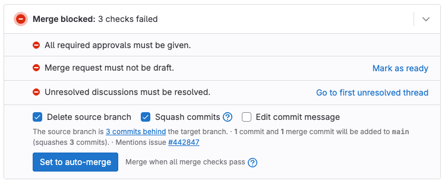
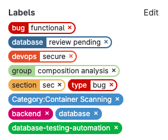
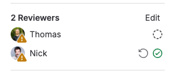
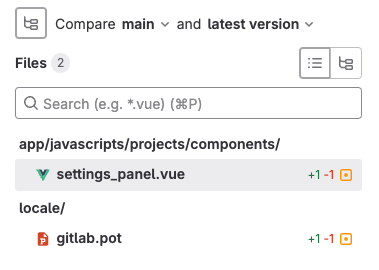
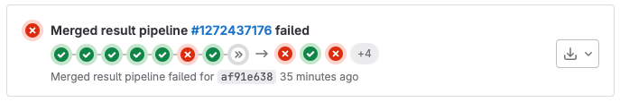
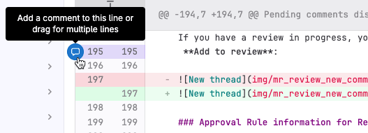

Merge request reviews help ensure only high-quality code makes it into your codebase.
This tutorial shows you how to review a merge request in GitLab. It guides
you through the structure of the merge request itself, and then the process of
giving constructive, helpful feedback. By the end of the tutorial, you're ready to
approve the merge request, or request more changes.

<i class="fa fa-youtube-play youtube" aria-hidden="true"></i>
For an overview, see [Merge request review](https://www.youtube.com/watch?v=2MayfXKpU08&list=PLFGfElNsQthYDx0A_FaNNfUm9NHsK6zED&index=183).
<!-- Video published on 2023-04-29 -->

To review a merge request:

1. [Go to the merge request](#go-to-the-merge-request)
1. [Understand the structure of merge requests](#understand-the-structure-of-merge-requests)
1. [Get a high-level view](#get-a-high-level-view-of-the-merge-request)
   1. [Check related issues](#check-related-issues)
   1. [Check the sidebar](#check-the-sidebar)
   1. [Check the comments](#check-the-comments)
1. [Read the code changes](#read-the-code-changes)
   1. [Skim changes for an overview](#skim-changes-for-an-overview)
   1. [Examine each file in depth](#examine-each-file-in-depth)
   1. [Test the code](#test-the-code)
   1. [Check the pipelines](#check-the-pipelines)
   1. [Re-review considerations](#re-review-considerations)
   1. [Think about the big picture](#think-about-the-big-picture)
1. [Finish your review](#finish-your-review)
   1. [Write your review comments](#write-your-review-comments)
   1. [Summarize your review](#summarize-your-review)
1. [Perform cleanup tasks](#perform-cleanup-tasks)

## Go to the merge request

1. On the left sidebar, select **Search or go to** and find your project.
1. Either:
   - Press <kbd>Shift</kbd> + <kbd>r</kbd> to go to your **Review requests** page.
   - On the left sidebar, select **Merge requests** (**{merge-request}**) **> Review requests**.

## Understand the structure of merge requests

Merge requests have a secondary menu with four options. You use these areas of a
merge request at different times during your review:

- **Overview**: The merge request's description, a report on its current mergeability,
  an **Activity** area with comments, and a sidebar with more information.
- **Commits**: A list of commits in this merge request, newest commit first.
- **Pipelines**: A list of CI/CD pipelines run against the content of this merge request.
- **Changes**: A diff of the changes proposed in this merge request, showing lines removed, added, and changed.

The sidebar in the **Overview** tab contains important metadata about the merge request itself:
the assignee, reviewer, labels, milestone, and time tracking.

## Get a high-level view of the merge request

Before you jump into reviewing the code, you should assess the merge request at a
high level. Understand the context and purpose of the merge request: what it is trying to do, and why. Compare those needs
to your skillset, while asking yourself these questions:

1. What's the story behind the merge request? Do I have enough background in this
   area to perform a thoughtful review?
1. What type, and depth, of review has been requested? For example,
   a narrowly-scoped bug fix and a deep architectural review likely have very
   different review expectations.
1. Are you the right person to review this work? Does the type of review it needs
   match with your skills and abilities?

Start by looking at the description of the merge request. It should be the solution
to a problem or a feature request in an issue.

- **Who is the author?** Are you familiar with this person's work? If you're familiar with
  this person, what part of the codebase do they usually work on? Later, your
  knowledge of the author helps you gauge how to scrutinize their changes.
- **What's the goal?** Read the description to understand the author's intent.
- **Is it a draft?** Drafts are often incomplete or theoretical solutions. A draft merge request might require
  a different level of scrutiny than fully-finished merge requests.
- **How can you reproduce the problem?** Does the description explain how to reproduce
  the problem, test the changes, or try out the new feature? Does it include screenshots to guide you?

Below the description, check the merge request widget to understand the
current status of this work. This example shows a merge widget for a merge request
that is missing approvals, is still in draft mode, and has unresolved discussion threads:

- **Does it cross-link to an issue?** Check the description and merge widget
  for links to other issues. Some merge requests are straightforward, but
  some require you to read the corresponding issue to understand how this merge request
  came to be. More complex merge requests should point back to issues with full information.
- **What's the pipeline status?** Is the pipeline green? Red pipelines point to problems.
  If you see incomplete or canceled pipelines, you can't assess the full mergeability of the work yet.

### Check related issues

If related issues exist, and the merge request feels complex enough that you need
more information, scan through the issue descriptions.

- **Are the problem and solution separated?** The issue should describe and investigate
  the problem, and the merge request should focus on the solution.
- **Is the merge request author involved in the issue?** Throughout the review process,
  think about who helped define the problem (or the feature). Ideally, those people
  are also involved in the merge request.

### Check the sidebar

- **What labels does it have?** Labels can provide cues to the content of the merge request.
  Depending on your team's workflow, incomplete or missing labels might be innocuous, or
  might indicate this merge request lacks full information.
  - If the labels match your area of expertise, you're likely a good candidate
    to review this merge request.
  - If the labels match areas of expertise you _don't_ have, you might need to
    reassign the merge request to a different reviewer.
  - Add any labels your workflow expects.

  In this example, even if the exact labels are unfamiliar to you, you can determine this merge request is about a database bug:

  

- **Who are the reviewers?** Scan the names in the reviewer list. Do they match
  the type of work you'd expect, based on the description and (optionally) the labels?
  Consider both who is present, and who is absent. What do those names tell you
  about where this merge request is in its review cycle? Do you need to add or remove anyone?
- **Have any reviewers already approved?** If you know those reviewers and their areas of expertise,
  you can gain some idea of what aspects of the proposed changes need your attention.

  In this example, both Thomas and Nick are reviewers. Thomas has not yet reviewed
  (**{dotted-circle}**) the merge request. Nick has reviewed and approved (**{check-circle}**):

  

### Check the comments

On the **Overview** page, read the comments left by the author and others.
Keep those discussions in mind as you read the code changes.

Do you see evidence of previous reviews in
the comments? A large number of comments might influence how deeply you want to
review this work.

## Read the code changes

Now you're ready to read the proposed changes. For large merge requests,
skim the changes before diving in. Build your understanding of what to
expect before you begin to read changes line by line.

NOTE:
The diffs displayed in the **Changes** tab are dense with information. To learn
how to get the most out of this page, see
[Changes in merge requests](../../user/project/merge_requests/changes.md).

### Skim changes for an overview

When you first open the **Changes** page, focus on the broader details first:

- **What files have changed?** Expand the file browser (**{file-tree}**) to see
  the list of changed files. Are you familiar with these files? What part of the
  codebase are these files in?

  

- **Does the file list match your expectations?** You've already read the description of
  the merge request. Are these the files you'd expect to see changed for this kind
  of work? Pay extra attention to changes to unexpected files, or if changes
  you'd expect to see are missing.
- **Are lines added, removed, or changed?** These numbers tell you what kind
  of work to expect in your deeper read: a new feature, a removed feature, or changes in behavior?
- **Were any tests changed?** Are any of the files part of your testing suite?
  If not, you might need to nudge the author to update tests.
- **Are feature flags used?** If you see feature flags, make a note to check their
  use in your deeper read-through.

When you've finished skimming the changes, you're ready to read the changes line by line!

### Examine each file in depth

You now have a broad idea of the changes this merge request contains. It's time to dive
in and read the changes in full. Stay aware of where your knowledge is strong, and
where it is weak. Do you know this project well? Are the changes written in a
language you're comfortable working in?

- **Are the changes clear and understandable?**
- **Are feature flags used?** Do the changes test for the presence or absence of
  the feature flag? Make sure that feature-flagged changes don't accidentally leak out
  when the flag is disabled.
- **Is it performant?** Are you comfortable testing the performance yourself,
  or should you add a reviewer with more in-depth performance knowledge?
- **Can it be simplified?**
- **Does it take edge cases into account?**
- **Is it commented and documented correctly?** Good code is maintainable by others,
  not just the author. Has the author provided enough explanation to make this work maintainable?
- **Does it follow your team's style expectations?**
- **Is it backwards compatible?** Is this work a breaking change? Could it cause data loss?
- **Are security concerns addressed?** Are the changes in an area of your project
  with special security concerns? Do they handle sensitive data appropriately?
  Do they accept user input, and has it been sanitized? Should you add a reviewer
  with more security knowledge?
- **Were any debugging statements left in?**

Different types of changes have different effects on your codebase. Consider, in broad terms:

- **Lines added**: New code shouldn't be modifying existing behavior.
  Are the new behaviors tested? Are the tests granular enough?
- **Lines removed**: Is the removal clean and complete? Do the removed code and
  tests match each other in scope? Make sure that no partial stubs are left behind
  in either place.
- **Lines modified**: If the lines added and removed are roughly equal to each other,
  are the changes a refactoring of existing code? For a refactoring, do you understand
  what the previous code did, and how the new code does it differently? Do the
  changes in behavior match the author's stated intent in the description? Do the
  tests still work properly?

### Test the code

Unfortunately, we can't give you much guidance here. Every project is different!
Without knowing your application firsthand, we can't tell you _how_ to test the
changes, but we can offer some questions to consider:

- **Does it work?** It's a deceptively simple question, but it's important to keep
  in mind. Code can be ugly, convoluted, and undocumented — but still work.
- **How far along is the review process?** Is it early or late in the review process?
  Are you a specialist?

  - Reviewers early in the process should verify the code works the way the author
    says it should. This prevents more people from spending time on code that
    can't or shouldn't merge.
  - Reviewers later in the process might not be involved in ensuring the feature works
    as advertised, but might instead focus more on style and maintainability.
  - Specialized reviewers might review only certain parts of merge requests, without
    addressing whether the entire merge request works as expected.

While you're testing the code, you should also check the pipeline status. While you still
haven't written any review comments yet, you're nearly ready.

### Check the pipelines

Go to the **Pipelines** tab of the merge request, and verify the pipeline status.
Approve the merge request only if the pipeline has succeeded.
In this example, multiple jobs have failed:

- **Did all the expected tests run?** Make sure the pipeline isn't just green, but complete.
- **Did any tests fail?** Expand **Failed jobs** to see which tests, if any, failed.
- **What happened in each failing job?** Select each job that failed. Scroll through the
  output, scanning for mentions of failures, errors, and lines marked in red. When
  you write your review comments, you want to help the author understand what needs
  fixing, and how to do it.
- **Are the failures related to the changes?** If the failures feel unrelated,
  consider rerunning the job or the pipeline.

### Re-review considerations

Sometimes merge request reviews are not straightforward and require a back-and-forth between the assignee and reviewers. If you're re-reviewing work, go to
the **Commits** page for this merge request, and read the contents of the commits
added after your last review.

Do these commits address your concerns from your initial review?

### Think about the big picture

You've now done the prep work for a thoughtful, helpful review. When you first skimmed
through the merge request, you didn't have full knowledge of the line-level changes.
Now you do! Before you start writing, step back from the line-by-line view of the
merge request and think about it broadly again. You now know what the merge request
is trying to do, and how it's doing it.

- **Do the changes in the merge request match the intended scope?** If not,
  ask yourself if the work should be simplified, or broken apart into multiple
  merge requests. Be honest about your own scope of knowledge, and your limitations.
- **Do you detect [code smells](https://martinfowler.com/bliki/CodeSmell.html)?**
  If something you see isn't a bug, but it points to future quality, maintainability,
  or security problems, pay attention. Trust your instincts if something about the
  changes feels off, obfuscated, or poorly done. The code might be technically correct,
  but contain weaknesses that could cause problems in the future.

The best and most helpful code reviews don't just focus on line-by-line fixes.
They also consider long-term concerns, like maintainability and technical debt.

## Finish your review

It's time to give feedback!

When you're new to reviewing merge requests, you might be surprised at how much
time you spend thinking before you write your first comment. As you become more
familiar with a codebase, you'll understand new merge requests faster. However -
you'll probably also start taking on more complex reviews.

### Write your review comments

The **Start a review** feature enables you to write your thoughts down in
pending comments. These comments aren't visible to anyone else until you submit
your review. This avoids message overload to your recipients, and gives you a chance
to recheck (and change) your words before you publish.

Remember to be constructive and kind. The structure of
[Conventional comments](https://conventionalcomments.org/) can help you write
comments that are both thoughtful _and_ constructive.

First, write your comments you want to attach to specific lines or files:

1. Select the **Changes** tab.
1. When you find lines you want to ask questions about, or provide feedback on,
   select **Add a comment to this line** (**{comment}**) in the gutter. This expands
   the diff lines and displays a comment box.
1. You can also
   [select multiple lines](../../user/project/merge_requests/reviews/suggestions.md#multi-line-suggestions),
   or select an entire file to comment on:

   

1. In the text area, write your first comment. To keep your comments private until
   the end of your review, select **Start a review** below your comment.
1. [Provide suggestions](../../user/project/merge_requests/reviews/suggestions.md)
   when the fixes are easy for you to draft, or if you want to
   show the author a better approach. If the code changes are too big or complex
   for the suggestion format, leave a comment requesting changes.
1. Continue commenting on files and individual lines of code. After each comment,
   select **Add to review**.

As you work, you can use [quick actions](../../user/project/quick_actions.md), like
`/label` or `/assign_reviewer`, in your review comments. Your pending comments
show your requested actions, but the actions aren't performed until you submit your review.
(Later, you can submit your review with the `/submit_review` quick action, too!)

### Summarize your review

You've added your file- and line-specific feedback, and now you're ready to summarize
your review. It's time to think broadly, one last time.

1. Go back to the **Overview** page of the merge request.
1. **Scan your pending comments.** They should be helpful, thoughtful, kind, and - most importantly - _actionable_.
   Have you given the author an obvious next step to fix any problems you found?
1. **Consider your tone.** Are you teaching, debating, or discussing? Do your comments
   achieve your goal? If you were the author, would you know what to do next? Reinforce
   good behaviors, and nudge the author away from bad behaviors.
1. **Do your comments still make sense?** In large merge requests, you might find that some comments are no longer useful, or some questions that you had have been answered in the meantime.
1. **Start threads for generalized feedback.** Make sure unrelated items aren't clumped together
   in the same comment, so that when threads resolve, unaddressed feedback isn't hidden. Some possible topics:
   - Breaking large functions into smaller single-purpose functions.
   - Using meaningful variable names.
   - Adding more comments to explain complex code.
   - Checking for edge cases and errors.
1. **Start a new thread for your summary comment.** Make sure you mention the author's
   username, in case they work from to-do items. State clearly:
   - What's your overall finding?
   - Are you finished reviewing, or do you want to see this merge request again after more work is done?
1. Select [**Submit your review**](../../user/project/merge_requests/reviews/_index.md#submit-a-review)
   (or use the `/submit_review` quick action) to publish all comments in your review.
   Submitting your review also runs any [quick actions](../../user/project/quick_actions.md)
   those review comments contain.
   - If the changes look good, select **Approve**.
   - If the changes need more work, select **Request changes**.

If you [approve a merge request](../../user/project/merge_requests/approvals/_index.md#approve-a-merge-request)
and are shown in the reviewer list, a green check mark **{check-circle-filled}**
displays next to your name.

## Perform cleanup tasks

After you provide your feedback, tidy up.

- **Make sure all pending comments are submitted.**
- **Update labels and milestone.**
- **Check the approval requirements.**
  - Has each type of work (backend, frontend, documentation) in the merge request been reviewed by the right person?
  - If more reviews are needed, mention the usernames of the next reviewers, and add them as reviewers.
- **Check the merge widget.**
  - Address the blockers you can, and assign users to help with the ones you can't.
  - Add any needed Code Owners for review.
- **Is this merge request ready to merge?** If the merge request is fully reviewed and approved, assign to a maintainer for merging!

## Related topics

- [Conventional comments](https://conventionalcomments.org/) provide helpful structure for comments.
- [Code review guidelines](https://handbook.gitlab.com/handbook/engineering/workflow/code-review/) in the GitLab handbook
- [Merge request coaches](https://handbook.gitlab.com/job-families/expert/merge-request-coach/) in the GitLab handbook
- [Merge requests workflow](../../development/contributing/merge_request_workflow.md) for GitLab team members
- [Efficient code review tips](https://about.gitlab.com/blog/2020/09/08/efficient-code-review-tips/)
