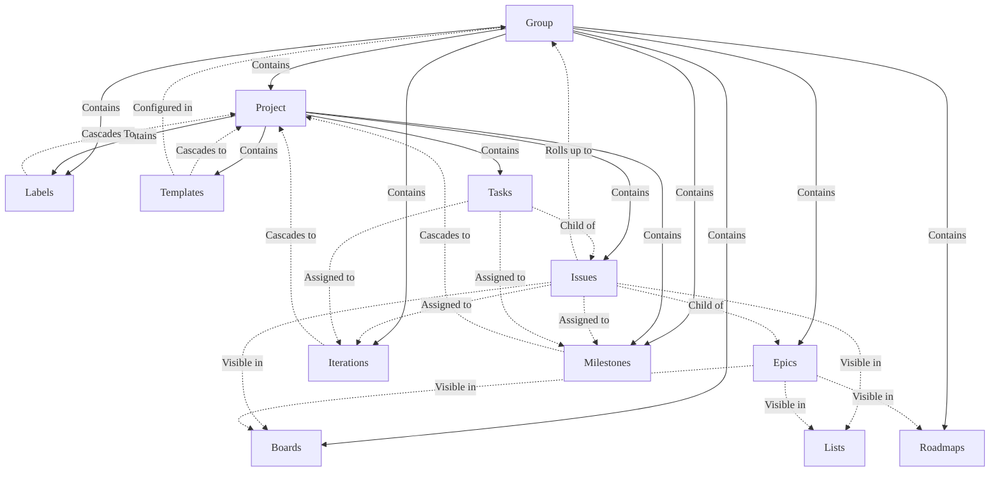
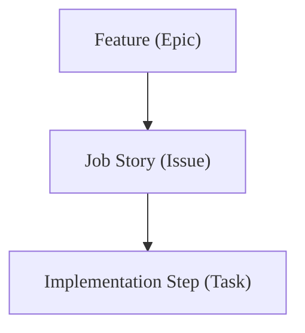
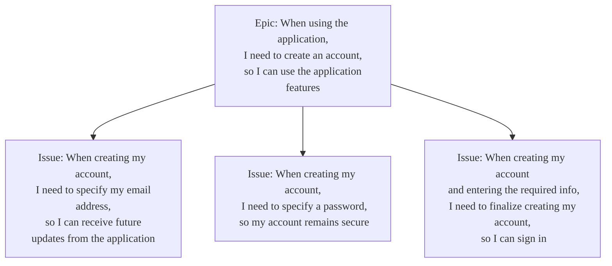
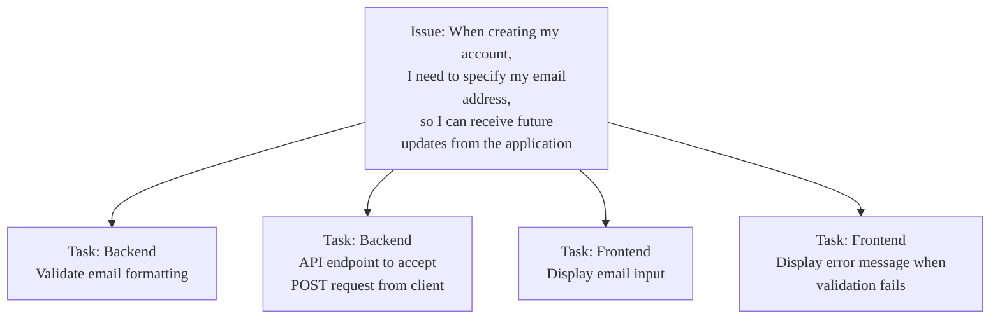
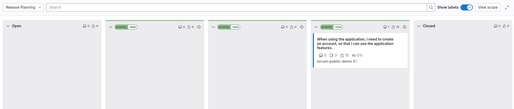
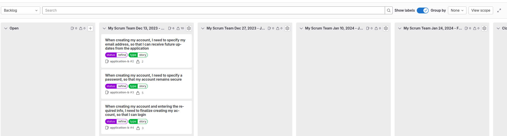
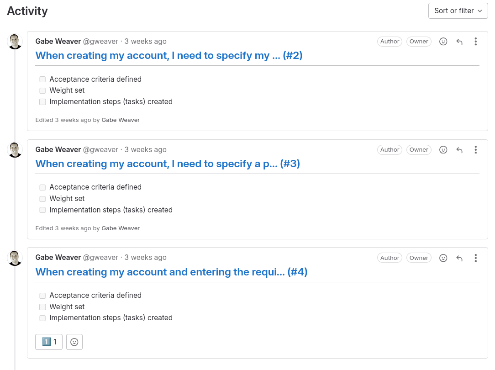

DETAILS:
**Tier:** Premium, Ultimate
**Offering:** GitLab.com, GitLab Self-Managed, GitLab Dedicated

<!-- vale gitlab_base.FutureTense = NO -->

This tutorial provides step-by-step guidance on using agile planning and tracking features in GitLab
to facilitate core Scrum ceremonies and workflows.
By setting up groups, projects, boards, and other features in a deliberate way, teams can realize
enhanced transparency, collaboration, and delivery cadences.

According to Martin Fowler's [Agile Fluency Model](https://martinfowler.com/articles/agileFluency.html), teams practicing [Scrum](https://scrumguides.org/scrum-guide.html):

> ...think and plan in terms of the benefits their sponsors, customers, and users will see from their software.

They achieve this by demonstrating their progress monthly; regularly reflecting on improving their
processes and work habits to provide more business and customer value.

This tutorial covers the following topics:

- [Setting up your groups and projects](#setting-up-your-groups-and-projects)
- [Managing your feature backlog](#managing-your-feature-backlog)
- [Managing your story backlog](#managing-your-story-backlog)
- [Tracking sprint progress](#tracking-sprint-progress)

## Setting up your groups and projects

To facilitate Scrum practices in GitLab, you first need to set up the foundational structure of groups
and projects.
You'll use groups to create boards and labels that can be inherited by projects nested under that group.
Projects will contain the issues and tasks that make up the actual work items for each sprint.

### Understanding the inheritance model in GitLab

GitLab has a hierarchical structure where groups contain projects.
Settings and configurations applied at the group level cascade down to child projects, so you can
standardize labels, boards, and iterations across multiple projects:



- Groups contain one or more projects, epics, boards, labels, and iterations.
  User membership in groups cascades down to a group's projects.
- You can create boards and labels in a group or project.
  For this tutorial, you should create them in a group to facilitate standardized planning workflows
  and reporting across many projects in a single group.
- Any object that cascades down to a project can be associated with that project's issues,
  for example: you can apply labels from a group to issues.

### Create your group

Create a dedicated group for your Scrum activities.
This will be the parent container for projects and configurations like boards and labels that you want
to be standardized across projects.

This group will be the primary location for the different activities during a typical Scrum cadence.
It will contain your boards, features (epics), story (issue) roll up, and labels.

To create a group:

1. On the left sidebar, at the top, select **Create new** (**{plus}**) and **New group**.
1. Select **Create group**.
1. In the **Group name** text box, enter the name of the group. For a list of words that cannot be used as group names, see
   [reserved names](../../user/reserved_names.md).
1. In the **Group URL** text box, enter the path for the group used for the [namespace](../../user/namespace/_index.md).
1. Select the [**Visibility level**](../../user/public_access.md) of the group.
1. Optional. To personalize your GitLab experience:
   - From the **Role** dropdown list, select your role.
   - For **Who will be using this group?**, select an option.
   - From the **What will you use this group for?** dropdown list, select an option.
1. Optional. To invite members to the group, in the **Email 1** text box, enter the email address of the user you want to invite. To invite more users, select **Invite another member** and enter the user's email address.
1. Select **Create group**.

### Create your projects

In the group you created, create one or more projects.
Your project will contain the stories that roll up to your parent group.

To create a blank project:

1. On the left sidebar, at the top, select **Create new** (**{plus}**) and **New project/repository**.
1. Select **Create blank project**.
1. Enter the project details:
   - In the **Project name** field, enter the name of your project. See the
     [limitations on project names](../../user/reserved_names.md).
   - In the **Project slug** field, enter the path to your project. The GitLab instance uses the
     slug as the URL path to the project. To change the slug, first enter the project name,
     then change the slug.
   - To modify the project's [viewing and access rights](../../user/public_access.md) for
     users, change the **Visibility Level**.
   - To create README file so that the Git repository is initialized, has a default branch, and
     can be cloned, select **Initialize repository with a README**.
1. Select **Create project**.

### Create scoped labels to support different phases of the Scrum lifecycle

Next, in the group you've created, you'll create labels to add to issues to categorize them.

The best tool for this is [scoped labels](../../user/project/labels.md#scoped-labels), which you
can use to set mutually exclusive attributes.

The double colon (`::`) in the name of a scoped label prevents two labels of the same scope being
used together.
For example, if you add the `status::in progress` label to an issue that already has `status::ready`,
the previous one is removed.

To create each label:

1. On the left sidebar, select **Search or go to** and find your group.
1. Select **Manage > Labels**.
1. Select **New label**.
1. In the **Title** field, enter the name of the label. Start with `priority::now`.
1. Optional. Select a color by selecting from the available colors, or enter a hex color value for
   a specific color in the **Background color** field.
1. Select **Create label**.

Repeat these steps to create all the labels you'll need:

- **Priority:** You will use these on an epic board to facilitate feature-level release prioritization.
  - `priority::now`
  - `priority::next`
  - `priority::later`
- **Status:** You will use these labels on an issue board to understand a story's current step in the
  overall development lifecycle.
  - `status::triage`
  - `status::refine`
  - `status::ready`
  - `status::in progress`
  - `status::in review`
  - `status::acceptance`
  - `status::done`
- **Type:** You will use these labels to represent the different types of work typically pulled into a single iteration:
  - `type::story`
  - `type::bug`
  - `type::maintenance`

### Create an iteration cadence

In GitLab, sprints are called iterations.
Iteration cadences contain the individual, sequential iteration timeboxes for planning and reporting
on your issues.
Similar to labels, iterations cascade down your group, subgroup, and project hierarchy.
That's why you'll create the iteration cadence in the group you've created.

Prerequisites:

- You must have at least the Reporter role for a group.

To create an iteration cadence:

1. On the left sidebar, select **Search or go to** and find your group.
1. Select **Plan > Iterations**.
1. Select **New iteration cadence**.
1. Enter the title and description of the iteration cadence.
1. Make sure the **Enable automatic scheduling** checkbox is selected.
1. Complete the required fields to use automatic scheduling.
   - Select the automation start date of the iteration cadence. Iterations are scheduled to
     begin on the same day of the week as the day of the week of the start date.
   - From the **Duration** dropdown list, select **2**.
   - From the **Upcoming iterations** dropdown list, select **4**.
   - Select the **Enable roll over** checkbox.
1. Select **Create cadence**. The cadence list page opens.

With your iteration cadence configured this way:

- Each sprint is two weeks in length.
- GitLab automatically creates four sprints in the future.
- Incomplete issues from one sprint are automatically reassigned to the next sprint when the current sprint is closed.

You can also disable **Automatic scheduling** and
[manually create and manage iterations](../../user/group/iterations/_index.md#create-an-iteration-manually) in your cadence.

## Managing your feature backlog

A feature backlog captures ideas and desired functionality in the form of epics.
As you refine this backlog, epics will be prioritized to flow into upcoming sprints.
This section covers creating an epic board to facilitate backlog management and writing your first
feature epic.

### Decide on a way to structure your work

GitLab is extensible to support different flavors of backlog management.
For this tutorial, we will structure our deliverables in the following way:



- An epic represents a feature that a team can deliver in a single iteration.
- Each epic will contain many
  [job stories](https://medium.com/@umang.soni/moving-from-user-role-based-approach-to-problem-statement-based-approach-for-product-development-18b2d2395e5).
  - A story should provide tangible customer value, contain explicit acceptance criteria, and be small
    enough that an individual can complete it in one or two days.
  - You should be able to complete four to ten stories as a team per sprint.
- While there are many strategies for splitting features, a great strategy is to
  [vertically slice](https://www.agilerant.info/vertical-slicing-to-boost-software-value/) stories
  into discrete, standalone stories a user must take to accomplish their goal.

  While you might not be able to ship a single story to your customers, your team should be able to
  test and interact with each story by using a feature flag on production or in a staging environment.
  Not only does this help provide stakeholders visibility into the story's progress, but also is a
  mechanism to break down more complex features into approachable development goals.
- Depending on the complexity of the stories, you can use tasks to break down stories into discrete
  implementation steps developers need to take to complete the story.

In terms of time horizons, target the following guidelines to sizing and scoping work items:

- A **feature** can be completed in a single iteration.
- A **story** can be completed in a few days.
- A **task** can be completed in a few hours to a day.

#### Example: Vertically slicing a feature

Here's an example of breaking a feature into vertically sliced job stories based on the end user's
journey:



You've taken the feature of an unmodified account sign-up for an application and broke it down into
three discrete stories:

1. Entering an email address.
1. Entering a password.
1. Selecting a button to execute the account creation.

After you have broken down a feature into stories, you can further break down the story into discrete
implementation steps:



### Set up a release planning board

You've defined your deliverables structure.
The next step is to create an epic board that you will use to develop and maintain your feature backlog.

To create a new epic board:

1. On the left sidebar, select **Search or go to** and find your group.
1. Select **Plan > Epic boards**.
1. In the upper-left corner, select the dropdown list with the current board name.
1. Select **Create new board**.
1. Enter the new board's title: `Release Planning`.
1. Select **Create board**.

Next, [create lists](../../user/group/epics/epic_boards.md#create-a-new-list) for the `priority::later`,
`priority::next`, and `priority::now` labels.

To create a new list:

1. In the upper-right corner of your board, select **Create list**.
1. In the **New list** column expand the **Select a label** dropdown list and select the label to use as
   list scope.
1. Select **Add to board**.

You'll use these lists to facilitate moving features through your board from left to right.

Use each list in your release planning board to represent the following time horizons:

- **Open:** Features that are not yet ready for prioritization.
- **Later:** Features that will be prioritized into a later release.
- **Next:** Features tentatively planned for the next release.
- **Now:** Features prioritized for your current release.
- **Closed:** Features that have been completed or canceled.

### Create your first epic

Next, create a new epic in the `priority::now` list:

1. On the top of the **`priority::now`** list, select the **New epic** (**{plus}**) icon.
1. Enter the new epic's title:

   ```plaintext
   When using the application, I need to create an account, so that I can use the application features.
   ```

1. Select **Create epic**.

When you complete this step, your board should look like this:



You can now use the **Release Planning** board to quickly build your backlog.

Stub out many features and prioritize them into the **Now**, **Next**, **Later** lists.
Next, spend some time to further break down each story into stories and tasks.

To reorder feature epics in a list or across lists, drag the epic cards.
You can also [move cards to the top or bottom](../../user/group/epics/epic_boards.md#move-an-epic-to-the-start-of-the-list) of a list.

## Managing your story backlog

When you have features defined as epics, the next step is to break down those features into granular,
vertical slices as issues.
You will then refine and sequence those issues across iterations on a dedicated backlog board.

### Break down features into stories

Break features into vertically sliced stories ahead of time to have an efficient sprint planning meeting.
In the previous step, you created your first feature.
Let's break that down into stories.

To create your first stories:

1. On the left sidebar, select **Search or go to** and find your group.
1. Select **Plan > Epic boards**.
1. In the upper-left corner, make sure the dropdown list with the current board name shows **Release Planning**.
   If not, from the dropdown list, select that board.
1. Open an epic by clicking the title of the epic card.
1. In the **Child issues and epics** section, select **Add > Add a new issue**.
1. Enter the following title for the issue:

   ```plaintext
   When creating my account, I need to specify my email address so that I can receive future updates from the application
   ```

1. From the **Project** dropdown list, select the project where you want to create the issue.
1. Select **Create issue**.
1. Repeat this process for the other two vertical slices:

   ```plaintext
   When creating my account, I need to specify a password so that my account remains secure
   ```

   ```plaintext
   When creating my account and entering the required information, I need to finalize creating my account so that I can sign in
   ```

### Refine your story backlog

In the previous step, you broke down a feature into the necessary user stories to complete the feature.
Next, set up an issue board to serve as your canonical location for managing and refining your story backlog.

In your group, create a new issue board titled **Backlog**.
You will use this board to sequence and schedule your stories into upcoming sprints (iterations):

1. On the left sidebar, select **Search or go to** and find your group.
1. Select **Plan > Issue boards**.
1. In the upper-left corner, select the dropdown list with the current board name.
1. Select **Create new board**.
1. Enter the new board's title: `Backlog`.
1. Select **Create board**.

After you've created the board, create a new list for each upcoming iteration:

1. In the upper-right corner of the issue board page, select **Create list**.
1. In the column that appears, under **Scope**, select **Iteration**.
1. From the **Value** dropdown list, select one of the iterations.
1. Select **Add to board**.
1. Repeat the previous step for the other upcoming iterations.

Then, when an iteration is over, you should [remove the completed iteration list](../../user/project/issue_board.md#remove-a-list)
and add a new list for the new future iteration that was automatically created based on your cadence settings.

At this point, stories haven't been estimated or refined into tasks.
Mark them for refinement:

1. [Select each issue's card](../../user/project/issue_board.md#edit-an-issue) in the board and apply the `status::refine` label:
   1. In the **Labels** section of the sidebar, select **Edit**.
   1. From the **Assign labels** list, select the `status::refine` label.
   1. Select **X** next to **Assign labels** or select any area outside the label section.
1. Drag the three stories into the desired upcoming sprint to assign the stories to the corresponding sprint timebox.

By this point in the tutorial, your **Backlog** board should look like this:



In practice, you will use this board to sequence many stories into upcoming iterations.
When your backlog grows, and you have dozens of stories spanning multiple features, it can be helpful
to enable [**Group by epic**](../../user/project/issue_board.md#group-issues-in-swimlanes) so you can
view stories related to their corresponding feature epic.
When stories are grouped, it's easier to sequence them into upcoming sprints.

### Sprint planning ceremony

With the backlog prepared, it's time to plan the upcoming sprint.
You can use synchronous and asynchronous ways to facilitate sprint planning meetings in GitLab.

#### Synchronous planning

When it's time for your sprint planning ceremony, pull up the **Backlog** board with the team and
work through each story.
You should start planning for your next sprint on the last day of your current sprint.
While discussing each issue:

- Review and collaborate on the acceptance criteria.
  You can capture this in the issue's description by using checklists or list items.
- Further [break down the story into tasks](../../user/tasks.md#create-a-task) for each implementation step.
- Estimate the issue's story point effort or complexity and set this value in the issue's **Weight** field.
- After the team is satisfied with the scope of the issue and agrees on the story point value,
  apply the `status::ready` label to the issue:

  1. In the **Labels** section of the sidebar, select **Edit**.
  1. From the **Assign labels** list, select the `status::ready` label.
  1. Select **X** next to **Assign labels** or select any area outside the label section.

After you've cycled through all the issues in the upcoming iteration, you're done with sprint planning!

Remember to incorporate your team's velocity into your sprint commitment.
You can find the total number of story points (weight) allocated to each sprint at the top of each iteration list.
It's also worth making sure story points that will likely roll over from the previous sprint.

#### Asynchronous planning

Instead of holding a synchronous meeting, use an issue to run your sprint planning.

Given the nature of asynchronous sprint planning, you should start this a few days before the end of
the current sprint.
Provide all team members the appropriate time to contribute and collaborate.

1. Open the **Backlog** issue board:
   1. On the left sidebar, select **Search or go to** and find your group.
   1. Select **Plan > Issue boards**.
   1. In the upper-left corner, select the dropdown list with the current board name.
   1. Select **Backlog**.
1. In the list for the upcoming sprint, select **Create new issue** (**{plus-square}**).
1. Enter the issue's title: `Release Planning`.
1. Select **Create issue**.
1. Open the issue and create a discussion thread for each story assigned to the upcoming sprint.

   Append `+` to the issue URL to automatically unfurl the title.
   Append `+s` to the issue URL to automatically unfurl the title, milestone, and assignees.
   You can use the following template for these threads to create checkboxes:

   ```markdown
   ## https://gitlab.example.com/my-group/application-b/-/issues/5+

   - [ ] Acceptance criteria defined
   - [ ] Weight set
   - [ ] Implementation steps (tasks) created
   ```

   For example:

   

1. After every story has a thread, edit the issue description and [mention each team member](../../user/discussions/_index.md#mentions).
   Mentioning team members automatically creates a to-do item for them in their respective [to-do lists](../../user/todos.md).
1. Then, asynchronously, before the start of the upcoming sprint, team members should:

   - Discuss each issue, ask questions, and collaborate to align on the acceptance criteria for each planned issue.
   - Use a reaction emoji such as `:one:`, `:two:`, and `:three:` to cast their vote on what the story point (weight) should be.
     If team members set different story point values, it's an excellent opportunity to discuss further until there is consensus.
     You can also average all the various reactions to align on what the story point will be.
   - Break down vertical slices (issues) into implementation steps (tasks).

1. As each story discussion concludes, update the issue with any changes to the acceptance criteria
   and set the story point value in the **Weight** field.
1. After the story is updated, add the `status::ready` label to each issue.
1. Then, to signal the planning for that vertical slice has been completed,
   [resolve each discussion thread](../../user/discussions/_index.md#resolve-a-thread) in the planning issue.

## Tracking sprint progress

To visualize and manage the work during a sprint, teams can create a dedicated issue board representing
the current sprint's scope.
This board provides transparency into the team's progress and any potential blockers.
Teams can also use iteration analytics for additional visibility through burndown charts.

### Create a board for your current sprint

In your group, create a new issue board titled **Current Sprint**:

1. On the left sidebar, select **Search or go to** and find your group.
1. Select **Plan > Issue boards**.
1. In the upper-left corner, select the dropdown list with the current board name.
1. Select **Create new board**.
1. Enter the new board's title: `Current Sprint`.
1. Next to **Scope**, select **Expand**.
1. Next to **Iteration**, select **Edit**.
1. Below your iteration cadence, select **Current**.
1. Select **Create board**.

The board is now filtered only to show issues assigned to the current iteration.
Use it to visualize the team's progress in the active sprint.

Next, create label lists for all the statuses:

1. In the upper-right corner of the issue board page, select **Create list**.
1. In the column that appears, under **Scope**, select **Label**.
1. From the **Value** dropdown list, select one of the labels:

   - `status::refine`: The issue needs further refinement before being developed.
   - `status::ready`: The issue is ready for development.
   - `status::in progress`: The issue is in development.
   - `status::review`: The issue's corresponding MRs are going through code review.
   - `status::acceptance`: The issue is ready for stakeholder acceptance and QA testing.
   - `status::done`: The issue's acceptance criteria have been satisfied.

1. Select **Add to board**.
1. Repeat the previous steps for the other labels.

Then, as the sprint progresses, drag issues to different lists to change their `status::` label.

### View burndown and burnup charts for your sprint

It can be helpful to review the iteration report during the sprint.
Iteration reports provide progress metrics and burndown and burnup charts.

To view your iteration report:

1. On the left sidebar, select **Search or go to** and find your group.
1. Select **Plan > Iterations** and select an iteration cadence.
1. Select an iteration.
