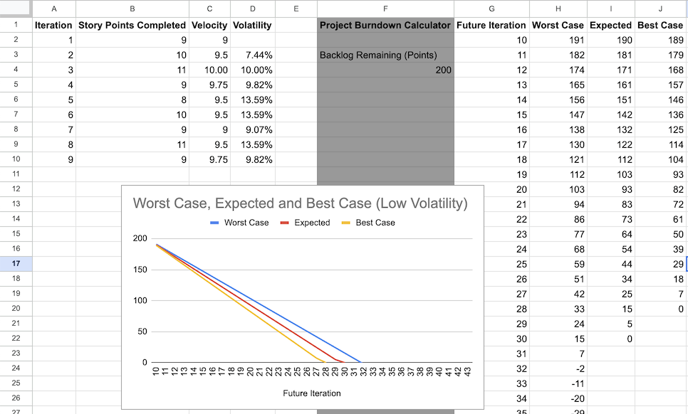
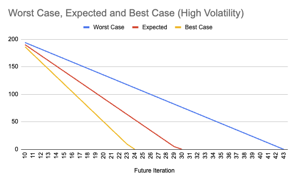
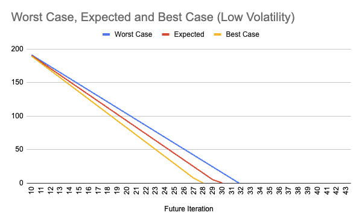

<!-- vale gitlab_base.FutureTense = NO -->

In addition to the core Scrum ceremonies such as sprint planning and reviews, teams can use GitLab to
facilitate the following common Scrum ceremonies in both co-located and distributed environments:

- Daily stand-ups
- Retrospectives
- Story points
- Velocity and volatility

This page builds on the concepts and workflows from the [introductory Scrum tutorial](_index.md).
If you haven't completed that tutorial, you should do so before you go further.

## Daily stand-ups

General guidelines:

- Limit the stand-up to no more than 15 minutes.
- If any topic requires further discussion beyond a status update, postpone the discussion so the
  relevant parties can break out after the stand-up to discuss further.

### Synchronous stand-up

If you are colocated, gather in the same room and walk through the **Current Sprint** board to discuss
updates for the respective issues.

If you are distributed, get on a video call and have one person drive the screen-sharing to review
the current sprint board.

Instead of reviewing the current sprint board together, you can use the following format.
Each team member should answer these three questions:

- "What did I accomplish yesterday?"
- "What am I working on today?"
- "Am I or will I be soon blocked by anything?"

### Asynchronous stand-up

To facilitate an asynchronous stand-up in GitLab, you have a few different options:

- In your team's chat tool: Use automation to report stand-ups from each team member.
  We use [Geekbot](https://geekbot.com/) internally at GitLab.
- In GitLab:

  1. Create an issue titled **Stand-up** and add it to the current iteration.
  1. Each day of the sprint, the first person to report their stand-up should create a new comment with
     the date, and then add a comment with their update.
  1. Each team member adds their respective updates to the discussion as a thread.
     [See an example](https://gitlab.com/tech-marketing/demos/gitlab-agile-demo/scrum-public-demo/application-b/-/issues/6)
     in a demo project.

## Sprint retrospectives

A retrospective is a blameless opportunity for the team to identify process improvements and celebrate
progress.
You can choose from many retrospective formats.

<!-- vale gitlab_base.InclusiveLanguage = NO -->
James Shore provides [an excellent outline for how to conduct a retrospective](https://www.jamesshore.com/v2/books/aoad1/retrospectives)
in his book, "The Art of Agile."
<!-- vale gitlab_base.InclusiveLanguage = YES -->

### Synchronous retrospectives

It can be helpful to review the [iteration report](../../user/group/iterations/_index.md#iteration-report)
during retrospectives.

To review an iteration report for a completed iteration:

1. On the left sidebar, select **Search or go to** and find your group.
1. Select **Plan > Iterations**.
1. At the top, select **Done** and select your iteration cadence.
1. Select the most recently completed iteration.

### Asynchronous retrospectives

You can use GitLab issues for asynchronous retrospectives.

1. In the current iteration, create a new issue titled **Retrospective**.

   You can apply many of the same formats as for synchronous retrospectives.
   [See an example issue](https://gitlab.com/tech-marketing/demos/gitlab-agile-demo/scrum-public-demo/application-b/-/issues/7)
   that applies the retrospective outline proposed by James Shore.

1. If there are many action items, consider creating separate issues to track them independently of the
   retrospective.
1. After the team has finished triaging action items, close the retrospective issue.

## Story points

To identify the relative complexity and effort necessary to complete a story, you can use story points.
Story points can also help you identify and discuss trade-offs in scope and implementation during
the planning process.

In GitLab, teams capture story points using the **weight** field in an issue or task.
You can set weights on stories (issues) or tasks depending on your estimation strategy.

### Deciding the value of story points

You should use a modified Fibonacci sequence for your story point scale of 0, 1, 2, 3, 5, 8, 13, 20, and 40.
As Mike Cohn [points out](https://www.mountaingoatsoftware.com/blog/why-the-fibonacci-sequence-works-well-for-estimating)
when articulating [Weber's Law](https://en.wikipedia.org/wiki/Weber%E2%80%93Fechner_law#Weber's_law),
"numbers that are too close to one another are impossible to distinguish as estimates."

When deciding the value of a single story point, it's helpful to set the baseline definition of a
single story point being equal to a developer's "ideal" day.
On such a day, the developer is highly productive, not blocked by anything,
and maintains flow throughout the day.

You can work with your team to agree on a different value for a single story point.
It's essential that after you decide on a definition, you do not change it.
If you do change it, be aware that your velocity and volatility will likely be inaccurate for the
following several sprints.

For example, if you set the goal to deliver four to ten user stories per iteration, split any story
with a point value greater than three into two or more smaller stories.
Ideally, your team should work toward splitting or combining stories until they weigh one or two.

NOTE:
Stakeholders should never use story points to measure the team's performance or
[compare one team to another](https://towardsdatascience.com/why-story-points-are-a-horrible-metric-for-software-engineers-421bc8971f11).

## Velocity and volatility

Over time, teams can use story points to understand their velocity.
Understanding velocity helps when you're adjusting the size of the scope of sprints and setting more
reliable expectations with stakeholders outside the team.

You can calculate **velocity** by averaging the number of story points delivered over several previous sprints.

**Volatility** represents the standard deviation among the number of story points delivered in previous
sprints divided by your current velocity.

Knowing your team's volatility is significant in helping you understand how predictable you are in
completing stories from one iteration to another.
One of the most critical areas to focus on improving is lowering your team's volatility.

In the following sections, we look at two teams that each completed the same number of story points
over nine iterations.
You'll see how lower volatility provides more predictability in forecasting future team performance,
ultimately empowering teams to set better expectations with stakeholders.

### Create a velocity and volatility tracker spreadsheet

Until velocity and volatility is integrated natively into GitLab (see
[epic 435](https://gitlab.com/groups/gitlab-org/-/epics/435)), you can track your team's velocity
and volatility in a spreadsheet like the following:

In this example, we use Google Sheets.
You might need to adapt the formulas to your preferred spreadsheet software.

To create such a spreadsheet, create and populate the following columns.

To calculate current velocity and volatility:

- **Iteration**: Numbers or titles of past iterations.
- **Story Points Completed**
- **Velocity**:
  - The number in the first cell is the same as in the **Story Points Completed** column.
  - All other cells show the average number of story points delivered over several previous
    sprints.
    In this example, we use up to four.
  - For example, the `C10` cell has the following formula: `=AVERAGE(B7:B10)`.
- **Volatility**:
  - Calculate the standard deviation among the number of story points delivered in previous sprints
    divided by your current velocity.
  - For example, the `D10` cell has the following formula: `=(STDEV(B7:B10)/C10)`.

To forecast future number of story points completed:

- A cell for the remaining backlog points.
  In this example, it's `F4`.
- **Future Iteration**: Numbers or titles of future iterations.
- **Worst Case**: The worst case forecast of remaining story points after each iteration.
  - Calculation refers to the velocity and volatility of the latest completed iteration.
    Here:
    - Volatility: `C10`
    - Velocity: `D10`
  - The formula in the first cell subtracts from the number in the `F4` cell.
    For example: `=F4-(C10*(1-D10))`.
  - All other cells subtract from the cell above.
    For example, the `H10` cell has the following formula: `=H9-($C$10*(1-$D$10))`.
- **Expected**: A realistic forecast of remaining story points after each iteration, subtracting the
  latest calculated velocity from the remaining story points.
  - The formula in the first cell subtracts from the number in the `F4` cell.
    For example: `=F4-$C$10`.
  - All other cells subtract from the cell above.
    For example, the `I10` cell has the following formula: `=I9-$C$10`.
- **Best Case**: The best case forecast of remaining story points after each iteration.
  - Like Worst Case, calculation refers to the velocity and volatility of the latest completed iteration.
  - The formula in the first cell subtracts from the number in the `F4` cell.
    For example: `=F4-(C10*(1+D10))`.
  - All other cells subtract from the cell above.
    For example, the `J10` cell has the following formula: `=J9-($C$10*(1+$D$10))`.
- Line chart to illustrate the forecast:
  - Title the chart `Worst Case, Expected and Best Case`
  - Set the range to the above four columns.
  - Set the Future Iteration column as the X-axis.
  - Add a series for each of the remaining columns.
  - Select the following checkboxes: **Use row 1 as headers**, **Use column G as labels**,
    **Treat labels as text**.

To maintain the tracker, at the end of each sprint, update it with your team's completed story point
count.

### High volatility decreases predictability

The first example is a team with high volatility over the last nine sprints:

| Iteration | Story points completed | Velocity | Volatility |
| --------- | ---------------------- | -------- | ---------- |
| 1         | 8                      | 8        | 0%         |
| 2         | 15                     | 11.5     | 43%        |
| 3         | 11                     | 11.33    | 40%        |
| 4         | 7                      | 10.25    | 35%        |
| 5         | 6                      | 9.75     | 42%        |
| 6         | 15                     | 9.75     | 42%        |
| 7         | 10                     | 9.5      | 43%        |
| 8         | 6                      | 9.25     | 46%        |
| 9         | 8                      | 9.75     | 40%        |

Assuming the team has 200 points left in their backlog, we can use their current velocity and volatility to predict the worst, expected, and best-case scenarios for how many more sprints until they complete the backlog.

The team will deliver the backlog:

- In the best case, in 24 sprints.
- In the expected scenario, in 30 sprints.
- In the worst case, in 43 sprints.

If each sprint lasts two weeks, and other business functions rely on estimated delivery dates to
coordinate their work, 38 weeks between best, expected, and worst cases is not very actionable.
This wide variability erodes trust between the Scrum team and the rest of the organization.

### Low volatility increases predictability

The second example looks at a team with low volatility over the last nine sprints:

| Iteration | Story points completed | Velocity | Volatility |
| --------- | ---------------------- | -------- | ---------- |
| 1         | 9                      | 9        | 0%         |
| 2         | 10                     | 9.5      | 8%         |
| 3         | 11                     | 10       | 10%        |
| 4         | 9                      | 9.75     | 10%        |
| 5         | 8                      | 9.5      | 14%        |
| 6         | 10                     | 9.5      | 14%        |
| 7         | 9                      | 9        | 9%         |
| 8         | 11                     | 9.5      | 14%        |
| 9         | 9                      | 9.75     | 10%        |

Like the previous team, this one had the same ending velocity but a much lower volatility metric.
With the same backlog size of 200 story points, this team has much more confidence in communicating
a more realistic and predictable timeline for completing the backlog:

Both teams completed the same number of story points.
However, the team with the lower volatility can communicate a delivery window of 28 to 32 sprints
(compared to 24 to 43), which is only eight weeks of variability in the timeline.
This level of predictability fosters trust between the Scrum team and the rest of the organization.

### Reducing volatility

If you're experiencing high volatility, you can explore the following:

1. Maintain a stable, focused product team.

   Suppose team members split their time across many work streams and are not consistently allocated
   to the same team and workstream from one sprint to the next.
   In such case, it can lead to fluctuations in velocity.
1. Break stories down into smaller vertical slices.

   Look at your recently completed stories and evaluate the ranges in story points.
   A story with five points has much more complexity and unknowns compared to a story with a single point.
   Be intentional as a team to only pull stories with a weight of one or two into an iteration.
   If you can't figure out how to reduce the size of a large story, consider conducting an
   [engineering spike](https://www.jamesshore.com/v2/books/aoad1/spike_solutions).
   Understand the implementation path and identify how your team can approach the story more
   incrementally and iteratively.
1. Understand where you have process bottlenecks.

   You can create a
   [custom value stream analytics report](../../user/group/value_stream_analytics/_index.md#create-a-value-stream-with-custom-stages)
   that mirrors the workflow stages that a story progresses through in a sprint.
   This report can help focus discussions in your retrospectives on the specific workflow stages
   that take the longest during your sprint cycles.

## Related topics

- [Tutorial: Set up an issue board for a team stand-up](../boards_for_standups/_index.md)
