# High Availability on AWS

GitLab on AWS can leverage many of the services that are already
configurable with High Availability. These services have a lot of
flexibility and are able to adopt to most companies, best of all is the
ability to automate both vertical and horizontal scaling.

In this article we'll go through a basic HA setup where we'll start by
configuring our Virtual Private Cloud and subnets to later integrate
services such as RDS for our database server and ElastiCache as a Redis
cluster to finally manage them within an auto scaling group with custom
scaling policies.

***

## Where to Start

Login to your AWS account through the `My Account` dropdown on
`https://aws.amazon.com` or through the URI assigned to your team such as
`https://myteam.signin.aws.amazon.com/console/`. You'll start on the
Amazon Web Services console from where we can choose all of the services
we'll be using to configure our cloud infrastructure.

***

## Network

We'll start by creating a VPC for our GitLab cloud infrastructure, then
we can create subnets to have public and private instances in at least
two AZs. Public subnets will require a Route Table keep an associated
Internet Gateway.

### VPC

Start by looking for the VPC option on the web console. Now create a new
VPC. We can use `10.0.0.0/16` for the CIDR block and leave tenancy as
default if we don't require dedicated hardware.

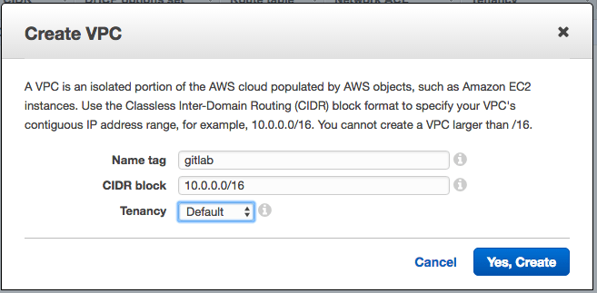

If you're setting up the Elastic File System service then select the VPC
and from the Actions dropdown choose Edit DNS Hostnames and select Yes.

### Subnet

Now let's create some subnets in different Availability Zones. Make sure
that each subnet is associated the the VPC we just created, that it has
a distinct VPC and lastly that CIDR blocks don't overlap. This will also
allow us to enable multi AZ for redundancy.

We will create private and public subnets to match load balancers and
RDS instances as well.

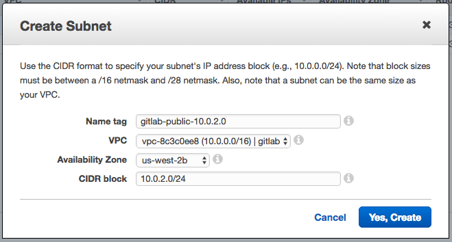

The subnets are listed with their name, AZ and CIDR block:

* gitlab-public-10.0.0.0  - us-west-2a - 10.0.0.0
* gitlab-private-10.0.1.0 - us-west-2a - 10.0.1.0
* gitlab-public-10.0.2.0  - us-west-2b - 10.0.2.0
* gitlab-private-10.0.3.0 - us-west-2b - 10.0.3.0

### Route Table

Up to now all our subnets are private. We need to create a Route Table
to associate an Internet Gateway. On the same VPC dashboard choose
Route Tables on the left column and give it a name and associate it to
our newly created VPC.

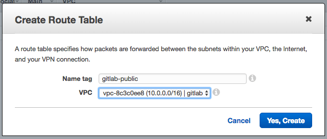

### Internet Gateway

Now still on the same dashboard head over to Internet Gateways and
create a new one. After its created pres on the `Attach to VPC` button and
select our VPC.

### Configure Subnets

Go back to the Router Tables screen and select the newly created one,
press the Routes tab on the bottom section and edit it. We need to add a
new target which will be our Internet Gateway and have it receive
traffic from any destination.

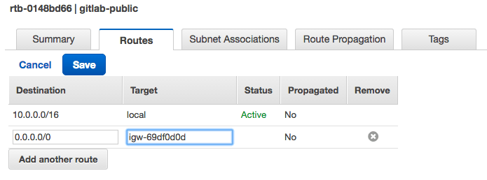

Before leaving this screen select the next tab to the rgiht which is
Subnet Associations and add our public subnets. If you followed our
naming convention they should be easy to find.

***

## Database with RDS

For our database server we will use Amazon RDS which offers Multi AZ
for redundancy. Lets start by creating a subnet group and then we'll
create the actual RDS instance.

### Subnet Group

From the RDS dashboard select Subnet Groups. Lets select our VPC from
the VPC ID dropdown and at the bottom we can add our private subnets.

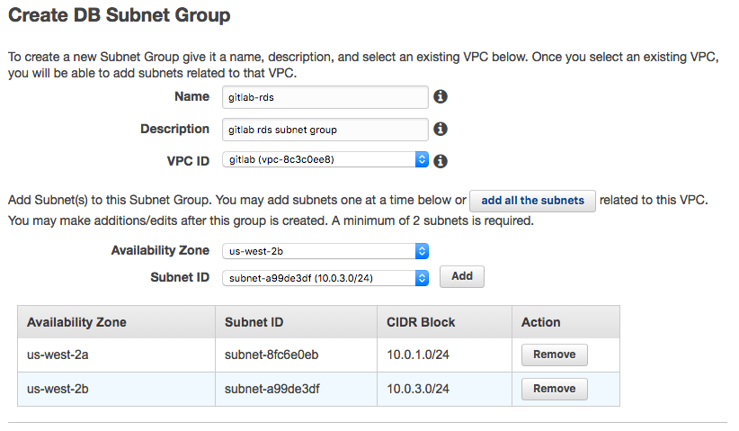

### RDS

Select the RDS service from the Database section and create a new
PostgreSQL instance. After choosing between a Production or
Development instance we'll start with the actual configuration. On the
image bellow we have the settings for this article but note the
following two options which are of particular interest for HA:

1. Multi-AZ-Deployment is recommended as redundancy. Read more at
[High Availability (Multi-AZ)](http://docs.aws.amazon.com/AmazonRDS/latest/UserGuide/Concepts.MultiAZ.html)
1. While we chose a General Purpose (SSD) for this article a Provisioned
IOPS (SSD) is best suited for HA. Read more about it at
[Storage for Amazon RDS](http://docs.aws.amazon.com/AmazonRDS/latest/UserGuide/CHAP_Storage.html)

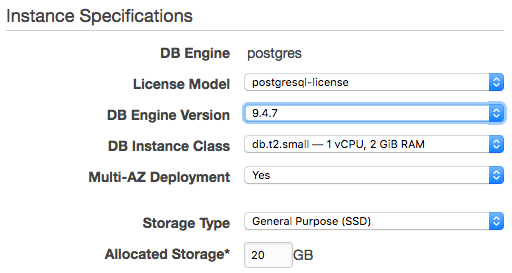

The rest of the setting on this page request a DB identifier, username
and a master password. We've chosen to use `gitlab-ha`, `gitlab` and a
very secure password respectively. Keep these in hand for later.

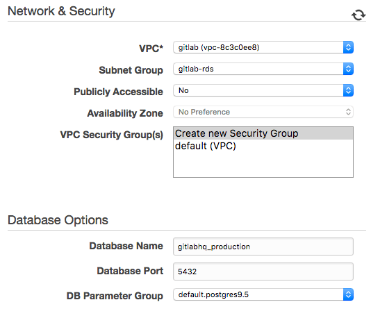

Make sure to choose our gitlab VPC, our subnet group, not have it public,
and to leave it to create a new security group. The only additional
change which will be helpful is the database name for which we can use
`gitlabhq_production`.

***

## ElastiCache

EC is an in-memory hosted caching solution. Redis maintains its own
persistance and is used for certain types of application.

Let's choose the ElastiCache service in the Database section from our
AWS console. Now lets create a cache subnet group which will be very
similar to the RDS subnet group. Make sure to select our VPC and its
private subnets.

Now press the Launch a Cache Cluster and choose Redis for our
DB engine. You'll be able to configure details such as replication,
Multi AZ and node types. The second section will allow us to choose our
subnet and security group and     

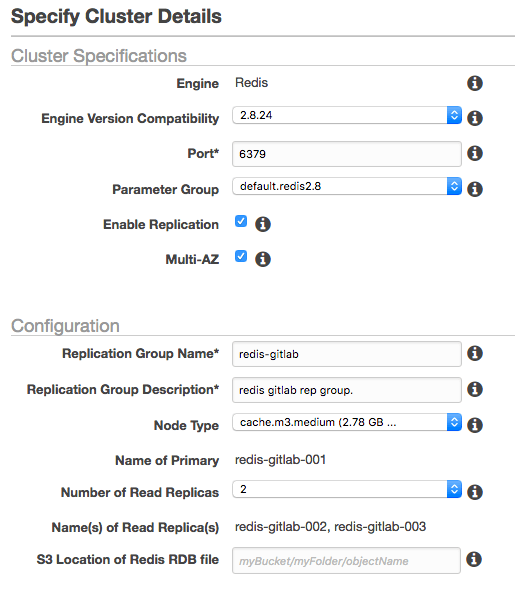

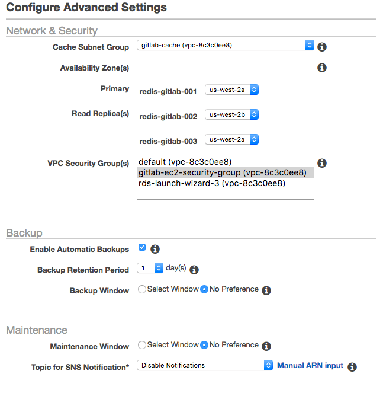

***

## Elastic File System

This new AWS offering allows us to create a file system accessible by

EC2 instances within a VPC. Choose our VPC and the subnets will be

automatically configured assuming we don't need to set explicit IPs.
The
next section allows us to add tags and choose between General
Purpose or
Max I/O which is a good option when being accessed by a
large number of
EC2 instances.



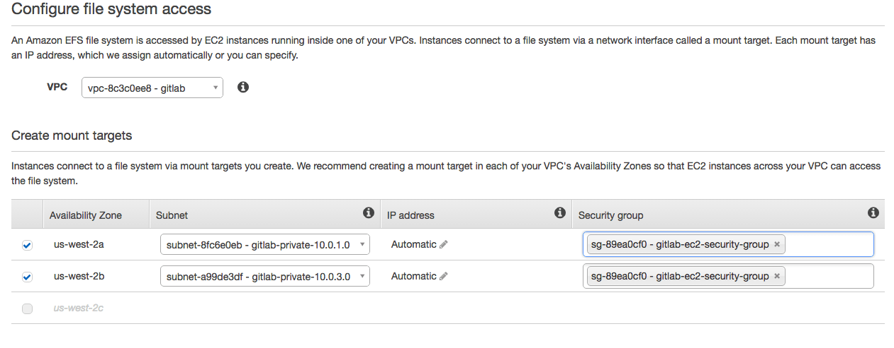

To actually mount and install the NFS client we'll use the User Data
section when adding our Launch Configuration.

***

## Initiate AMI

We are going to launch an EC2 instance and bake an image so that we can
later use it for auto scaling. We'll also take this opportunity to add an
extension to our RDS through this temporary EC2 instance.

### EC2 Instance

Look for the EC2 option and choose to create an instance. We'll need at
least a t2.medium type and for this article we'll choose an Ubuntu 14.04
HVM 64-bit. In the Configure Instance section choose our GitLab VPC and
a public subnet. I'd choose at least 10GB of storage.

In the security group we'll create a new one considering that we need to
SSH into the instance and also try it out through http. So let's add the
http traffic from anywhere and name it something such as
`gitlab-ec2-security-group`.

While we wait for it to launch we can allocate an Elastic IP and
associate it with our new EC2 instance.  

### RDS and Redis Security Group

After the instance is being created we will navigate to our EC2 security
groups and add a small change for our EC2 instances to be able to
connect to RDS. First copy the security group name we just defined,
namely `gitlab-ec2-security-group`, and edit select the RDS security
group and edit the inbound rules. Choose the rule type to be PostgreSQL
and paste the name under source.

Similar to the above we'll jump to the `gitlab-ec2-security-group` group
and add a custom TCP rule for port 6379 accessible within itself.

### Install GitLab

To connect through SSH you will need to have the `pem` file which you
chose available and with the correct permissions such as `400`.

After accessing your server don't forget to update and upgrade your
packages.

    sudo apt-get update && sudo apt-get upgrade -y

Then follow installation instructions from
[GitLab](https://about.gitlab.com/downloads-ee/#ubuntu1404), but before
running reconfigure we need to make sure all our services are tied down
so just leave the reconfigure command until after we edit our gitlab.rb
file.

### Extension for PostgreSQL

Connect to your new RDS instance to verify access and to install
a required extension. We can find the host or endpoint by selecting the
instance and  we just created and after the details drop down we'll find
it labeled as 'Endpoint'; do remember not to include the colon and port
number.

    sudo /opt/gitlab/embedded/bin/psql -U gitlab -h <rds-endpoint> -d gitlabhq_production
    psql (9.4.7)
    Type "help" for help.

    gitlab=# CREATE EXTENSION pg_trgm;
    gitlab=# \q

### Configure GitLab

While connected to your server edit the `gitlab.rb` file at `/etc/gitlab/gitlab.rb`
find the `external_url 'http://gitlab.example.com'` option and change it
to the domain you will be using or the public IP address of the current
instance to test the configuration.

For a more detailed description about configuring GitLab read [Configuring GitLab for HA](http://docs.gitlab.com/ee/administration/high_availability/gitlab.html)

Now look for the GitLab database settings and uncomment as necessary. In
our current case we'll specify the adapter, encoding, host, db name,
username, and password.

    gitlab_rails['db_adapter'] = "postgresql"
    gitlab_rails['db_encoding'] = "unicode"    
    gitlab_rails['db_database'] = "gitlabhq_production"   
    gitlab_rails['db_username'] = "gitlab"
    gitlab_rails['db_password'] = "mypassword"
    gitlab_rails['db_host'] = "<rds-endpoint>"

Next we only need to configure the Redis section by adding the host and
uncommenting the port.

The last configuration step is to [change the default file locations ](http://docs.gitlab.com/ee/administration/high_availability/nfs.html)
to make the EFS integration easier to manage.

    gitlab_rails['redis_host'] = "<redis-endpoint>"
    gitlab_rails['redis_port'] = 6379

Finally run reconfigure, you might find it useful to run a check and
a service status to make sure everything has been setup correctly.

    sudo gitlab-ctl reconfigure  
    sudo gitlab-rake gitlab:check  
    sudo gitlab-ctl status  

If everything looks good copy the Elastic IP over to your browser and
test the instance manually.

### AMI

After you finish testing your EC2 instance go back to its dashboard and
while the instance is selected press on the Actions dropdown to choose
Image -> Create an Image. Give it a name and description and confirm.

***

## Load Balancer

On the same dashboard look for Load Balancer on the left column and press
the Create button. Choose a classic Load Balancer, our gitlab VPC, not
internal and make sure its listening for HTTP and HTTPS on port 80.

Here is a tricky part though, when adding subnets we need to associate
public subnets instead of the private ones where our instances will
actually live.

On the secruity group section let's create a new one named
`gitlab-loadbalancer-sec-group` and allow both HTTP ad HTTPS traffic
from anywhere.

The Load Balancer Health will allow us to indicate where to ping and what
makes up a healthy or unhealthy instance.

We won't add the instance on the next session because we'll destroy it
momentarily as we'll be using the image we where creating. We will keep
the Enable Cross-Zone and Enable Connection Draining active.

After we finish creating the Load Balancer we can re visit our Security
Groups to improve access only through the ELB and any other requirement
you might have.

***

## Auto Scaling Group

Our AMI should be done by now so we can start working on our Auto
Scaling Group.

This option is also available through the EC2 dashboard on the left
sidebar. Press on the create button. Select the new image on My AMIs and
give it a `t2.medium` size. To be able to use Elastic File System we need
to add a script to mount EFS automatically at launch. We'll do this at
the Advanced Details section where we have a [User Data](http://docs.aws.amazon.com/AWSEC2/latest/UserGuide/user-data.html)
text area that allows us to add a lot of custom configurations which
allows you to add a custom script for when launching an instance. Let's
add the following script to the User Data section:

    #cloud-config
    package_upgrade: true
    packages:
    - nfs-common
    runcmd:
    - mkdir -p /gitlab-data
    - chown ec2-user:ec2-user /gitlab-data
    - echo "$(curl --silent http://169.254.169.254/latest/meta-data/placement/availability-zone).file-system-id.aws-region.amazonaws.com:/ /gitlab-data nfs defaults,vers=4.1 0 0" >> /etc/fstab
    - mount -a -t nfs
    - sudo gitlab-ctl reconfigure

On the security group section we can chosse our existing
`gitlab-ec2-security-group` group which has already been tested.

After this is launched we are able to start creating our Auto Scaling
Group. Start by giving it a name and assinging it our VPC and private
subnets. We also want to always start with two instances and if you
scroll down to Advanced Details we can choose to receive traffic from ELBs.
Lets enable that option and select our ELB. We also want to use the ELB's
health check.

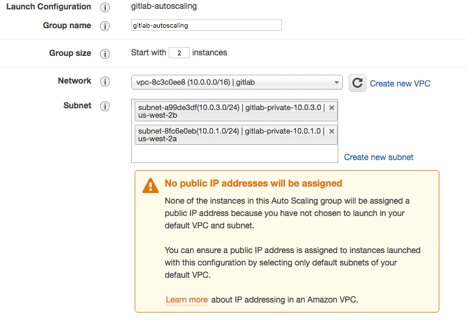

### Policies

This is the really great part of Auto Scaling, we get to choose when AWS
launches new instances and when it removes them. For this group we'll
scale between 2 and 4 instances where one instance will be added if CPU
utilization is greater than 60% and one instance is removed if it falls
to less than 45%. Here are the complete policies:

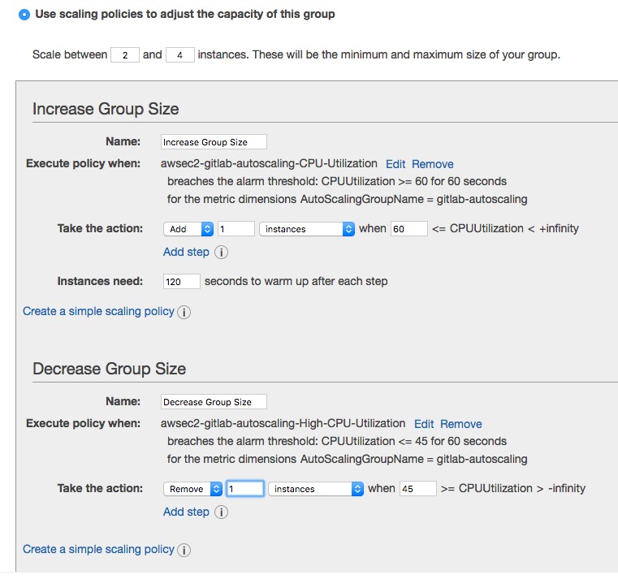

You'll notice that after we save this AWS starts launching our two
instances in different AZs and without a public IP which is exactly what
we where aiming for.

***

## Final Thoughts

After you're done with the policies section have some fun trying to break
instances. You should be able to see how the Auto Scaling Group and the
EC2 screen start bringing them up again.

High Availability is a very big area, we went mostly through scaling and
some redundancy options but it might also imply Geographic replication.
There is a lot of ground yet to cover so have a read through these other
resources and feel free to open an issue to request additional material.

 * [GitLab High Availability](http://docs.gitlab.com/ce/administration/high_availability/README.html#sts=High Availability)
 * [GitLab Geo](http://docs.gitlab.com/ee/gitlab-geo/README.html)  
