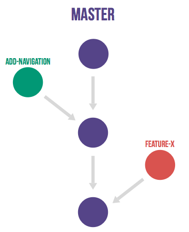
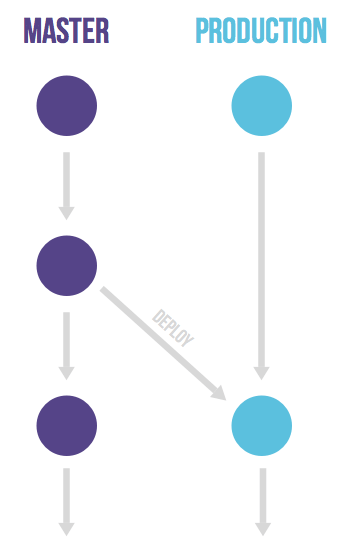
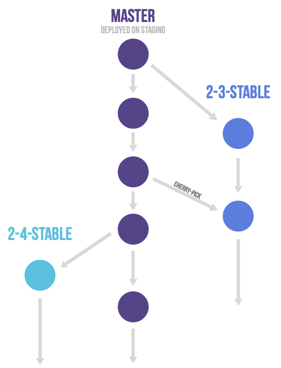

# What is the GitLab Flow

- A simplified branching strategy
- All features and fixes first go to master
- Allows for 'production' or 'stable' branches
- Bug fixes/hot fix patches are cherry-picked from master

## Feature branches

- Create a feature/bugfix branch to do all work
- Use merge requests to merge to master

## Production branch

- One, long-running production release branch
  as opposed to individual stable branches
- Consider creating a tag for each version that gets deployed

## Release branch

- Useful if you release software to customers
- When preparing a new release, create stable branch
  from master
- Consider creating a tag for each version
- Cherry-pick critical bug fixes to stable branch for patch release
- Never commit bug fixes directly to stable branch

## More details

For more information, read through the [GitLab Flow](../../workflow/gitlab_flow.md)
documentation.

<!-- ## Troubleshooting

Include any troubleshooting steps that you can foresee. If you know beforehand what issues
one might have when setting this up, or when something is changed, or on upgrading, it's
important to describe those, too. Think of things that may go wrong and include them here.
This is important to minimize requests for support, and to avoid doc comments with
questions that you know someone might ask.

Each scenario can be a third-level heading, e.g. `### Getting error message X`.
If you have none to add when creating a doc, leave this section in place
but commented out to help encourage others to add to it in the future. -->
