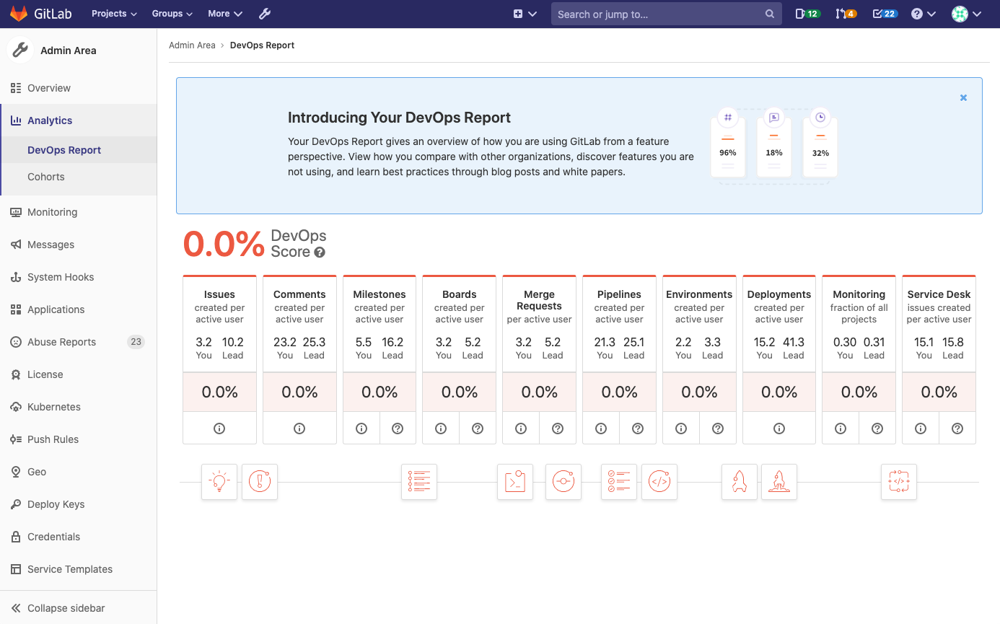

# DevOps Report **(CORE)**

> - [Introduced](https://gitlab.com/gitlab-org/gitlab-foss/-/issues/30469) in GitLab 9.3.
> - [Renamed from Conversational Development Index](https://gitlab.com/gitlab-org/gitlab/-/issues/20976) in GitLab 12.6.

NOTE: **Note:**
Your GitLab instance's [usage ping](../settings/usage_statistics.md#usage-ping) must be activated in order to use this feature.

The DevOps Report gives you an overview of your entire instance's adoption of
[Concurrent DevOps](https://about.gitlab.com/topics/concurrent-devops/)
from planning to monitoring.

To see DevOps Report, go to **Admin Area > Analytics > DevOps Report**.

## DevOps Score

DevOps Score displays the usage of GitLab's major features on your instance over
the last 30 days, averaged over the number of billable users in that time period. It also
provides a Lead score per feature, which is calculated based on GitLab's analysis
of top-performing instances based on [usage ping data](../settings/usage_statistics.md#usage-ping) that GitLab has
collected. Your score is compared to the lead score of each feature and then expressed as a percentage at the bottom of said feature.
Your overall **DevOps Score** is an average of your feature scores. You can use this score to compare your DevOps status to other organizations.

The page also provides helpful links to articles and GitLab docs, to help you
improve your scores.

Usage ping data is aggregated on GitLab's servers for analysis. Your usage
information is **not sent** to any other GitLab instances. If you have just started using GitLab, it may take a few weeks for data to be
collected before this feature is available.
