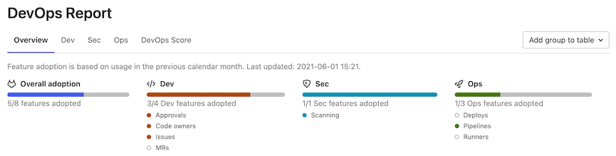

# DevOps Report **(FREE SELF)**

> [Renamed from Conversational Development Index](https://gitlab.com/gitlab-org/gitlab/-/issues/20976) in GitLab 12.6.

The DevOps Report gives you an overview of your entire instance's adoption of
[Concurrent DevOps](https://about.gitlab.com/topics/concurrent-devops/)
from planning to monitoring.

To see DevOps Report:

1. On the top bar, select **Menu >** **{admin}** **Admin**.
1. In the left sidebar, select **Analytics > DevOps Report**.

## DevOps Score

NOTE:
To see the DevOps score, you must activate your GitLab instance's [Service Ping](../settings/usage_statistics.md#service-ping).

You can use the DevOps score to compare your DevOps status to other organizations.

The DevOps Score tab displays the usage of major GitLab features on your instance over
the last 30 days, averaged over the number of billable users in that time period.
You can also see the Leader usage score, calculated from top-performing instances based on
[Service Ping data](../settings/usage_statistics.md#service-ping) that GitLab has collected.
Your score is compared to the lead score of each feature and then expressed
as a percentage at the bottom of said feature. Your overall **DevOps Score** is an average of your
feature scores.

Service Ping data is aggregated on GitLab servers for analysis. Your usage
information is **not sent** to any other GitLab instances.
If you have just started using GitLab, it might take a few weeks for data to be collected before this
feature is available.

## DevOps Adoption **(ULTIMATE SELF)**

> - [Introduced](https://gitlab.com/gitlab-org/gitlab/-/issues/247112) in GitLab 13.7 as a [Beta feature](https://about.gitlab.com/handbook/product/gitlab-the-product/#beta).
> - [Deployed behind a feature flag](../../../user/feature_flags.md), disabled by default.
> - [Enabled by default](https://gitlab.com/gitlab-org/gitlab/-/merge_requests/59267) in GitLab 14.0.
> - Enabled on GitLab.com.
> - For GitLab self-managed instances, GitLab administrators can opt to [disable it](#disable-or-enable-devops-adoption). **(ULTIMATE SELF)**
> - The Overview tab [introduced](https://gitlab.com/gitlab-org/gitlab/-/issues/330401) in GitLab 14.1.
> - DAST and SAST metrics [added](https://gitlab.com/gitlab-org/gitlab/-/issues/328033) in GitLab 14.1.

DevOps Adoption shows you which groups in your organization are using the most essential features of GitLab:

- Dev
  - Approvals
  - Code owners
  - Issues
  - Merge requests
- Sec
  - DAST
  - SAST
- Ops
  - Deployments
  - Pipelines
  - Runners

To add your groups, in the top right-hand section the page, select **Add group to table**.

DevOps Adoption allows you to:

- Verify whether you are getting the return on investment that you expected from GitLab.
- Identify specific groups that are lagging in their adoption of GitLab so you can help them along in their DevOps journey.
- Find the groups that have adopted certain features and can provide guidance to other groups on how to use those features.



### Disable or enable DevOps Adoption

DevOps Adoption is deployed behind a feature flag that is **enabled by default**.
[GitLab administrators with access to the GitLab Rails console](../../../administration/feature_flags.md)
can opt to disable it.

To disable it:

```ruby
Feature.disable(:devops_adoption_feature)
```

To reenable it:

```ruby
Feature.enable(:devops_adoption_feature)
```
