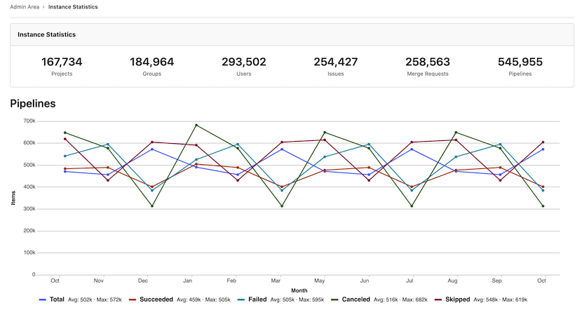

# Usage Trends **(FREE SELF)**

> - [Introduced](https://gitlab.com/gitlab-org/gitlab/-/issues/235754) in GitLab 13.5 behind a feature flag, disabled by default.
> - [Became enabled by default](https://gitlab.com/gitlab-org/gitlab/-/merge_requests/46962) in GitLab 13.6.
> - [Renamed](https://gitlab.com/gitlab-org/gitlab/-/issues/285220) from Instance Statistics to Usage Trends in GitLab 13.6.
> - It's enabled on GitLab.com.
> - It's recommended for production use.

WARNING:
This feature might not be available to you. Check the **version history** note above for details.

Usage Trends gives you an overview of how much data your instance contains, and how quickly this volume is changing over time.

To see Usage Trends:

1. On the top bar, select **Menu >** **{admin}** **Admin**.
1. On the left sidebar, select **Analytics > Usage Trends**.

## Total counts

At the top of the page, Usage Trends shows total counts for:

- Users
- Projects
- Groups
- Issues
- Merge Requests
- Pipelines

These figures can be useful for understanding how much data your instance contains in total.

## Past year trend charts

Usage Trends also displays line charts that show total counts per month, over the past 12 months,
in the categories shown in [Total counts](#total-counts).

These charts help you visualize how rapidly these records are being created on your instance.

