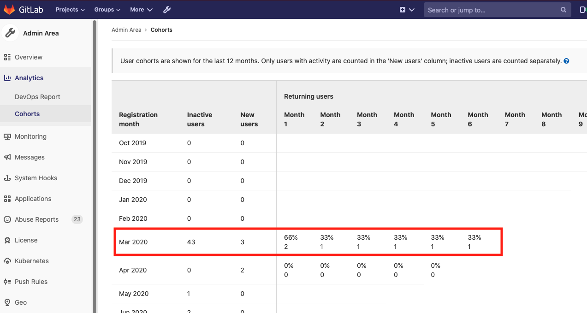

# Cohorts **(CORE)**

> [Introduced](https://gitlab.com/gitlab-org/gitlab-foss/-/issues/23361) in GitLab 9.1.

As a benefit of having the [usage ping active](../settings/usage_statistics.md),
GitLab lets you analyze the users' activities over time of your GitLab installation.

To see User Cohorts, go to **Admin Area > Analytics > Cohorts**.

## Overview

How do we read the user cohorts table? Let's take an example with the following
user cohorts.

For the cohort of March 2020, three users have been added on this server and have
been active since this month. One month later, in April 2020, two users are
still active. Five months later (August), we can see that one user from this cohort
is active, or 33% of the original cohort of three that joined in March.

The Inactive users column shows the number of users who have been added during
the month, but who have never actually had any activity in the instance.

How do we measure the activity of users? GitLab considers a user active if:

- The user signs in.
- The user has Git activity (whether push or pull).
- The user visits pages related to Dashboards, Projects, Issues, and Merge Requests ([introduced](https://gitlab.com/gitlab-org/gitlab-foss/-/issues/54947) in GitLab 11.8).
- The user uses the API
- The user uses the GraphQL API
